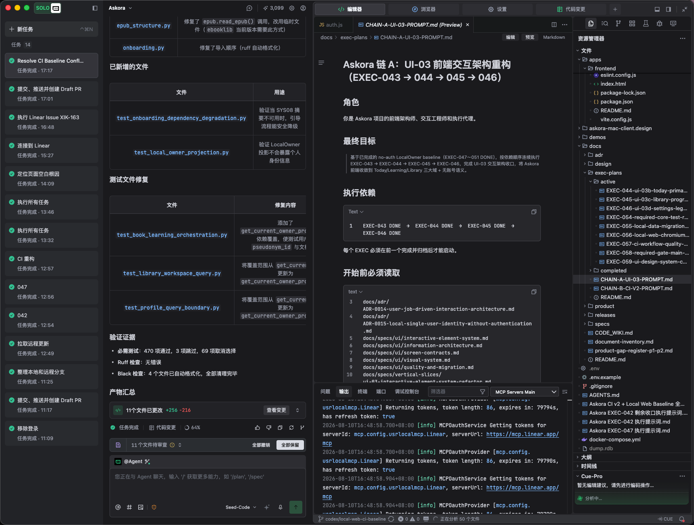

# Screenshot Inventory

> 状态：Research / Supporting  
> 素材根：`docs/ui-reverse-engineering/assets/`  
> 当前数量：1

## 1. 素材扫描

扫描范围为当前 Askora workspace 与用户明确提供的 `/Users/xike/Downloads/TraeCode.png`。结果：

| 类型 | 结果 | 处置 |
|---|---|---|
| TraeCode screenshot | 仅发现 `TraeCode.png` 1 张 `[C]` | 复制为 `assets/traecode-01.png` 并校验哈希 |
| Workspace PNG | 任务完成后共 3 张：2 张 app icon + 1 张本研究截图 `[C]` | app icon 与 TraeCode 逆向无关，不纳入 inventory |
| Workspace JPG | 1 张 app icon `[C]` | 与本任务无关 |
| Workspace JPEG / WebP / PDF | 0 `[C]` | 无素材可纳入 |
| 既有 Figma / FigJam 文件 | 初始扫描未发现；本轮创建独立实际资产 `[C]` | 当前 Figma / FigJam 链接见 overview |
| TraeCode 官方 Design System | 后续由用户提供 `TraeCode Copy/` `[C]` | 作为 token / component / icon source；详见 `12-official-design-system-consumption.md` |
| Askora Canonical Design | `docs/design/experience/` 与 `docs/specs/ui/` 已存在 `[C]` | 只用于确认 authority boundary，不被本研究覆盖 |
| Askora Design System EXEC | `docs/planning/execs/EXEC-059-ui-design-system-component-foundation.md` 已存在 `[C]` | 只读核对，不改变其 scope/status |
| Dirty worktree design files | `askora-mac-client.design/` 存在用户删除状态，另有未跟踪设计稿 `[C]` | 不恢复、不移动、不覆盖、不纳入 TraeCode 证据 |

截图清单仍只收录直接视觉证据。`TraeCode Copy/` 单独作为 source artifact 登记，不计为第二张截图，也不会把 Askora app icon、canonical docs 或 dirty worktree 设计文件伪装成额外截图样本。

## 2. 清单

| Screenshot ID | 文件名 | 分辨率 | 窗口尺寸 | 页面/场景 | 主要区域 | 可见状态 | 特殊交互状态 | 备注 |
|---|---|---:|---|---|---|---|---|---|
| `TC-UI-001` | `traecode-01.png` | 1717 × 1299 px `[C]` | 截图完整窗口像素为 1717 × 1299 `[C]`；逻辑尺寸与缩放倍率 `[U]` | Askora workspace；Agent 已完成任务；Markdown Preview；Resource Manager；Output Panel | Top Bar、Task Rail、Agent Main、Editor、Resource Sidebar、Bottom Panel、Status Bar `[C]` | 任务完成、变更待审查、Preview selected、Output selected、Cue-Pro analyzing、workbench file analysis running `[C]` | 未显示鼠标、Hover、Focus、Popover、Modal 或拖拽 `[C]` | 唯一直接视觉证据；不得用来确认跨状态规则 |

## 3. 资产校验

| 项目 | 值 | 证据 |
|---|---|---|
| 仓库路径 | `docs/ui-reverse-engineering/assets/traecode-01.png` | `[C]` |
| 原始路径 | `/Users/xike/Downloads/TraeCode.png` | `[C]` |
| 格式 | PNG，RGBA，8-bit，non-interlaced | `[C]` |
| 文件大小 | 620,941 bytes | `[C]` |
| SHA-256 | `b91484232b40fe940b919d989c3e1023a17eecae198baa3b23df2b40a811ce1d` | `[C]` |
| FigJam 节点 | Screenshot Inventory 中已上传原图，节点 `1:14` | `[C]` |

## 4. 分类

一张截图同时覆盖多个类别，不能把它当作每类的完整状态集。

| 分类 | 是否覆盖 | 截图证据 |
|---|---|---|
| Application Shell | 是 `[C]` | 完整窗口与一级分区可见 |
| Navigation | 部分 `[C]` | Workspace selector、产品模式、任务列表、Tab、Panel Tab |
| Workspace | 是 `[C]` | Markdown 文档 Preview |
| Editor | 部分 `[C]` | 单文档 Tab、Breadcrumb、Edit/Preview/Markdown 控件 |
| Chat / Agent | 部分 `[C]` | 完成态结果、变更审阅、Composer；缺 start/error/approval |
| Resource Panel | 是 `[C]` | 文件树及 Outline / Timeline / Cue-Pro 折叠区 |
| Bottom Panel | 是 `[C]` | Output active；Problem、Terminal、Port、Debug Console tabs |
| Status Bar | 是 `[C]` | Workbench 范围内的分析状态与计数 |
| Modal / Popover | 否 `[C]` | 当前画面没有可见 Overlay |
| Settings | 仅入口 `[C]` | 顶部 Settings 模式可见，设置内容未显示 |
| Browser | 仅入口 `[C]` | 顶部 Browser 模式可见，浏览内容未显示 |
| Code Changes | 入口及局部摘要 `[C]` | 顶部模式、Agent 变更摘要与待审查操作可见 |

## 5. 当前画面状态摘要

### Task Rail

- Workspace 为 `Askora`，状态标识 `SOLO` `[C]`。
- `新任务` 是顶部主动作，显示快捷键提示 `[C]`。
- 任务列表显示 `任务 14`，多个历史任务为绿色完成状态 `[C]`。
- 当前选中任务有不同背景与边框层级 `[C]`。

### Agent Main

- 主内容显示执行结果、文件变更、测试文件修复与验证证据 `[C]`。
- 底部显示 `11个文件已更改 +256 -216`、完成态、代码变更、`64%` 与反馈动作 `[C]`。
- `11个文件待审查` 带有 `全部撤销` / `全部保留` 操作 `[C]`。
- Composer 显示 `@Agent`、模型/模式选择、附件类动作与提交按钮 `[C]`。

### Workbench

- 顶部全局模式为 `编辑器` active；`浏览器`、`设置`、`代码变更` 可见 `[C]`。
- Editor 当前为单个 Markdown 文件 Preview `[C]`。
- Resource Manager 显示 Askora 文件树、当前文件选中状态与多个辅助区 `[C]`。
- Bottom Panel 当前 `输出` active，日志在滚动内容区显示 `[C]`。
- Cue-Pro 与 Status Bar 同时处于分析中/文件分析状态 `[C]`。

## 6. 证据限制

- 截图没有标注 macOS display scale，所有像素测量是图像像素，不等同于已确认的 CSS px 或 Figma logical px `[U]`。
- 只观察到一个窗口尺寸，无法把 observed width 称为 default width `[U]`。
- 截图不包含鼠标位置，不能确认任何 Hover state `[U]`。
- 选中态、完成态与运行态可以确认存在；触发它们的 transition 仍需交互证据 `[I]`。
- 文本内容可帮助识别任务语义，但不能反向证明组件的数据合同或状态 owner `[U]`。
