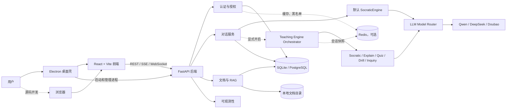
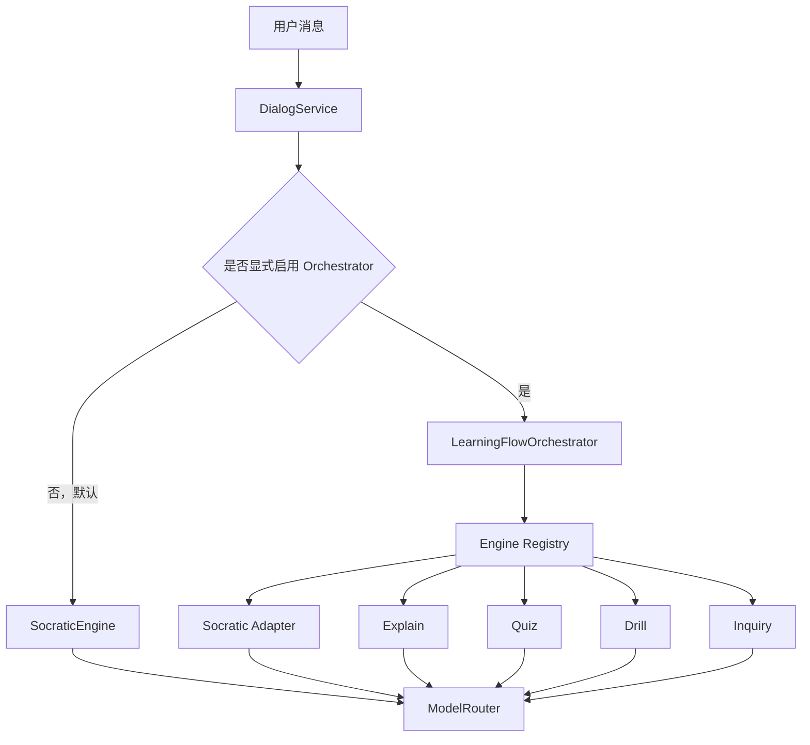

# Askora 当前项目架构

> 更新日期：2026-08-06  
> 文档口径：以当前仓库代码为准；`docs/architecture` 下的早期方案仅作设计参考。

## 1. 项目定位

Askora 是一个私人自用的苏格拉底式学习应用。当前仓库是单仓结构，包含：

- React/Vite Web 前端；
- Electron macOS 桌面壳；
- FastAPI 后端；
- SQLite/PostgreSQL 数据持久层；
- Redis 可选状态与缓存层；
- Qwen、DeepSeek、Doubao 多供应商 LLM 接入；
- 本地文档解析和关键词检索型 RAG；
- 教学引擎编排的实验性运行时。

当前默认产品形态是单用户、单机、单后端进程，不应按公开互联网、多租户 SaaS 或多 worker 服务理解。

## 2. 系统全景



## 3. 仓库分层

```text
Askora/
├── apps/
│   ├── frontend/                 React/Vite 前端与 Electron 桌面壳
│   │   ├── src/
│   │   │   ├── pages/            登录、对话、资料、知识、账号页面
│   │   │   ├── components/       侧栏、路由保护、全局通知
│   │   │   ├── hooks/            认证状态
│   │   │   └── api/              Axios、Token 刷新、SSE 对话客户端
│   │   └── electron/             后端进程、窗口、菜单和 IPC
│   └── backend/
│       ├── app/
│       │   ├── api/v1/           HTTP、SSE、WebSocket 接口层
│       │   ├── services/         业务服务层
│       │   ├── engines/          教学引擎与编排运行时
│       │   ├── models/           SQLAlchemy 数据模型
│       │   ├── core/             配置、数据库、Redis、日志、加密
│       │   ├── workers/          独立任务队列实验代码
│       │   └── main.py           FastAPI 组合根和生命周期入口
│       ├── alembic/              数据库迁移
│       ├── tests/                后端测试
│       └── scripts/              初始化与种子数据
├── docs/                         研究、设计参考与现状架构文档
├── demos/                        独立静态演示页面
├── askora-mac-client.design/     UI 设计稿与设计验证资产
└── docker-compose.yml            PostgreSQL + Redis + Backend 部署编排
```

## 4. 前端与桌面层

### 4.1 React 前端

前端使用 React 18 和自定义 Hash Router，共有以下页面：

| 路径 | 页面 | 当前职责 |
|---|---|---|
| `/login` | Login | 注册、登录、显式演示模式 |
| `/` | Chat | 会话列表、创建会话、SSE 流式对话 |
| `/profile` | Profile | 用户资料 |
| `/knowledge` | Knowledge | 当前为“建设中”占位页 |
| `/account` | Account | 账号信息 |

API 客户端负责附加 Access Token 和设备指纹；遇到 401 时用 Refresh Token 单飞刷新，系统级错误通过全局通知弹窗展示。开发环境默认连接 `127.0.0.1:8000`，Electron 环境通过 IPC 获取内嵌后端地址。

### 4.2 Electron 桌面壳

Electron 主进程负责：

1. 创建权限受限的应用数据目录；
2. 首次启动生成 JWT、KEK 本地随机密钥；
3. 启动源码 Python 后端或 PyInstaller 单文件后端；
4. 等待后端 `/ready` 成功后加载前端；
5. 退出应用时终止后端进程。

桌面运行时固定使用 `127.0.0.1:8765`、SQLite 和本地文档目录。渲染进程启用了上下文隔离、沙箱并关闭 Node 集成。

## 5. 后端分层

### 5.1 接口层

当前挂载到 `/api/v1` 的主接口包括：

- `auth`：注册、手机号登录、Token 刷新、登出、当前用户；
- `users`：用户资料；
- `dialog`：会话、历史消息、普通回复、SSE 流式回复、结束会话；
- `documents`：上传、列表、状态、删除、存储统计、RAG 查询；
- `ws`：文档进度和通知连接；
- `orchestrator`：仅在 `ENABLE_ORCHESTRATOR_DEBUG_API=true` 时挂载的调试接口。

系统接口位于根路径：`/health`、`/ready`、`/health/config` 和可选 `/metrics`。

### 5.2 业务服务层

| 模块 | 职责 | 主链路状态 |
|---|---|---|
| `services/auth` | 密码、JWT、设备指纹、Token 撤销、数据归属检查 | 已接入 |
| `services/dialog` | 会话和消息持久化、引擎调用、会话状态更新 | 已接入 |
| `services/llm` | 多供应商统一接口和学科路由 | 已接入 |
| `services/documents` | 安全扫描、解析、分块、Embedding、检索 | 部分接入 |
| `services/storage` | 用户隔离的本地文件存储 | 已接入 |
| `services/websocket` | 文档进度和通知推送 | 已接入 |
| `services/kt` | 简化知识追踪 | 未接入主 API |
| `services/dkt` | DKT 实验实现 | 未接入主 API |
| `services/assessment` | 评估服务 | 未接入主 API |
| `services/knowledge_graph` | 知识图谱服务 | 未接入主 API |

### 5.3 教学引擎层

项目目前同时存在两条教学执行路径：



默认路径的 `SocraticEngine` 完成意图解析、策略选择、提示等级调整、Prompt 构建、LLM 调用和输出检查。

Orchestrator 路径采用统一 `TeachingEngine` 接口，以 `SharedContext` 共享跨引擎状态，并由编排器独占状态写权限。引擎通过 `TransitionSuggestion` 建议停留、切换、切换后返回或结束。该路径已有 Redis 快照和内存降级，但目前仍是显式开启的增强/实验路径，并非默认生产主链路。

### 5.4 模型路由

`ModelRouter` 对 Qwen、DeepSeek、Doubao 提供统一的非流式、流式和 Embedding 接口，并可按学科选择供应商。未配置 API Key 时会明确返回模拟响应，便于本地跑通，但不能视为真实模型可用。

## 6. 核心数据流

### 6.1 对话流

1. 前端创建或选择会话；
2. 用户消息通过 REST 或 SSE 请求进入 `DialogService`；
3. 后端校验当前用户和会话归属；
4. 写入用户消息，读取最近对话历史；
5. 默认调用 `SocraticEngine`，显式配置时改走 Orchestrator；
6. 教学引擎经 `ModelRouter` 调用 LLM；
7. 写入助手消息，更新回合数、Token、提示级别和掌握度估计；
8. 普通请求返回 JSON，流式请求持续发送 SSE 事件。

当前会话写入使用进程内会话锁和数据库唯一约束防止重复回合，因此运行约束是单后端 worker。

### 6.2 文档与 RAG 流

1. 上传接口检查文件名、大小、扩展名和内容安全；
2. 原文件写入用户隔离的本地目录，元数据写入数据库；
3. 当前 API 进程通过 `asyncio.create_task` 执行解析、分块和可选 Embedding；
4. 文档状态和分块写入数据库，并通过 WebSocket 推送进度；
5. `/documents/rag/query` 以用户身份、学科和审核状态过滤文档；
6. 当前检索主实现是关键词匹配和简化 TF-IDF，返回 Top-N 文档片段。

重要边界：RAG 查询接口已经可用，但检索结果目前没有自动注入默认对话引擎。Embedding 代码已存在，当前检索主路径仍不是向量数据库检索；独立 Redis Worker 也未接管上传处理。

## 7. 数据与状态

### 7.1 关系数据库

核心表按领域分为：

- 用户：`User`、`UserProfile`；
- 对话：`DialogSession`、`DialogMessage`；
- 文档：`UserDocument`、`DocumentChunk`；
- 知识内容：`KnowledgePoint`、`LearningMaterial`、`StrategyTemplate`；
- 评估：`AssessmentItem`、`AssessmentResult`。

本地、开发和测试环境自动建表；生产/容器环境以 Alembic 迁移为结构来源。

### 7.2 Redis

Redis 用于 Token 黑名单、缓存、编排器会话快照等状态。开发和桌面模式允许 Redis 不可用并降级到单进程内存；生产模式的 `/ready` 要求 Redis 和数据库都可用。

### 7.3 文件存储

原始学习资料存储在本地文件系统，数据库只保存文档元数据和分块。桌面版默认放在 Askora 的应用数据目录；Compose 通过命名卷持久化。

## 8. 运行与部署形态

| 形态 | 前端 | 后端 | 数据库 | Redis | 适用场景 |
|---|---|---|---|---|---|
| 源码开发 | Vite | Python/Uvicorn | SQLite 或 PostgreSQL | 可选 | 开发调试 |
| macOS 桌面 | Electron 内置静态前端 | PyInstaller 单文件进程 | SQLite | 可缺省 | 私人本机使用 |
| Docker Compose | 可另行提供前端 | 单 Uvicorn worker | PostgreSQL 16 | Redis 7 | 单机私人部署 |

当前 Compose 只编排后端、PostgreSQL 和 Redis，不包含前端服务。API 仅映射到宿主机环回地址。

## 9. 当前实现边界

### 已形成闭环

- 注册、登录、刷新、登出和受保护页面；
- 会话创建、历史记录、普通与流式苏格拉底对话；
- SQLite/PostgreSQL 双运行模式；
- 本地文档上传、解析、分块、管理和关键词检索；
- Electron 启停本地后端及本地密钥生成；
- 健康检查、就绪检查、结构化日志和 Prometheus 指标。

### 已有代码但尚未形成产品闭环

- Orchestrator 多引擎链路不是默认路径；
- RAG 结果未自动进入对话 Prompt；
- 知识点前端仍是占位页；
- Assessment、KT、DKT、Knowledge Graph 未接入主 API；
- Redis TaskQueue/Worker 未接管文档后台处理；
- 旧的 consent、child profile、gateway/security 等代码不属于当前私人版主链路；
- 桌面构建尚未默认签名和公证，不面向公开分发。

## 10. 建议的收敛顺序

1. **先统一教学主链路**：决定 Orchestrator 是否替代直连 `SocraticEngine`，避免两套状态模型长期并存。
2. **再接通 RAG 与对话**：把检索、引用来源和上下文预算放入统一引擎输入，而不只是保留独立查询接口。
3. **明确后台任务策略**：私人桌面版保留进程内任务；容器版若需要可靠重试，再正式接通 Worker。
4. **收口实验模块**：对 Assessment、KT/DKT、Knowledge Graph 分别标注“接入计划”或迁出主包，降低误读和维护成本。
5. **补齐前端能力映射**：知识库上传、文档状态、知识点与学习进度应与后端已实现接口对应起来。

