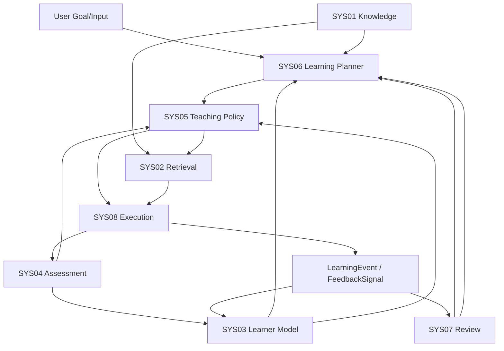
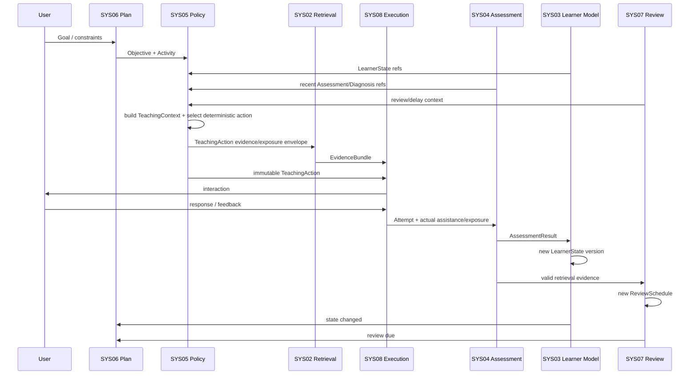

# Askora AI 学习系统：算法与教学内核设计

> 状态：v0.3 Canonical Design — Adaptive Teaching Loop 冻结  
> 更新时间：2026-08-07  
> 目标：定义 Askora 的学习科学、领域语义、八系统边界、Teaching Policy 与学习效果验证的唯一设计基线。  
> 上游唯一研究综合：`docs/design/research/synthesis/v0.3-Research-Synthesis-Adaptive-Teaching-Loop.md`

> 重要边界：本文件是 Design，不是 Spec。`docs/specs/**`、`docs/adr/**`、`docs/exec-plans/**` 与代码不因本次设计冻结自动变化。所有已识别 implementation contract 变化统一登记到本文件的 **Spec Delta Input**，必须经过后续阶段显式处理。

## 1. 核心定位

Askora 不应被定义为“能够读取资料并回答问题的 AI 聊天工具”，而应定位为：

> **以无提示独立成功、延迟保持、迁移和单位学习时间能力增益为核心结果的个人自适应学习系统。**

系统不以对话量、即时正确率、课程完成率、点赞或 token 数作为最高目标。

完整学习闭环：

```text
LearningGoal
→ Content / Knowledge Modeling
→ Prerequisite Diagnosis
→ LearningPlan / LearningActivity
→ LearnerState / MasteryEstimate
→ TeachingContext Snapshot
→ Teaching Policy
→ TeachingAction
→ EvidenceBundle + LLM/Tool Execution
→ Attempt / AssessmentResult
→ LearnerState Update
→ ReviewSchedule
→ Independent / Delayed / Transfer Validation
→ Replan / Next Teaching Decision
```

v0.3 的核心增量不是增加新的教学引擎，而是把“此刻怎么教”的决策正式冻结为一个 **deterministic、constrained、versioned、replayable Adaptive Teaching Loop**。

---

## 2. 教学决策变量与 Canonical TeachingContext

v0.2 的概念表达：

```text
教学策略 = f(学习目标, 先备知识, 内容复杂度, 错误类型, 学习阶段)
```

在 v0.3 被正式收敛为：

```text
TeachingAction =
Policy(
  immutable TeachingContext snapshot,
  immutable PolicyBundle
)
```

TeachingContext 不拥有任何第二份 canonical truth，而是对多个 owner 的不可变版本引用和本次决策派生 feature 的组合。

### 2.1 LearningObjective / LearningActivity

SYS06 拥有：

- LearningGoal；
- LearningObjective；
- LearningActivity；
- LearningPlan。

SYS05 可以读取当前 Objective / Activity 的：

- activity type；
- target capability；
- current task / task structure；
- time budget；
- priority/constraints；

但不得改变目标、重新排序长期计划或自行创建新的学习目标。

### 2.2 先备知识与 LearnerState

先备状态来自：

- SYS01 的 PrerequisiteRelation；
- SYS03 的 MasteryEstimate / confidence；
- SYS04 的诊断结果与单次表现。

必须区分：

```text
prerequisite relation truth   → SYS01
prerequisite learner state    → SYS03
single-attempt diagnosis      → SYS04
current teaching response     → SYS05
```

### 2.3 内容复杂度

内容复杂度区分：

- intrinsic / task structural complexity；
- relative complexity for current learner。

后者可由 SYS05 Feature Builder 在当前 snapshot 上派生，但必须带：

```text
value
availability
confidence
feature_version
```

它不是新的持久 learner field。

### 2.4 Canonical Error Taxonomy

v0.3 核心 `ErrorType` 冻结为：

```text
KNOWLEDGE_GAP
CONCEPTUAL_MISCONCEPTION
METHOD_SELECTION
EXECUTION
RETRIEVAL_FAILURE
TRANSFER_FAILURE
EXPRESSION_FORMAT
UNKNOWN
```

历史设计迁移：

```text
condition_omission
→ reason code / subcategory，不再是顶层 error type

metacognitive
→ behavioral/policy signal，不再是核心 error type

expression_incomplete
→ EXPRESSION_FORMAT
```

必须保持：

```text
observed error
≠ misconception evidence
≠ persistent misconception hypothesis
```

所有权：

```text
SYS04 → single-attempt error / diagnostic evidence
SYS03 → persistent learner misconception hypothesis
SYS05 → remediation candidate / TeachingAction decision
```

`assessment_confidence` 表示测量/评分可信度；`diagnostic_confidence` 表示错误解释可信度。二者禁止合并。

诊断层至少需要表达：

```text
error_type
diagnostic_confidence
diagnostic_evidence_refs
alternative_hypotheses
reason_codes
needs_probe
```

当存在多个可行解释、不同解释会导致不同 remediation 且当前证据不足以区分时，应进入 bounded diagnostic probe。`UNKNOWN` 是合法结果，不得为了“完整分类”强行选择一个错误类型。

### 2.5 Canonical TeachingStage

`TeachingStage` 正式冻结为：

> activity-specific、transient、derived policy feature。

建议 canonical 值：

```text
DIAGNOSE
EXPLICIT_INSTRUCTION
GUIDED_PRACTICE
FADING_PRACTICE
RETRIEVAL_PRACTICE
DELAYED_RETRIEVAL
ERROR_REMEDIATION
TRANSFER_CHALLENGE
```

定义：

```text
TeachingStage = f(
  TeachingContext snapshot,
  PolicyBundle version
)
```

TeachingStage 绝不是：

- LearnerState；
- MasteryState；
- 持久学习阶段；
- 第二状态机 truth。

持久化原则：

- 不作为 authoritative mutable state；
- replay 时重新派生；
- 可以进入 DecisionTrace；
- 可以存在 non-authoritative projection/cache；
- cache 必须可删除、可重建。

FSM/HSM 保存的是：

```text
stage definition
entry guard
stay guard
exit guard
transition priority
fallback transition
```

而不是 learner truth。

### 2.6 缺失值语义

所有 policy feature 必须显式区分：

```text
AVAILABLE
MISSING
STALE
LOW_CONFIDENCE
NOT_APPLICABLE
```

禁止：

```text
missing = 0
```

缺失/不新鲜/低置信必须影响 hard constraint、feature availability 或 conservative fallback，而不是伪造精确数值。

---

## 3. 上传一本书后的工作流程

以上传《哥德尔、艾舍尔、巴赫》EPUB 为例，Askora 不直接从第一章开始总结。

### 3.1 明确 LearningGoal

例如：

- 理解全书主要思想；
- 理解形式系统、自指与不完备性；
- 能解释哥德尔证明的核心结构；
- 能把怪圈概念迁移到程序、AI 或意识问题。

目标由 SYS06 结构化并由用户确认。

### 3.2 解析 EPUB

保留：

- spine / TOC；
- 章节、段落、脚注；
- 插图与案例；
- 定义、论证、谜题和练习；
- EPUB CFI / DOM path / 稳定 SourceSpan。

### 3.3 构建知识结构

示意：

```text
符号与规则
→ 形式系统
→ 对象语言与元语言
→ 自指
→ 对角化
→ 哥德尔编码
→ 不完备性
→ 怪圈、意识与智能
```

机器抽取只形成候选；必须经过证据绑定、实体消歧、关系验证、循环依赖检查、置信度与必要审核。

### 3.4 诊断先备知识

系统通过少量高信息价值任务判断：

- 公理与定理；
- 系统与元系统；
- 简单形式规则操作；
- 自指和悖论；
- 基础逻辑。

### 3.5 生成 LearningPlan

学习路径不等于原书目录：

```text
建立直觉
→ 掌握形式机制
→ 理解不完备性
→ 建立跨领域联系
→ 迁移验证
```

### 3.6 Adaptive Teaching

同一 KnowledgeUnit 的教学会根据 TeachingContext 改变：

- 缺乏基础表征 → `EXPLICIT_INSTRUCTION`；
- 有初步理解、需要引导生成 → `GUIDED_PRACTICE`；
- 已能在支架下完成 → `FADING_PRACTICE`；
- 需要无提示提取 → `RETRIEVAL_PRACTICE`；
- 错误已诊断 → `ERROR_REMEDIATION`；
- 基本能力稳定后 → `TRANSFER_CHALLENGE`。

策略切换必须由 material evidence 驱动，而不是由“又多了一轮聊天”驱动。

---

# 4. AI 学习工具的八类技术系统

## 4.0 本章目标与设计原则

本章定义 Askora 的 Canonical Learning Core。八系统职责与状态所有权继续冻结，不因 v0.3 Teaching Policy 重构而改变。

证据标记继续使用：`学术共识`、`研究证据`、`行业实践`、`Askora 设计选择`、`实验性方案`、`研究者推断`。

冻结原则：

1. 每项核心职责只有一个主责系统；
2. 每类核心决策只有一个最终 owner；
3. 关键业务状态只允许一个系统写入；
4. AssessmentResult 与 MasteryEstimate 分离；
5. TeachingAction 与 LearningPlan 分离；
6. ReviewSchedule 与 LearnerState 分离；
7. MisconceptionEvidence 与 MisconceptionHypothesis 分离；
8. TeachingStage 是 derived feature，不是 learner truth；
9. 检索层供给证据，不选择 TeachingAction；
10. SYS08/LLM 执行动作，不拥有领域决策；
11. hard constraint 不能被 scorer、LLM 或实验覆盖；
12. 任何高级学习算法必须在正确数据基础与学习结果证据成熟后再进入。

## 4.1 八类技术系统现状与 v0.3 Delta

v0.2 已经完成状态所有权与主要跨系统边界冻结；v0.3 的主要 Delta 集中在 SYS04/SYS05 与 Outcome/Evaluation：

| 系统 | v0.2 已冻结 | v0.3 主要增量 |
|---|---|---|
| SYS01 内容解析与知识建模 | Knowledge truth / relation owner | 无 owner 变化 |
| SYS02 检索与知识供给 | EvidenceBundle owner；answer leakage filtering | 对接新的 canonical answer_exposure / TeachingAction envelope |
| SYS03 学习者建模 | LearnerState / MasteryEstimate owner | 明确 validation obligation 不是 MasteryState；消费正交 assistance/exposure |
| SYS04 评估与错误诊断 | AssessmentResult / Attempt owner | error taxonomy、diagnostic confidence、actual assistance/exposure |
| SYS05 教学策略选择 | TeachingAction owner | 六策略族、TeachingStage、TeachingContext、hard taxonomy、Policy Stack、anti-oscillation、PolicyBundle |
| SYS06 学习路径与任务调度 | LearningPlan / Activity owner | metacognitive activity 继续归 SYS06；不受 strategy ontology 污染 |
| SYS07 记忆保持与复习调度 | ReviewSchedule / next_due owner | 无 owner 变化；向 TeachingContext 提供 review/delay context |
| SYS08 LLM/Agent 与可信控制 | Model/tool execution owner | 明确不得扩大 scaffold/hint/exposure 或改 TeachingAction semantics |

## 4.2 八类系统职责矩阵

| 技术系统 | 唯一核心职责 | 最终决策所有权 | 明确不负责 |
|---|---|---|---|
| SYS01 内容解析与知识建模 | 原始材料 → 可审计知识结构 | KnowledgeUnit / relations publish | learner mastery、TeachingAction、plan |
| SYS02 检索与知识供给 | 为当前动作选择可引用证据 | EvidenceBundle | 为什么教、mastery、TeachingAction |
| SYS03 学习者建模 | 跨时间融合学习证据 | LearnerState / MasteryEstimate / learner misconception hypothesis | 单次评分、TeachingAction、plan、review time |
| SYS04 评估与错误诊断 | 测量一次 Attempt | AssessmentResult / error diagnosis / actual assistance | 长期 mastery |
| SYS05 教学策略选择 | 当前 Objective/Activity 下决定怎么教 | TeachingAction / policy config | 长期目标排序、评分、模型执行 |
| SYS06 学习路径与任务调度 | 生成和维护学习计划 | LearningPlan / LearningActivity | 当前怎么讲、next_due |
| SYS07 记忆保持与复习调度 | 估计遗忘风险与建议复习时点 | ReviewSchedule / next_due_at | full mastery / daily plan |
| SYS08 LLM/Agent 与可信控制 | 执行既定领域决策 | ModelInference / WorkflowRun / tool-model route | 改 LearnerState、Assessment truth、TeachingAction、plan、review |

核心决策唯一 owner：

```text
Knowledge truth / relations     → SYS01
EvidenceBundle                  → SYS02
LearnerState / MasteryEstimate  → SYS03
AssessmentResult                → SYS04
TeachingAction                  → SYS05
LearningPlan / Activity         → SYS06
ReviewSchedule / next_due       → SYS07
Model / Tool execution          → SYS08
```

## 4.3 整体分层架构

```text
知识基础设施层
- SYS01 Content & Knowledge
- SYS02 Retrieval & Evidence Supply

学习证据与状态层
- SYS04 Assessment & Diagnosis
- SYS03 Learner Model
- SYS07 Review Scheduler

教学决策层
- SYS06 Learning Planner
- SYS05 Teaching Policy

交互执行与治理层
- SYS08 LLM / Agent / Tool Execution
```

整体数据流：



反馈环采用“读取旧 snapshot → 产生新不可变结果 → 下一轮消费新版本”，不允许多个系统同步写同一业务状态。

## 4.4 统一领域对象

| 对象 | 含义 | Owner | 更新/派生语义 |
|---|---|---|---|
| `LearningGoal` | 最终能力目标、预算、成功标准 | SYS06 | versioned |
| `LearningObjective` | 可计划、可测量阶段目标 | SYS06 | plan version |
| `LearningActivity` | 当前可执行学习活动 | SYS06 | plan version |
| `SourceDocument/MaterialRevision` | 版本化材料 | SYS01 | immutable revision |
| `SourceSpan/SourceChunk` | 原文锚点 / 可重建检索投影 | SYS01 | revision / rebuild |
| `KnowledgeUnit/Concept` | 规范知识身份 | SYS01 | stable id + revision |
| `PrerequisiteRelation` | 前置关系 | SYS01 | revision |
| `Misconception` | 规范误区定义 | SYS01 | revision |
| `EvidenceBundle` | 当前动作允许使用的证据集合 | SYS02 | per retrieval request |
| `AssessmentItem` | 可评分测量单元 | SYS04 | item version |
| `Attempt` | 一次真实提交及实际帮助状态 | SYS04 | append/revision |
| `AssessmentResult` | 单次评分、错误、诊断证据 | SYS04 | reassessment version |
| `LearnerEvidence` | SYS03 接纳/权重化的长期状态证据 | SYS03 | append/version |
| `MasteryEstimate` | learner × KnowledgeUnit 掌握估计 | SYS03 | versioned inference |
| `LearnerState` | 当前认知状态 snapshot | SYS03 | immutable snapshot |
| `TeachingContext` | SYS05 决策输入 snapshot | SYS05 构建；引用其他 owner | immutable/reference-based |
| `TeachingStage` | 当前 activity 的 policy interpretation | SYS05 derived | replay 时重算 |
| `StrategyFamily` | 稳定教学 episode/control intent | SYS05 policy definition | immutable/versioned definition |
| `TeachingAction` | 下一步具体教学决策 | SYS05 | immutable decision |
| `PolicyBundle` | 全套不可变 policy config | SYS05 | immutable publish + atomic activation |
| `LearningPlan` | 中长期学习计划 | SYS06 | replan version |
| `ReviewSchedule` | 记忆状态与建议复习时点 | SYS07 | schedule version |
| `ModelInference` | 一次模型调用执行记录 | SYS08 | append-only |
| `LearningEvent` | 已发生的不可变领域事实 | Event Ledger 托管 | append-only |
| `FeedbackSignal` | 用户显式反馈事实 | Event Ledger 托管 | append-only |
| `DecisionTrace` | 关键决策审计记录 | owner 产 payload，Ledger 托管 | append-only |
| `TeachingEpisode` | 一段可分析的教学 episode | Outcome/experiment view | append/reference aggregate |
| `LearningTrajectory` | 跨 episode 的学习轨迹 | Outcome/experiment view | reference aggregate |
| `OutcomeObservation` | 学习结果测量记录 | measurement/outcome layer | append-only observation |
| `ExperimentAssignment` | 实验分配事实 | Experiment Router | immutable assignment |

关键对象边界继续冻结：

```text
AssessmentResult ≠ MasteryEstimate
LearningPlan ≠ TeachingAction
ReviewSchedule ≠ LearnerState
MisconceptionEvidence ≠ MisconceptionHypothesis
TeachingStage ≠ LearnerState
TeachingStrategy ≠ TeachingAction
TeachingAction ≠ InteractionMove
SourceChunk ≠ KnowledgeUnit
DecisionTrace ≠ OutcomeObservation
ExperimentAssignment probability ≠ action selection propensity
```

## 4.5 统一事件、决策与可回放协议

### 4.5.1 LearningEvent

LearningEvent 继续采用不可变、append-only、幂等消费、版本化 schema 与 Transactional Outbox 语义。更正历史使用 correction event；replay 不调用在线 LLM。

### 4.5.2 DecisionTrace v0.3 Design Delta

本阶段不修改 `docs/specs/domain/decision-contract.md`，但 Design 冻结下一版至少需要支持：

```text
TeachingContext refs/version
context fingerprint
policy bundle version/hash
strategy family/version
available actions
hard-filtered actions
filter reason codes
derived TeachingStage
stage mapper version
features + availability + confidence + feature version
candidate scores
selected TeachingAction
previous action
transition reason
material evidence refs
tie-break reason
experiment assignment
behavior policy type
action propensity
replayability status
```

Teaching Policy 的 trace 必须能够回答：

1. 当时引用了哪些 exact-version canonical objects？
2. 哪些候选在 hard constraints 前可用？
3. 哪些候选被什么 hard reason code 排除？
4. TeachingStage 如何派生？
5. 每个 feature 的值、availability、confidence 与版本是什么？
6. soft score 如何形成？
7. anti-oscillation 是否阻止了切换？
8. tie-break 如何决定最终动作？
9. 当时使用哪一个 PolicyBundle？
10. 是否属于实验，以及行为策略概率语义是什么？

概率语义冻结：

```text
deterministic policy
→ action_propensity = null
```

不得保存伪造 `1.0`。

同时：

```text
experiment assignment probability
≠
action selection propensity
```

若历史 TeachingContext、PolicyBundle 或输入版本不可取得，`replayability_status` 必须显式为 partial/not_replayable，不能声称 fully replayable。

## 4.6 公共学习科学原则

| 原则 | 证据判断 | Askora v0.3 约束 |
|---|---|---|
| Mastery Learning | 研究证据 | 进入强依赖目标前需要足够先备证据；阈值必须校准 |
| Retrieval Practice | 学术共识 | 独立提取优先；看答案后复述不能等权 |
| Spacing | 学术共识 | 复习跨时间分散；不存在统一固定天数 |
| Interleaving | 研究证据 | 用于类别/策略辨别，不机械混排全部内容 |
| Worked Examples | 研究证据 | 新手可降低无效搜索，随后必须 fading |
| Cognitive Load | 研究证据 | 控制信息量、推理跨度、冗余 |
| Formative Assessment | 研究证据 | 测量服务于下一步教学，不以“给分”结束 |
| Scaffolding | 研究证据 | 支架可增加、保持、撤除，并记录依赖 |
| Metacognition | 研究证据 | 作为 modifier/activity，而不是核心 error type |
| Delayed Retention | 学术共识 | 即时正确不足以证明稳定能力 |
| Transfer | 学术共识 | 迁移必须独立测量；表面换数字不等于迁移 |
| Productive Failure | 研究证据 | v0.3 不作为 generic selectable Strategy Family；延后到未来专项设计 |

稳定掌握的具体 threshold、独立成功数量、延迟窗口均不是学术定律；它们只能是版本化 Askora policy/config，并通过实验校准。

## 4.7 公共 AI 工程能力

所有 LLM/ML 调用经统一 Model Gateway：

```text
typed request
→ model route
→ timeout/retry
→ structured output
→ schema validation
→ business validation
→ ModelInference
```

公共能力：

1. JSON/typed schema；
2. Prompt/version/hash；
3. capability/privacy/cost/latency model routing；
4. bounded timeout/retry；
5. version-aware cache；
6. trace / correlation；
7. cost budget；
8. Prompt Injection defense；
9. data minimization；
10. no-model deterministic fallback；
11. model no direct domain repository write；
12. Outbox/idempotency/DLQ/schema evolution。

SYS08 的核心原则：

```text
LLM = inference/generation/execution
≠ domain truth
≠ policy owner
```

---

## 4.8 八类技术系统逐项设计

### 4.8.1 SYS01 — 内容解析与知识建模

**系统定义**：把原始材料转换为可审计、版本化、可定位原文、可教学和可评估的规范知识模型。

**唯一所有权**：SourceDocument、SourceChunk、KnowledgeUnit、Concept、PrerequisiteRelation、规范 Misconception 及发布状态。

#### 分层内容模型

继续沿用：

```text
RawAsset
→ MaterialRevision / SourceDocument revision
→ DocumentNode
→ SourceSpan
→ KnowledgeUnit
→ KnowledgeRelation / PrerequisiteRelation
→ PedagogicalAsset
→ IndexProjection
```

| 层 | 主要职责 |
|---|---|
| RawAsset | 原文件、checksum、MIME、安全扫描 |
| MaterialRevision | 不可变材料版本 |
| DocumentNode | 卷章段、表格、图片、公式、代码、脚注 |
| SourceSpan | 最小可回放原文证据锚点 |
| KnowledgeUnit | 可教学、可评估、可规划知识/技能 |
| KnowledgeRelation | 前置、组成、推导、对比、应用、例证 |
| PedagogicalAsset | 定义、解释、示例、反例、练习、解答、提示候选 |
| IndexProjection | 全文、向量、图、层级等可重建索引 |

关系数据库中的规范模型是事实源；向量库、全文索引和图数据库均为可重建投影。

#### 解析与结构恢复

优先支持 Markdown/TXT/EPUB/PDF/DOCX。PDF 使用：

```text
原生文本层
→ 版面恢复
→ 局部 OCR
→ 整页 OCR
→ 低置信复核
```

OCR 不是默认路径。

#### DocumentIR 与多粒度单元

所有解析器输出统一 DocumentIR，并保留页码、节点路径、字符区间、EPUB CFI、DOM path 等稳定 locator。

禁止一个 chunk 同时承担所有职责：

```text
EvidenceSpan      → 精确引用
SemanticUnit      → 知识抽取
RetrievalChunk    → 检索召回
HierarchyNode     → 长文档范围定位
```

#### 知识关系与发布

hard prerequisite precision 优先于 recall。仅有章节顺序或模型直觉不得发布 hard prerequisite。

核心流水线：

```text
结构解析
→ 语义切分
→ schema-constrained candidate extraction
→ SourceSpan binding
→ entity resolution
→ relation inference
→ reverse verification
→ graph quality check
→ publish/review
```

LLM 自报 confidence 不直接视为校准概率。

#### 版本、安全与评估

- MaterialRevision immutable；
- canonical ID 尽量跨 revision 稳定；
- parser/model/prompt/config 版本化；
- 局部变化局部重算；
- 上传内容视为不可信 data；
- 索引全部可重建。

离线指标继续包括对象/关系 P-R-F1、entity resolution、hard prerequisite precision、anchor replay、hallucination；这些不能直接证明学习效果。

### 4.8.2 SYS02 — 检索与知识供给

**系统定义**：在已确定 TeachingAction、来源范围和答案暴露约束下选择最适合当前教学的 EvidenceBundle。

**唯一所有权**：EvidenceBundle。

核心原则：

> retrieval relevance ≠ pedagogical suitability。

#### TeachingRetrievalRequest

请求由 TeachingAction 编译而来，至少包含：

```text
learning_objective_ref
learning_activity_ref
target_knowledge_unit_ids
pedagogical_roles
TeachingStage
source_scope
required_prerequisites
answer_exposure ceiling
context budget
```

SYS02 读取 TeachingStage，但不维护 learner stage truth。

#### 多路召回与选择

默认：

```text
BM25 / lexical
+ dense vector
+ graph neighborhood/path（按需）
+ hierarchy route（按需）
+ structured stores
→ RRF
→ reranker
→ MMR / coverage / budget selection
```

硬约束：权限、source scope、citation validity、learner-visible role 与 exposure ceiling 先于 relevance score。

#### 答案暴露语义

v0.3 canonical `answer_exposure` 为：

```text
NONE
PARTIAL
COMPLETE
```

SYS02 可以继续保留内部更细的 leakage-risk classification，例如 L0～L4，用于检索过滤和审计；但它是 **internal retrieval classification**，必须映射到 canonical answer exposure，不能继续被全系统当作统一 hint/support level。

SYS05 给出最大允许 exposure；SYS02/SYS08 只能进一步收紧，不能放宽。

#### 失败语义

继续显式返回：

```text
NO_RELEVANT_EVIDENCE
INSUFFICIENT_PREREQUISITE_EVIDENCE
SOURCE_CONFLICT
CITATION_INVALID
EXPOSURE_POLICY_BLOCKED
INDEX_STALE
```

检索失败不能自行切 TeachingAction，也不能由 LLM 编造来源事实。

### 4.8.3 SYS03 — 学习者建模

**系统定义**：把多次 AssessmentResult、LearningEvent、Review outcome 与用户纠错融合为版本化、带不确定性的 LearnerState / MasteryEstimate。

**唯一所有权**：LearnerState、MasteryEstimate、learner-specific MisconceptionHypothesis、LearnerEvidence acceptance/weighting。

建议 MasteryEstimate 保留：

```text
learner_id
knowledge_unit_id
competence estimate
confidence
independent_success_count
assistance_dependency
last_independent_success_at
delayed_independent_evidence
transfer_evidence
active_misconception_hypotheses
evidence_count/effective weight
algorithm version
source evidence refs
```

#### Baseline

v0.3 继续允许透明 probabilistic/BKT-like baseline + evidence weighting。BKT/PFA/简单概率模型的具体选择不改变本次 Teaching Policy Design；Deep KT 不作为 canonical truth。

证据资格必须消费 SYS04 的实际：

```text
assistance_state
scaffold_control experienced
hint_specificity experienced
answer_exposure experienced
independence
delay
transfer novelty
assessment confidence
```

#### Independent Validation Obligation 与 SYS03

validation obligation 是 SYS05 的教学控制义务，不是 SYS03 的第二 MasteryState。

SYS03 只根据真实 evidence 判断：

- assisted success 可低/中权；
- answer-exposed success 当前不产生 stable-mastery 高权证据；
- fresh no-hint independent outcome 才能清除相关证据缺口。

若 SYS05 认为“需要独立验证”，但真实 fresh Attempt 尚未发生，SYS03 不得提前假定验证通过。

#### Misconception

```text
Misconception definition       → SYS01
MisconceptionEvidence          → SYS04
MisconceptionHypothesis        → SYS03
Remediation decision           → SYS05
```

一次错误不能永久标记用户。

#### Open Learner Model

用户可查看状态、证据、置信度、assistance dependency、误区假设并提出 dispute。纠错触发 retest/review/recompute，不直接把 mastery 设为 0/1。

### 4.8.4 SYS04 — 评估与错误诊断

**系统定义**：对一次 Attempt 进行可复现测量，发布 AssessmentResult、错误类型、诊断证据、评分置信度和实际帮助/暴露事实。

**唯一所有权**：AssessmentItem、Attempt、AssessmentResult。

核心边界：

```text
“这次延迟 7 天、无提示独立正确” → SYS04
“这说明用户稳定掌握”             → SYS03
“下一步应该怎么教”               → SYS05
```

#### Evaluator Router

```text
MCQ/exact        → deterministic
numeric          → tolerance/unit checker
symbolic math    → CAS/equivalence checker
code             → sandbox tests
structured steps → step validator
open explanation → rubric-constrained LLM + evidence + confidence
```

系统故障不得记成 learner failure。

#### Canonical Error / Diagnosis Model

AssessmentResult 的诊断部分按 v0.3 使用：

```text
error_type:
  KNOWLEDGE_GAP
  CONCEPTUAL_MISCONCEPTION
  METHOD_SELECTION
  EXECUTION
  RETRIEVAL_FAILURE
  TRANSFER_FAILURE
  EXPRESSION_FORMAT
  UNKNOWN

diagnostic_confidence
diagnostic_evidence_refs
alternative_hypotheses
needs_probe
reason_codes
```

历史：

- condition omission → `reason_code=CONDITION_OMITTED` 或更具体 subcategory；
- metacognitive problem → behavioral/policy signal；
- incomplete expression → `EXPRESSION_FORMAT`。

#### Diagnostic Probe Trigger

probe 不是为了把每个错误都分类得更细，而是为了决定下一步 remediation。当：

```text
存在 ≥2 个合理诊断
AND 不同诊断会导致 materially different remediation
AND 当前 evidence 无法区分
AND probe cost 可接受
```

则 `needs_probe=true`。

具体 diagnostic confidence cutoff 是 **versioned configurable parameter / Askora Experiment Required**。

#### Actual Assistance / Exposure Recording

SYS04 必须记录 Attempt 实际发生的：

```text
scaffold_control
hint_specificity
answer_exposure
assistance_state
delivery mode（必要时）
relevant exposure event refs
```

不能只记录 SYS05 “允许的 ceiling”，因为执行层可能进一步收紧或发生实际 exposure event。

### 4.8.5 SYS05 — Teaching Policy

**系统定义**：在 SYS06 已确定 LearningObjective / LearningActivity 的前提下，根据 immutable TeachingContext 和 immutable PolicyBundle，选择下一步不可变 TeachingAction。

**唯一所有权**：

- Strategy Family definitions；
- TeachingAction；
- TeachingStage derivation；
- hard rule set；
- candidate table；
- feature/normalization/weights；
- anti-oscillation policy；
- support/exposure ceiling；
- independent-validation obligation；
- PolicyBundle。

SYS05 不拥有 LearnerState、AssessmentResult、LearningPlan、ReviewSchedule 或模型执行。

#### 4.8.5.1 Canonical Strategy Families

v0.3 顶层 Strategy Family 冻结为：

```text
EXPLICIT_INSTRUCTION
GUIDED_PRACTICE
FADING_PRACTICE
RETRIEVAL_PRACTICE
ERROR_REMEDIATION
TRANSFER_CHALLENGE
```

Strategy Family 表达相对稳定的 teaching episode / control intent，不是具体一句话。

历史策略迁移：

| Historical name | v0.3 canonical semantic |
|---|---|
| `DIRECT_INSTRUCTION` | `EXPLICIT_INSTRUCTION` 下的 Interaction Move / action template |
| `WORKED_EXAMPLE` | `EXPLICIT_INSTRUCTION` 下的 Interaction Move / action template |
| `WORKED_EXAMPLE_FADING` | `FADING_PRACTICE` 下的 action pattern |
| `SOCRATIC_PROBING` | `GUIDED_PRACTICE` 下的 bounded Interaction Move |
| `GUIDED_PRACTICE` | 同名 Strategy Family |
| `ERROR_REMEDIATION` | 同名 Strategy Family |
| `RETRIEVAL_PRACTICE` | 同名 Strategy Family |
| `TRANSFER_CHALLENGE` | 同名 Strategy Family |
| `METACOGNITIVE_REFLECTION` | Action Modifier 或 SYS06 `METACOGNITIVE_REVIEW` activity |
| `PRODUCTIVE_FAILURE` | v0.3 deferred |

#### 4.8.5.2 Interaction Move

典型 Interaction Move：

```text
DIRECT_INSTRUCTION
WORKED_EXAMPLE
SOCRATIC_PROBE
SELF_EXPLANATION_PROMPT
ORIENTATION_HINT
CONCEPTUAL_HINT
SUBGOAL_HINT
PARTIAL_STEP
COMPLETION_PROBLEM
FADING_STEP
CORRECTNESS_FEEDBACK
PROCESS_FEEDBACK
RETRIEVAL_REQUEST
DELAYED_RETRIEVAL_REQUEST
TRANSFER_TASK
DIRECT_ANSWER_OVERRIDE
METACOGNITIVE_CHECK
```

Interaction Move 是 TeachingAction 的执行语义组成部分；不得为每个 move 创建新的 top-level strategy family。

#### 4.8.5.3 Action Modifier

用于表达横切语义：

```text
self_explanation
metacognitive_reflection
feedback_type
representation_style
transition_intent
support_reason
target_scope
delivery_mode
```

Modifier 不改变 strategy ownership，也不能绕过 hard constraint。

#### 4.8.5.4 Canonical TeachingContext

TeachingContext 是：

> immutable, versioned/reference-based decision snapshot。

它不能把 LearnerState、AssessmentResult、Plan 等对象复制成第二份可变状态。

字段设计：

| Field | Required / Optional / Derived | Owner | Reference/Value | Version Requirement | Missing Semantics |
|---|---|---|---|---|---|
| `learning_objective_ref` | Required | SYS06 | Reference | exact objective/plan version | missing → invalid decision input / fail-safe |
| `learning_activity_ref` | Required | SYS06 | Reference | exact activity/plan version | missing → invalid decision input |
| `activity_type` | Required | SYS06 | Value from referenced activity | source version pinned | missing → invalid input |
| `target_capability` | Required | SYS06 | Value/reference | objective version | missing → invalid input |
| `current_task_ref` | Optional | SYS06/SYS04 | Reference | exact task/item version if present | missing → availability=MISSING |
| `task_structure_refs` | Optional | SYS06/SYS01 | References | exact versions | missing → no structural assumptions |
| `relative_complexity` | Derived | SYS05 | Feature | feature schema/version | missing inputs → availability=MISSING, never 0 |
| `mastery_estimate_ref` | Required-for-personalized path | SYS03 | Reference | exact estimate version | unavailable → conservative default/diagnostic path |
| `mastery_confidence` | Derived/read | SYS03 | Value from referenced estimate | estimate version | low → LOW_CONFIDENCE hard/soft handling |
| `prerequisite_state_refs` | Optional/Required by activity | SYS03 + SYS01 | References | exact relation/state versions | missing hard prereq evidence → conservative |
| `prerequisite_confidence` | Derived/read | SYS03 | Value | state version | low → no aggressive challenge |
| `active_misconception_hypothesis_refs` | Optional | SYS03 | References | exact hypothesis/state version | missing ≠ no misconception; availability=MISSING |
| `evidence_sufficiency` | Derived/read | SYS03 | Value | learner model version | missing → insufficient evidence |
| `recent_assessment_result_ref` | Optional | SYS04 | Reference | exact result version | none → NOT_APPLICABLE/MISSING by activity |
| `correctness_score` | Optional | SYS04 | Value | result version | no result → MISSING |
| `assessment_confidence` | Optional | SYS04 | Value | result version | low → do not over-weight result |
| `error_type` | Optional | SYS04 | Value | result schema/version | absent → UNKNOWN/not diagnosed |
| `diagnostic_confidence` | Optional | SYS04 | Value | diagnostic version | low → conservative/probe candidate |
| `misconception_evidence_refs` | Optional | SYS04 | References | exact evidence/result version | missing → no persistent inference |
| `alternative_diagnostic_hypotheses` | Optional | SYS04 | References/values | diagnostic version | missing → no claim of uniqueness |
| `needs_probe` | Derived/read | SYS04 | Value | diagnostic policy/version | missing → unknown, not false |
| `assistance_history_summary` | Derived | SYS04 Attempt history | Feature | history window + feature version | missing → UNKNOWN assistance history |
| `scaffold_history` | Optional/Derived | SYS04 events | References/summary | event refs + feature version | missing → UNKNOWN |
| `hint_history` | Optional/Derived | SYS04 events | References/summary | event refs + feature version | missing → UNKNOWN |
| `answer_exposure_history` | Optional/Derived | SYS04 events | References/summary | event refs + feature version | missing → UNKNOWN; conservative evidence handling |
| `worked_example_exposure` | Optional/Derived | SYS04/SYS08 events | References/summary | event refs | missing → UNKNOWN |
| `independent_success_history` | Optional/Derived | SYS03 evidence | References/summary | evidence ids + state version | missing → insufficient evidence |
| `assisted_success_history` | Optional/Derived | SYS03/SYS04 | References/summary | evidence ids | missing → UNKNOWN |
| `previous_teaching_action_ref` | Optional | SYS05 | Reference | exact action/policy version | absent → initial decision |
| `previous_action_outcome_refs` | Optional | SYS04/SYS08 | References | exact event/result refs | missing → no transition evidence |
| `delayed_independent_evidence` | Optional/Derived | SYS03/SYS04 | References/feature | evidence/result versions | missing → no delayed claim |
| `review_context` | Optional | SYS07 | Reference/value | schedule/model version | absent → no review-specific assumption |
| `transfer_evidence` | Optional | SYS03/SYS04 | References/feature | exact versions | missing → no transfer claim |
| `transfer_distance_novelty` | Optional/Derived | SYS04/SYS01 | Value | task/feature version | missing → transfer status unknown |
| `time_since_clean_evidence` | Derived | SYS03/SYS04 | Feature | time basis + feature version | missing timestamp → unavailable |
| `direct_answer_request` | Optional | User command / SYS08 envelope | Value/event ref | command/event version | absent=false only if command contract guarantees capture |
| `explanation_request` | Optional | User command | Value/event ref | command/event version | absent=false only with complete capture |
| `time_budget` | Optional | SYS06/User context | Value/ref | plan/user constraint version | missing → default profile, explicitly logged |
| `accessibility_constraints` | Optional | User preference/profile | Reference | profile version | missing → default accessibility profile, not “none” assumption |
| `experiment_assignment_ref` | Optional | Experiment Router | Reference | exact experiment/variant version | absent → non-experiment path |
| `experiment_opt_out` | Optional | User/Experiment Router | Value/ref | preference/event version | unknown → do not enroll |
| `decision_time` | Required | System clock input | Value | deterministic time basis | missing → invalid input |
| `context_schema_version` | Required | SYS05 | Value | exact | missing → invalid input |
| `context_fingerprint` | Required | SYS05 | Derived hash | canonical serialization version | missing → not fully replayable |

原则：reference 表示 authoritative object；derived summary/feature 必须能回到 source refs 和 feature version。

#### 4.8.5.5 Support / Hint / Exposure Canonical Model

不得继续只用一个整数表达所有帮助。

**scaffold_control**：系统承担多少认知控制/任务分解。

```text
NONE
LOW
MEDIUM
HIGH
```

**hint_specificity**：提示有多具体。

```text
NONE
ORIENTATION
CONCEPTUAL_STRATEGIC
SUBGOAL
PARTIAL_STEP
BOTTOM_OUT
```

**answer_exposure**：答案内容实际/允许暴露程度。

```text
NONE
PARTIAL
COMPLETE
```

**assistance_state**：Attempt 的测量独立性结果。

```text
INDEPENDENT
ASSISTED
ANSWER_EXPOSED
```

同时允许：

```text
delivery_mode
support_reason
transition_intent
```

所有权：

```text
SYS05 → allowed scaffold/hint/exposure envelope
SYS08 → execute inside envelope
SYS04 → record actual assistance/exposure
SYS03 → evidence eligibility/weighting
```

#### 4.8.5.6 Independent Validation Debt / Obligation

定义：

> assisted 或 answer-exposed performance 产生后续 fresh independent validation obligation。

**Assisted success**：

- 可作为低/中权 evidence；
- 不能单独支持 stable mastery；
- 后续需要 no-hint independent opportunity。

**Answer-exposed success**：

- 当前结果不是 independent mastery evidence；
- v0.3 frozen baseline 下不得产生 stable-mastery 高权证据；
- 后续必须用 fresh item / fresh context 独立验证。

该 obligation 属于 SYS05 policy control，不属于 SYS03 的第二 MasteryState。实现上可以有可重建 obligation projection，但不得变成与 mastery 并列的 truth source。

#### 4.8.5.7 Canonical Hard Constraint Taxonomy

| Hard Constraint | Canonical requirement | Failure / obligation semantics |
|---|---|---|
| Assessment Integrity | no-hint assessment 禁止 solution-bearing hint / answer exposure | blocked candidate；无合法动作则 fail-closed |
| Answer Exposure Integrity | answer-exposed success 不得当 independent validation | 记录 exposure + validation obligation |
| Prerequisite Safety | severe prerequisite gap 不持续同难度无支架挑战 | 过滤高风险 challenge / 提升 remediation candidates |
| Repeated Failure Ceiling | 达 ceiling 后禁止原样重复低支架策略 | hard transition，突破 sticky/dwell |
| Independent Success Constraint | stable independent success 后不得无理由增加高支架 | 高支架候选过滤/强降权，除非新证据 |
| Low-confidence Conservatism | 低置信禁止激进、高确定 personalization | 优先 probe / reversible support |
| Objective Ownership | SYS05 不得改变 SYS06 Objective/Activity | candidate 不能跨 objective |
| Model/LLM Override | SYS08/LLM 不得提高 exposure 或改变 action semantics | reject execution output / explicit failure |
| Unsupported Configuration | 未知 strategy/action/config 不得执行 | fail-closed / previous known-good bundle |
| Hard-rule Conflict | eligible actions 为空必须显式失败/安全 fallback | scorer/LLM 不得仲裁 hard-rule conflict |
| User Direct Answer | 可请求直接答案，但不能绕过 active assessment integrity | 允许时 exposure + independent-validation obligation |

**Hard Constraint**：不可被 scoring 覆盖。

**Soft Preference**：只用于合法候选间比较，例如：

```text
stage_fit
learning_value_proxy
diagnostic_value
remediation_fit
review_fit
cognitive_load
time_cost
hint_dependency_risk
transition_cost
oscillation_penalty
```

**Experiment Guardrail**：限制哪些合法候选可以进入 randomized experiment。实验不能把 hard-filtered action 重新放回候选集。

三者禁止混用。

#### 4.8.5.8 Canonical Policy Decision Architecture

冻结流水线：

```text
TeachingContext Snapshot
→ Typed Hard Constraints
→ Derived TeachingStage
→ Candidate Generation / Decision Table
→ Feature Builder
→ Normalized Weighted Scoring
→ Anti-Oscillation Gate
→ Deterministic Tie-break
→ Immutable TeachingAction
→ DecisionTrace
```

层职责：

| Layer | Input | Output | Responsibility | Must Not |
|---|---|---|---|---|
| TeachingContext Snapshot | exact-version refs + user constraints | immutable context | 固定本次决策观察面 | 复制/拥有第二份 canonical state |
| Typed Hard Constraints | context + rule set | eligible set + obligations + reason codes | admissibility、安全、测量完整性 | 变成巨大 if/else action selector；被 scorer 覆盖 |
| Derived TeachingStage | context + stage mapper | TeachingStage | 当前 activity 的 policy interpretation | 写 LearnerState / 持久 stage truth |
| Candidate Generation | eligible space + stage/error/activity/obligation | typed action templates | 构造合法候选 | generic DSL / embedded Python / LLM-generated rule |
| Feature Builder | context + candidate | versioned features | 统一计算可比较特征 | 把 missing 当 0；无版本自由特征 |
| Normalized Weighted Scoring | features + weight profile | comparable candidate scores | 合法候选偏好排序 | 违反 hard rule；声称 causal learning effect |
| Anti-Oscillation Gate | current action + evidence + scores | stay/switch admissibility | continuity、dwell、hysteresis | 阻止 hard transition |
| Deterministic Tie-break | tied candidates | single candidate | 稳定消除平分 | runtime random |
| Immutable TeachingAction | selected template + envelope | action | 固化当前教学语义 | 执行中原地改语义 |
| DecisionTrace | all prior artifacts | append-only trace | replay/audit/explain | 成为业务状态 owner |

#### 4.8.5.9 Candidate Generation

推荐 typed decision table：

```text
strategy family
× TeachingStage
× ErrorType
× LearningActivity type
× assistance/exposure obligation
→ candidate action templates
```

示意：

| Stage / Signal | Candidate families | Example moves | Important guard |
|---|---|---|---|
| DIAGNOSE + ambiguous error | GUIDED_PRACTICE / ERROR_REMEDIATION | SOCRATIC_PROBE / diagnostic item | low exposure |
| EXPLICIT_INSTRUCTION + knowledge gap | EXPLICIT_INSTRUCTION | DIRECT_INSTRUCTION / WORKED_EXAMPLE | objective fixed |
| GUIDED_PRACTICE + partial understanding | GUIDED_PRACTICE | SOCRATIC_PROBE / CONCEPTUAL_HINT | bounded probing |
| FADING_PRACTICE + assisted success | FADING_PRACTICE | COMPLETION_PROBLEM / FADING_STEP | validation obligation remains |
| RETRIEVAL_PRACTICE | RETRIEVAL_PRACTICE | RETRIEVAL_REQUEST | no answer exposure |
| ERROR_REMEDIATION | ERROR_REMEDIATION | targeted explanation / subgoal practice | match diagnostic confidence |
| TRANSFER_CHALLENGE | TRANSFER_CHALLENGE | TRANSFER_TASK | prerequisite/independence guard |

v0.3 不引入通用 rule engine DSL、embedded Python policy、自由文本 Prompt rule 或 LLM-generated policy rule。

#### 4.8.5.10 Feature Builder 与 Weighted Scoring

每个 feature 至少有：

```text
value
availability
confidence
feature_version
```

推荐 score 语义：

```text
+ learning_value_proxy
+ diagnostic_value
+ stage_fit
+ remediation_fit
+ review_fit

- hint_dependency_risk
- cognitive_load_penalty
- time_cost
- transition_cost
- oscillation_penalty
```

`learning_value_proxy` 只是 heuristic，不是 causal learning-effect estimate。

所有：

```text
feature schema
normalization
weight profile
```

必须版本化。

禁止根据当前候选集合动态 min-max 导致同一 candidate 在不同集合中含义漂移；normalization 应使用固定版本化范围/变换或稳定统计基线。

#### 4.8.5.11 Deterministic Tie-break 与 Experiment Router

B3 canonical policy runtime 不使用随机 tie-break。必须存在稳定顺序，例如：

```text
hard-priority class
→ score
→ continuity preference
→ lower exposure / lower irreversible cost
→ stable action-template order
```

具体 tie-break profile 版本化。

随机实验 assignment 属于独立 Experiment Router，不属于 deterministic policy selector。ExperimentAssignment 可以改变 variant/policy bundle，但在给定 assignment 后 B3 selector 仍保持 deterministic。

#### 4.8.5.12 Anti-Oscillation

**Material Evidence Gate**：以下可以构成 material evidence：

- new AssessmentResult；
- new independent attempt；
- diagnostic probe result；
- LearnerState update；
- explicit user request；
- prerequisite evidence；
- exposure event；
- meaningful review/delay transition。

以下不是 material evidence：

- policy 被再次调用；
- 对话多一轮；
- LLM wording 变化；
- wall clock 多几秒。

**Sticky continuity**：

```text
current action remains legal
AND exit guard not met
AND no material negative evidence
→ default stay
```

**Minimum dwell**：使用 evidence opportunities，不使用固定聊天轮数。参数必须版本化。

**Hysteresis**：challenger 相对 current 必须超过版本化 switch margin；margin 不是科学常数。

**Transition priority**：hard transition 优先 soft continuity。

**Repeated failure override**：failure ceiling 可以强制突破 sticky/minimum dwell。

#### 4.8.5.13 PolicyBundle

v0.3 正式引入 immutable `PolicyBundle`：

```text
schema_version
policy_version
hard_rule_set_version
stage_mapper_version
candidate_table_version
feature_schema_version
normalization_version
weight_profile_version
anti_oscillation_profile_version
tie_break_version
fallback_profile_version
subject_profile_version
content_digest
```

要求：

- immutable publish；
- atomic activation；
- 每个 TeachingAction pin exact bundle/version/hash；
- replay 必须能取得历史 bundle；
- config 只能是 typed declarative data，不得成为 executable DSL；
- 缺失历史 config 时不得标记 fully replayable；
- bundle activation 只影响新 TeachingAction，不修改旧 action。

#### 4.8.5.14 TeachingAction Canonical Semantic Envelope

TeachingAction 至少概念上包含：

```text
action_id
learning_objective_ref
learning_activity_ref
strategy_family + version
action_template / move plan
action_modifiers
scaffold_control ceiling
hint_specificity ceiling
answer_exposure ceiling
delivery constraints
support_reason
validation_obligations
evidence_requirements
success / failure / exit semantics
time budget
reason codes
TeachingStage
PolicyBundle ref/hash
decision_id
```

实际 Spec schema 由后续 Spec Delta 冻结，本阶段不直接修改 domain-model。

#### 4.8.5.15 Failure Semantics

- missing/stale LearnerState → conservative/default/probe；
- low diagnostic confidence → avoid high-certainty remediation；
- no eligible actions → explicit policy failure + fail-safe/fail-closed；
- hard-rule conflict → config/spec error，不由 LLM 仲裁；
- unsupported action/config → 不执行；
- SYS08 provider/tool failure → execution failure，不自动解释为教学策略失败；
- historical bundle unavailable → replayability degraded；
- user direct answer during active assessment → blocked；允许场景则 exposure + validation obligation。

### 4.8.6 SYS06 — 学习路径与任务调度

**系统定义**：根据 LearningGoal、Knowledge Graph、LearnerState、ReviewSchedule、时间预算和截止期生成/维护 LearningPlan。

**唯一所有权**：LearningObjective、LearningActivity、LearningPlan、今日任务优先级和 replan。

边界：

```text
SYS06 → 学什么、先后顺序、今天做什么
SYS05 → 当前任务怎么教
SYS07 → 何时最适合复习
```

LearningActivity 类型继续包含：

```text
LEARN_NEW
PREREQUISITE_REMEDIATION
DIAGNOSTIC
PRACTICE
DELAYED_REVIEW
TRANSFER_CHECK
METACOGNITIVE_REVIEW
```

`METACOGNITIVE_REFLECTION` 因此可以作为 SYS06 activity 或 SYS05 Action Modifier，但不是 v0.3 top-level Strategy Family。

规划 baseline 继续采用 prerequisite feasibility + multi-objective heuristic + budget constraint。复杂 solver 可在必要时引入；v0.3 不使用 RL 规划 curriculum。

### 4.8.7 SYS07 — 记忆保持与复习调度

**系统定义**：根据有效 retrieval evidence 维护 memory scheduling state 与遗忘风险，计算 next_due_at。

**唯一所有权**：ReviewSchedule、memory model state、next_due_at。

核心边界：

```text
retrievability ≠ mastery
```

有效复习证据必须区分 independent / assisted / answer-exposed。完整答案先暴露后复述不能等价于 no-hint retrieval。

MVP 继续采用 FSRS-compatible state + simpler baseline；事实、概念、程序技能和迁移任务不能被机械当作同一类卡片。

SYS07 向 TeachingContext 提供 review context、delay context、last clean retrieval 等只读信息；SYS05 不修改 ReviewSchedule。

### 4.8.8 SYS08 — LLM 生成、Agent 编排与可信控制

**系统定义**：把 SYS01～SYS07 已确定的状态、计划、证据和 TeachingAction 可靠执行为用户交互。

**唯一所有权**：SessionState、WorkflowRun、ModelInference、模型/工具执行路径、工程降级、Event/Decision Ledger 托管。

硬边界：

```text
LLM / Agent
= semantic inference / generation / tool execution
≠ LearnerState owner
≠ Assessment truth owner
≠ TeachingAction owner
≠ LearningPlan owner
≠ ReviewSchedule owner
≠ hard-rule override
≠ exposure override
```

主工作流：

```text
load immutable domain inputs
→ resolve TeachingAction + PolicyBundle refs
→ request/use EvidenceBundle
→ execute allowed interaction moves/tools
→ schema validation
→ business validation
→ citation validation
→ exposure envelope validation
→ render
→ capture Attempt/Feedback/exposure events
→ append LearningEvent/ModelInference/trace
```

SYS08 可以把支架/提示做得更保守，但不能比 TeachingAction ceiling 更强、更具体或暴露更多答案。

允许 Agent：

- 在授权工具集内完成局部多步任务；
- 在固定 TeachingAction 下生成表达候选；
- 为检索/内容工作进行受约束工具规划。

禁止 Agent：

- 自由选择新的 strategy family；
- 修改 mastery/assessment/plan/review；
- 检索失败后偷偷改变 TeachingAction；
- 使用未授权任意 shell/network/file side effect。

---

## 4.9 系统接口与完整 Adaptive Teaching Loop

| Producer | Consumer | Object / Command | Forbidden override |
|---|---|---|---|
| SYS01 | SYS02 | SourceSpan/Chunk/KnowledgeUnit | SYS02 不改知识事实 |
| SYS01 | SYS04 | KnowledgeUnit/Misconception definitions | SYS01 不发布 AssessmentResult |
| SYS01 | SYS06 | PrerequisiteRelation | SYS06 不直接改 graph truth |
| SYS02 | SYS08 | EvidenceBundle | SYS08 不重选 canonical evidence set |
| SYS04 | SYS03 | AssessmentResult / actual assistance | SYS04 不写 mastery |
| SYS03 | SYS05 | LearnerState/MasteryEstimate | SYS05 不写 learner state |
| SYS03 | SYS06 | LearnerState/MasteryEstimate | SYS06 不写 learner state |
| SYS07 | SYS06 | ReviewSchedule/ReviewDue | SYS06 不改 next_due |
| SYS07 | SYS05 | review/delay context | SYS05 不改 ReviewSchedule |
| SYS06 | SYS05 | LearningObjective/LearningActivity | SYS05 不改 objective/plan |
| SYS05 | SYS02 | TeachingAction evidence/exposure requirement | SYS02 不改变 TeachingAction |
| SYS05 | SYS08 | TeachingAction | SYS08 不扩大 support/exposure |
| SYS08 | SYS04 | SubmitAttempt + actual assistance/exposure | SYS08 不评分 |
| SYS04 | SYS05 | AssessmentResult/Diagnosis | SYS05 不重评 |
| SYS08 | Ledger | LearningEvent/ModelInference | Ledger 不反写业务 truth |

完整闭环：



---

## 4.10 Outcome、Experiment 与 Evaluation Canonical Design

### 4.10.1 Canonical Outcome Hierarchy

#### Primary Learning Outcomes

冻结优先级：

```text
1. no-hint independent success
2. delayed independent performance
3. independent transfer
4. unit-time capability gain
```

每个具体实验必须只预先指定一个 primary outcome。

#### Secondary Learning Outcomes

可包括：

- next independent success；
- immediate independent post-test；
- additional delayed windows；
- misconception recurrence；
- relearning speed；
- time to stable capability。

#### Process Diagnostics

可包括：

```text
hint count
hint specificity
scaffold control
answer exposure
strategy switch count
conversation turns
response latency
worked-example exposure
fallback
user override
```

它们用于解释过程，不能宣称等于 learning。

#### Safety / Trust Guardrails

至少：

```text
hard constraint violation
answer leakage
assessment contamination
LLM override
unsupported citation
grader disagreement
system failure → learner failure
false mastery promotion
experiment opt-out violation
```

冻结：

```text
engagement
conversation duration
likes
hint count
token count
≠ primary learning objective/reward
```

### 4.10.2 Outcome / Experiment Data Model

Design 概念层正式引入：

```text
TeachingEpisode
LearningTrajectory
OutcomeObservation
ExperimentAssignment
```

**TeachingEpisode**：围绕一个相对稳定 strategy/control intent 的教学片段，可包含多个 TeachingAction，但不拥有 LearnerState。

**LearningTrajectory**：跨多个 episode 的 longitudinal reference view，用于延迟结果与实验分析。

**ExperimentAssignment**：实验分组事实，包含 experiment/variant、assignment mechanism/version 与 assignment probability；不等于 action propensity。

**OutcomeObservation** 至少表达：

```text
outcome_type
measurement_reference
independence
assistance_state
scaffold_control
hint_specificity
answer_exposure
actual_delay
transfer_distance / novelty
score / success
measurement_confidence
active_learning_time / time_cost
hint_cost
contamination_status
attribution_scope
teaching_episode_ref
learning_trajectory_ref
experiment_association
```

OutcomeObservation 不应全部塞入 DecisionTrace；DecisionTrace 记录“为什么当时做这个决策”，OutcomeObservation 记录“之后实际测到了什么”。

### 4.10.3 Attribution Scope

冻结：

```text
ACTION_DIRECT
EPISODE_ASSOCIATED
TRAJECTORY_ASSOCIATED
EXPERIMENTALLY_CAUSAL
UNATTRIBUTABLE
```

禁止 last-touch attribution：延迟保持或迁移成功不能简单归因给最近一条 TeachingAction。

只有满足相应实验设计条件的结果才允许标 `EXPERIMENTALLY_CAUSAL`。

### 4.10.4 Offline Policy Verification & Evaluation（OPVE）

v0.3 使用 OPVE 一词，避免与 reinforcement learning 的 causal Off-Policy Evaluation 混淆。

评估层级：

```text
Contract Verification
→ Gold Set
→ Scenario Replay
→ Sequential Transition Replay
→ Property / Metamorphic Tests
→ Baseline Differential Replay
→ Synthetic Learner Stress Test
→ Real-user N-of-1
→ B2 vs B3
→ Delayed Independent
→ Near Transfer
→ Efficiency
```

Offline 能证明：

- deterministic replay；
- constraint compliance；
- transition correctness；
- candidate validity；
- anti-oscillation；
- no infinite loops；
- policy behavior difference。

Offline 不能证明：

- human learning efficacy；
- retention benefit；
- transfer benefit；
- population superiority。

Synthetic Learner 只能测试系统结构和 policy dynamics，绝不能作为“学习效果提高”的证据。

### 4.10.5 Gold Set 分层

建议：

```text
G0 — Hard Constraint Gold
G1 — Acceptable Action Set Gold
G2 — Research / Calibration Cases
```

- G0：必须 100% 通过；
- G1：selected action 必须属于 acceptable set，不要求唯一动作；
- G2：用于 policy tuning/研究，不直接作为 blocking correctness truth。

专家一致性只证明 policy reasonableness/contract fit，不能证明学习效果。

### 4.10.6 B2 vs B3 Experiment

B2：

```text
same TeachingContext
same action vocabulary
same retrieval
same model snapshot
same assessment
same hard shield

LLM proposes/chooses action
```

B3：

```text
Askora deterministic Adaptive Teaching Policy
```

核心差异：

```text
LLM strategy judgment
vs
explicit deterministic policy
```

B2 仍必须经过完全相同的 hard policy shield；不得让 B2 因“自由 LLM tutor”获得在 B3 中被禁止的答案泄漏或越权动作。

首选 matched-content randomized/counterbalanced N-of-1：

```text
Pretest
→ Teaching episode
→ Immediate no-hint independent
→ Delayed independent
→ Near transfer
→ optional far transfer
```

同一 experiment 只指定一个 primary outcome；其他 outcome 为 secondary/guardrail。

### 4.10.7 v0.3 Release Gate

#### Engineering Gate

至少：

- deterministic replay；
- immutable TeachingAction；
- trace completeness；
- no policy bypass；
- assessment integrity；
- failure semantics；
- state ownership；
- versioning/recovery。

#### Policy Correctness Gate

至少：

- G0 hard constraint gold 100%；
- forbidden action = 0；
- G1 selected action ∈ acceptable set；
- repeated failure 能退出；
- independent success 能 fading；
- answer exposure 产生 validation obligation；
- low confidence conservative；
- synthetic stress 无 infinite loop / illegal oscillation。

#### Learning Evidence Gate

不要求群体统计显著性，但要求：

```text
Engineering Correct
+
Policy Correct
+
No Learning Harm
+
Directional Individual Learning Evidence
+
Correct Experimental Data Foundation
```

pilot 至少采集：

- immediate independent；
- delayed independent；
- near transfer；
- active learning time。

当工程和 policy 正确但真实学习证据不足时，状态必须是：

```text
LEARNING_EVIDENCE_INSUFFICIENT
```

不得外推 population efficacy。

---

## 4.11 隐私、安全、伦理与用户控制

### 数据最小化

- 只收集教学所需 learner signals；
- 区分认知状态、体验偏好、敏感属性；
- raw private content 不默认进入 telemetry；
- 外部模型上下文最小化。

### Prompt Injection / Tool Security

上传书籍、网页、PDF、代码块中的“指令”全部视为 source data：

```text
untrusted-data marker
→ instruction/data separation
→ tool allowlist
→ least privilege
→ parameter validation
→ no-secret context by default
→ output/exposure validation
→ monitoring/red-team
```

### 用户控制

用户可以：

- 编辑/确认 LearningGoal；
- 查看 LearnerState 依据；
- 对评分/误区/状态提出争议；
- 要求更直接或更引导；
- 暂停/跳过活动；
- 查看/导出关键学习记录。

用户 request 是 TeachingContext 输入，不直接覆盖 hard constraint。

---

## 4.12 整体技术选型

| 能力 | v0.3 Canonical / MVP | 增强但不改变 owner | Deferred research |
|---|---|---|---|
| 规范数据 | SQLite/PostgreSQL domain stores | projection/index optimization | microservices only by scale |
| 内容解析 | format adapters + DocumentIR | multi-modal/layout improvements | — |
| 检索 | BM25 + dense + RRF + reranker | graph/hierarchy routes, LTR | Bandit routing only future research |
| 学习者模型 | interpretable baseline + evidence weighting | PFA/IRT calibration challengers | Deep KT challenger, never sole truth in v0.3 |
| 评估 | deterministic + rubric LLM | diagnostic probes/adjudication | complex IRT-CAT deferred |
| 教学策略 | constrained deterministic policy stack | supervised model may later become feature/challenger only after evidence | Contextual Bandit / Offline RL / Online RL deferred |
| 学习计划 | DAG feasibility + heuristic scheduler | OR-Tools/MILP | learned long-horizon policy deferred |
| 复习 | FSRS-compatible + baseline | individual parameter tuning | RL replacement deferred |
| Agent | explicit workflow + tool calling | bounded agentic subtask | multi-agent teaching control deferred |
| 事件/决策 | Outbox + LearningEvent + DecisionTrace | richer materialized views | — |
| Outcomes | TeachingEpisode/Trajectory/OutcomeObservation/ExperimentAssignment | experiment dashboards | population experimentation later |
| 可观测 | structured trace + decision/outcome linkage | experiment/quality dashboards | — |

v0.3 不把“未来可能研究”写成产品承诺或实现路线默认下一步。

---

## 4.13 v0.3 实施路线（Design Dependency）

```text
Research Synthesis
→ Canonical Design Delta       [本文件]
→ ADR Resolution               [仅必须 ADR]
→ Spec Delta
→ v0.3 Vertical Slice
→ EXEC-007+
→ Implementation
```

当前阶段只冻结 Design。

v0.3 的 policy baseline 固定为：

```text
TeachingContext
→ Hard Constraints
→ TeachingStage
→ Candidate Table
→ Feature Builder
→ Normalized Weighted Score
→ Anti-Oscillation
→ Deterministic Tie-break
→ TeachingAction
→ DecisionTrace
```

任何 Contextual Bandit、Offline RL、Online RL 或 learned reward 均不属于本版本实施路线。

---

## 4.14 关键设计结论

| 问题 | v0.3 结论 |
|---|---|
| 八类系统是否仍构成完整闭环？ | 是，owner 不变；v0.3 只增强 Adaptive Teaching Loop。 |
| Assessment 与 Learner Model 如何分？ | SYS04 判断“这一次怎样”；SYS03 判断“综合历史后怎样”。 |
| Plan 与 Teaching Policy 如何分？ | SYS06 决定学什么；SYS05 决定当前怎么教。 |
| TeachingStage 是 learner state 吗？ | 不是；它是 activity-specific derived policy feature。 |
| Strategy Family 有多少个？ | 6 个，其他历史名称映射为 move/pattern/modifier 或 deferred。 |
| Socratic tutor 是否是默认策略？ | 否；Socratic 是 GUIDED_PRACTICE 下 bounded move。 |
| 如何表达帮助？ | scaffold、hint specificity、answer exposure、actual assistance 分离。 |
| assisted success 是否掌握？ | 不是独立验证；需要后续 no-hint evidence。 |
| answer-exposed success 是否掌握？ | 当前不能作为 independent/stable-mastery 高权 evidence。 |
| error 是否等于 misconception？ | 不等于；单次 error/evidence 与长期 hypothesis 分离。 |
| SYS05 如何做决定？ | constrained deterministic policy stack。 |
| hard rule 可被高分抵消吗？ | 不可以。 |
| low confidence 如何处理？ | conservative，不做高确定激进 personalization。 |
| 如何避免策略振荡？ | material evidence + sticky continuity + dwell + hysteresis + failure override。 |
| Policy config 如何管理？ | immutable PolicyBundle + exact version pinning。 |
| deterministic policy propensity 是多少？ | `null`，不能伪造 1.0。 |
| 实验 assignment probability 是 action propensity 吗？ | 不是。 |
| offline replay 能证明学习有效吗？ | 不能，只能证明 policy correctness/behavior。 |
| synthetic learner 能证明学习收益吗？ | 不能。 |
| v0.3 是否使用 Bandit/RL？ | 不使用，明确 deferred。 |

---

## 4.15 Open Questions 与 Versioned Parameters

### 4.15.1 Versioned configurable parameters

以下数值全部不是学习科学定律：

| Parameter | Status |
|---|---|
| mastery thresholds | `versioned configurable parameter` + `Askora Experiment Required` |
| failure ceiling | `versioned configurable parameter` + `Askora Experiment Required` |
| minimum dwell | `versioned configurable parameter` + `Askora Experiment Required` |
| switch margin / hysteresis | `versioned configurable parameter` + `Askora Experiment Required` |
| hint sequence | `versioned configurable parameter` + `Askora Experiment Required` |
| scaffold fade amount | `versioned configurable parameter` + `Askora Experiment Required` |
| diagnostic confidence cutoff | `versioned configurable parameter` + `Askora Experiment Required` |
| transfer novelty threshold | `versioned configurable parameter` + `Askora Experiment Required` |
| delay windows | `versioned configurable parameter` + `Askora Experiment Required` |
| policy weights | `versioned configurable parameter` + `Askora Experiment Required` |
| practical harm margin | `versioned configurable parameter` + `Askora Experiment Required` |

### 4.15.2 Remaining research questions

1. 不同 activity/content type 需要多少 fresh independent evidence 才足以清除 validation obligation？
2. minimum dwell、failure ceiling、switch margin、fade amount 的最佳组合是什么？
3. 不同知识/技能类型的 hint specificity sequence 是否应不同？
4. 生成式输出中的 semantic answer exposure 如何可靠检测和分级？
5. bounded Socratic probe 与 direct explanation 在不同内容类型上的长期效果差异是什么？
6. near/far transfer novelty 的可操作 taxonomy 如何校准？
7. 用户重复要求直接答案时，怎样尊重请求又不把动机/能力误诊为 mastery signal？
8. Learning Evidence Gate 的 practical harm margin、最低覆盖和 stop rule 如何校准？

这些问题进入实验 backlog；不得在 Spec 中伪装成科学常数。

---

## 4.16 Canonical Design Delta Register

本登记先解决 Design 冲突，再向下游产生 Spec Delta。

| ID | Topic | Current conflict | Classification | Canonical resolution |
|---|---|---|---|---|
| CDDR-001 | Eight-system ownership | Current Design/Spec 已基本一致 | `NO_CHANGE` | 保持 SYS01～08 唯一 owner |
| CDDR-002 | LLM boundary | Current Design/Spec 已基本一致 | `NO_CHANGE` | LLM 执行/生成，不拥有核心 truth/action |
| CDDR-003 | 9 strategies → 6 families | Current Design/Spec 仍使用 9 top-level family | `ADR_CANDIDATE` | 冻结 6 Strategy Families + migration mapping |
| CDDR-004 | Strategy/Action/Move/Modifier | Current Design 未正式分层 | `DESIGN_DELTA_REQUIRED` | 四层语义正式冻结 |
| CDDR-005 | TeachingStage | Current Spec 有 `learning_stage_summary`、旧 state-machine names | `DESIGN_CLARIFICATION` | activity-specific derived feature，非 learner truth |
| CDDR-006 | TeachingContext | Current Design 只有宽泛 snapshot 概念 | `DESIGN_DELTA_REQUIRED` | immutable reference/version snapshot + missing semantics |
| CDDR-007 | Error taxonomy | Current Design/Spec 使用 condition/metacognitive/incomplete_expression 顶层值 | `DESIGN_DELTA_REQUIRED` | 7 canonical + UNKNOWN；旧值迁移 |
| CDDR-008 | Diagnostic confidence | Current Spec 主要只有 assessment confidence | `DESIGN_DELTA_REQUIRED` | diagnostic confidence / alternatives / needs_probe 分离 |
| CDDR-009 | Hard/Soft/Experiment rules | Current Spec 只部分区分 hard/soft | `DESIGN_DELTA_REQUIRED` | 三类正式 taxonomy，hard 不可被 override |
| CDDR-010 | Scaffold/hint/exposure | Current Spec 使用 class + integer hint/scaffold | `ADR_CANDIDATE` | orthogonal support/exposure model |
| CDDR-011 | Independent validation | Current design 有 evidence weighting 但缺 control obligation | `DESIGN_DELTA_REQUIRED` | SYS05 validation obligation，非 MasteryState |
| CDDR-012 | Deterministic policy stack | Current SYS05 baseline 缺 feature builder/anti-oscillation完整层 | `ADR_CANDIDATE` | constrained deterministic policy architecture |
| CDDR-013 | Anti-oscillation | Current design 只有策略振荡指标 | `DESIGN_DELTA_REQUIRED` | material evidence/sticky/dwell/hysteresis/failure override |
| CDDR-014 | PolicyBundle | Current Spec 只有 loose policy version/config | `DESIGN_DELTA_REQUIRED` | immutable bundle + atomic activation + exact replay |
| CDDR-015 | DecisionTrace | Current contract fields不足 | `SPEC_DELTA_REQUIRED_LATER` | refs/fingerprint/stage/features/transitions/replayability |
| CDDR-016 | Probability semantics | Current DecisionTrace 只有 generic experiment propensity | `SPEC_DELTA_REQUIRED_LATER` | deterministic action_propensity=null；assignment probability 分离 |
| CDDR-017 | Outcome data model | Current observability 主要是指标，不足以表达 attribution | `DESIGN_DELTA_REQUIRED` | Episode/Trajectory/OutcomeObservation/ExperimentAssignment |
| CDDR-018 | Evaluation framework | Current testing 有 L6，但缺完整 OPVE 与 Gold 分层 | `DESIGN_DELTA_REQUIRED` | OPVE + G0/G1/G2 + N-of-1 + B2/B3 |
| CDDR-019 | Release Gate | Current DoD 主要工程级 | `DESIGN_DELTA_REQUIRED` | Engineering + Policy Correctness + Learning Evidence |
| CDDR-020 | Bandit/RL/Productive Failure | Current Design 把它们列为自然演进下一步 | `DEFER_TO_V0.4` | v0.3 明确 deferred，不进入实现范围 |

---

## 4.17 ADR Candidate Register

本阶段只判断，不创建 `docs/adr/**`。

| ADR Candidate | Decision | Rationale | Breaking? | Required before Spec Delta? |
|---|---|---|---:|---:|
| **A — Teaching Strategy Ontology**：9 top-level strategies → 6 Strategy Families + TeachingAction + Interaction Move + Action Modifier | **ADR REQUIRED** | 属于核心领域模型语义重构；影响 enum、TeachingAction、policy config、trace、历史数据解释 | Yes | Yes |
| **B — SYS05 Constrained Deterministic Policy Architecture** | **ADR REQUIRED** | 属于关键算法/架构选择；需要固定为何 v0.3 选择 typed hard constraints + decision table + versioned scoring + anti-oscillation，而不采用 generic rule engine、LLM selector、Bandit/RL 作为 canonical owner | Yes at behavior/config contract level | Yes |
| **C — Outcome / Experiment Data Model**：TeachingEpisode / LearningTrajectory / OutcomeObservation / ExperimentAssignment | **ADR NOT REQUIRED CURRENTLY** | 当前是 additive Design/Spec Delta，不改变八系统 truth owner；若未来把它升级为独立 durable service/aggregate owner，再评估 ADR | No | No |

DecisionTrace 的 `action_propensity=null` 与 assignment probability 分离，作为 ADR-B 的 replay/experiment data-foundation约束一并固化，不单独增加 ADR。

---

## 4.18 Spec Delta Input

本节仅作为下一阶段输入，**禁止据此认为 Spec 已修改**。

| ID | Target | Required Change | Design Source | Breaking? | Migration? | ADR Dependency? |
|---|---|---|---|---:|---:|---|
| `SD-01` | Domain Model + SYS05 | 9 strategy family enum → 6 Strategy Families；增加历史 mapping；明确 Action/Move/Modifier | 4.8.5.1～3 | Yes | Yes | ADR-A |
| `SD-02` | Domain Model + SYS05 | 正式定义 immutable/reference-based TeachingContext、fingerprint、missing/stale/low-confidence semantics | 4.8.5.4 | No/Additive | historical trace replay status | ADR-B |
| `SD-03` | SYS04 | AssessmentResult/diagnosis 增加 diagnostic_confidence、diagnostic_evidence_refs、alternative_hypotheses、needs_probe | 4.8.4 | Mostly additive | optional backfill = unknown | None |
| `SD-04` | Domain Model + SYS04 | ErrorType 迁移为 KNOWLEDGE_GAP/CONCEPTUAL_MISCONCEPTION/METHOD_SELECTION/EXECUTION/RETRIEVAL_FAILURE/TRANSFER_FAILURE/EXPRESSION_FORMAT/UNKNOWN；旧 condition/metacognitive/incomplete mapping | 2.4, 4.8.4 | Yes | Yes | None |
| `SD-05` | Domain Model + SYS03/SYS04/SYS05 | TeachingAction/Attempt support schema 改为 scaffold_control + hint_specificity + answer_exposure + assistance_state + delivery/support/transition；加入 validation obligation | 4.8.5.5～6 | Yes | Yes/best-effort | ADR-A |
| `SD-06` | SYS05 | 加入 material evidence gate、sticky continuity、evidence-opportunity dwell、hysteresis、repeated-failure override | 4.8.5.12 | Behavior-breaking | policy config migration | ADR-B |
| `SD-07` | SYS05 + Domain config | 定义 immutable PolicyBundle、版本组件、content_digest、atomic activation、historical bundle retention | 4.8.5.13 | No/Additive but required | existing config → bundle | ADR-B |
| `SD-08` | Decision Contract | TeachingContext refs/fingerprint、available/hard-filtered actions、stage、features/confidence、transition/material evidence/tie-break、behavior policy、action_propensity、replayability；deterministic propensity=null；assignment probability 分离 | 4.5.2 | Yes schema semantics | versioned reader/upcaster | ADR-B |
| `SD-09` | Domain/Observability/Outcome | 增加 TeachingEpisode、LearningTrajectory、OutcomeObservation、ExperimentAssignment 与 attribution scope；不要塞入 DecisionTrace | 4.10.2～3 | No/Additive | telemetry linkage best-effort | None（ADR-C reviewed） |
| `SD-10` | Testing Standard | 加入 OPVE：G0/G1/G2、scenario/sequential replay、property/metamorphic、baseline differential、synthetic stress；明确 offline 不能证明 efficacy | 4.10.4～5 | No | No | ADR-B |
| `SD-11` | Observability + DoD + Vertical Slice | 加入 outcome hierarchy、B2/B3、三层 release gate、`LEARNING_EVIDENCE_INSUFFICIENT`、pilot outcome collection | 4.10.1, 4.10.6～7 | Process/acceptance change | dashboard/test fixture updates | ADR-B |

分类汇总：

```text
Domain Model Delta       → SD-01, SD-02, SD-04, SD-05, SD-09
SYS03 Delta              → SD-05
SYS04 Delta              → SD-03, SD-04, SD-05
SYS05 Delta              → SD-01, SD-02, SD-05, SD-06, SD-07
Decision Contract Delta  → SD-08
Testing Delta            → SD-10
Observability Delta      → SD-09, SD-11
Vertical Slice Delta     → SD-11
```

---

## 4.19 v0.3 Canonical Design Decisions

| ID | Decision | Status |
|---|---|---|
| `V03-CD-001` | Adaptive Teaching Loop 以 TeachingContext → deterministic TeachingAction 为正式即时教学控制闭环 | **FROZEN** |
| `V03-CD-002` | 顶层 Strategy Family 固定为 6 个 | **FROZEN** |
| `V03-CD-003` | Strategy Family / TeachingAction / Interaction Move / Action Modifier 四层分离 | **FROZEN** |
| `V03-CD-004` | TeachingStage 是 activity-specific、transient、derived policy feature，不是 LearnerState | **FROZEN** |
| `V03-CD-005` | TeachingContext 是 immutable、versioned/reference-based decision snapshot；missing ≠ 0 | **FROZEN** |
| `V03-CD-006` | ErrorType 冻结为 7 类 + UNKNOWN；error/evidence/hypothesis 分离 | **FROZEN** |
| `V03-CD-007` | Hard Constraint / Soft Preference / Experiment Guardrail 三类规则严格分离 | **FROZEN** |
| `V03-CD-008` | scaffold_control / hint_specificity / answer_exposure / assistance_state 正交建模 | **FROZEN** |
| `V03-CD-009` | assisted/answer-exposed performance 产生 fresh independent validation obligation | **FROZEN** |
| `V03-CD-010` | SYS05 使用 constrained deterministic policy stack，不以 LLM/rule DSL/Bandit/RL 作为 canonical selector | **FROZEN** |
| `V03-CD-011` | Anti-oscillation 采用 material evidence、sticky continuity、dwell、hysteresis 与 repeated-failure override | **FROZEN** |
| `V03-CD-012` | Policy configuration 采用 immutable/versioned PolicyBundle + atomic activation | **FROZEN** |
| `V03-CD-013` | DecisionTrace 增加 context/stage/features/transitions/propensity/replayability；deterministic action_propensity=null | **FROZEN** |
| `V03-CD-014` | Outcome 层采用 TeachingEpisode / LearningTrajectory / OutcomeObservation / ExperimentAssignment，并禁止简单 last-touch attribution | **FROZEN** |
| `V03-CD-015` | 学习效果采用 Primary/Secondary/Process/Safety hierarchy + OPVE → real-user evidence framework | **FROZEN** |
| `V03-CD-016` | B2 vs B3 只比较 LLM strategy judgment 与 explicit deterministic policy，其他关键条件匹配且共享 hard shield | **FROZEN** |
| `V03-CD-017` | v0.3 Release Gate 分 Engineering / Policy Correctness / Learning Evidence 三层；证据不足使用 `LEARNING_EVIDENCE_INSUFFICIENT` | **FROZEN** |
| `V03-CD-018` | Contextual Bandit、Offline/Online RL、Deep KT truth、complex IRT-CAT、generic Productive Failure 等不进入 v0.3 | **FROZEN** |

所有数值阈值与权重仍按 4.15 标记为 `versioned configurable parameter` / `Askora Experiment Required`，不因为核心设计冻结而变成固定科学常数。

---

## 4.20 v0.3 Out of Scope

以下重新确认不进入 v0.3：

```text
Contextual Bandit
Offline RL
Online RL
Deep KT as canonical truth
complex IRT-CAT
open-world misconception discovery
school-level population A/B
multi-agent teaching control
automatic learned reward
synthetic learner as learning evidence
free-form LLM TeachingAction ownership
generic Productive Failure strategy
always-on Socratic tutor
```

---

## 4.21 参考资料

完整研究证据与引用见：

- `docs/design/research/synthesis/v0.3-Research-Synthesis-Adaptive-Teaching-Loop.md`；
- `docs/design/research/synthesis/DR-03-01-教学策略与支架转换研究.md`；
- `docs/design/research/synthesis/DR-03-02-错误诊断到教学补救研究.md`；
- `docs/design/research/synthesis/DR-03-03-Teaching-Policy-决策算法与数据契约研究.md`；
- `docs/design/research/synthesis/DR-03-04-学习效果验证与产品实验研究.md`；
- `docs/design/research/八类技术系统-参考资料索引.md`。

既有教育科学、ITS、BKT/PFA/IRT、RAG、FSRS、NIST、OWASP、CloudEvents、OpenTelemetry 等基础研究仍保留为背景依据；Research Synthesis 已经解决的问题在本阶段不重新投票。

---

# 5. DeepTutor 与 Askora 的判断

## 5.1 DeepTutor 的优势

DeepTutor 作为通用 AI 学习工作台，在文档解析、RAG、知识库、Book Engine、Quiz/Research/Solve、Agent/Tool、多模型接入、前端和部署方面具有成熟基础。

## 5.2 Askora 的差异方向

Askora 不应通过“更多 Agent / 更多模型”竞争，而应在以下方面形成严格差异：

- canonical learner-state ownership；
- 独立 AssessmentResult；
- constrained deterministic Teaching Policy；
- support/exposure integrity；
- independent validation obligation；
- delayed/transfer outcome；
- DecisionTrace replay；
- learning-effect experiment foundation。

准确表述：

> Askora 的目标不是宣称产品整体已经优于 DeepTutor，而是建立一个对学习证据、教学决策与长期学习结果要求更严格的个人自适应教学内核。

---

# 6. Askora Canonical Algorithm Architecture Summary

## 6.1 Learner Model

v0.3 继续采用可解释 baseline，具体 mastery threshold、evidence weighting、delay/transfer calibration 由版本化参数与实验决定。

```text
AssessmentResult / LearningEvent
→ evidence eligibility
→ evidence weighting
→ interpretable learner-state update
→ MasteryEstimate + confidence
```

Deep KT 仅可作为 challenger/auxiliary feature，不成为 canonical truth。

## 6.2 Teaching Policy

v0.3 唯一 canonical 路径：

```text
TeachingContext Snapshot
→ Typed Hard Constraints
→ Derived TeachingStage
→ Candidate Table
→ Feature Builder
→ Normalized Weighted Scoring
→ Anti-Oscillation
→ Deterministic Tie-break
→ TeachingAction
→ DecisionTrace
```

不再把“硬规则 + 状态机 + 加权评分”作为模糊三段式；每层职责、版本和 replay data 已在 4.8.5 冻结。

## 6.3 Dynamic Planning

SYS06 继续按目标相关性、知识缺口、前置价值、复习紧迫、deadline、uncertainty、transfer need、time cost 进行受约束规划；不能被 SYS05 每轮微小交互扰动而频繁全量 replan。

## 6.4 Mastery / Transfer

稳定掌握和迁移标签必须基于 independent、delayed、transfer evidence 与 active misconception hypothesis，而不是单个概率或最近一题正确。

具体 threshold 与 evidence count 仍为实验参数。

## 6.5 Event Sourcing / Replay

LearningEvent、DecisionTrace、PolicyBundle、输入对象历史版本共同构成重放基础。replay 不重新调用在线 LLM；历史依赖缺失时明确 downgrade replayability。

---

# 7. 对话气泡反馈系统

反馈体系继续保留，但用途进一步收敛。

## 7.1 体验反馈

```text
有帮助 / 没理解
换种讲法
太抽象 / 信息太多
例子不合适
```

## 7.2 教学控制反馈

```text
提示太弱 / 太强
已经暴露答案
拆成更小步骤
让我自己再试
直接解释
改用引导提问
提高 / 降低难度
```

这些反馈进入 TeachingContext 的 user request / support signal，不直接改 mastery。

## 7.3 题目与评分反馈

```text
题目太难 / 太简单
题意不清 / 缺少条件
题目可能有误
评分有误
错误原因判断不准
参考答案有问题
```

评分争议由 SYS04 review/reassess；learner-state dispute 由 SYS03 recompute/retest。

## 7.4 反馈的正确用途

反馈只形成可审计 signal。真正验证策略效果仍依赖：

- 后续 no-hint independent performance；
- delayed independent；
- transfer；
- unit-time capability gain。

点赞、对话时长或“感觉更喜欢”不能替代这些结果。

---

# 8. Advanced Policy Learning 的适用边界

v0.3 不进入 Contextual Bandit / Offline RL / Online RL。

未来是否研究这些算法，只能在以下条件同时满足后重新开题：

```text
canonical deterministic baseline 已稳定
AND hard shield 已验证
AND action vocabulary / availability logs 完整
AND behavior policy semantics 正确
AND outcome linkage 足够
AND 延迟/迁移 reward 可定义
AND 数据覆盖足够
AND simple baseline 存在明确瓶颈
AND 有可信 offline/experimental evaluation
```

即使未来研究，hard constraints 仍不允许被 learned policy 覆盖。

v0.3 不把以下指标作为 reward：

```text
likes
conversation duration
token count
hint count
engagement
```

---

# 9. 当前阶段结论

Askora v0.3 Adaptive Teaching Loop 的设计现在收敛为：

```text
Explicit domain ownership
+ Immutable TeachingContext
+ Six Strategy Families
+ Orthogonal support/exposure semantics
+ Typed hard constraints
+ Derived TeachingStage
+ Deterministic candidate/scoring policy
+ Anti-oscillation
+ Immutable PolicyBundle / TeachingAction
+ Replayable DecisionTrace
+ Independent validation
+ Outcome / experiment foundation
```

当前阶段完成的是 Canonical Design，不是 Spec 或实现。

由于 **ADR-A Teaching Strategy Ontology** 与 **ADR-B Constrained Deterministic Policy Architecture** 都属于必须先固化的重大设计选择，后续流程必须先进入 ADR Resolution，再进入 Spec Delta。

---

# 10. 文档职责与后续边界

本文件继续作为 Askora 算法与教学内核的 Canonical Design 主文档，不再建议把 v0.3 Teaching Policy 复制成多份平行设计文档。

后续各阶段职责：

```text
Canonical Design → 定义“系统应该是什么”
ADR              → 固化重大、breaking、替代方案明确的设计选择及理由
Spec Delta       → 定义“实现必须满足什么合同”
Vertical Slice   → 定义 v0.3 最小端到端验收场景
EXEC             → 给 Codex 的具体实施任务
Code             → 仅实现已经冻结的 Spec/EXEC
```

本次设计冻结没有修改任何 `docs/specs/**`、`docs/adr/**`、`docs/exec-plans/**` 或生产代码。