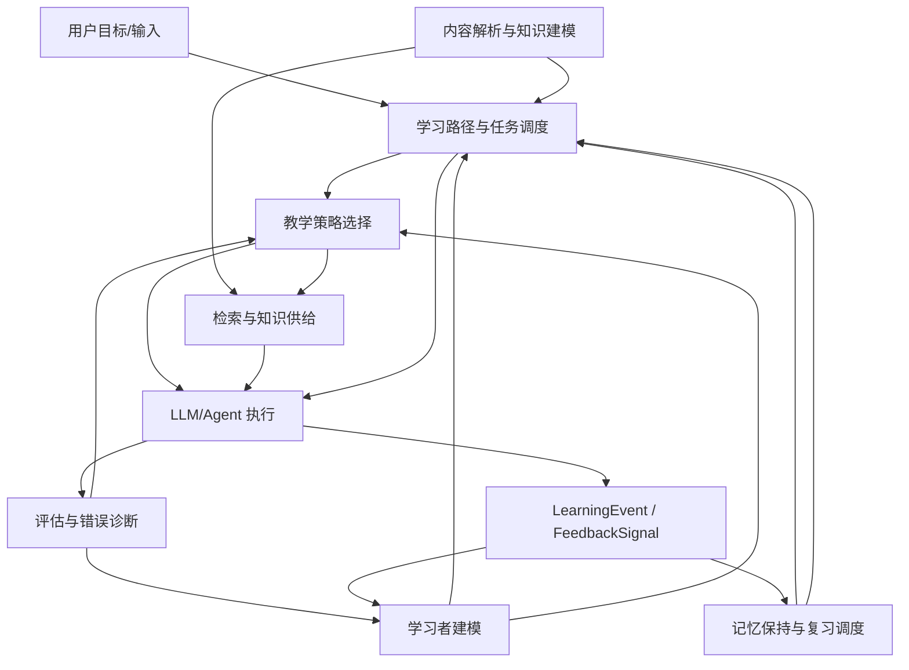
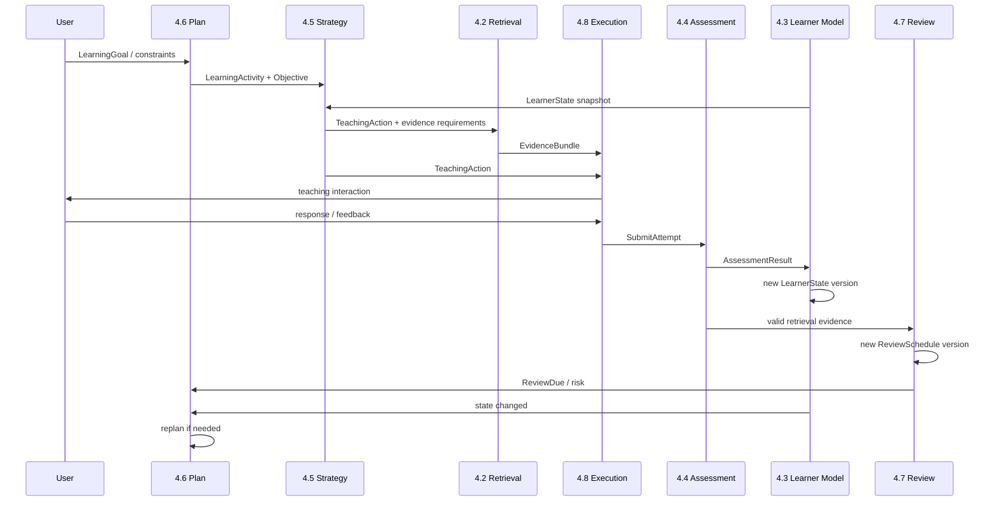

# Askora AI 学习系统：算法与教学内核设计

> 状态：阶段性设计基线  
> 更新时间：2026-08-07  
> 目标：定义 Askora 相对于普通 RAG 聊天工具与 DeepTutor 等通用 AI 学习平台的核心差异。

## 1. 核心定位

Askora 不应被定义为“能够读取资料并回答问题的 AI 聊天工具”，而应定位为：

> **以长期保持、独立完成和迁移能力为目标的个人自适应学习系统。**

系统不以对话量、即时正确率或课程完成率作为最高目标，而应优化：

- 延迟一段时间后仍能回忆；
- 不依赖提示完成任务；
- 将知识迁移到陌生情境；
- 用尽可能少的学习时间获得稳定能力。

完整学习闭环：

```text
学习目标
→ 内容与知识结构建模
→ 先备知识诊断
→ 学习者状态估计
→ 教学策略选择
→ 学习任务执行
→ 行为证据采集
→ 掌握状态更新
→ 间隔复习与迁移验证
→ 动态重新规划
```

---

## 2. 教学策略的决策变量

教学策略可抽象为：

```text
教学策略 = f(
  学习目标,
  先备知识,
  内容复杂度,
  错误类型,
  学习阶段
)
```

这些变量不是系统天然知道的事实，而是持续更新的估计值。每个维度都应保存：

```text
当前估计值 + 证据来源 + 置信度 + 更新时间
```

### 2.1 学习目标

由用户输入和系统结构化确认获得，包括：

- 学习主题；
- 目标能力层级；
- 应用场景；
- 截止时间；
- 时间预算；
- 成功标准。

LLM 可以负责从自然语言中抽取目标，但最终目标必须可编辑、可确认，不能完全由模型猜测。

### 2.2 先备知识

通过以下证据估计：

- 自适应诊断题；
- 概念解释；
- 代表性任务；
- 历史学习记录；
- 前置知识图谱。

第一阶段可使用 BKT 估计知识点掌握概率，后续用 IRT 校正题目难度和用户能力。

### 2.3 内容复杂度

应区分：

- 内容固有复杂度；
- 相对于当前学习者的复杂度。

主要变量包括：

- 前置知识数量；
- 依赖深度；
- 同时交互的概念数量；
- 推理步骤数量；
- 抽象程度；
- 用户已掌握的相关知识。

### 2.4 错误类型

错误至少应区分：

- 知识缺失；
- 概念误解；
- 条件遗漏；
- 方法选择错误；
- 执行错误；
- 记忆提取失败；
- 迁移失败；
- 表达不完整；
- 元认知错误。

错误识别建议采用：

```text
确定性规则
→ 误区模式库
→ 诊断追问
→ LLM 语义分类
→ 后续题验证
```

### 2.5 学习阶段

学习阶段应根据行为证据推导，而不是按课程进度机械计算：

```text
未诊断
→ 知识断层
→ 初步建模
→ 有提示模仿
→ 无提示应用
→ 延迟保持
→ 迁移掌握
```

---

## 3. 上传一本书后的工作流程

以上传《哥德尔、艾舍尔、巴赫》EPUB 为例，Askora 不应直接从第一章开始总结，而应执行以下流程。

### 3.1 明确学习目标

例如：

- 理解全书主要思想；
- 理解形式系统、自指与不完备性；
- 能解释哥德尔证明的核心结构；
- 能将怪圈概念迁移到程序、AI 或意识问题中。

不同目标对应不同学习路径。

### 3.2 解析 EPUB

提取：

- 目录和章节；
- 段落和脚注；
- 插图与案例；
- 定义、论证、谜题和练习；
- 原文位置和引用锚点。

### 3.3 构建知识结构

示意：

```text
符号与规则
→ 形式系统
→ 对象语言与元语言
→ 自指
→ 对角化
→ 哥德尔编码
→ 不完备性
→ 怪圈、意识与智能
```

机器抽取的概念和关系只能作为候选，需要经过：

- 同义词合并；
- 原文证据绑定；
- 循环依赖检查；
- 置信度标记；
- 人工修正。

### 3.4 诊断先备知识

系统用少量高信息增益题目判断：

- 是否理解公理与定理；
- 是否理解系统与元系统；
- 是否能操作简单形式规则；
- 是否理解自指和悖论；
- 是否具备基础逻辑知识。

### 3.5 生成概念路径

学习路径不必等于原书目录顺序：

```text
建立直觉
→ 掌握形式机制
→ 理解不完备性
→ 建立跨领域联系
→ 完成迁移任务
```

### 3.6 动态教学

针对同一知识点，根据学习状态采用不同策略：

- 完全陌生：直接讲解 + 完整示例；
- 有初步理解：苏格拉底追问；
- 会模仿：示例褪去 + 半完成题；
- 能独立完成：变式练习；
- 已稳定掌握：延迟测试 + 迁移任务。

---

## 4. AI 学习工具的八类技术系统

### 4.0 本章目标与设计原则

本章把 Askora 的教学内核拆成八类职责唯一、状态边界明确的技术系统。核心目标不是堆叠更多 RAG、LLM 或 Agent，而是建立一条可实现、可回放、可解释、可评估的教学闭环。

证据标记统一使用：`学术共识`、`研究证据`、`行业实践`、`Askora 设计选择`、`实验性方案`、`研究者推断`。

冻结原则：

1. 每项核心职责只有一个主责系统；
2. 每类核心决策只有一个最终所有者；
3. 关键业务状态只允许一个系统写入；
4. 评估证据与长期学习者状态分离；
5. 教学动作与长期学习计划分离；
6. 一般计划与复习调度分离；
7. 检索层负责供给证据，不负责选择教学动作；
8. LLM/Agent 负责推断、生成和执行，不拥有业务真相；
9. 任何高级算法都必须优于简单 baseline 后才进入下一阶段；
10. 最终效果关注无提示独立完成、延迟保持和迁移，而不是点击率、对话次数或学习时长。

### 4.1 八类技术系统现状诊断

重构前第 4 章存在明显成熟度断层：

| 原系统 | 重构前状态 | 主要问题 |
|---|---|---|
| 内容解析与知识建模 | 已有详细工程设计 | 与公共对象命名、状态所有权需统一 |
| 检索与知识供给 | 已有详细工程设计 | 需冻结与教学策略、Agent 的决策边界 |
| 学习者建模 | 能力清单 | 缺状态模型、更新规则、置信度和版本 |
| 评估与错误诊断 | 能力清单 | 与掌握判断边界冲突 |
| 教学策略选择 | 能力清单 | 缺 TeachingAction 所有权、策略约束和演进方法 |
| 学习路径与任务调度 | 能力清单 | 与即时教学、复习调度边界不清 |
| 记忆保持与复习调度 | 能力清单 | 与 LearnerState、LearningPlan 重复 |
| LLM 生成、Agent 编排与可信控制 | 能力清单 | 容易演化成越权的“超级决策系统” |

必须保留的 4.1/4.2 设计包括：

- 4.1 的 `RawAsset → MaterialRevision → DocumentNode → SourceSpan → KnowledgeObject → KnowledgeRelation → PedagogicalAsset → IndexProjection` 分层思想；
- `DocumentIR`、稳定原文锚点、证据强绑定、多粒度内容单元、候选抽取、实体消歧、关系置信度、质量门禁、增量更新、版本追踪、索引投影和解析安全；
- 4.2 的教学感知检索、多路召回、RRF、重排、GraphRAG/PageIndex 边界、`EvidenceBundle`、L0～L4 答案泄漏控制、引用、失败降级、缓存版本和多级评估。

重构前的主要闭环断点：

```text
AssessmentResult → MasteryEstimate 缺正式协议
LearnerState → TeachingAction 缺正式决策协议
ReviewSchedule → LearningPlan 缺统一合并机制
TeachingAction + EvidenceBundle → 可执行交互缺确定性编排边界
用户纠正 → 状态重算缺标准流程
算法决策 → 离线回放/A-B 缺统一 DecisionTrace
```

### 4.2 八类系统职责矩阵

| 技术系统 | 唯一核心职责 | 最终决策所有权 | 明确不负责 |
|---|---|---|---|
| 内容解析与知识建模 | 把原始材料转为规范、可审计知识结构 | 内容/知识对象和关系是否发布 | 用户掌握、教学动作、学习计划 |
| 检索与知识供给 | 为当前教学动作选择可引用证据 | 哪些候选进入 EvidenceBundle | 为什么要取、教学动作、掌握更新 |
| 学习者建模 | 维护学习者认知状态估计 | LearnerState、MasteryEstimate、用户误区假设 | 单次判分、教学动作、计划、复习时间 |
| 评估与错误诊断 | 对单次 Attempt 产生测量和诊断证据 | AssessmentResult、错误类型、评分置信度 | 长期掌握状态 |
| 教学策略选择 | 对当前目标选择即时 TeachingAction | TeachingAction、提示强度、答案暴露上限 | 长期学习目标排序、模型执行 |
| 学习路径与任务调度 | 生成并维护 LearningPlan | 学什么、先后顺序、今日活动 | 怎么讲、何时最佳复习 |
| 记忆保持与复习调度 | 计算遗忘风险和下一建议复习时点 | ReviewSchedule、next_due_at | 完整日计划、mastery 裁决 |
| LLM 生成、Agent 编排与可信控制 | 执行既定领域决策并生成交互 | 会话执行、模型/工具路由和工程降级 | 改 learner state、教学策略、计划和复习日期 |

核心决策唯一所有者：

```text
知识事实/关系发布        → 内容解析与知识建模
EvidenceBundle 最终选择   → 检索与知识供给
单次评分/错误诊断         → 评估与错误诊断
长期掌握估计              → 学习者建模
当前教学动作              → 教学策略选择
长期/今日学习计划          → 学习路径与任务调度
下一建议复习时间           → 记忆保持与复习调度
会话/模型/工具执行         → LLM/Agent 编排与可信控制
```

### 4.3 整体分层架构

八类系统分成四个逻辑层：

```text
知识基础设施层
- 内容解析与知识建模
- 检索与知识供给

学习证据与状态层
- 评估与错误诊断
- 学习者建模
- 记忆保持与复习调度

教学决策层
- 教学策略选择
- 学习路径与任务调度

交互执行与治理层
- LLM 生成、Agent 编排与可信控制
```

整体数据流：



反馈环通过不可变事件和新状态版本形成，不允许多个系统同步写同一业务状态。

### 4.4 统一领域对象

相同语义必须复用统一对象。4.1 原有内部对象继续保留，但跨系统接口统一如下。

| 对象 | 含义 | 唯一创建/拥有方 | 更新机制 | 属性分类 |
|---|---|---|---|---|
| `LearningGoal` | 用户最终能力目标、场景、预算、成功标准 | 4.6；用户确认语义 | 新版本 | 用户事实 + 目标决策 |
| `LearningObjective` | 可计划、可验证的阶段目标 | 4.6 | plan version | 决策 |
| `SourceDocument` | 版本化规范材料；内部映射 MaterialRevision | 4.1 | 新 revision | 来源事实 |
| `SourceChunk` | 具原文锚点的检索投影 | 4.1 | 随索引重建 | 来源事实投影 |
| `KnowledgeUnit` | 可教学/评估/规划的知识或技能单元 | 4.1 | stable id + revision | 事实/归纳，带 provenance |
| `Concept` | 规范语义概念身份 | 4.1 | canonical revision | 事实/规范化归纳 |
| `PrerequisiteRelation` | hard/soft/contextual 前置关系 | 4.1 | edge revision | 事实或推断，带证据 |
| `LearnerState` | 学习者当前认知状态快照 | 4.3 | 新 snapshot | 推断 |
| `MasteryEstimate` | learner × KnowledgeUnit 掌握估计 | 4.3 | 新 estimate version | 推断 |
| `Misconception` | 规范误区定义 | 4.1 | revision | 事实/专家归纳/候选分层 |
| `LearningActivity` | 可执行的新学/复习/诊断/迁移任务 | 4.6 | plan version | 计划决策 |
| `TeachingAction` | 当前一步教学动作 | 4.5 | 不原地改；创建下一决策 | 决策 |
| `TeachingStrategy` | 可版本化教学策略模板 | 4.5 | semantic version | 策略配置 |
| `TeachingContext` | 决策时的只读上下文快照 | 4.5 | 每次重建 | 决策输入快照 |
| `EvidenceBundle` | 当前动作可使用的证据集合 | 4.2 | 每次检索新建 | 来源事实 + 选择决策 |
| `AssessmentItem` | 可评分测量单元 | 4.4 | item version | 测量设计 |
| `Attempt` | 学习者一次提交 | 4.4 | append/revision link | 用户行为事实 |
| `AssessmentResult` | 单次评分、错误、误区证据、置信度 | 4.4 | 复评产生新版本 | 测量推断 |
| `LearningPlan` | 中长期目标与活动计划 | 4.6 | replan 新版本 | 决策 |
| `ReviewSchedule` | 记忆状态、风险、next_due_at | 4.7 | schedule version | 推断 + 调度决策 |
| `LearningEvent` | 不可变学习/领域事件 | 4.8 托管 Event Ledger | append-only | 发生事实 |
| `FeedbackSignal` | 用户对教学、评分、体验或状态的显式反馈 | 4.8 | append-only | 用户事实 + 分类推断 |
| `ModelInference` | 一次模型调用的完整执行元数据 | 4.8 | append-only | 模型推断/执行记录 |
| `DecisionTrace` | 关键决策的输入、候选、约束、理由、版本 | 4.8 托管账本；领域系统提供 payload | append-only | 决策记录 |

原 4.1 对象映射：

```text
RawAsset           → 4.1 内部原始资产
MaterialRevision   → SourceDocument 的不可变版本实体
DocumentNode       → 4.1 内部结构节点
SourceSpan         → 4.1 内部最小证据锚点
KnowledgeObject    → 统一为 KnowledgeUnit
KnowledgeMention   → 文档 mention，不等于 Concept
KnowledgeRelation  → 关系基类；PrerequisiteRelation 公共化
PedagogicalAsset   → 教学素材候选；正式 AssessmentItem 由 4.4 发布
IndexProjection    → 全文/向量/图等可重建投影
```

关键对象边界：

```text
AssessmentResult ≠ MasteryEstimate
Misconception 定义 ≠ 用户存在该误区的假设
ReviewSchedule ≠ LearnerState
LearningPlan ≠ TeachingAction
SourceChunk ≠ KnowledgeUnit
```

### 4.5 统一事件与决策协议

#### 4.5.1 LearningEvent

```json
{
  "event_id": "evt_xxx",
  "event_type": "question.answered",
  "user_id": "usr_xxx",
  "session_id": "ses_xxx",
  "timestamp": "2026-08-07T08:00:00+08:00",
  "source_system": "assessment",
  "entity_type": "Attempt",
  "entity_id": "att_xxx",
  "payload": {},
  "schema_version": "1.0",
  "trace_id": "trace_xxx"
}
```

协议要求：

- `event_id` 全局唯一，消费者按 event id 幂等；
- transient error 指数退避，业务校验失败不盲重试；
- 不假设跨分区全局顺序，迟到事件可触发局部 replay；
- schema 采用版本化、尽量 additive 的演进方式；
- 关键领域更新使用 Transactional Outbox；
- 无法恢复的事件进入 Dead Letter Queue，可人工审查和重放；
- 学习者状态与复习状态可由不可变学习事件重建；
- 更正历史不直接改旧事件，而产生 correction event。

#### 4.5.2 DecisionTrace

```json
{
  "decision_id": "dec_xxx",
  "decision_type": "teaching_action_selection",
  "inputs": [
    {"entity_type": "LearnerState", "entity_id": "ls_xxx", "version": "42"}
  ],
  "candidate_actions": [],
  "selected_action": {},
  "constraints": [],
  "reason_codes": [],
  "confidence": 0.0,
  "algorithm_version": "1.0",
  "model_version": "model_xxx",
  "created_at": "2026-08-07T08:00:00+08:00",
  "trace_id": "trace_xxx"
}
```

必须记录：

- 高影响知识对象/关系发布；
- EvidenceBundle 最终选择；
- Adaptive AssessmentItem 选择；
- 复杂 AssessmentResult；
- MasteryEstimate 更新；
- TeachingAction 选择；
- LearningPlan 生成与重规划；
- ReviewSchedule 更新；
- 高影响模型路由和降级；
- 用户纠正系统判断后的重算。

DecisionTrace 支持：

```text
稳定 reason codes
→ 用户可解释
→ 历史 replay
→ 新旧算法 counterfactual compare
→ A/B experiment_id / variant_id
→ algorithm/prompt/model rollback
```

### 4.6 公共教学科学原则

以下原则只定义一次，各系统引用而不重复理论史。

| 原则 | 证据判断 | Askora 约束 |
|---|---|---|
| 掌握学习 | `研究证据` | 进入强依赖目标前需要足够先备证据，但阈值需校准 |
| 提取练习 / 测试效应 | `学术共识` | 真实提取优先；看答案后复述与独立成功不等权 |
| 间隔效应 | `学术共识` | 复习跨时间分散；不存在适用于所有内容的固定天数 |
| 交错学习 | `研究证据` | 适合需要类别/策略辨别的任务，不机械交错全部内容 |
| Worked Examples | `研究证据` | 新手阶段降低无效搜索，能力增长后逐步褪去 |
| 认知负荷 | `研究证据` | 控制一次动作的信息量、推理跨度和上下文冗余 |
| 形成性评价 | `研究证据` | 评估用于产生下一步证据，不把“给分”当终点 |
| 脚手架 | `研究证据` | 支架有等级、有退出条件、能撤除，防止提示依赖 |
| Productive Failure | `研究证据` | 仅在任务适合且之后有 consolidation 时采用 |
| 元认知/自我调节 | `研究证据` | 用户可查看目标、状态、证据并纠正系统 |
| 延迟保持 | `学术共识` | 即时正确不足以证明稳定掌握 |
| 知识迁移 | `学术共识` | 独立测量迁移；表面换数字不等于真正迁移 |

稳定掌握建议定义为 `Askora 设计选择`：

```text
MasteryEstimate 达到经校准阈值
AND 足够的无提示独立成功
AND 至少一次延迟提取证据
AND 无高置信活跃误区
```

迁移掌握：

```text
稳定掌握
AND 足够新颖的迁移任务独立成功
```

阈值不是学术定律，必须由 Askora 数据校准。

### 4.7 公共 AI 工程能力

所有 LLM/ML 调用经统一 Model Gateway：

```text
typed request
→ model route
→ timeout/retry
→ structured output
→ schema validation
→ business validation
→ ModelInference
```

公共能力只实现一次：

1. **结构化输出**：JSON/typed schema、enum/范围/引用 ID 校验；
2. **Prompt 版本**：`prompt_template_id + prompt_version + schema_version`；
3. **模型路由**：按能力、延迟、成本、隐私选择；确定性计算不用 LLM；
4. **超时与重试**：区分网络、限流、拒绝、schema failure；非幂等工具不盲重试；
5. **缓存**：键包含业务对象版本、索引版本、Prompt/模型版本和权限范围；
6. **日志与可观测性**：统一 `trace_id/session_id/decision_id/model_inference_id/retrieval_trace_id/event_id`；
7. **成本治理**：每次调用记录 usage/cost，设置 session/workflow budget；
8. **Prompt Injection 防护**：上传内容始终作为不可信 data；tool allowlist、least privilege、参数校验和纵深防御；
9. **数据隐私**：数据最小化、用户隔离、日志脱敏、供应商字段最小化；
10. **无模型降级**：已有计划、ReviewSchedule、规则判分、LearnerState 投影和缓存检索在外部 LLM 不可用时仍可工作；
11. **权限与审计**：模型不能直接 UPDATE 领域表，所有写入走领域 command；
12. **事件驱动**：使用 Outbox、幂等消费者、DLQ 和 schema evolution。

`行业安全共识`：RAG 和 fine-tuning 不能完全消除 Prompt Injection，因此禁止将系统 Prompt 视为唯一安全边界。

### 4.8 八类技术系统逐项设计

#### 4.8.1 内容解析与知识建模

**系统定义**：把原始材料转换为可审计、版本化、可定位原文、可教学和可评估的规范知识模型。

**唯一所有权**：SourceDocument、SourceChunk、KnowledgeUnit、Concept、PrerequisiteRelation、规范 Misconception 及发布状态。

##### 分层内容模型

继续沿用原设计的八层思想，并统一跨系统命名：

```text
RawAsset
→ MaterialRevision / SourceDocument revision
→ DocumentNode
→ SourceSpan
→ KnowledgeUnit（原 KnowledgeObject）
→ KnowledgeRelation / PrerequisiteRelation
→ PedagogicalAsset
→ IndexProjection
```

| 层 | 主要职责 |
|---|---|
| RawAsset | 原文件、checksum、MIME、大小、安全扫描 |
| MaterialRevision | 不可变材料版本 |
| DocumentNode | 卷、章、节、段、表格、图片、公式、代码、脚注 |
| SourceSpan | 最小可回放证据锚点 |
| KnowledgeUnit | 可教学、可评估、可规划的知识/技能 |
| KnowledgeRelation | 前置、组成、推导、对比、应用、例证等 |
| PedagogicalAsset | 定义、解释、示例、反例、练习、解答、提示、误区候选 |
| IndexProjection | 全文、向量、图、层级索引等可重建投影 |

关系数据库中的规范内容模型是事实源，向量库、全文索引和图数据库均是可重建投影。

##### 解析与结构恢复

优先支持 Markdown、TXT、EPUB、PDF、DOCX，后续扩展 HTML、网页快照、幻灯片、音视频转写。

| 格式 | 必须保留 | 主要风险 |
|---|---|---|
| Markdown | 标题、列表、表格、引用、代码、公式 | 正则切分破坏嵌套结构 |
| TXT | 段落、空行、推断章节 | 缺少显式结构 |
| EPUB | spine、TOC、标题、脚注、图片、内部链接、CFI | 去 HTML 后锚点丢失 |
| PDF | 页码、文本框、阅读顺序、表格、公式、图片、脚注 | 多栏错序、扫描页、编码错误 |
| DOCX | 标题样式、列表、表格、图片、题注、脚注、公式 | 只读段落会丢结构语义 |

PDF 采用分级策略：

```text
原生文本层
→ 版面分析/阅读顺序恢复
→ 局部 OCR
→ 整页 OCR
→ 低置信人工复核
```

OCR 不是默认路径；正常数字 PDF 不重复识别。

##### 统一 DocumentIR

所有解析器输出统一中间表示，而不是只有 `full_text + chunks`：

```json
{
  "material_id": "mat_xxx",
  "revision_id": "rev_xxx",
  "source_type": "epub",
  "checksum": "sha256:...",
  "parser": {"name": "epub_parser", "version": "2.0.0"},
  "nodes": [],
  "source_spans": [],
  "assets": []
}
```

DocumentIR 必须保留稳定定位信息：页码/节点路径/字符区间/EPUB CFI/DOM path 等，保证引用能回放原文。

##### 多粒度内容单元

禁止一个固定 chunk 同时承担所有职责。至少区分：

```text
EvidenceSpan      精确引用/证据
SemanticUnit      知识抽取/教学建模
RetrievalChunk    检索召回
HierarchyNode     长文档范围定位
```

`SourceChunk` 是检索投影，不是知识事实；`KnowledgeUnit` 才是教学和规划的规范对象。

##### 知识对象与关系

KnowledgeUnit 可覆盖：概念、事实、命题、规则、过程、方法、策略、表征、技能等。Concept 是规范语义身份，不等于文档中每次 mention。

关系至少区分：

```text
hard_prerequisite
soft_prerequisite
part_of
explains
supports
contrasts_with
example_of
applies_to
derived_from
possible_same_as
```

hard prerequisite 发布要求最高：必须有证据或审核，执行环检测；仅有章节顺序或模型直觉不得自动变成硬前置。

##### 候选抽取、消歧和置信度

核心流水线：

```text
确定性结构解析
→ 语义切分
→ Schema 约束 LLM/规则抽取候选
→ SourceSpan 绑定
→ 实体消歧/别名合并
→ 关系推断
→ 反向证据验证
→ 图质量检查
→ 自动发布或人工复核
```

置信度来自可校准证据，例如：来源显式性、多个抽取器一致性、反向验证、结构线索和人工标签；LLM 自报 confidence 不能直接视为概率。

##### 版本、增量更新和存储

- `MaterialRevision` 不可变；
- canonical ID 尽量跨版本稳定；
- parser/model/prompt/config 版本全部记录；
- 文档局部变化只重算受影响节点、知识对象和索引投影；
- 删除/合并对象使用 supersedes/retired，而不是静默复用 ID；
- 所有索引都可从规范数据库重建。

##### 事件和安全

关键事件包括：

```text
MaterialImported
MaterialParsed
KnowledgeCandidateCreated
KnowledgeUnitPublished
RelationPublished
KnowledgeModelUpdated
ProjectionBuilt
```

上传文件视为不可信输入：文件大小/类型限制、解压炸弹防护、宏/脚本禁止执行、OCR/解析沙箱、Prompt Injection 内容按数据处理。

##### 核心算法与评估

核心问题不是最大化抽取数量，而是最大化：

```text
高精度知识对象
× 证据覆盖
× ID 稳定性
× 可回放性
```

hard prerequisite 的 precision 优先于 recall。

离线指标：对象/关系 P-R-F1、entity resolution accuracy、hard prerequisite precision、anchor replay rate、hallucination rate。系统指标：解析时延、失败恢复、增量重算率、索引一致性。教学效果需通过后续学习实验验证，不能由知识图指标直接推出。

##### 演进路线

- MVP：DocumentIR、SourceSpan、稳定文档版本、基础 SourceChunk；
- 增强：KnowledgeUnit/Concept/Relation、人工审核、增量更新；
- 成熟：跨材料 canonical、多模态、置信度校准、抽样审核；
- 暂不建议：独立图数据库作为事实源、纯 LLM 端到端自动建图、低证据关系自动发布。

#### 4.8.2 检索与知识供给

**系统定义**：在 4.5 已确定的 TeachingAction、来源范围和答案暴露约束下，从知识基础设施选择最适合本轮教学的证据集合。

**唯一所有权**：EvidenceBundle 最终选择。

核心原则：

> **检索相关性（retrieval relevance）不等于教学适用性（pedagogical suitability）。**

##### TeachingRetrievalRequest

检索请求应由 TeachingAction 编译而来，而非把用户原话直接作为唯一 query：

```json
{
  "learning_objective_id": "obj_xxx",
  "target_knowledge_unit_ids": ["ku_xxx"],
  "pedagogical_roles": ["definition", "example", "misconception"],
  "learner_stage": "emerging",
  "answer_exposure_max": "L1",
  "source_scope": ["rev_xxx"],
  "required_prerequisites": [],
  "context_budget_tokens": 3500
}
```

`learner_stage` 等字段来自 4.3/4.5 的只读 snapshot，检索层不维护另一份状态。

##### 多路召回

默认召回路线：

```text
BM25 / lexical
+ dense vector
+ graph neighborhood/path（按需）
+ hierarchy/page tree（长文档按需）
+ structured stores：题目/误区/定义/示例
```

稀疏与稠密检索错误模式互补；MVP 不应只保留单一路线。

多路融合可用 Reciprocal Rank Fusion：

```text
RRF(d) = Σ_i 1 / (k + rank_i(d))
```

随后进入 Cross-Encoder 或 late-interaction 重排，再做 MMR/覆盖/预算选择。

##### 教学重排与选择

建议 utility：

```text
score =
  w_r * semantic_or_lexical_relevance
+ w_c * target_concept_coverage
+ w_p * prerequisite_fit
+ w_s * learner_stage_fit
+ w_t * pedagogical_role_fit
+ w_q * source_quality
- w_l * answer_leakage_risk
- w_d * redundancy
- w_b * context_cost
```

硬约束先于分数：权限、source_scope、允许素材类型、最大答案暴露级别和 citation validity 不得由高相关性“抵消”。

证据选择可视为带覆盖约束的预算问题：

```text
maximize Σ utility(e)
subject to Σ tokens(e) <= context_budget
           required_roles covered
           exposure(e) <= allowed_level
```

MVP 用 greedy marginal utility/token 即可，不必为了理论最优引入复杂整数规划。

##### GraphRAG 与层级检索边界

GraphRAG 更适合：前置依赖、多跳关系、跨章节概念联系、全局主题。层级/PageIndex/RAPTOR 类路线更适合：长文档章节定位、连续论证和结构范围缩小。BM25/dense 更适合局部精确取证。

```text
精确术语/局部事实 → BM25 + dense
长文档连续论证   → hierarchy/page tree
跨知识依赖       → graph
```

三者互补，不设置“所有请求默认 GraphRAG”。任何图/摘要结果最终必须回到 SourceSpan。

##### EvidenceBundle

```json
{
  "bundle_id": "evb_xxx",
  "request_id": "trq_xxx",
  "items": [
    {
      "knowledge_unit_id": "ku_xxx",
      "pedagogical_role": "example",
      "source_span_id": "span_xxx",
      "content": "...",
      "relevance": 0.0,
      "confidence": 0.0,
      "answer_exposure_level": "L1",
      "allowed_use": ["teaching_generation"]
    }
  ],
  "missing_evidence": [],
  "conflicts": [],
  "retrieval_trace_id": "rtr_xxx"
}
```

引用链：

```text
最终生成陈述
→ EvidenceBundle item
→ KnowledgeUnit/PedagogicalAsset
→ SourceSpan/SourceChunk
→ MaterialRevision
```

##### 答案泄漏控制

暴露级别：

```text
L0 题目条件/已知事实
L1 方向性线索
L2 局部下一步
L3 关键解法结构
L4 完整解答
```

控制链：

```text
候选召回前元数据过滤
→ 重排惩罚
→ EvidenceBundle 选择
→ 最终生成层输出审查
```

4.5 拥有最高允许暴露级别；4.2 和 4.8 只能进一步收紧，不能放宽。

##### 缓存、失败和观测

缓存键必须包含：source/index version、request schema、TeachingAction/learner-state 相关版本、权限范围、reranker version。禁止不同学习阶段误用同一个性化 EvidenceBundle。

显式失败类型：

```text
NO_RELEVANT_EVIDENCE
INSUFFICIENT_PREREQUISITE_EVIDENCE
SOURCE_CONFLICT
CITATION_INVALID
EXPOSURE_POLICY_BLOCKED
INDEX_STALE
```

检索失败时返回 `missing_evidence/conflict/confidence`；不能自行切换 TeachingAction，更不能由 LLM 编造事实。

##### 评估与路线

离线：Recall@K、MRR、nDCG、citation precision/coverage、role coverage、leakage rate、redundancy/token efficiency。在线教学：下一次独立成功、提示依赖、延迟保持、迁移。

- MVP：BM25 + dense + RRF + Cross-Encoder + MMR + metadata filter + EvidenceBundle；
- 增强：graph/hierarchy route、coverage constrained selector、来源冲突；
- 成熟：LTR、基于学习结果的 rerank features、有限 Contextual Bandit route；
- 暂不建议：所有请求默认 GraphRAG、单 embedding 检索、Agent 自由检索后直接回答。

#### 4.8.3 学习者建模

**系统定义**：把多次 AssessmentResult、LearningEvent 和用户反馈融合为版本化、带不确定性的 LearnerState 与 MasteryEstimate。

**唯一所有权**：LearnerState、MasteryEstimate、学习者特定 misconception hypotheses。

建议 MasteryEstimate：

```text
learner_id
knowledge_unit_id
competence_probability
confidence
independent_success_count
hint_dependency_score
last_independent_success_at
delayed_recall_evidence
transfer_evidence
active_misconception_ids[]
evidence_count
effective_evidence_weight
algorithm_version
source_event_ids[]
```

##### MVP：证据加权 BKT

经典 BKT 保留可解释状态：

```text
P(L0) 初始掌握
P(T)  学习转移
P(G)  猜对
P(S)  失误
```

Askora 不把所有正确答案视为同一观察。证据质量按至少以下维度调整：

```text
看答案后复述        极低
强提示后成功        低
轻提示后成功        中
无提示相似任务成功   较高
延迟无提示回忆      高
陌生迁移任务成功    最高
```

这里的具体权重属于 `Askora 设计选择`，需要校准，而非学术固定常数。

`competence_probability` 与 `confidence` 分离：即使概率暂时高，如果有效证据少、没有延迟证据或题目过易，仍不能进入稳定掌握状态。

##### 其他模型边界

- PFA：强可解释 benchmark/challenger；
- IRT：用于题目难度/能力校准和 Adaptive Testing，不直接替代序列掌握状态；
- Cognitive Diagnosis：需要可靠 Q-matrix，题库成熟后再考虑；
- DKT/SAKT/SAINT：可作为数据成熟后的预测 challenger，高 AUC 不等于可解释 mastery；
- 深度模型只有在 user/time split 上稳定优于 BKT/PFA、校准不恶化并能改善教学决策时才进入主路径。

##### 误区状态

```text
Misconception              4.1 规范定义
AssessmentResult evidence  4.4 本次证据
LearnerState hypothesis    4.3 用户特定概率/活跃状态
```

一次错误不能直接成为长期误区；需要重复证据、鉴别题或用户确认。

##### Open Learner Model 与用户纠正

用户可以查看：

- 系统认为掌握/未掌握什么；
- 最近证据；
- 置信度；
- 提示依赖；
- 活跃误区假设；
- “系统判断不对”的纠正入口。

纠正流程：

```text
FeedbackSignal
→ disputed estimate
→ 复测/证据重权/人工复核
→ event replay/recompute
→ 新 LearnerState version
```

禁止用户反馈直接把 mastery 改为 0/1。

##### 评估与路线

离线重点：log loss、Brier、ECE/calibration、time-split prediction、replay determinism；AUC 为辅助指标。在线最终看状态驱动的教学是否减少错误晋级、提示依赖和无效重复，并改善延迟保持/迁移。

- MVP：BKT + evidence weighting；
- 增强：IRT/PFA、置信度校准、Open Learner Model；
- 成熟：hierarchical/Deep KT challenger、跨 KnowledgeUnit 关联；
- 暂不建议：LLM 自报掌握概率、黑盒模型作为唯一状态真相。

#### 4.8.4 评估与错误诊断

**系统定义**：对一次 Attempt 进行可复现测量，发布评分、错误类型、误区证据和评估置信度。

**唯一所有权**：AssessmentItem、Attempt、AssessmentResult。

核心边界：

```text
“这次是延迟 7 天、无提示独立正确，评分置信度 0.96”
属于 4.4

“用户已稳定掌握”
属于 4.3
```

##### 评估器分层

```text
MCQ/exact        → deterministic
numeric          → tolerance/unit checker
symbolic math    → CAS/equivalence checker
code             → sandbox tests + static constraints
structured steps → step validator
open explanation → rubric-constrained LLM + evidence + confidence
```

确定性评估器优先于 LLM。开放式 LLM judge 必须有 rubric、来源证据、schema、人工 gold set 和置信度；出现多评估器冲突时进入 adjudication 或 `needs_review`。

AssessmentResult 建议结构：

```text
raw_score
rubric_dimensions
correctness
error_type
misconception_evidence[]
independence_level
hint/exposure history
assessment_confidence
evaluator_versions
reason_codes
```

##### 错误诊断

至少区分：

```text
knowledge_missing
misconception
condition_omitted
method_selection_error
execution_error
retrieval_failure
transfer_failure
incomplete_expression
metacognitive_error
```

流程：

```text
确定性规则/测试
→ 已知误区模式
→ LLM 结构化语义分类
→ 诊断追问/鉴别题
→ AssessmentResult evidence
→ 4.3 更新长期状态
```

LLM 首次判断只能形成 evidence/hypothesis，不能永久标记用户。

##### Adaptive Testing

MVP 先采用：

```text
前置覆盖
+ 状态不确定性
+ 难度分级
+ 未暴露约束
+ 简单信息增益
```

题库获得稳定参数后再使用 IRT-CAT；题目选择不仅追求信息量，还必须满足内容覆盖和暴露控制。

##### 评估与路线

离线：专家一致性、accuracy/F1、kappa/ICC、misconception P/R、assessment confidence calibration。在线：复评/申诉率、错误反馈后的后续独立成功、诊断题效率。

- MVP：deterministic graders + rubric LLM + 人工 gold set；
- 增强：IRT、diagnostic probes、多评估器 adjudication；
- 成熟：题目质量模型、跨学科 grader ensemble；
- 暂不建议：单一 LLM judge 直接修改 mastery、未校准题库上复杂 CAT。

#### 4.8.5 教学策略选择

**系统定义**：在当前 LearningObjective 已确定的前提下，根据 LearnerState、最近 AssessmentResult 和约束选择下一步 TeachingAction。

**唯一所有权**：TeachingAction、TeachingStrategy、提示等级、答案暴露上限、证据需求和退出条件。

候选 TeachingStrategy：

```text
DIRECT_INSTRUCTION
WORKED_EXAMPLE_FADING
SOCRATIC_PROBING
GUIDED_PRACTICE
ERROR_REMEDIATION
RETRIEVAL_PRACTICE
PRODUCTIVE_FAILURE
TRANSFER_CHALLENGE
METACOGNITIVE_REFLECTION
```

TeachingAction 至少包含：

```text
action_type
strategy_id/version
scaffold_level
hint_level
answer_exposure_max
evidence_requirements
expected_evidence_type
success_condition
failure_condition
max_attempts
time_budget
reason_codes
```

##### MVP 策略算法

严格采用：

```text
Hard Rules
→ Feasible Action Set
→ State Machine Guard
→ Weighted Scoring
→ TeachingAction
```

示例硬规则：

```text
if assessment_mode == independent_test:
    禁止完整解释与高等级提示

if prerequisite_gap_high:
    提升 DIAGNOSTIC_PROBE / PREREQUISITE_REMEDIATION

if repeated_failure and scaffold_level < limit:
    允许逐级增加支架

if independent_success_repeated:
    降低支架并提高迁移/延迟提取候选权重
```

软评分示例：

```text
score(a) =
  w1 * expected_learning_value
+ w2 * diagnostic_value
+ w3 * learner_stage_fit
- w4 * hint_dependency_risk
- w5 * cognitive_load
- w6 * time_cost
```

状态机可表现为：

```text
UNKNOWN
→ DIAGNOSE
→ NOVICE: EXPLAIN / WORKED_EXAMPLE
→ EMERGING: SOCRATIC / GUIDED_PRACTICE
→ PRACTICING: FADED_EXAMPLE / PRACTICE
→ INDEPENDENT: NO_HINT_RETRIEVAL
→ RETAINED: DELAYED_RETRIEVAL
→ TRANSFER: TRANSFER_TASK
```

这里的 state machine 是策略控制状态，不是 4.3 LearnerState 的第二份真相。

##### 强化学习演进约束

必须依次比较：

```text
规则
→ 启发式评分
→ 监督学习
→ Contextual Bandit
→ Offline RL
→ 受约束在线 RL
```

当前推荐停在规则 + 状态机 + 加权评分，并建设高质量 DecisionTrace。

Contextual Bandit 只适合在安全动作候选中做局部个性化；奖励优先下一次无提示成功、提示依赖下降，长期再用延迟保持/迁移校正。点击、时长、点赞不能成为主奖励。

Offline RL 只有在存在大规模多策略轨迹、行为策略 propensity、长期 reward、可靠 OPE 和安全 shield 时才研究。在线受约束 RL 当前不实施。

##### 评估与路线

- 离线：constraint violation 必须为 0、专家一致性、历史 replay、后期 OPE；
- 教学过程：hint dependency、scaffold fading、diagnostic efficiency、策略振荡；
- 学习结果：下一次无提示成功、延迟保持、迁移、单位时间能力增益。

#### 4.8.6 学习路径与任务调度

**系统定义**：根据 LearningGoal、前置知识图、LearnerState、ReviewSchedule、时间预算和截止期生成并维护 LearningPlan。

**唯一所有权**：LearningObjective、LearningActivity、LearningPlan、今日任务优先级和重规划。

关键边界：

```text
4.6 决定：学什么、先后顺序、今天安排什么
4.5 决定：对当前任务怎么教
4.7 决定：某知识点何时最适合复习
```

LearningActivity 类型：

```text
LEARN_NEW
PREREQUISITE_REMEDIATION
DIAGNOSTIC
PRACTICE
DELAYED_REVIEW
TRANSFER_CHECK
METACOGNITIVE_REVIEW
```

##### 核心算法

先建立 prerequisite-feasible set：

```text
F = {
  u |
  hard_prerequisites(u) 已满足
  OR 当前活动本身是 prerequisite remediation
}
```

候选优先级：

```text
priority =
  w_g * goal_relevance
+ w_k * knowledge_gap
+ w_p * prerequisite_value
+ w_r * review_urgency
+ w_d * deadline_urgency
+ w_u * state_uncertainty
+ w_t * transfer_need
- w_c * expected_time_cost
```

再在时间预算下选活动：

```text
maximize Σ priority_i * x_i
subject to Σ duration_i * x_i <= daily_budget
           prerequisite/order constraints
           review/new/transfer mix constraints
```

MVP 用 greedy + constraint repair，优先可解释和稳定重规划；复杂时间/比例约束增强阶段可用 OR-Tools/MILP。

重规划触发：

- LearningGoal 变化；
- LearnerState 出现重大变化；
- hard prerequisite 被修订；
- ReviewSchedule 大量到期；
- deadline/time budget 变化；
- 当前计划连续失败或显著提前完成。

禁止每次对话微小变化就全量重排，避免 plan churn。

##### 强化学习边界

```text
固定课程/规则
→ 多目标启发式
→ 监督 ranking / duration-success models
→ Contextual Bandit（局部同层排序）
→ Offline RL
→ 受约束在线 RL
```

当前不使用 RL 规划整条 curriculum。长程 reward 跨天/周、状态部分可观测且真实学习时间不可随意探索。

##### 评估与路线

- 离线：constraint violation、plan coverage、budget fit、plan stability；
- 过程：prerequisite remediation、overdue review incorporated、plan abandonment；
- 结果：目标能力达成时间、延迟保持、迁移、单位时间 mastery gain。

#### 4.8.7 记忆保持与复习调度

**系统定义**：根据有效提取证据维护 learner × KnowledgeUnit 的记忆状态和遗忘风险，计算下一建议复习时点。

**唯一所有权**：ReviewSchedule、memory scheduling state、`next_due_at`。

核心边界：

```text
memory retrievability ≠ full mastery
4.7 决定什么时候最好复习
4.6 决定今天是否把这次复习排进去
```

##### 有效复习证据

只有符合最低证据质量的 retrieval event 才能高权更新：

- 发生真实主动提取；
- 未提前看到完整答案；
- 提示强度在允许阈值内；
- AssessmentResult confidence 足够；
- 记录与上次有效 retrieval 的时间间隔。

先看答案再复述、强提示补最后一步、随机猜中、点击“我会了”不能等价于无提示回忆。

##### FSRS-compatible 路线

`行业实践` + `Askora 设计选择`：MVP 优先采用 FSRS-compatible memory state，同时保留 SM-2/简单指数模型作为 benchmark/降级。

核心状态：

```text
Difficulty
Stability
Retrievability
Desired Retention
```

ReviewSchedule：

```text
learner_id
knowledge_unit_id
memory_model/model_version
difficulty
stability
retrievability
desired_retention
last_valid_retrieval_at
next_due_at
review_priority
evidence_quality
source_event_ids[]
```

更高 desired retention 会增加复习负担，因此 4.7 输出的是“基于目标保持率的建议时点”，4.6 还需结合现实时间预算。

##### 不同知识类型

- 事实/配对记忆最接近传统 SRS；
- 概念理解需要解释、反例、应用等不同 retrieval tasks；
- 程序技能需要真实执行；
- 迁移能力不能只由经典遗忘曲线代表，应由 4.4 安排迁移测量、4.3 更新状态。

##### 评估与路线

离线：Brier/log loss、recall calibration、observed vs predicted retention、与 SM-2 baseline 比较。过程：overdue、active-recall proportion、review workload。最终：延迟独立回忆、单位复习次数保持、迁移维持。

当前不采用 RL 替换成熟 SRS；只有传统调度在长期 workload-retention 上出现明确瓶颈且有反事实数据时再研究。

#### 4.8.8 LLM 生成、Agent 编排与可信控制

**系统定义**：把 4.1～4.7 已确定的状态、证据、计划和 TeachingAction 可靠执行为用户交互，并统一管理模型、工具、Prompt、安全和可观测性。

**唯一所有权**：SessionState、WorkflowRun、ModelInference、模型/工具执行路径、工程降级、Event/Decision Ledger 托管。

硬边界：

```text
LLM = 推断器 / 生成器 / 候选提出者 / 表达器
≠ 业务真相数据库
≠ LearnerState 所有者
≠ 教学策略所有者
≠ LearningPlan 所有者
≠ ReviewSchedule 所有者
```

##### 主工作流

```text
load immutable domain inputs
→ resolve workflow version
→ execute TeachingAction-defined steps
→ request/use EvidenceBundle
→ model/tool calls
→ schema validation
→ business policy validation
→ citation/exposure validation
→ render
→ capture Attempt/Feedback
→ append LearningEvent/ModelInference/trace
```

优先显式 workflow/state machine，而不是把主教学链交给 autonomous agent。

允许 Agent：

- 在已授权工具集内进行多步研究；
- 在固定 TeachingAction 下生成多个表达候选；
- 为复杂检索任务规划工具调用。

禁止 Agent：

- 直接修改 learner state；
- 修改 AssessmentResult 为“已掌握”；
- 自行改变 LearningPlan 或 next_due_at；
- 检索失败后偷偷改变 TeachingAction；
- 获得任意 shell/网络/文件写入权限而无边界。

##### 模型路由

```text
route utility =
  predicted_quality
- λ_cost * expected_cost
- λ_latency * expected_latency
- λ_risk * policy_or_privacy_risk
```

路由输入可以包括任务类型、上下文长度、成本/延迟预算、模型健康和隐私等级。确定性计算、简单分类优先不用大模型。

##### 生成可信控制

- 结构化输出必须 schema validation；
- 引用必须映射到 EvidenceBundle；
- schema 通过不代表业务语义合法，仍需 domain validation；
- 外部文档全部按不可信 data 处理；
- tool allowlist、least privilege、参数验证、side-effect 授权；
- workflow step/token/time/cost 均设置上限；
- 模型/Prompt/toolset/证据版本全部记录。

OWASP 对直接和间接 Prompt Injection 的公开指导表明 RAG 不能完全消除此类风险，因此 Askora 的防线重点是降低模型权限和攻击影响面，而不是声称“已解决 Prompt Injection”。

##### 无模型降级

外部 LLM 不可用时，仍应能够：

- 读取既有 LearningPlan；
- 维护/读取 ReviewSchedule；
- 执行确定性判分；
- 投影 LearnerState；
- 使用基础模板反馈；
- 使用 BM25/向量检索和已缓存 EvidenceBundle。

##### 评估与路线

离线：schema pass、faithfulness、citation precision、Prompt regression、injection red-team、模型路由质量/成本 Pareto。系统：latency、tool error、fallback、cost/session、event delivery。教学层最终仍用学习结果实验判断模型/表达 variant，而非“更流畅”作为成功标准。

### 4.9 系统接口与完整教学闭环

直接接口：

| 生产方 | 消费方 | 主要对象/命令 | 禁止越权 |
|---|---|---|---|
| 4.1 | 4.2 | SourceChunk/KnowledgeUnit/graph snapshot | 4.2 不改知识事实 |
| 4.1 | 4.4 | KnowledgeUnit/Misconception/PedagogicalAsset candidate | 4.1 不发布 AssessmentResult |
| 4.1 | 4.6 | PrerequisiteRelation | 4.6 不直接改图 |
| 4.2 | 4.8 | EvidenceBundle | 4.8 不重选证据 |
| 4.2 | 4.4 | grader/source EvidenceBundle | 4.2 不评分 |
| 4.4 | 4.3 | AssessmentResult | 4.4 不写 mastery |
| 4.3 | 4.5 | LearnerState/MasteryEstimate | 4.5 不写 learner state |
| 4.3 | 4.6 | LearnerState/MasteryEstimate | 4.6 不写 learner state |
| 4.7 | 4.6 | ReviewSchedule/ReviewDue | 4.6 不改 next_due_at |
| 4.6 | 4.5 | LearningObjective/LearningActivity | 4.5 不重排长期计划 |
| 4.5 | 4.2 | TeachingAction/evidence requirements | 4.2 不改变 TeachingAction |
| 4.5 | 4.8 | TeachingAction | 4.8 不私自换教学策略 |
| 4.8 | 4.4 | SubmitAttempt command | 4.8 不评分 |
| 4.8 | 4.3/4.7 | LearningEvent/FeedbackSignal | 4.8 不直接写状态 |

完整闭环：



循环依赖的处理原则是“读取旧 snapshot → 产生新不可变结果 → 下一轮消费新版本”，不在同一事务中互相写状态。

### 4.10 统一评估体系

Askora 采用四级指标，任何算法升级都不得只报告一级指标。

#### 一级：算法指标

- 检索：Recall@K、MRR、nDCG、citation precision；
- 学习者模型：log loss、Brier、ECE/calibration；
- 评估：专家一致性、F1、kappa/ICC；
- 教学策略：constraint violations、OPE policy value（成熟阶段）；
- 计划：constraint satisfaction、plan stability；
- 记忆调度：recall calibration、workload-retention；
- LLM/Agent：schema pass、faithfulness、tool success。

#### 二级：系统指标

- latency / availability；
- event lag；
- retry/fallback；
- index freshness；
- model/tool failure；
- cost；
- security/validation failure。

#### 三级：教学过程指标

- 独立尝试率；
- 提示依赖；
- scaffold fading；
- 前置缺口修复；
- error recurrence；
- answer leakage；
- 到期复习执行；
- 计划稳定性。

#### 四级：学习结果指标

优先级最高：

1. 无提示独立完成；
2. 延迟保持；
3. 陌生情境迁移；
4. 单位学习时间的稳定能力增益。

冻结结论：

```text
点击率、学习时长、对话次数、点赞
≠ 最终学习效果
```

```text
离线算法最优
≠ 教育效果最优
```

实验设计优先用户级/课程阶段级持久分流，避免同一用户频繁切 variant 造成 carryover。关键教学策略应尽量使用随机对照或可信反事实评价，而不是观察性相关。

### 4.11 隐私、安全、伦理与用户控制

#### 数据最小化

- 只收集教学所需 learner signals；
- 区分认知状态、体验偏好、敏感属性；
- 普通日志不保存完整敏感对话；
- 发往外部模型供应商的数据做字段最小化。

#### 隔离与访问

- 用户材料、LearnerState、评估、事件、向量索引按用户/租户隔离；
- Agent 工具按 least privilege 授权；
- 高影响写操作走领域 command + audit；
- 任何副作用工具需要显式权限边界。

#### Prompt Injection

上传书籍、网页、PDF、代码块中的“指令”均视为 source data。防御包括：

```text
不可信数据标记
→ instruction/data separation
→ tool allowlist
→ least privilege
→ parameter validation
→ no-secret context by default
→ output validation
→ monitoring/red-team
```

#### 用户控制

用户可以：

- 编辑/确认 LearningGoal；
- 查看 LearnerState 的依据和置信度；
- 对评分和误区判断提出异议；
- 要求更直接/更苏格拉底/更简单/更难；
- 暂停或跳过任务；
- 查看/导出关键学习记录；
- 触发状态复核，而不是被不可见算法永久贴标签。

#### 公平与伦理

学习者状态是模型推断，不得用“能力标签”造成不可逆路径锁定。低置信状态优先诊断；系统应允许重新证明能力，并记录模型版本和纠错过程。

### 4.12 整体技术选型

| 能力 | MVP 推荐 | 增强版 | 成熟版/研究 |
|---|---|---|---|
| 规范数据 | PostgreSQL | 分区/事件投影 | 按规模拆服务 |
| 文档解析 | format adapters + DocumentIR | 版面/公式/多模态 | 高级多模态模型 |
| 检索 | BM25 + dense + RRF + reranker | GraphRAG + hierarchy | LTR/局部 bandit |
| 向量 | pgvector 或成熟向量服务 | 独立向量服务按规模 | 多 embedding 路由 |
| 图 | PostgreSQL adjacency/edge model | 图投影/图服务 | 独立图数据库仅在收益明确时 |
| 学习者模型 | BKT + evidence weighting | PFA/IRT/calibration | Deep KT challenger |
| 评估 | deterministic + rubric LLM | IRT/CAT/adjudication | 题目质量模型 |
| 教学策略 | rules + state machine + weighted score | supervised/contextual bandit | Offline RL 研究 |
| 学习计划 | DAG feasibility + heuristic scheduler | OR-Tools/MILP | learned ranking/OPE |
| 复习 | FSRS-compatible + baseline | 个体参数优化 | 多目标长期调度 |
| Agent | explicit workflow + tool calling | 局部 agentic workflow | 受约束自治子任务 |
| 事件 | Outbox + append-only LearningEvent | replay/materialized views | 更完整事件平台按规模 |
| 可观测 | OpenTelemetry 思路 | experiment/decision dashboards | 自动异常分析 |

当前明确不应采用：

- 在线强化学习自由探索教学动作；
- Deep KT 作为唯一 learner state 真相；
- 所有请求默认 GraphRAG；
- 完全 autonomous Agent 统管学习者模型、评分、计划和状态写入；
- LLM 单独承担关键判分和知识发布；
- 独立图数据库作为第一阶段事实源；
- 以 engagement 指标作为教学主奖励。

### 4.13 MVP、增强版与成熟版实施路线

推荐实施顺序不是按“AI 炫技程度”，而是按闭环依赖。

#### MVP：先形成可验证闭环

1. 统一公共对象、状态所有权和事件协议；
2. 完成 4.1 DocumentIR、SourceSpan、KnowledgeUnit 最小模型；
3. 完成 4.2 混合检索、EvidenceBundle 和泄漏控制；
4. 建 4.4 AssessmentItem/Attempt/AssessmentResult 与 deterministic/rubric grader；
5. 建 4.3 BKT + evidence weighting LearnerState；
6. 建 4.5 规则 + 状态机 + 加权 TeachingAction；
7. 建 4.6 基于 DAG/优先级/时间预算的 LearningPlan；
8. 建 4.7 FSRS-compatible ReviewSchedule；
9. 建 4.8 明确 workflow、ModelInference、LearningEvent、DecisionTrace 和基础安全；
10. 建统一四级离线/在线评价。

#### 增强版：提高测量和个性化

- 4.1 跨材料 canonical / 更强知识关系；
- 4.2 graph/hierarchy routes；
- 4.3 PFA/IRT/calibration/Open Learner Model；
- 4.4 自适应诊断、多评估器；
- 4.5 监督 outcome model、局部 Contextual Bandit；
- 4.6 constraint solver、时长/成功模型；
- 4.7 个体 FSRS 参数和知识类型策略；
- 4.8 多模型路由、sandbox、Prompt regression、red-team。

#### 成熟版：数据证明后进入高级算法

- Learning-to-Rank / retrieval personalization；
- Deep KT ensemble/challenger；
- 教学策略 Offline RL 研究；
- 长程 curriculum OPE；
- transfer probe scheduling；
- 受约束 Agent 子任务自动化；
- 更严格的长期 RCT/准实验评估。

高级算法的进入条件：

```text
简单 baseline 存在明确瓶颈
AND 数据量与覆盖足够
AND 离线/反事实评价可靠
AND 可解释、可回滚
AND 在线实验有安全边界
AND 学习结果有增益
```

### 4.14 关键设计结论

以下直接回答本轮必须明确的 20 个关键问题。

| 问题 | 结论 |
|---|---|
| 1. 八类系统是否构成完整教学闭环？ | 是。知识→计划→策略→证据→执行→评估→状态→复习→重规划形成闭环，并通过事件/版本解耦。 |
| 2. 哪些属于知识基础设施？ | 内容解析与知识建模、检索与知识供给。 |
| 3. 哪些属于教学内核？ | 教学策略选择是即时教学内核；学习路径与任务调度是长期教学决策内核。 |
| 4. 哪些属于学习者建模？ | 学习者建模独占 LearnerState/MasteryEstimate；评估和复习只提供证据/辅助状态。 |
| 5. 哪些属于长期规划？ | 学习路径与任务调度拥有 LearningPlan；复习系统只拥有 next_due。 |
| 6. 哪些属于交互编排？ | LLM 生成、Agent 编排与可信控制。 |
| 7. 每个核心决策唯一所有者是谁？ | 已在 4.2 冻结；知识4.1、证据包4.2、掌握4.3、评分4.4、教学动作4.5、计划4.6、复习时点4.7、执行4.8。 |
| 8. 学习者模型与评估系统如何划分？ | 4.4 判断“这一次表现如何”；4.3 判断“综合历史后当前状态如何”。 |
| 9. 教学策略与学习计划如何划分？ | 4.6 决定学哪个目标/任务；4.5 决定当前任务怎么教。 |
| 10. 检索相关性与教学适用性有什么区别？ | 相关文本可能直接泄漏答案；教学适用性还需满足阶段、前置、提示和暴露约束。 |
| 11. 推荐内容与安排教学顺序是同一个问题吗？ | 不是。候选内容相关性属于供给/排序证据；跨目标教学顺序属于 4.6 受约束规划。 |
| 12. 如何避免答案泄漏？ | 4.5 定 exposure 上限；4.2 召回/重排/选包多阶段过滤；4.8 最终输出再验证。 |
| 13. 如何控制提示与脚手架强度？ | TeachingAction 显式 scaffold/hint level，策略依据 learner state 和错误逐级调整并在成功后撤除。 |
| 14. 如何判断真正掌握与暂时答对？ | 单次 AssessmentResult 不等于 mastery；需要多次独立成功、延迟证据、误区消退和迁移证据。 |
| 15. 如何评估延迟保持和知识迁移？ | 4.7 负责调度延迟提取，4.4 发布延迟/迁移 AssessmentResult，4.3 综合更新状态。 |
| 16. 如何处理错误的学习者状态估计？ | 用户/后续证据产生 FeedbackSignal/correction，4.3 通过 replay/recompute 生成新状态版本，历史不静默改写。 |
| 17. 如何允许用户纠正系统判断？ | Open Learner Model 显示依据、置信度和异议入口；纠错触发复测/复评/重算，而非直接强制概率。 |
| 18. 如何证明教学策略真正有效？ | 不能靠点赞/时长；使用用户级实验、下一次独立表现、延迟保持、迁移及单位时间能力增益。 |
| 19. 哪些高级算法当前不应采用？ | 在线 RL、全局 Offline RL、Deep KT 唯一真相、全请求 GraphRAG、完全 autonomous Agent。 |
| 20. Askora 与普通 RAG 问答工具的本质区别是什么？ | 普通 RAG 优化“找资料并回答”；Askora 维护长期 learner state、主动选择教学动作、控制答案暴露、安排复习/迁移并用真实学习结果闭环优化。 |

最核心的系统关系可以压缩为：

```text
知识事实由 4.1 管
证据供给由 4.2 管
长期认知状态由 4.3 管
单次测量由 4.4 管
当前怎么教由 4.5 管
长期学什么由 4.6 管
何时复习由 4.7 管
怎么可靠执行由 4.8 管
```

### 4.15 尚未解决的问题

以下不是文档占位，而是需要用 Askora 数据验证的明确假设：

1. 不同知识类型最合适的 KnowledgeUnit 粒度；
2. BKT 的提示/延迟/迁移证据权重如何校准；
3. 稳定掌握与迁移掌握的最优门槛；
4. LLM 开放式评分在不同学科的人工一致性上限；
5. 学习者误区 hypothesis 需要几类鉴别证据才足够可靠；
6. FSRS-compatible 状态对概念理解、程序技能的适用程度；
7. graph/hierarchy retrieval 对学习结果是否显著优于普通 hybrid RAG；
8. Contextual Bandit 在教学策略中的真实增益是否超过规则/监督模型；
9. 如何定义跨周甚至跨月的长期策略 reward 与可靠 OPE；
10. 用户可编辑 learner model 后，如何在尊重用户控制与保持测量一致性之间平衡；
11. 不同 LLM/Prompt 对教学表达的差异是否真的改变长期学习结果；
12. 何种迁移任务才足够新颖，能避免“题型记忆”伪装成迁移能力。

每个问题必须进入实验/评估 backlog，不得用模型推测直接填成“事实”。

### 4.16 参考资料

教育科学与测量：

1. Dunlosky, J. et al. (2013). *Improving Students’ Learning With Effective Learning Techniques*. https://doi.org/10.1177/1529100612453266
2. Cepeda, N. J. et al. (2006). *Distributed practice in verbal recall tasks*. https://pubmed.ncbi.nlm.nih.gov/16719566/
3. Roediger, H. L. & Karpicke, J. D. (2006). *Test-enhanced learning*. https://pubmed.ncbi.nlm.nih.gov/16507066/
4. Pan, S. C. & Rickard, T. C. (2018). *Transfer of test-enhanced learning*. https://pubmed.ncbi.nlm.nih.gov/29733621/
5. Brunmair, M. & Richter, T. (2019). *Interleaved learning meta-analysis*. https://pubmed.ncbi.nlm.nih.gov/31556629/
6. van Gog, T., Paas, F., & Sweller, J. (2010). Worked examples / Cognitive Load Theory. https://link.springer.com/article/10.1007/s10648-010-9145-4
7. Hattie, J. & Timperley, H. (2007). *The Power of Feedback*. https://doi.org/10.3102/003465430298487
8. Black, P. & Wiliam, D. (1998). *Assessment and Classroom Learning*. https://doi.org/10.1080/0969595980050102
9. Corbett, A. T. & Anderson, J. R. *Knowledge tracing*. https://doi.org/10.1007/BF01099821
10. Pavlik, P. I. et al. (2009). *Performance Factors Analysis*. https://doi.org/10.3233/978-1-60750-028-5-531
11. Piech, C. et al. (2015). *Deep Knowledge Tracing*. https://proceedings.neurips.cc/paper_files/paper/2015/hash/bac9162b47c56fc8a4d2a519803d51b3-Abstract.html
12. ETS (2020). *An Introduction to Item Response Theory*. https://www.ets.org/research/policy_research_reports/publications/report/2020/kbxx.html
13. Ma, W. et al. (2014). ITS learning outcomes meta-analysis. https://doi.org/10.1037/a0037123

检索、序列决策与记忆：

14. Lewis, P. et al. (2020). *Retrieval-Augmented Generation*. https://arxiv.org/abs/2005.11401
15. Robertson, S. & Zaragoza, H. (2009). *BM25 and Beyond*. https://doi.org/10.1561/1500000019
16. Karpukhin, V. et al. (2020). *Dense Passage Retrieval*. https://aclanthology.org/2020.emnlp-main.550/
17. Cormack, G. V. et al. (2009). *Reciprocal Rank Fusion*. https://doi.org/10.1145/1571941.1572114
18. Edge, D. et al. (2024). *GraphRAG*. https://arxiv.org/abs/2404.16130
19. Sarthi, P. et al. (2024). *RAPTOR*. https://arxiv.org/abs/2401.18059
20. Belfer, R. et al. (2022). Adaptive Curriculum + Contextual Bandits. https://arxiv.org/abs/2207.14003
21. Levine, S. et al. (2020). *Offline Reinforcement Learning*. https://arxiv.org/abs/2005.01643
22. Kumar, A. et al. (2020). *Conservative Q-Learning*. https://arxiv.org/abs/2006.04779
23. Settles, B. & Meeder, B. (2016). *A Trainable Spaced Repetition Model*. https://aclanthology.org/P16-1174/
24. Open Spaced Repetition. *FSRS*. https://github.com/open-spaced-repetition/free-spaced-repetition-scheduler
25. Anki Manual. *FSRS / Deck Options*. https://docs.ankiweb.net/deck-options.html

LLM、Agent 与可信工程：

26. Yao, S. et al. *ReAct*. https://arxiv.org/abs/2210.03629
27. Schick, T. et al. *Toolformer*. https://arxiv.org/abs/2302.04761
28. NIST. *AI RMF Generative AI Profile, NIST AI 600-1*. https://doi.org/10.6028/NIST.AI.600-1
29. OWASP GenAI Security Project. *LLM01:2025 Prompt Injection*. https://genai.owasp.org/llmrisk/llm01-prompt-injection/
30. CNCF. *CloudEvents Specification*. https://github.com/cloudevents/spec
31. Debezium. *Outbox Event Router*. https://debezium.io/documentation/reference/stable/transformations/outbox-event-router.html
32. OpenTelemetry. *Documentation*. https://opentelemetry.io/docs/

完整研究索引见：`docs/design/research/八类技术系统-参考资料索引.md`。

---

## 5. DeepTutor 与 Askora 的判断

### 5.1 DeepTutor 的优势

DeepTutor 当前是成熟度较高的通用 AI 学习工作台，强项包括：

- 文档解析；
- 多种 RAG；
- 知识库；
- Book Engine；
- Chat、Quiz、Research、Solve、Visualize；
- Agent 和 Tool 框架；
- 多模型接入；
- 记忆系统；
- Mastery Path；
- 间隔复习；
- 前端、部署和工程生态。

### 5.2 DeepTutor 的主要短板

其核心短板集中在教育算法：

- 掌握度主要使用最近答题的加权正确率；
- 题目难度未充分校准；
- 提示后答对和独立答对未严格区分；
- 概念型知识较依赖 LLM 定性判断；
- 教学策略主要由 LLM 临场决定；
- 学习路径主要按模块和知识点顺序推进；
- 复习间隔主要采用固定规则；
- 延迟保持和迁移尚未成为完整硬门槛。

总体判断：

```text
DeepTutor =
优秀的知识与 Agent 基础设施
+
可用的掌握式学习闭环
+
相对基础的教育算法
```

### 5.3 Askora 的优势方向

Askora 应重点增强：

- 学习目标结构化；
- 精细学习者模型；
- 独立教学策略引擎；
- 行为证据系统；
- 提示依赖追踪；
- 动态学习路径；
- 个性化遗忘模型；
- 延迟保持门槛；
- 迁移掌握门槛；
- 学习事件溯源。

### 5.4 推荐工程路线

不建议完全从零重做 DeepTutor 已有的成熟基础设施。

更合理的方案是：

> **参考或复用成熟项目的文档、RAG、模型接入和前端能力，重新设计 Askora 的教学内核。**

优先重写：

1. 学习者模型；
2. 证据模型；
3. 教学策略引擎；
4. 动态路径规划器；
5. 复习调度器；
6. 掌握门槛；
7. 教学效果评估。

---

## 6. Askora 建议采用的算法架构

### 6.1 掌握度模型

第一阶段采用：

```text
BKT + 题目难度分级 + 证据权重
```

后续逐步引入：

- IRT；
- 个性化参数；
- 置信区间；
- 跨知识点关联更新。

不同证据使用不同权重：

```text
看答案后复述：极低
强提示后答对：低
轻提示后答对：中
无提示相似题成功：较高
延迟后独立回忆：高
陌生任务迁移成功：最高
```

### 6.2 教学策略算法

第一阶段不直接采用完整强化学习，而使用：

```text
硬规则过滤 + 状态机 + 加权评分
```

策略输入：

```text
学习目标
先备知识
掌握概率
状态置信度
内容复杂度
错误类型
提示历史
挫败信号
时间预算
```

策略输出：

```text
教学模式
提示等级
预期学习证据
退出条件
选择理由
```

积累数据后再引入：

- Contextual Bandit，用于局部个性化；
- 受约束强化学习，用于长期教学序列优化。

规则负责教学安全底线，强化学习不能自由探索所有动作。

### 6.3 动态任务优先级

任务优先级综合：

```text
目标相关性
+ 知识缺口
+ 遗忘风险
+ 前置价值
+ 截止时间紧迫度
+ 状态不确定性
- 学习成本
```

同时满足：

- 前置知识约束；
- 今日时间预算；
- 新学、复习和迁移比例；
- 认知负荷限制；
- 学习任务多样性。

### 6.4 掌握门槛

稳定掌握建议定义为：

```text
掌握概率达到阈值
AND 至少两次无提示独立成功
AND 至少一次延迟回忆成功
AND 不存在活跃稳定误区
```

迁移掌握建议定义为：

```text
稳定掌握
AND 陌生情境任务成功
AND 未使用关键提示
```

### 6.5 事件溯源

所有学习行为保存为不可变事件，例如：

```text
MaterialImported
GoalConfirmed
QuestionPresented
HintRequested
AttemptSubmitted
AnswerRevised
MisconceptionDetected
DelayedRecallCompleted
TransferTaskCompleted
ReviewCompleted
StrategyFeedbackSubmitted
```

学习者状态由事件投影计算。

收益：

- 替换算法后重算历史状态；
- 审计掌握判断；
- 回滚错误推断；
- 进行离线算法比较；
- 支持未来训练策略模型。

---

## 7. 对话气泡反馈系统

建议在每条教学气泡下设计情境化反馈入口。

### 7.1 基础入口

```text
有帮助
没理解
换种讲法
调整难度
更多
```

### 7.2 讲解反馈

```text
太抽象
信息太多
太简单
例子不合适
内容可能有误
和问题无关
```

### 7.3 练习反馈

```text
题目太难
题目太简单
题意不清
缺少条件
超出范围
题目可能有误
```

### 7.4 提示反馈

```text
提示太弱
提示太强
已经暴露答案
没有解决卡点
```

### 7.5 评分反馈

```text
评分有误
没有理解我的答案
错误原因判断不准
参考答案有问题
```

### 7.6 直接教学控制

```text
换一个例子
拆成更小步骤
先补前置知识
让我自己再试一次
直接解释
改用苏格拉底提问
提高难度
降低难度
```

### 7.7 反馈数据分类

后台应将反馈分为三类：

1. 体验反馈：表达、长度、例子和风格；
2. 教学反馈：策略、提示强度和难度；
3. 质量反馈：事实错误、题目错误和评分争议。

不能把用户点赞直接视为教学有效。

### 7.8 反馈的正确用途

显式反馈只用于提出假设，例如：

- 用户可能不适合当前抽象讲解；
- 用户可能需要更强提示；
- 当前题目可能偏难；
- 当前评分可能存在争议。

真正验证策略效果的证据仍然是：

- 下一题是否独立成功；
- 提示依赖是否下降；
- 是否能自行解释；
- 延迟后是否能回忆；
- 是否能完成迁移题。

完整信号：

```text
显式反馈
+ 即时行为反馈
+ 后续学习表现
+ 延迟保持结果
```

---

## 8. 强化学习的适用边界

强化学习的潜在收益包括：

- 学习不同用户的个体差异；
- 优化长期结果而非即时正确率；
- 自动发现复杂教学策略组合；
- 学习何时撤除提示；
- 平衡探索与利用；
- 优化多步教学序列。

主要风险是奖励函数错位。

若奖励设置为点赞、完成率、活跃度或即时正确率，系统可能学会：

- 降低难度；
- 过度提示；
- 直接给答案；
- 避免挑战；
- 追求满意而非真实学习。

建议的长期奖励重点包含：

```text
延迟保持
+ 独立完成
+ 迁移成功
- 提示依赖
- 重复误区
- 无效学习时间
```

落地顺序建议：

```text
专家规则
→ Contextual Bandit
→ 群体预训练与个人适配
→ 有限的长期强化学习
```

---

## 9. 当前阶段结论

Askora 可以在教学算法层面设计得比 DeepTutor 更严格，但当前不应声称产品整体已经优于 DeepTutor。

准确判断是：

> **DeepTutor 是更成熟的现成 AI 学习平台；Askora 应成为更强调学习成果、学习证据和教学决策的自适应教学系统。**

Askora 下一阶段不应继续优先增加更多 RAG、Agent 或模型入口，而应优先实现：

1. 统一知识点模型；
2. 学习事件模型；
3. 学习者状态模型；
4. 教学策略引擎；
5. 掌握门槛；
6. 动态任务调度；
7. 对话气泡反馈体系；
8. 延迟复习和迁移测试；
9. 算法离线评估框架。

## 10. 推荐下一步文档拆分

当前文档作为总体设计基线。进入实现阶段后，建议拆分为：

```text
docs/design/01-产品定位与学习闭环.md
docs/design/02-八类算法与技术框架.md
docs/design/03-学习者模型与证据系统.md
docs/design/04-教学策略与动态路径规划.md
docs/design/05-反馈系统与强化学习.md
docs/research/DeepTutor对比分析.md
```