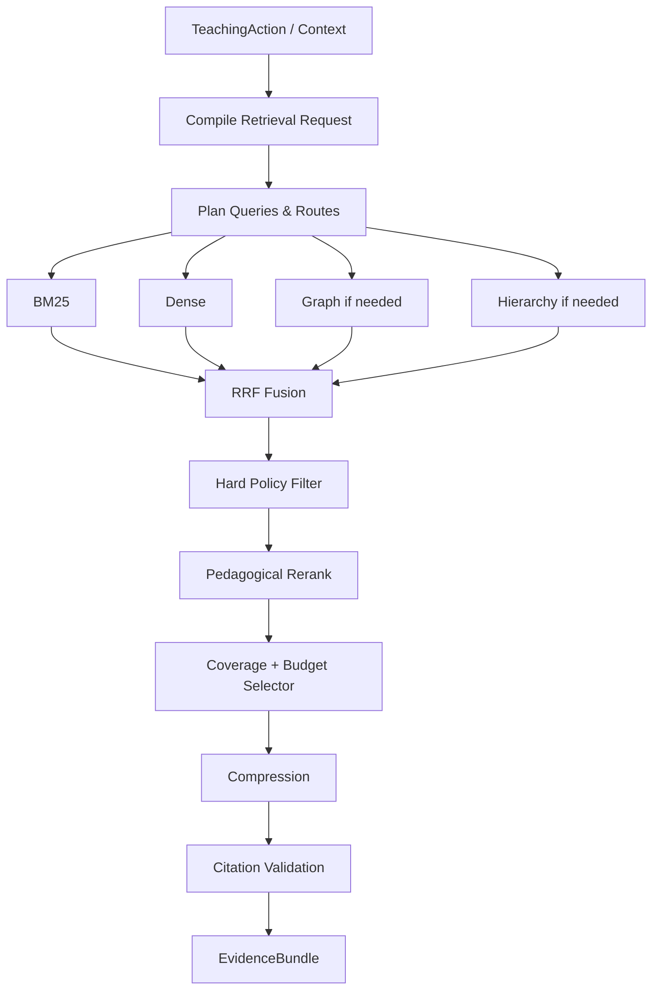

# 4.2 检索与知识供给

## D.2.1 系统定义与唯一职责

**一句话定义**：根据 4.5 已确定的教学动作、范围和泄漏约束，从知识基础设施中选择最适合当前动作的一组可引用证据。

**唯一核心职责**：生成 `EvidenceBundle`。

**最终决策所有权**：哪些检索候选进入本轮 EvidenceBundle、如何压缩组合和引用。

**不负责**：

- 选择 TeachingAction；
- 修改 learner state；
- 判断长期掌握；
- 决定 LearningPlan；
- 生成最终用户表达。

上游：4.1、4.5。  
下游：4.4、4.8；对 4.5 只反馈 `missing_evidence/conflicts`。

## D.2.2 独有教育价值

核心价值是实现：

> **教学适用性，而不只是语义相关性。**

相同问题在讲解、苏格拉底追问、一级提示、无提示测试、错误诊断、迁移练习中，允许取用的材料不同。

特别负责：

- 前置证据充分；
- 示例与学习阶段匹配；
- 误区/反例取证；
- 当前禁止暴露答案时排除高相关答案；
- 提供可跳转原文的引用。

## D.2.3 独有输入输出

| 类型 | 对象 | 来源或去向 | 作用 |
|---|---|---|---|
| 输入 | TeachingAction / TeachingContext subset | 4.5 | 证据需求、提示/暴露、目标概念 |
| 输入 | SourceChunk/KnowledgeUnit/Concept/Relation | 4.1 | 检索 corpus |
| 输入 | source_scope / ACL | 4.8/权限层 | 范围与权限 |
| 输出 | EvidenceBundle | 4.4/4.8 | 可引用教学证据 |
| 输出 | RetrievalTrace | Decision/Audit ledger | 离线评价与解释 |
| 输出 | MissingEvidence/Conflict | 4.5 | 下一轮策略降级的证据，不直接改动作 |

## D.2.4 独有领域模型

内部对象：

- `TeachingRetrievalRequest`：从 TeachingAction 派生的检索合同；
- `RetrievalPlan`：路由、查询、过滤、预算；
- `RetrievalCandidate`：带多路分数/来源/暴露级别；
- `RetrievalTrace`：召回、过滤、重排轨迹；
- `EvidenceBundle`：公共输出对象。

保留原 4.2 L0～L4 `answer_exposure_level`。

## D.2.5 内部模块

| 模块 | 职责 | 输入 | 输出 | 模式 | LLM | 失败降级 |
|---|---|---|---|---|---|---|
| Request Compiler | TeachingAction → retrieval request | context/action | request | 同步 | 可选 | deterministic mapping |
| Retrieval Planner | 查询分解/路由/预算 | request | plan | 同步 | 可选 | 固定路由 |
| Lexical Retriever | 精确术语/原文 | plan | candidates | 并行 | 否 | 返回空 |
| Dense Retriever | 语义召回 | plan | candidates | 并行 | 否 | lexical-only |
| Graph Retriever | 前置/关系多跳 | plan | candidates | 按需 | 否 | skip graph |
| Hierarchy/Page Retriever | 长文档范围收缩 | plan | candidates | 按需 | 可选 | section search |
| Fusion | RRF/融合 | candidates | ranked pool | 同步 | 否 | lexical+dense |
| Reranker | 高精度教学重排 | pool | reranked | 同步 | 模型可用 | RRF score |
| Policy Filter | ACL/泄漏/类型硬过滤 | reranked | allowed | 同步 | 否 | fail closed |
| Selector | 覆盖/预算/MMR | allowed | selected | 同步 | 否 | top-k with caps |
| Compressor | 抽取式优先 | selected | compact evidence | 同步 | 可选 | no compression |
| Citation Validator | 锚点/引用一致性 | evidence | verified bundle | 同步 | 否 | drop invalid evidence |

## D.2.6 核心算法

### 核心算法：混合召回 + 教学约束重排 + 预算选择

1. **问题定义**：在权限、来源、教学动作、答案暴露和上下文预算约束下，选择能覆盖当前教学需求的最小高质量证据集合。
2. **为什么不能只用简单规则**：单一关键词漏掉语义改写；单一向量漏精确术语；纯规则难平衡前置/例子/误区/引用覆盖。
3. **输入特征**：BM25、dense similarity、graph distance、hierarchy proximity、concept overlap、pedagogical role、learner stage fit、source quality、exposure level、redundancy、token cost。
4. **状态**：index version、source scope、TeachingAction、request budget；不持久化 learner state 副本。
5. **输出/动作**：route selection、candidate inclusion/exclusion、EvidenceBundle。
6. **评分函数**：`score = w_r*relevance + w_c*coverage + w_p*pedagogical_fit + w_s*source_quality - w_l*leakage_risk - w_d*redundancy - w_t*token_cost`；MVP 权重手工，后续学习排序。
7. **约束**：ACL/source_scope、allowed type、max exposure、citation valid、required concept coverage、context budget。
8. **更新机制**：材料/index/embedding/reranker 版本变化后重算；learner state 变化通常只需重新过滤/重排。
9. **不确定性**：输出 evidence-level relevance/confidence、bundle confidence、missing evidence；低置信不由 LLM补事实。
10. **冷启动**：BM25 + dense + RRF + Cross-Encoder + 固定 pedagogical rules，不需要行为训练数据。
11. **解释机制**：保留每路 rank、融合分、过滤 reason、重排 features、selected role 和 SourceSpan。
12. **离线评估**：Recall@K、MRR、nDCG、citation precision、role coverage、leakage rate、context redundancy。
13. **在线验证**：下一次独立成功、提示依赖、用户跳转原文率只作过程指标；最终看延迟保持/迁移。
14. **失败模式**：无结果、低相关、缺前置、冲突来源、锚点坏、答案泄漏、长上下文噪声、embedding domain shift。
15. **替代方案**：纯 BM25、纯 dense、全 GraphRAG、全 Agent search；均可作为 route，但不应成为唯一全局方案。
16. **推荐采用阶段**：MVP 混合检索与引用；P2 graph/hierarchy；P3 LTR/个性化 route。
17. **数据规模要求**：MVP 无训练数据；LTR 需积累有教学角色/选择偏好的标注；Bandit 需要稳定 outcome 和 propensity logging。

候选融合：

```text
RRF(d) = Σ_i 1 / (k + rank_i(d))
```

预算选择可近似为带 coverage 约束的 knapsack：

```text
maximize Σ utility(e)
subject to Σ tokens(e) <= B
           required_roles covered
           exposure(e) <= allowed_level
```

MVP 用 greedy marginal utility/token 即可，不必求全局整数规划最优。

## D.2.7 独有运行流程



## D.2.8 与其他系统的边界接口

- ← 4.1：只读知识/索引/锚点；发现冲突可提交 evidence，不直接改知识库。
- ← 4.5：TeachingAction、allowed exposure、required evidence roles。
- → 4.8：EvidenceBundle；4.8 不得扩大 exposure。
- → 4.4：评分/诊断所需 rubric/source evidence；答案对评估模型和学习者展示权限分离。
- → 4.5：只返回 `missing_evidence/conflict/low_confidence` 供**下一轮**决策。

## D.2.9 特有失败模式

- relevance 高但 pedagogically harmful；
- 完整答案泄漏；
- 引用与实际文本不一致；
- source_generated 与 source_extracted 混淆；
- 多路召回重复造成 context flooding；
- 图多跳放大错误关系；
- 外部文档 indirect prompt injection；
- 缓存跨 learner state/version 污染。

## D.2.10 特有评估指标

- 离线算法：Recall@K、nDCG、RRF/reranker win rate、coverage、token efficiency。
- 系统：p50/p95 latency、cache hit、retrieval failure、index freshness。
- 教学过程：answer leakage、prerequisite sufficiency、stage fit、hint material appropriateness。
- 学习结果：EvidenceBundle variant 对下一次独立成功、延迟保持、迁移的增益。

## D.2.11 技术选型与演进

**MVP**：BM25 + dense + RRF + Cross-Encoder + MMR + metadata filter + source anchors + EvidenceBundle。  
**增强版**：GraphRAG route、hierarchical long-doc retrieval、coverage constrained selector、conflict detection。  
**成熟版**：LTR、按学习结果训练 rerank features、route personalization。  
**暂不建议**：全请求 GraphRAG；让 Agent 自由搜并直接回答；单向量检索；把生成摘要当事实源。

## D.2.12 强化学习约束

比较顺序：

```text
规则
→ 启发式评分 / RRF
→ 监督 Learning-to-Rank
→ Contextual Bandit（仅 route/reranker variant）
→ Offline RL
→ 在线受约束 RL
```

当前推荐停在 **启发式 + 监督 LTR 前置准备**。Contextual Bandit 只有在有可靠教学 outcome、propensity logging、明确安全候选集后才考虑。检索系统不需要完整 RL；若简单排序已达到目标，不进入 RL。