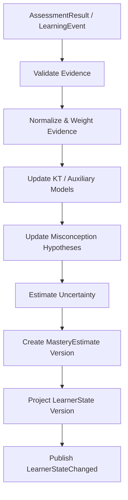

# 4.3 学习者建模

## D.3.1 系统定义与唯一职责

**一句话定义**：把多次学习行为和评估证据融合为可版本化、带不确定性的 LearnerState 与 MasteryEstimate。

**唯一核心职责**：维护“系统目前认为用户知道什么、不会什么、有哪些不确定误区假设”的唯一状态投影。

**最终决策所有权**：

- LearnerState 当前版本；
- learner × KnowledgeUnit 的 MasteryEstimate；
- 活跃 misconception hypothesis 的概率/状态；
- 状态是否因新证据重新计算。

**不负责**：单次 Attempt 判分、题目评分、TeachingAction、LearningPlan、ReviewSchedule。

上游：4.4、4.7、4.8。  
下游：4.4、4.5、4.6、4.7。

## D.3.2 独有教育价值

本系统把“表现”转换为“状态估计”，防止常见错误：

```text
答对一道题 → 已掌握
```

它必须显式区分：

- 猜对 vs 稳定能力；
- 提示后成功 vs 独立成功；
- 即时成功 vs 延迟保持；
- 相似题成功 vs 迁移成功；
- 一次错误 vs 稳定误区；
- 状态估计 vs 客观事实。

## D.3.3 独有输入输出

| 类型 | 对象 | 来源或去向 | 作用 |
|---|---|---|---|
| 输入 | AssessmentResult | 4.4 | 主要能力证据 |
| 输入 | Attempt metadata | 4.4 | 提示、延迟、修订、耗时等上下文 |
| 输入 | LearningEvent | 4.8 Event Ledger | 复习、迁移、活动完成等 |
| 输入 | FeedbackSignal | 4.8 | 用户对状态判断的异议 |
| 输入 | ReviewSchedule/Retrievability | 4.7 只读 | 记忆风险辅助特征 |
| 输出 | LearnerState | 4.4/4.5/4.6/4.7 | 当前状态快照 |
| 输出 | MasteryEstimate | 4.4/4.5/4.6/4.7 | 知识单元掌握估计 |
| 输出 | StateChanged event | 4.5/4.6/4.7 | 触发后续决策/重规划 |

## D.3.4 独有领域模型

### MasteryEstimate 建议字段

```text
learner_id
knowledge_unit_id
competence_probability
confidence
independent_success_count
hint_dependency_score
last_independent_success_at
delayed_recall_evidence
transfer_evidence
active_misconception_ids[]
evidence_count
effective_evidence_weight
algorithm_id
algorithm_version
updated_at
source_event_ids[]
```

### LearnerState

是多个 MasteryEstimate、学习阶段、全局能力/偏好和不确定性摘要的版本化 snapshot。偏好与认知状态分开；用户体验偏好不应污染 mastery。

## D.3.5 内部模块

| 模块 | 职责 | 输入 | 输出 | 模式 | LLM | 失败降级 |
|---|---|---|---|---|---|---|
| Evidence Normalizer | 把 AssessmentResult/事件归一为证据 | events/results | evidence records | 同步/异步 | 否 | 忽略未知低质量事件 |
| Evidence Weighter | 根据提示、延迟、迁移等定权 | evidence | weighted evidence | 同步 | 否 | 保守默认权重 |
| KT Engine | BKT/PFA 等更新 | weighted evidence | mastery posterior | 同步 | 否 | 简单加权状态 |
| Item/Ability Adapter | IRT 题目难度/能力辅助 | item params | adjusted evidence | 异步 | 否 | 不使用 IRT |
| Misconception Projector | 多次误区证据融合 | assessment evidence | hypotheses | 同步 | 可选分类仅来自4.4 | 只保留 evidence count |
| Uncertainty Engine | 置信区间/样本充分度 | state/evidence | confidence | 同步 | 否 | conservative confidence |
| State Projector | 构造 LearnerState snapshot | estimates | state | 同步 | 否 | last valid state |
| Replay/Recompute | 算法升级/纠错重算 | event log | new versions | 异步 | 否 | partial replay |
| OLM Presenter | 为用户提供可解释状态 | state/trace | explanation data | 同步 | LLM 可表达 | reason codes/template |

## D.3.6 核心算法

### 核心算法：证据加权 BKT 基线 + 不确定性层

1. **问题定义**：对每个 learner × KnowledgeUnit，持续估计掌握概率与证据充分度。
2. **为什么不能只用简单规则**：固定“连续答对 2 次=掌握”忽略猜测、失误、提示、题目难度、时间和先验；但完全深度模型又缺少早期数据和可解释性。
3. **输入特征**：correctness、score、hint level、answer exposure、attempt count、delay、item difficulty、transfer distance、error type、misconception evidence、assessment confidence。
4. **状态**：经典 `P(L)` 与扩展证据统计；可保留 `P(T), P(G), P(S)` 参数或分层参数。
5. **输出/动作**：更新 MasteryEstimate；状态不足时保持 unknown/low confidence；不输出教学动作。
6. **目标函数**：概率预测可优化 log loss/Brier；产品状态目标是 calibration + 对后续独立表现的预测 + 可解释性，而非只最大化 AUC。
7. **约束**：AssessmentResult confidence 过低不得高权更新；强提示成功权重上限；单次成功不能直接满足稳定掌握；错误 learner state 可 replay。
8. **更新机制**：每个有效 evidence event 在线更新；算法版本改变可从 event log 重算。
9. **不确定性**：单独维护 confidence/effective sample size；概率高但证据少时仍不可标为稳定掌握。
10. **冷启动**：使用学科/全局默认先验；新用户初始状态保持宽不确定性；可通过少量诊断题收窄。
11. **解释机制**：reason codes 如 `two_independent_successes`、`no_delayed_evidence`、`high_hint_dependency`、`misconception_active`。
12. **离线评估**：next-attempt prediction、time-split log loss、Brier、ECE、calibration curve；与简单加权/PFA baseline 比较。
13. **在线验证**：状态门槛改变是否降低错误晋级、减少不必要重复；最终检查延迟保持/迁移。
14. **失败模式**：KC 标注错、题目过易、答案泄漏、评估器误判、短期 burst 造成虚高、selection bias、不同知识类型共用错误参数。
15. **替代方案**：简单证据权重、PFA、IRT、DKT/SAKT/SAINT、CDM。MVP 选择可解释 BKT；复杂模型作为 challenger。
16. **推荐采用阶段**：MVP BKT+权重；增强 IRT/PFA/校准；成熟后深度 KT ensemble/challenger。
17. **数据规模要求**：BKT 可在少量个体数据下依靠先验工作；IRT/深度 KT 需题目/知识点积累大量跨用户交互。具体阈值不写死，由置信区间与离线学习曲线决定。

简化更新思想：

```text
AssessmentResult
→ quality_weight(hint, delay, confidence, transfer)
→ BKT observation likelihood adjustment
→ posterior mastery
→ evidence sufficiency / uncertainty
→ MasteryEstimate version
```

### IRT 的位置

IRT 用来校准题目与能力，不替代 BKT 的序列状态。新题/样本不足时只使用粗粒度 difficulty bucket。

### Deep KT 的采用条件

只有在以下同时成立时进入 challenger：

- 历史量足够；
- user/time split 上稳定优于 BKT/PFA；
- calibration 不恶化；
- 决策模拟证明更好的状态会改善教学选择；
- 可以提供 fallback 和版本回放。

## D.3.7 独有运行流程



## D.3.8 与其他系统的边界接口

- ← 4.4：只接收 AssessmentResult，不接受“已掌握”命令。
- → 4.4：只读 LearnerState snapshot，用于 adaptive item selection/解释，不允许 4.4 写回。
- → 4.5：提供状态、置信度、提示依赖、误区 hypothesis。
- → 4.6：提供可学/未掌握/不确定知识状态。
- ↔ 4.7：4.7 提 memory risk；4.3 提 MasteryEstimate；双方不写对方状态。
- ← 用户反馈：通过 FeedbackSignal 进入 disputed/retest，不直接手改概率。

## D.3.9 特有失败模式

- 把答题表现当真实掌握；
- hint success 权重过高；
- assessment 误差累积；
- user-specific 少量数据过拟合；
- 知识点拆分/合并导致状态漂移；
- 新算法回放后与旧计划不一致；
- 错误误区 hypothesis 长期不消退。

## D.3.10 特有评估指标

- 离线算法：log loss、Brier、ECE、AUC（次要）、state stability、replay determinism。
- 系统：projection latency、recompute cost、event lag、state version conflict。
- 教学过程：错误晋级率、过度复习率、提示依赖识别 precision。
- 学习结果：基于状态做策略/计划是否改善延迟独立成功和迁移。

## D.3.11 技术选型与演进

**MVP**：Python/domain service + PostgreSQL 状态投影；BKT + evidence weighting；append-only source event ids。  
**增强版**：IRT item calibration、PFA benchmark、置信区间/校准、Open Learner Model。  
**成熟版**：hierarchical Bayesian/Deep KT challenger、cross-KC dependencies、自动 state recalibration。  
**暂不建议**：直接 DKT/SAKT 作为唯一真相；用 LLM 自报掌握概率；无法回放的黑盒状态。

## D.3.12 强化学习约束

Learner modeling 是状态估计问题，不需要 RL。

```text
规则/加权证据
→ 概率模型/监督序列模型
```

已经足够。Bandit/RL 属于 4.5 的策略学习或其他决策系统，不能混入 4.3 以“更新状态”为名形成策略。