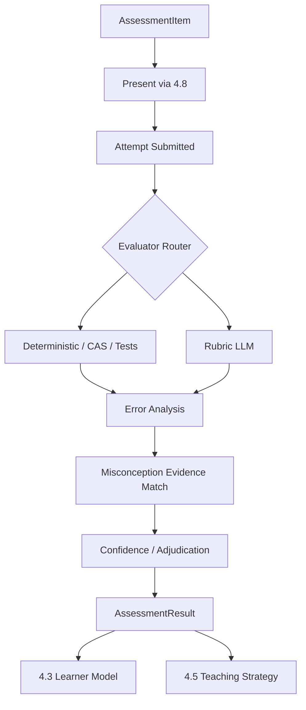

# 4.4 评估与错误诊断

## D.4.1 系统定义与唯一职责

**一句话定义**：对一次学习者尝试进行可复现测量，判断表现质量、错误类型和可验证误区证据。

**唯一核心职责**：发布 AssessmentItem/Attempt/AssessmentResult，并保证评分和诊断可审计。

**最终决策所有权**：

- 单次 Attempt 的评分/正确性；
- rubric 维度结果；
- 本次错误类型；
- 本次是否提供某 Misconception 的 evidence；
- AssessmentResult confidence。

**不负责**：把单次结果直接宣布为长期 mastery；选择教学策略；修改计划/复习时间。

上游：4.1、4.2、4.3、4.8。  
下游：4.3、4.5、4.7。

## D.4.2 独有教育价值

评估的核心不是“给分”，而是生产可信学习证据：

- 诊断先备缺口；
- 区分知识缺失、误解、方法选择、执行错误、提取失败、迁移失败；
- 用延迟题与迁移题验证能力；
- 为形成性反馈提供具体下一步依据；
- 防止提示后答对被误认为独立掌握。

## D.4.3 独有输入输出

| 类型 | 对象 | 来源或去向 | 作用 |
|---|---|---|---|
| 输入 | PedagogicalAsset/KnowledgeUnit/Misconception | 4.1 | 题目目标与诊断知识 |
| 输入 | EvidenceBundle | 4.2 | rubric/source evidence；对学习者暴露受限 |
| 输入 | LearnerState snapshot | 4.3 | adaptive item selection 只读依据 |
| 输入 | user response | 4.8 | SubmitAttempt |
| 输出 | AssessmentItem | 4.5/4.6/4.8 | 可执行测量单元 |
| 输出 | Attempt | 4.3/4.7 | 用户行为事实 |
| 输出 | AssessmentResult | 4.3/4.5/4.7 | 单次表现证据 |

## D.4.4 独有领域模型

### AssessmentItem

至少包含：

```text
item_id/version
objective/knowledge_unit_ids
item_type
prompt/stimulus
answer_type
reference_answer
rubric
scoring_method
difficulty_bucket / calibrated params
prerequisite_ids
hint_policy
answer_exposure_level
source/provenance
validation_status
```

### Attempt

必须记录：

```text
response
started/submitted time
hint/exposure history
revision parent
attempt number
session context
item version
```

### AssessmentResult

必须区分：

```text
raw score
rubric dimensions
correctness
error_type
misconception_evidence[]
independence_level
assessment_confidence
evaluator versions
reason codes
```

## D.4.5 内部模块

| 模块 | 职责 | 输入 | 输出 | 模式 | LLM | 降级 |
|---|---|---|---|---|---|---|
| Item Authoring | 生成/整理题目候选 | knowledge/assets | candidate item | 异步 | 是 | curated/source exercise |
| Item Validator | 答案、范围、泄漏、歧义审查 | candidate | valid item | 异步 | 是+规则 | review_required |
| Item Selector | 诊断/评估题选择 | objective/state | item | 同步 | 否/模型可选 | rule heuristic |
| Deterministic Grader | MCQ、numeric、symbolic、code test | Attempt | score | 同步 | 否 | n/a |
| Rubric Grader | 开放式分维度评分 | Attempt+rubric | dimension scores | 同步 | 是 | human/retry/low-confidence |
| Error Classifier | 错误类型 | response/trace | error evidence | 同步 | 是+规则 | unknown error |
| Misconception Matcher | 规范误区匹配 | result + catalog | evidence | 同步 | 是+规则 | hypothesis only |
| Diagnostic Probe | 选择鉴别题 | hypotheses | next item candidate | 同步 | 否/可用LLM生成候选 | fixed probe |
| Result Adjudicator | 多评估器冲突 | scores | AssessmentResult | 同步 | 可选 | low confidence/manual |

## D.4.6 核心算法

### 核心算法：分层评估器 + 证据化错误诊断

1. **问题定义**：根据题型选择最可靠评估器，并对开放式响应输出可解释、带置信度的 AssessmentResult。
2. **为什么不能只用简单规则**：数学等价、代码、开放式概念解释的正确性结构不同；纯字符串匹配无法覆盖，纯 LLM 又可能漂移。
3. **输入特征**：item type、rubric、reference evidence、response、tool execution、solution steps、hint exposure、prior attempt、learner state（仅选题/解释辅助）。
4. **状态**：AssessmentItem version、rubric version、evaluator version；AssessmentResult 自身不可变版本。
5. **输出/动作**：score、dimension scores、error type、misconception evidence、confidence、是否需要 diagnostic probe/manual review。
6. **目标函数**：maximize 与专家评分一致性 + diagnostic precision + calibration；false-positive mastery evidence 的代价高于“暂不确定”。
7. **约束**：确定性评估器优先；LLM 必须依据 rubric/evidence；参考答案对 learner output 与 grader visibility 分权；低置信结果不得强更新 mastery。
8. **更新机制**：rubric/validator/LLM 版本变更可重评历史 Attempt，生成新 AssessmentResult version。
9. **不确定性**：多 evaluator disagreement、schema/semantic confidence、out-of-rubric answer；可输出 `needs_review`。
10. **冷启动**：source-derived exercise + rule/deterministic grading；开放题使用人工设计 rubric + 双模型/抽样审核。
11. **解释机制**：保存 rubric evidence span、failed criteria、error reason codes、misconception match evidence。
12. **离线评估**：与专家 gold set 的 accuracy/F1、quadratic weighted kappa/ICC（按分数类型）、calibration、misconception precision/recall。
13. **在线验证**：复评申诉率、错误反馈纠正率、diagnostic probe 信息增益、后续独立成功。
14. **失败模式**：答案本身有误、rubric 不完备、LLM 偏爱措辞、代码测试覆盖不足、数学表达等价误判、提示信息未记录、把偶然错误标成稳定误区。
15. **替代方案**：全人工（高质量低扩展）、全规则（覆盖窄）、单 LLM judge（易漂移）；推荐 deterministic-first + rubric LLM + adjudication。
16. **推荐采用阶段**：MVP 确定性+rubric grader；增强 adaptive diagnostic/IRT；成熟多评估器校准和自动题目质量模型。
17. **数据规模要求**：MVP 可由专家小型 gold set 起步；LLM judge 校准至少持续积累按题型/学科分层人工双标；IRT-CAT 需稳定题库数据后再启用。

评估器路由：

```text
MCQ/exact → deterministic
numeric → tolerance/unit checker
symbolic math → CAS/equivalence
code → sandbox tests/static constraints
structured steps → step validator
open explanation → rubric-constrained LLM + evidence + confidence
```

### 掌握证明的边界

4.4 只能输出：

```text
“这次是无提示、延迟 7 天后的独立正确，评估置信度 0.96”
```

不能输出：

```text
“用户已稳定掌握”
```

后者属于 4.3。

## D.4.7 独有运行流程



## D.4.8 与其他系统的边界接口

- ← 4.1：知识、规范误区、source exercise candidate；4.4 独占 AssessmentItem 发布。
- ← 4.2：grader EvidenceBundle/Rubric evidence；4.2 不评分。
- ← 4.3：LearnerState 只读 snapshot；4.4 不写 mastery。
- → 4.3：AssessmentResult。
- → 4.5：当前错误类型/置信度；4.5 决定反馈动作。
- → 4.7：有效 retrieval outcome；4.7 决定 schedule。

## D.4.9 特有失败模式

- LLM judge 漂移；
- reference answer 错；
- rubric 漏掉合法答案；
- 自动题目含歧义/无解；
- 数学单位/等价判定错误；
- code sandbox 不安全；
- assessment leakage；
- 题目重复导致记忆答案而非能力；
- diagnosis overconfidence。

## D.4.10 特有评估指标

- 离线算法：grader agreement、F1、kappa/ICC、misconception precision/recall、item discrimination（数据成熟后）。
- 系统：grading latency、sandbox failure、manual review rate、reassessment rate。
- 教学过程：诊断后错误复发率、提示依赖区分准确率、题目暴露率。
- 学习结果：形成性评估策略是否提高下一次无提示表现、延迟保持和迁移。

## D.4.11 技术选型与演进

**MVP**：typed item schema、deterministic graders、Python sandbox/测试隔离、rubric-constrained LLM、人工 gold set。  
**增强版**：IRT item calibration、自适应诊断题、误区鉴别题、多评估器 adjudication。  
**成熟版**：题目质量模型、自动 item exposure control、跨学科 grader ensemble。  
**暂不建议**：单一 LLM judge 直接改 mastery；没有校准题库就做复杂 CAT；自动生成题未经验证直接作为高风险评估。

## D.4.12 强化学习约束

评估本身主要是测量问题，不需要 RL。

Adaptive Testing 的题目选择可按：

```text
规则/覆盖约束
→ 信息增益启发式
→ IRT-CAT
→ 监督/Contextual Bandit（仅在明确测量目标下探索）
```

Offline RL/在线 RL 当前不推荐。评估题选择必须优先测量有效性、内容覆盖与题目暴露控制，而非 engagement reward。