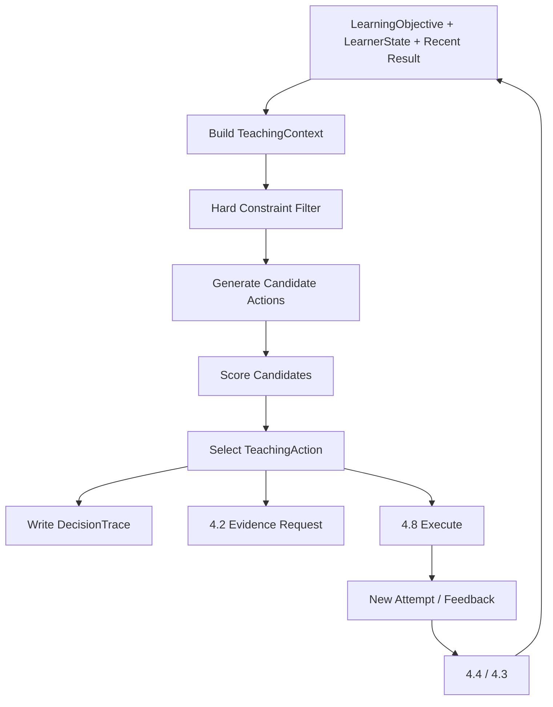

# 4.5 教学策略选择

## D.5.1 系统定义与唯一职责

**一句话定义**：在当前 LearningObjective 已确定的前提下，根据 LearnerState、最近 AssessmentResult 与约束，选择下一步具体 TeachingAction。

**唯一核心职责**：决定“当前怎么教”。

**最终决策所有权**：

- `TeachingAction`；
- `TeachingStrategy` 版本；
- scaffold/hint level；
- 本轮答案暴露上限；
- EvidenceBundle 所需 pedagogical roles；
- 当前动作退出/升级/降级条件。

**不负责**：选择长期学哪个知识目标、维护 LearnerState、判分、检索证据、执行 LLM、计算下次复习日期。

上游：4.3、4.4、4.6、4.7。  
下游：4.2、4.8。

## D.5.2 独有教育价值

把学习科学原则真正转化为逐步教学控制：

- 新手优先完整示例/直接解释；
- 形成初步模型后增加生成与苏格拉底追问；
- 会模仿后采用示例褪去；
- 无提示独立成功后增加变式与迁移；
- 失败时根据错误类型补前置、换表征或增加支架；
- 支架成功后主动撤除，防止提示依赖。

它是 Askora 与“LLM 自由聊天式 Tutor”最核心的差异之一。

## D.5.3 独有输入输出

| 类型 | 对象 | 来源/去向 | 作用 |
|---|---|---|---|
| 输入 | LearningObjective/LearningActivity | 4.6 | 当前要完成什么 |
| 输入 | LearnerState/MasteryEstimate | 4.3 | 当前能力与不确定性 |
| 输入 | AssessmentResult | 4.4 | 最近表现/错误/误区证据 |
| 输入 | ReviewSchedule/due context | 4.7 | 若当前为复习任务，提供记忆风险 |
| 输入 | user constraints | 4.8/4.6 | 时间、偏好、无障碍、是否要求直接讲解 |
| 输出 | TeachingAction | 4.2/4.8 | 当前教学动作 |
| 输出 | TeachingContext | 4.2/4.8 | 决策时只读快照 |
| 输出 | Decision payload | Decision Ledger | 审计/实验 |

## D.5.4 独有领域模型

### TeachingStrategy

示例策略族：

```text
DIRECT_INSTRUCTION
WORKED_EXAMPLE_FADING
SOCRATIC_PROBING
GUIDED_PRACTICE
ERROR_REMEDIATION
RETRIEVAL_PRACTICE
PRODUCTIVE_FAILURE
TRANSFER_CHALLENGE
METACOGNITIVE_REFLECTION
```

### TeachingAction

建议字段：

```text
action_id
learning_objective_id
strategy_id/version
action_type
scaffold_level
hint_level
answer_exposure_max
evidence_requirements[]
expected_evidence_type
success_condition
failure_condition
max_attempts
time_budget
reason_codes[]
policy_version
```

## D.5.5 内部模块

| 模块 | 职责 | 输入 | 输出 | 模式 | LLM | 降级 |
|---|---|---|---|---|---|---|
| Context Builder | 生成 TeachingContext | state/result/plan | context | 同步 | 否 | latest valid snapshots |
| Safety/Policy Filter | 产生可行动作集合 | context | feasible actions | 同步 | 否 | conservative defaults |
| Stage Mapper | 学习阶段/支架需求 | state | stage features | 同步 | 否 | unknown stage |
| Candidate Generator | 规则产生动作候选 | context | candidates | 同步 | 否 | fixed strategy table |
| Action Scorer | 加权评分/监督模型 | candidates | scores | 同步 | 否 | rule priority |
| Policy Selector | 选择动作 | scores/constraints | TeachingAction | 同步 | 否 | deterministic tie-break |
| Explanation Builder | reason codes | decision | explanation data | 同步 | LLM 仅表达 | templates |
| Experiment Router | 允许安全 variant | eligibility | variant | 同步 | 否 | control |

## D.5.6 核心算法

### 核心算法：硬约束 + 状态机 + 加权动作评分

1. **问题定义**：从有限教学动作集中选择当前一步，最大化有价值学习证据与能力增益，同时避免过度提示、无效困难和答案泄漏。
2. **为什么不能只用简单规则**：学习目标、掌握概率、错误类型、提示依赖、时间预算等信号会冲突；仅 if/else 难以表达软权衡，但完全学习型策略早期缺数据且难审计。
3. **输入特征**：mastery、confidence、prerequisite gap、error type、misconception hypothesis、hint history、independent success、delay/forgetting risk、task complexity、attempt count、time budget、user request。
4. **状态**：TeachingContext snapshot + 当前策略 state machine；不复制 LearnerState 为可写状态。
5. **输出/动作**：TeachingAction，如 EXPLAIN、SOCRATIC_QUESTION、HINT_L1、PRACTICE、TRANSFER_TASK。
6. **评分函数**：`score(a)=w1*expected_learning_value+w2*diagnostic_value+w3*stage_fit-w4*hint_dependency_risk-w5*cognitive_load-w6*time_cost`；硬规则先过滤。
7. **约束**：无提示评估不得选高暴露动作；用户明确要求可改变候选但仍受安全/目标约束；连续失败有最大探索次数；高不确定 learner state 优先诊断；不能越过 4.6 改目标。
8. **更新机制**：每次新 AssessmentResult/LearnerState/用户命令后重新决策；权重/规则/strategy version 独立发布。
9. **不确定性**：输入 state confidence 进入评分；不确定高时减少激进策略，优先 diagnostic probe/低风险动作。
10. **冷启动**：基于学习科学的状态机与规则；无需个体行为数据。
11. **解释机制**：DecisionTrace 保存候选、硬过滤、分数、reason codes，例如 `high_hint_dependency → reduce_scaffold`。
12. **离线评估**：历史 replay、专家一致性、policy regret proxy、违反教学硬约束次数；后期 OPE。
13. **在线验证**：A/B 比较下一次无提示成功、提示依赖、延迟保持和迁移；体验指标只作 guardrail。
14. **失败模式**：状态估计错误导致动作错、规则僵化、权重互相抵消、持续提问不解释、过度支架、策略 oscillation、reward proxy 偏移。
15. **替代方案**：纯规则、决策树、监督 ranking、Contextual Bandit、Offline RL、受约束在线 RL。
16. **推荐采用阶段**：MVP 规则+状态机+评分；增强监督 outcome model/Contextual Bandit；成熟后才研究 Offline RL。
17. **数据规模要求**：MVP 无历史要求；Bandit 必须有稳定 action logging、propensity、学习 outcome；RL 需大规模、多策略覆盖的长期轨迹和可靠 OPE。

示例状态机：

```text
UNKNOWN
→ DIAGNOSE
→ NOVICE: EXPLAIN/WORKED_EXAMPLE
→ EMERGING: SOCRATIC/GUIDED_PRACTICE
→ PRACTICING: FADED_EXAMPLE/PRACTICE
→ INDEPENDENT: NO_HINT_RETRIEVAL
→ RETAINED: DELAYED_RETRIEVAL
→ TRANSFER: TRANSFER_TASK
```

状态机不是 learner state 真相，仅是 4.5 的策略控制状态，来源于 4.3 当前快照。

## D.5.7 独有运行流程



## D.5.8 与其他系统的边界接口

- ← 4.3：read-only learner state；不直接写 mastery。
- ← 4.4：AssessmentResult/error evidence；不自己重新评分。
- ← 4.6：当前 LearningActivity/Objective；不自行切换课程目标。
- ← 4.7：复习上下文/风险；不计算 next_due_at。
- → 4.2：证据角色、目标概念、暴露上限；检索层不能放宽。
- → 4.8：TeachingAction；Agent 失败后必须回来重新决策。

## D.5.9 特有失败模式

- learner state 错导致策略错；
- 规则覆盖冲突；
- 同一状态反复振荡；
- “苏格拉底提问”过度使用；
- 提示强度递增后不撤除；
- 用户明确想要答案但系统过度阻拦；
- 策略实验以 engagement 为主要 reward；
- Agent 私自改变 TeachingAction。

## D.5.10 特有评估指标

- 离线算法：constraint violation=0、expert agreement、historical replay difference、OPE value（后期）。
- 系统：decision p95、fallback rate、policy version coverage。
- 教学过程：hint dependency、scaffold fading rate、diagnostic efficiency、strategy switch frequency。
- 学习结果：下一次无提示成功、延迟保持、迁移、单位学习时间能力增益。

## D.5.11 技术选型与演进

**MVP**：typed policy rules + state machine + YAML/DB versioned weights + DecisionTrace。  
**增强版**：监督 outcome model、Contextual Bandit 用于安全局部选择。  
**成熟版**：Offline RL 研究、受约束长程策略，但保留 immutable hard rules。  
**暂不建议**：让 LLM 直接“凭感觉”选策略；在线 RL 自由探索；用 session 时长/点赞做主奖励。

## D.5.12 强化学习约束

必须严格经过：

```text
规则
→ 启发式评分
→ 监督学习
→ Contextual Bandit
→ Offline RL
→ 受约束在线 RL
```

### Contextual Bandit 可能定义

- 状态/context：LearnerState features + current objective + recent result；
- 动作：已通过硬规则的少量 TeachingAction variants；
- 奖励：下一次独立成功/提示依赖下降，延迟结果作为后续校正；
- 探索风险：不能探索答案泄漏、明显过载、已知不适用动作；
- OPE：IPS/SNIPS/DR；
- 上线：先 shadow/offline，再小流量固定人群。

### Offline RL 仅在成熟阶段

- 状态：历史 learner/plan/context snapshot；
- 动作：TeachingAction；
- 奖励：延迟掌握 + transfer - time/hint cost；
- 奖励延迟：可能跨天/周；
- 数据：必须记录 behavior policy propensity 和 action availability；
- 安全：Conservative policy + hard constraint shield；
- 当前结论：**不实施**。