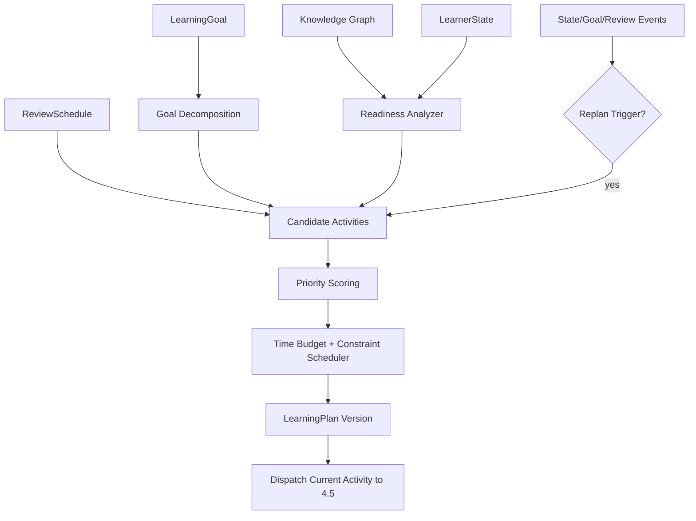

# 4.6 学习路径与任务调度

## D.6.1 系统定义与唯一职责

**一句话定义**：在 LearningGoal、知识前置图、LearnerState、ReviewSchedule、时间预算和截止期约束下，生成并动态维护 LearningPlan。

**唯一核心职责**：决定“下一步学什么、今天学什么、目标之间的顺序”。

**最终决策所有权**：

- LearningObjective；
- LearningActivity；
- LearningPlan；
- 今日任务选择与优先级；
- 何时因状态变化触发 replan。

**不负责**：当前怎么讲、如何提示、评估评分、下次最佳复习时间、知识图关系真伪。

上游：4.1、4.3、4.7、用户目标。  
下游：4.5、4.8。

## D.6.2 独有教育价值

将“书的目录顺序”转换为“基于先备与能力证据的学习顺序”，同时平衡：

- 当前目标相关性；
- prerequisite readiness；
- 知识缺口；
- 延迟复习；
- 迁移验证；
- 截止期；
- 用户每天时间；
- 任务多样性与认知负荷。

它保证 Askora 不只是响应式问答，而是长期推进能力目标。

## D.6.3 独有输入输出

| 类型 | 对象 | 来源/去向 | 作用 |
|---|---|---|---|
| 输入 | LearningGoal | 用户确认/4.6 | 规划终点 |
| 输入 | KnowledgeUnit + PrerequisiteRelation | 4.1 | 内容与依赖 |
| 输入 | LearnerState/MasteryEstimate | 4.3 | readiness/gap |
| 输入 | ReviewSchedule/ReviewDue | 4.7 | 到期复习候选 |
| 输入 | time/deadline/preferences | 用户 | 现实约束 |
| 输出 | LearningPlan | 用户/4.5/4.8 | 中长期计划 |
| 输出 | LearningObjective | 4.5 | 当前能力目标 |
| 输出 | LearningActivity | 4.5/4.8 | 可执行任务 |

## D.6.4 独有领域模型

### LearningPlan

```text
plan_id/version
learning_goal_id
planning_horizon
objectives[]
activities[]
constraints
assumptions
reason_codes
created_from_state_version
knowledge_graph_version
review_schedule_version
status
```

### LearningActivity 类型

```text
LEARN_NEW
PREREQUISITE_REMEDIATION
DIAGNOSTIC
PRACTICE
DELAYED_REVIEW
TRANSFER_CHECK
METACOGNITIVE_REVIEW
```

4.7 提供复习候选，4.6 才把它实例化为日计划中的 `DELAYED_REVIEW` activity。

## D.6.5 内部模块

| 模块 | 职责 | 输入 | 输出 | 模式 | LLM | 降级 |
|---|---|---|---|---|---|---|
| Goal Decomposer | Goal → Objectives | goal/knowledge | objectives | 异步 | 可用LLM提候选 | graph/rule template |
| Readiness Analyzer | 判断可学集合 | graph/state | feasible units | 同步 | 否 | conservative prerequisites |
| Candidate Generator | 新学/复习/迁移候选 | state/review | activities | 同步 | 否 | fixed candidates |
| Priority Scorer | 多目标优先级 | candidates | scores | 同步 | 否 | simple weighted score |
| Budget Scheduler | 时间背包/时段填充 | scores/time | daily plan | 同步 | 否 | greedy |
| Diversity/Load Guard | 避免单一/过载 | plan | constrained plan | 同步 | 否 | rule caps |
| Replanner | 状态/目标变化重规划 | events | new plan version | 异步/同步 | 否 | partial replan |
| Plan Explainer | 说明为何安排 | trace | explanation | 同步 | LLM可表达 | reason codes |

## D.6.6 核心算法

### 核心算法：前置约束可行集 + 多目标优先级 + 时间预算调度

1. **问题定义**：在 DAG/知识图和用户现实约束下，从新学、补缺、复习、迁移候选中选出有限活动并排序。
2. **为什么不能只用简单规则**：多个目标会同时竞争；“最薄弱”不一定最重要；复习到期、新知识前置价值、截止期和时间成本存在权衡。
3. **输入特征**：goal relevance、mastery gap、state uncertainty、prerequisite centrality、review urgency、deadline urgency、estimated duration、cognitive cost、transfer need、activity diversity。
4. **状态**：当前 active LearningPlan、LearnerState version、knowledge graph version、ReviewSchedule version。
5. **输出/动作**：objective sequence、today activities、defer/skip、replan。
6. **评分函数**：`priority = w_g*goal_relevance + w_k*knowledge_gap + w_p*prerequisite_value + w_r*review_urgency + w_d*deadline + w_u*uncertainty + w_t*transfer_need - w_c*time_cost`。
7. **约束**：hard prerequisites、daily time budget、max new content、必要 review、任务多样性、不可安排已失效内容、用户锁定任务。
8. **更新机制**：LearnerState、Goal、graph、ReviewDue、deadline 发生重要变化触发局部/全量 replan；执行过程中不因每个 token 动态重排。
9. **不确定性**：duration/mastery 低置信时保留 buffer，优先短诊断任务；计划注明 assumptions。
10. **冷启动**：用户 Goal + 4.1 prerequisite graph + 少量诊断；未知 mastery 不能假定为 0 或 1。
11. **解释机制**：每个 activity 保存 reason code，例如 `hard_prerequisite_for:X`、`review_overdue`、`transfer_evidence_missing`。
12. **离线评估**：constraint satisfaction、simulated completion、plan churn、oracle/expert comparison、time budget utilization。
13. **在线验证**：目标完成时间、无效前置学习减少、计划完成率（过程）、最终 mastery/retention/transfer（结果）。
14. **失败模式**：错误 prerequisite 图、错误时长估计、计划频繁震荡、只追弱项忽略目标价值、复习挤占所有新学、deadline 导致认知过载。
15. **替代方案**：固定课程顺序、拓扑排序、优先队列、knapsack/MILP、MPC、RL curriculum policy。MVP 采用解释性 heuristic scheduler。
16. **推荐采用阶段**：MVP weighted priority+greedy budget；增强 constrained optimization；成熟后研究 learning-to-rank/策略学习。
17. **数据规模要求**：MVP 无训练数据；学习时长/成功概率模型需历史 activity 数据；RL curriculum 需要长程 outcome 和多策略覆盖，当前不满足。

Feasible set：

```text
F = {u | hard_prerequisites(u) 已满足或当前活动就是补 prerequisite}
```

时间预算：

```text
maximize Σ priority_i * x_i
subject to Σ duration_i * x_i <= daily_budget
           prerequisite/order constraints
           review/new/transfer mix constraints
```

MVP 使用 greedy + repair，比 MILP 更易解释和实时重规划。

## D.6.7 独有运行流程



## D.6.8 与其他系统的边界接口

- ← 4.1：读 graph；规划异常只提交 relation conflict evidence。
- ← 4.3：读 mastery/state；不更新 learner state。
- ← 4.7：读 due/urgency；不计算新的 next_due_at。
- → 4.5：只发送当前 objective/activity；不指定讲解方式。
- → 4.8：计划展示与执行指令。

## D.6.9 特有失败模式

- graph 错误造成路径阻塞；
- 错误估计用户所有未知内容为缺口；
- replan 过频导致用户失去稳定预期；
- 时间估计偏差；
- 只优化完成率；
- 新学/复习/迁移比例失衡；
- 多目标之间无透明权衡。

## D.6.10 特有评估指标

- 离线算法：constraint violation、plan objective coverage、budget fit、priority regret proxy、plan stability。
- 系统：plan generation latency、replan frequency、stale-plan rate。
- 教学过程：prerequisite remediation success、overdue review incorporated、activity completion、plan abandonment。
- 学习结果：目标能力达成时间、延迟保持、迁移、单位时间 mastery gain。

## D.6.11 技术选型与演进

**MVP**：PostgreSQL graph query/recursive CTE + Python priority scheduler + greedy time budget + versioned plan。  
**增强版**：OR-Tools/constraint solver 或 MILP 处理复杂时间/比例/截止期约束；duration predictor。  
**成熟版**：learned priority/ranking、counterfactual planning、有限 horizon optimization。  
**暂不建议**：RL 直接规划整条 curriculum；所有图关系都强约束；每次状态微变立即重排全部日程。

## D.6.12 强化学习约束

比较顺序：

```text
固定顺序/规则
→ 启发式多目标评分
→ 监督 ranking / duration-success models
→ Contextual Bandit（局部同层活动排序）
→ Offline RL（长程序列）
→ 受约束在线 RL
```

当前推荐停在 **启发式 + 后续监督模型**。

若未来 Offline RL：

- 状态：LearnerState + plan progress + deadlines + review state；
- 动作：选择下一个 LearningActivity/Objective；
- 奖励：长期 mastery/retention/transfer - time cost；
- 奖励延迟：天/周；
- 探索风险：错误路径浪费真实学习时间；
- 安全：hard prerequisite、time budget、review due 等外部 shield；
- OPE：必须有 behavior policy 与 propensity；
- 当前结论：**不实施**。