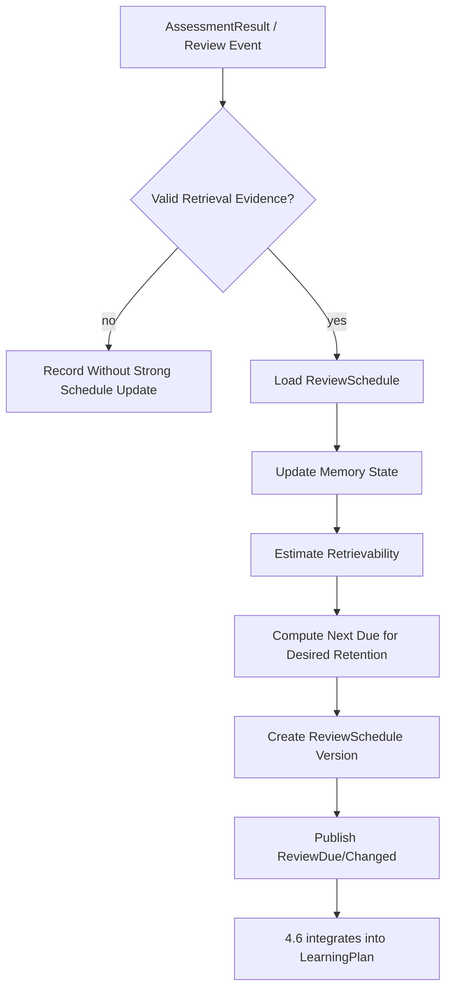

# 4.7 记忆保持与复习调度

## D.7.1 系统定义与唯一职责

**一句话定义**：根据有效提取证据和记忆模型，维护每个 learner × KnowledgeUnit 的遗忘风险，并计算下一建议复习时点。

**唯一核心职责**：决定“什么时候最好复习”。

**最终决策所有权**：

- ReviewSchedule；
- memory scheduling state；
- `next_due_at`；
- desired retention / scheduling policy version 下的复习风险与优先级。

**不负责**：

- 判断完整 mastery；
- 决定今天所有任务；
- 决定本轮讲解/提示；
- 给 Attempt 判分。

上游：4.3、4.4、4.8。  
下游：4.6、4.5；4.3 只读其 retrievability 特征。

## D.7.2 独有教育价值

将间隔效应和提取练习转化为长期保持机制：

- 防止刚学会后长期不再检索；
- 根据真实回忆结果调整间隔；
- 避免所有知识点固定“1/3/7/14 天”；
- 让复习围绕有效 retrieval evidence，而不是重新阅读；
- 把“记忆风险”作为学习计划输入，但不吞并一般任务规划。

## D.7.3 独有输入输出

| 类型 | 对象 | 来源/去向 | 作用 |
|---|---|---|---|
| 输入 | AssessmentResult | 4.4 | 复习结果与独立性证据 |
| 输入 | Attempt metadata | 4.4 | 提示、延迟、是否真正提取 |
| 输入 | MasteryEstimate | 4.3 只读 | 知识状态辅助，不直接复制 |
| 输入 | LearningEvent | 4.8 | ReviewCompleted/DelayedRecall 等 |
| 输出 | ReviewSchedule | 4.6/4.5/4.8 | 下次复习时间和风险 |
| 输出 | ReviewDue signal | 4.6 | 到期候选 |
| 输出 | retrievability estimate | 4.3/4.6 | 只读辅助特征 |

## D.7.4 独有领域模型

### ReviewSchedule

```text
learner_id
knowledge_unit_id
memory_model
model_version
difficulty
stability
retrievability
desired_retention
last_valid_retrieval_at
next_due_at
review_priority
evidence_quality
source_event_ids[]
version
```

### 有效复习证据

必须记录：

```text
retrieval_required
independence_level
hint_level
answer_seen_before_attempt
assessment_confidence
elapsed_since_last_valid_retrieval
knowledge_type
```

## D.7.5 内部模块

| 模块 | 职责 | 输入 | 输出 | 模式 | LLM | 降级 |
|---|---|---|---|---|---|---|
| Review Evidence Filter | 判断是否是有效 retrieval | result/event | valid review observation | 同步 | 否 | low-quality 不更新/低权更新 |
| Memory Model Adapter | FSRS/SM-2/HLR 等统一接口 | observation/state | updated memory state | 同步 | 否 | SM-2/simple exponential |
| Calibration Engine | 参数优化/校准 | history | params | 异步 | 否 | population defaults |
| Due Calculator | 计算 next_due_at | state/target retention | schedule | 同步 | 否 | conservative interval |
| Review Priority | overdue/risk/importance | schedule | priority | 同步 | 否 | overdue heuristic |
| Schedule Projector | 持久化版本 | update | ReviewSchedule | 同步 | 否 | last valid schedule |
| Simulator | workload/retention tradeoff | params | simulation | 异步 | 否 | simple estimate |

## D.7.6 核心算法

### 核心算法：FSRS-compatible 记忆状态与目标保持率调度

1. **问题定义**：根据历史有效提取结果，估计某知识单元当前 retrievability，并在目标保持率下求下一建议复习时间。
2. **为什么不能只用简单规则**：固定间隔忽略材料难度、个体记忆差异和每次成功/失败后的稳定性变化。
3. **输入特征**：review rating/score、独立性、提示暴露、elapsed time、knowledge type、assessment confidence、历史 stability/difficulty。
4. **状态**：Difficulty、Stability、Retrievability 或其他 memory model state；与 MasteryEstimate 分开。
5. **输出/动作**：更新 memory state、`next_due_at`、review priority；不创建 LearningPlan。
6. **目标函数**：使预测 recall probability 接近 desired retention，同时控制 review workload；可视为在保持率与成本之间优化。
7. **约束**：只有有效 retrieval evidence 才高权更新；强提示成功不能当完整 recall；最大/最小 interval；用户可提前/延迟但保留 recommended vs actual。
8. **更新机制**：每次有效 review/recall event 后更新；参数优化异步，切换模型生成新 schedule version。
9. **不确定性**：历史少、评分置信度低或知识类型不适配时提高 uncertainty 并采用保守 interval；不伪造精确概率。
10. **冷启动**：population/default parameters；根据首次有效表现初始化；逐步个性化。
11. **解释机制**：reason codes 如 `retrievability_below_target`、`recent_failure_shortened_interval`、`strong_independent_recall_increased_stability`。
12. **离线评估**：log loss/Brier、calibration、observed vs predicted retention、benchmark 与 SM-2/简单指数模型。
13. **在线验证**：reviews per retained unit、实际保持率、学习负担；最终检查延迟独立回忆与迁移，不只看卡片通过率。
14. **失败模式**：把概念理解简化为 flashcard recall、错误评分污染状态、用户乱用 Hard/Again 类信号、极少数据过拟合、复习爆量、复习内容单调。
15. **替代方案**：Leitner、SM-2、Half-Life Regression、FSRS、自定义 hazard model。推荐 FSRS-compatible + 简单 baseline。
16. **推荐采用阶段**：MVP FSRS/default params；增强个体优化/知识类型分层；成熟长期多目标调度。
17. **数据规模要求**：默认 FSRS 可先用通用参数；个性参数优化需足够 review history，由训练稳定性/validation 决定是否启用，不设置伪精确最小次数。

重要限制：

```text
memory retrievability ≠ full mastery
```

概念、程序和迁移能力仍由 4.3 综合多类 AssessmentResult。

## D.7.7 独有运行流程



## D.7.8 与其他系统的边界接口

- ← 4.4：AssessmentResult/Attempt independence；4.7 不重评答案。
- ← 4.3：MasteryEstimate 只读；4.7 不声明稳定掌握。
- → 4.6：next_due/risk/priority；4.6 不改 memory state。
- → 4.5：若当前 activity 是复习，提供 delay/risk context；4.5 决定用何种 retrieval action。
- ← 4.8：执行事件；4.8 不直接改 schedule。

## D.7.9 特有失败模式

- 闪卡范式过度泛化；
- 无效复述被当 recall；
- schedule 与用户实际执行时间混淆；
- desired retention 过高导致工作量爆炸；
- 参数过拟合；
- 同一知识不同任务难度未区分；
- 计划器和调度器各维护一套 next review。

## D.7.10 特有评估指标

- 离线算法：Brier/log loss、calibration、interval prediction comparison。
- 系统：schedule update latency、due event accuracy、parameter optimization cost。
- 教学过程：overdue rate、review completion、active recall proportion、hint-free review proportion。
- 学习结果：延迟回忆、保持率、单位复习次数的长期保持、迁移维持。

## D.7.11 技术选型与演进

**MVP**：FSRS-compatible scheduler / 官方开源实现思想 + Askora evidence adapter；SM-2/simple exponential baseline。  
**增强版**：个体参数优化、knowledge type policy、retention-workload simulator。  
**成熟版**：transfer probe scheduling、multi-objective workload optimization。  
**暂不建议**：自研 RL 替换成熟 SRS；一个 forgetting score 代表 mastery；4.6 重复计算遗忘曲线。

## D.7.12 强化学习约束

比较：

```text
Leitner/固定规则
→ SM-2/FSRS/HLR 等启发式或可训练记忆模型
→ 监督/参数优化
→ Contextual Bandit
→ Offline RL
→ 在线 RL
```

当前前三级已经覆盖核心需求。RL 只有在长期 workload-retention 优化证明传统调度存在明确瓶颈时再研究。

若未来使用：

- 状态：memory state + learner constraints；
- 动作：候选 review interval；
- 奖励：延迟 recall - review time cost；
- 长期奖励：稳定保持/迁移；
- 风险：过长间隔造成真实遗忘，过短造成负担；
- 安全：interval bounds + desired retention floor；
- 离线评估：counterfactual interval evaluation 极难，需随机化/丰富日志；
- 当前结论：**不实施 RL**。