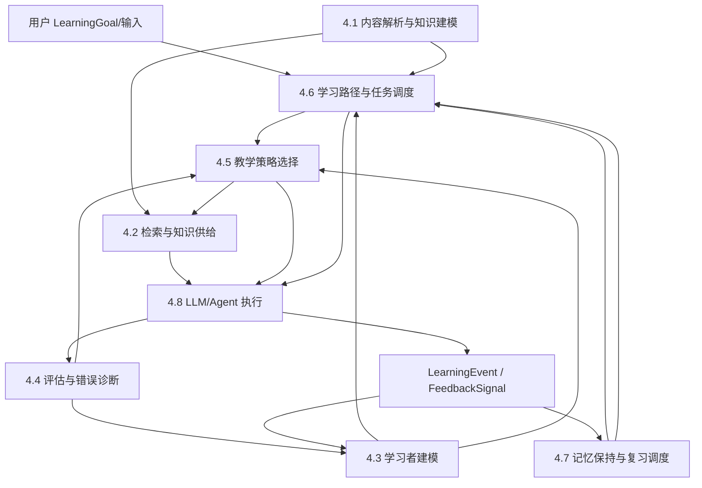

# Askora 八类技术系统：公共架构冻结稿

> 阶段：C｜公共架构冻结  
> 状态：后续四批系统设计必须遵守本文件；如需改变所有权，必须先修改本冻结稿并记录架构决策。  
> 八类系统名称与顺序保持目标文档原文不变。

## 1. 冻结目标

本文件先解决八类系统的公共架构问题，再展开单系统算法。目标是保证：

1. 每项核心职责只有一个主责系统；
2. 每类核心决策只有一个最终所有者；
3. 关键业务状态只有一个系统可写；
4. 其他系统只能提交证据、候选、约束或执行动作；
5. LLM 不拥有业务真相；
6. 系统之间通过版本化对象、命令和事件协作；
7. 循环反馈通过“事件 → 新状态版本 → 下一轮决策”形成，而不是互相直接写状态；
8. 所有关键决策可解释、可回放、可离线比较、可回滚。

## 2. 八类系统职责矩阵

| 技术系统 | 唯一核心职责 | 最终决策所有权 | 明确不负责 | 核心输入 | 核心输出 | 直接上游 | 直接下游 |
|---|---|---|---|---|---|---|---|
| 4.1 内容解析与知识建模 | 把原始材料转为可审计、版本化、可教学的规范知识结构 | 内容/知识对象及关系是否进入已发布知识模型 | 用户掌握判断、当前教学动作、日程排序 | RawAsset、解析配置、审核反馈 | SourceDocument、SourceChunk、KnowledgeUnit、Concept、PrerequisiteRelation、规范 Misconception、教学素材候选 | 文件导入/用户 | 4.2、4.4、4.6 |
| 4.2 检索与知识供给 | 在教学约束下查找并组合当前动作需要的知识证据 | 哪些候选证据进入本次 EvidenceBundle | 为什么要取、教学动作、掌握更新 | TeachingContext/TeachingAction 的证据需求、知识模型、来源范围 | EvidenceBundle、retrieval trace、missing/conflict signal | 4.1、4.5 | 4.4、4.8、4.5（仅失败信号） |
| 4.3 学习者建模 | 融合历史学习证据，维护可版本化的学习者认知状态估计 | LearnerState、MasteryEstimate、用户特定误区假设的当前值 | 单次作答判分、教学动作、计划、复习时间 | AssessmentResult、LearningEvent、FeedbackSignal、Review outcome | LearnerState、MasteryEstimate、state uncertainty | 4.4、4.7、4.8 | 4.4、4.5、4.6、4.7 |
| 4.4 评估与错误诊断 | 对一次尝试/任务进行测量，产出可解释的表现证据和错误诊断 | AssessmentResult、单次错误类型、评分置信度 | 长期掌握状态、TeachingAction、LearningPlan | AssessmentItem、Attempt、EvidenceBundle、LearnerState 只读快照 | AssessmentResult、misconception evidence、diagnostic signal | 4.1、4.2、4.3、4.8 | 4.3、4.5、4.7 |
| 4.5 教学策略选择 | 在给定当前学习目标/任务与状态下选择即时教学动作 | TeachingAction、TeachingStrategy 版本、提示强度、答案暴露上限 | 选择长期学习内容、计算下次复习日期、执行模型调用 | LearningObjective、LearnerState、AssessmentResult、TeachingContext、计划约束 | TeachingAction、证据需求、退出条件、DecisionTrace payload | 4.3、4.4、4.6、4.7 | 4.2、4.8 |
| 4.6 学习路径与任务调度 | 生成与维护跨知识目标的中长期 LearningPlan，并选择待执行 LearningActivity | 学什么、任务优先级、今日计划、何时重规划 | 复习曲线参数、即时讲解/提示方式、掌握估计 | LearningGoal、知识图谱、LearnerState、ReviewSchedule/due candidates、时间/截止期约束 | LearningPlan、LearningObjective、LearningActivity | 4.1、4.3、4.7、用户目标 | 4.5、4.8 |
| 4.7 记忆保持与复习调度 | 估计可复习知识的遗忘/提取风险并决定下一建议复习时点 | ReviewSchedule、next_due_at、memory scheduling state | 完整日计划、TeachingAction、掌握裁决 | 有效 retrieval/assessment LearningEvent、MasteryEstimate 只读、历史 ReviewSchedule | ReviewSchedule、ReviewDue signal、retrievability estimate | 4.3、4.4、4.8 | 4.6、4.5、4.3（只读特征） |
| 4.8 LLM 生成、Agent 编排与可信控制 | 按已确定的领域决策执行工作流、调用模型/工具、生成交互并进行可信控制 | 会话执行状态、模型/工具执行路径、模型路由与降级（不改变教学语义） | 学习者掌握、教学策略、学习计划、复习日期、知识事实 | TeachingAction、EvidenceBundle、Assessment/Plan commands、用户输入 | ModelInference、渲染输出、FeedbackSignal、LearningEvent、执行 trace | 4.2、4.4、4.5、4.6、4.7 | 用户及各领域系统的事件入口 |

## 3. 核心决策唯一所有权

| 决策 | 唯一最终所有者 | 其他系统允许做什么 |
|---|---|---|
| 原材料解析结果是否可发布 | 4.1 | LLM 提候选；人工审核；其他系统只读 |
| 概念/知识单元是否规范化合并 | 4.1 | 检索/评估提交冲突证据 |
| 前置关系是否成为正式知识关系 | 4.1 | 4.6 可报告规划冲突，不能直接改图 |
| 本次检索最终选哪些证据 | 4.2 | 4.5 给需求/约束；4.8 只消费 |
| 单次 Attempt 得多少分、错在哪里 | 4.4 | LLM/规则/代码测试作为评估器；4.3 只消费结果 |
| 用户当前掌握估计 | 4.3 | 4.4/4.7/用户提交证据；不能直接写 |
| 用户是否存在某活跃误区假设 | 4.3 | 4.4 提 misconception evidence；用户可提出异议 |
| 当前应该讲解、提问、提示还是练习 | 4.5 | 4.3/4.4/4.6 提状态/约束；Agent 只执行 |
| 当前提示强度和答案暴露上限 | 4.5 | 4.2 只能进一步收紧；4.8 校验输出 |
| 下一阶段/今日学哪些目标与任务 | 4.6 | 4.7 给复习 due/风险；4.5 不重排课程 |
| 某知识单元下次建议复习时间 | 4.7 | 4.6 决定是否纳入实际日计划，但不能改记忆模型状态 |
| 本次会话如何执行模型和工具 | 4.8 | 各领域系统定义命令/约束；4.8 不改业务决策 |
| DecisionTrace 的持久化和审计索引 | 4.8 的共享 Decision Ledger | 决策所有者产生决策 payload；账本不可改写决策 |

## 4. 状态所有权矩阵

符号：`C` 创建；`W` 更新；`R` 只读；`E` 只能提交证据/事件；`X` 执行动作但无状态所有权。

| 状态 | 4.1 | 4.2 | 4.3 | 4.4 | 4.5 | 4.6 | 4.7 | 4.8 | 唯一写入者 |
|---|---|---|---|---|---|---|---|---|---|
| 内容状态 / SourceDocument | C/W | R | R | R | R | R | R | R | 4.1 |
| 知识结构状态 | C/W | R | R | R | R | R/E | R | R | 4.1 |
| 学习者状态 | R | R | C/W | E | R | R | E | E | 4.3 |
| 掌握估计 | R | R | C/W | E | R | R | E | R | 4.3 |
| 学习者误区假设 | R | R | C/W | E | R | R | R | E | 4.3 |
| 规范 Misconception 定义 | C/W | R | R | R | R | R | R | R | 4.1 |
| 评估结果 | R | R | R | C/W* | R | R | R | X | 4.4（发布后不可变，仅更正生成新版本） |
| 教学决策 | R | R | R | R | C/W* | R | R | X | 4.5（决策不可变，下一轮产生新决策） |
| 学习计划 | R | R | R | R | R | C/W | R | X | 4.6 |
| 复习调度 | R | R | R | E | R | R | C/W | X | 4.7 |
| 会话执行状态 | R | R | R | R | R | R | R | C/W | 4.8 |
| ModelInference | R | R | R | R | R | R | R | C（append-only） | 4.8 |
| 决策追踪/审计状态 | R | R | R | R | R | R | R | C（append-only ledger） | 4.8 账本 |

`*` 表示领域结论采用 append/version 模式，不在原记录上静默覆盖。

## 5. 统一领域对象

### 5.1 LearningGoal

| 字段 | 说明 |
|---|---|
| 含义 | 用户希望最终获得的能力、应用场景、时间预算和成功标准 |
| 创建方 | 4.6；4.8 可从自然语言抽取候选，但必须由用户确认/规则校验后 4.6 创建 |
| 更新方 | 4.6；重大变更生成新 version，并保留用户确认记录 |
| 消费方 | 4.3、4.5、4.6、4.8 |
| 生命周期 | candidate → confirmed → active → achieved/paused/archived |
| 版本机制 | immutable version + current pointer |
| 属性分类 | 用户事实/约束 + 已确认目标决策 |

### 5.2 LearningObjective

| 字段 | 说明 |
|---|---|
| 含义 | 可计划、可验证的阶段性能力目标，关联一个或多个 KnowledgeUnit |
| 创建方 | 4.6 |
| 更新方 | 4.6，通过新版本变更范围/成功标准 |
| 消费方 | 4.3、4.4、4.5、4.7、4.8 |
| 生命周期 | planned → active → satisfied/reopened/superseded |
| 版本机制 | plan version 内不可变；重规划生成新版本 |
| 属性分类 | 决策/计划对象 |

### 5.3 SourceDocument

| 字段 | 说明 |
|---|---|
| 含义 | 可追踪来源和版本的规范文档对象；内部可映射 4.1 的 RawAsset + MaterialRevision + DocumentIR |
| 创建方 | 4.1 |
| 更新方 | 4.1；内容变化生成新 revision，不覆盖旧内容 |
| 消费方 | 4.2、4.4、4.6、4.8 |
| 生命周期 | imported → parsed → modeled → published → superseded |
| 版本机制 | MaterialRevision / checksum / parser_version |
| 属性分类 | 来源事实 |

### 5.4 SourceChunk

| 字段 | 说明 |
|---|---|
| 含义 | 从 SourceDocument 派生、用于检索的原文投影；必须保持 SourceSpan 锚点 |
| 创建方 | 4.1 |
| 更新方 | 4.1，随文档/分块版本重建 |
| 消费方 | 4.2、4.4、4.8 |
| 生命周期 | projected → indexed → superseded |
| 版本机制 | source_revision + segmentation_version + index_version |
| 属性分类 | 来源事实的可重建投影 |

### 5.5 KnowledgeUnit

| 字段 | 说明 |
|---|---|
| 含义 | Askora 可教学、可评估、可规划的规范知识/技能单元；承接原 4.1 `KnowledgeObject` 的能力 |
| 创建方 | 4.1 |
| 更新方 | 4.1；合并/拆分通过 supersedes/version 表示 |
| 消费方 | 4.2、4.3、4.4、4.5、4.6、4.7 |
| 生命周期 | candidate → verified/approved → published → superseded/rejected |
| 版本机制 | stable id + immutable revisions |
| 属性分类 | 原文事实/系统归纳（必须区分 provenance） |

### 5.6 Concept

| 字段 | 说明 |
|---|---|
| 含义 | 规范语义概念身份；是 KnowledgeUnit 可引用的语义实体，不等于任意文档 mention |
| 创建方 | 4.1 |
| 更新方 | 4.1 |
| 消费方 | 全部知识/教学系统 |
| 生命周期 | candidate → canonical → merged/superseded |
| 版本机制 | canonical id + aliases + revisions |
| 属性分类 | 事实/规范化归纳 |

### 5.7 PrerequisiteRelation

| 字段 | 说明 |
|---|---|
| 含义 | KnowledgeUnit/Concept 间 hard/soft/contextual 前置关系 |
| 创建方 | 4.1 |
| 更新方 | 4.1；4.6 仅提交冲突/反证 |
| 消费方 | 4.2、4.4、4.5、4.6 |
| 生命周期 | candidate → validated → published → weakened/retracted |
| 版本机制 | edge revision + evidence ids + confidence |
| 属性分类 | 来源事实或研究者/模型推断，必须标 provenance |

### 5.8 LearnerState

| 字段 | 说明 |
|---|---|
| 含义 | 某学习者在给定时间点的可审计认知状态快照 |
| 创建方 | 4.3 |
| 更新方 | 仅 4.3，以新 snapshot/version 更新 |
| 消费方 | 4.4、4.5、4.6、4.7、4.8 |
| 生命周期 | projected from events → superseded by next version → archived |
| 版本机制 | state_version + valid_at + source_event_ids + model_version |
| 属性分类 | 推断状态，不是客观事实 |

### 5.9 MasteryEstimate

| 字段 | 说明 |
|---|---|
| 含义 | 对 learner × KnowledgeUnit 的掌握程度、不确定性和证据摘要 |
| 创建方 | 4.3 |
| 更新方 | 仅 4.3 |
| 消费方 | 4.4、4.5、4.6、4.7、用户 OLM |
| 生命周期 | initialized → updated repeatedly → stale/archived |
| 版本机制 | estimate_version + algorithm_version + evidence ids |
| 属性分类 | 推断 |

### 5.10 Misconception

| 字段 | 说明 |
|---|---|
| 含义 | 规范误区定义：错误命题、触发条件、涉及知识、鉴别题和纠正证据 |
| 创建方 | 4.1（来源显式/专家/经验证模式）；4.4 可提出 candidate，但不能直接发布规范定义 |
| 更新方 | 4.1 |
| 消费方 | 4.2、4.3、4.4、4.5 |
| 生命周期 | hypothesized → validated/curated → published → retired |
| 版本机制 | misconception revision + evidence/provenance |
| 属性分类 | 事实/专家归纳/模型假设分层 |

> 学习者“当前可能存在某 Misconception”不另建同义对象，而存于 LearnerState 的 `misconception_hypotheses`，由 4.3 拥有。

### 5.11 LearningActivity

| 字段 | 说明 |
|---|---|
| 含义 | 计划中的可执行学习任务，如学习、复习、练习、迁移、诊断 |
| 创建方 | 4.6 |
| 更新方 | 4.6；执行状态由 4.8 单独记录，不改活动定义 |
| 消费方 | 4.5、4.7、4.8 |
| 生命周期 | planned → scheduled → dispatched → completed/skipped/expired |
| 版本机制 | plan_version 内稳定；重规划生成替代 activity |
| 属性分类 | 计划决策 |

### 5.12 TeachingAction

| 字段 | 说明 |
|---|---|
| 含义 | 当前一步的具体教学动作，包含模式、提示等级、证据需求、退出条件、答案暴露上限 |
| 创建方 | 4.5 |
| 更新方 | 不原地更新；下一次决策创建新 TeachingAction |
| 消费方 | 4.2、4.8、4.4（若为评估动作） |
| 生命周期 | selected → dispatched → executed/failed/cancelled |
| 版本机制 | immutable decision record + policy version |
| 属性分类 | 决策 |

### 5.13 TeachingStrategy

| 字段 | 说明 |
|---|---|
| 含义 | 可版本化的策略模板/策略族，例如 worked-example fading、Socratic probing |
| 创建方 | 4.5 |
| 更新方 | 4.5，经实验/治理发布新版本 |
| 消费方 | 4.5、4.8 |
| 生命周期 | draft → validated → active → deprecated |
| 版本机制 | strategy_id + semantic version |
| 属性分类 | 决策规则/策略配置 |

### 5.14 TeachingContext

| 字段 | 说明 |
|---|---|
| 含义 | 4.5 在决策时构造的只读上下文快照，引用目标、状态、最近评估、计划和会话约束 |
| 创建方 | 4.5 |
| 更新方 | 不更新；每次决策重新生成 |
| 消费方 | 4.5、4.2（受限字段）、4.8 |
| 生命周期 | create for decision → immutable archive |
| 版本机制 | 引用输入对象版本 + context schema version |
| 属性分类 | 事实/推断的决策快照，不是新真相源 |

### 5.15 EvidenceBundle

| 字段 | 说明 |
|---|---|
| 含义 | 为特定 TeachingAction/Assessment 提供的结构化、可引用证据包 |
| 创建方 | 4.2 |
| 更新方 | 不原地更新；重新检索创建新 bundle |
| 消费方 | 4.4、4.8、4.5（只读失败/缺失信号） |
| 生命周期 | planned → retrieved → verified → delivered/failed |
| 版本机制 | bundle id + retrieval/index/model versions |
| 属性分类 | 来源事实集合 + 检索选择决策 |

### 5.16 AssessmentItem

| 字段 | 说明 |
|---|---|
| 含义 | 可评分测量单元，含目标知识、题干、答案/规则、Rubric、难度、暴露信息 |
| 创建方 | 4.4；4.1 可抽取 exercise/asset candidate，但只有 4.4 可发布为 AssessmentItem |
| 更新方 | 4.4，修改生成新 version |
| 消费方 | 4.5、4.6、4.8 |
| 生命周期 | candidate → validated → active → retired/compromised |
| 版本机制 | item_version + source/generator/prompt version |
| 属性分类 | 来源事实或系统生成内容 + 测量设计 |

### 5.17 Attempt

| 字段 | 说明 |
|---|---|
| 含义 | 学习者对某 AssessmentItem/LearningActivity 的一次提交，含响应、时间、提示暴露和执行上下文 |
| 创建方 | 4.4；4.8 仅接收用户输入并调用 SubmitAttempt |
| 更新方 | 原始提交不可变；修订答案创建新的 Attempt/revision link |
| 消费方 | 4.4、4.3、4.7 |
| 生命周期 | started → submitted → assessed；可 revised |
| 版本机制 | attempt id + revision/parent attempt |
| 属性分类 | 用户行为事实 |

### 5.18 AssessmentResult

| 字段 | 说明 |
|---|---|
| 含义 | 对单次 Attempt 的评分、错误类型、Rubric 结果、误区证据和置信度 |
| 创建方 | 4.4 |
| 更新方 | 不静默更新；申诉/复评创建新 result version |
| 消费方 | 4.3、4.5、4.7、4.8 |
| 生命周期 | provisional → validated/final → superseded by reassessment |
| 版本机制 | result_version + evaluator/model/rubric version |
| 属性分类 | 测量推断，不等于长期掌握 |

### 5.19 LearningPlan

| 字段 | 说明 |
|---|---|
| 含义 | 在目标、前置依赖、时间预算、学习者状态和复习约束下形成的中长期计划 |
| 创建方 | 4.6 |
| 更新方 | 仅 4.6，通过 replan 创建新版本 |
| 消费方 | 4.5、4.7、4.8、用户 |
| 生命周期 | proposed → confirmed/active → replanned → completed/archived |
| 版本机制 | immutable plan versions + reason codes |
| 属性分类 | 决策 |

### 5.20 ReviewSchedule

| 字段 | 说明 |
|---|---|
| 含义 | learner × KnowledgeUnit 的记忆调度状态、风险和下一建议复习时间 |
| 创建方 | 4.7 |
| 更新方 | 仅 4.7 |
| 消费方 | 4.3（只读特征）、4.5、4.6、4.8 |
| 生命周期 | initialized → scheduled → due → reviewed → rescheduled |
| 版本机制 | schedule_version + memory_model_version + source events |
| 属性分类 | 记忆模型推断 + 调度决策 |

### 5.21 LearningEvent

| 字段 | 说明 |
|---|---|
| 含义 | 不可变的学习/领域事件标准记录；语义由 source_system 产生，统一账本持久化 |
| 创建方 | 4.8 托管的 Event Ledger/Event Gateway 将领域 event submission 固化为 LearningEvent |
| 更新方 | 无；append-only |
| 消费方 | 4.3、4.6、4.7、评估/实验系统 |
| 生命周期 | accepted → published → consumed；必要时以 correction event 纠错 |
| 版本机制 | event schema version；永不覆盖历史 |
| 属性分类 | 发生事实/领域事件 |

### 5.22 FeedbackSignal

| 字段 | 说明 |
|---|---|
| 含义 | 用户对体验、教学策略、难度、评分或系统判断的显式反馈 |
| 创建方 | 4.8 交互层 |
| 更新方 | 不更新；撤回/修正产生新 signal |
| 消费方 | 4.3、4.4、4.5、质量与实验系统 |
| 生命周期 | captured → classified → acted_on/closed |
| 版本机制 | append-only + classifier version |
| 属性分类 | 用户事实 + 后续分类推断分开存储 |

### 5.23 ModelInference

| 字段 | 说明 |
|---|---|
| 含义 | 一次 LLM/ML 推理的完整可审计元数据与结构化结果引用 |
| 创建方 | 4.8 |
| 更新方 | 无；重试创建新 inference 并关联 parent |
| 消费方 | 各领域服务、审计/成本/评估系统 |
| 生命周期 | requested → completed/failed/timeout |
| 版本机制 | model/prompt/schema/toolset version 全记录 |
| 属性分类 | 执行记录 + 模型推断 |

### 5.24 DecisionTrace

| 字段 | 说明 |
|---|---|
| 含义 | 某重要业务/算法决策的输入版本、候选、约束、选择、理由和算法版本记录 |
| 创建方 | 4.8 托管 Decision Ledger；决策 payload 由对应唯一决策系统提供 |
| 更新方 | 无；纠错产生新决策并 `supersedes` |
| 消费方 | 审计、离线评估、A/B、开发者、用户解释层 |
| 生命周期 | append-only |
| 版本机制 | decision schema + algorithm/model versions |
| 属性分类 | 决策记录 |

## 6. 4.1 原有对象与统一对象的映射

为保留 4.1 有效设计，不强行删除其内部模型：

| 原 4.1 对象 | 公共对象/定位 |
|---|---|
| RawAsset | 4.1 内部来源资产，不要求暴露为跨系统公共对象 |
| MaterialRevision | `SourceDocument` 的不可变版本实体 |
| DocumentNode | 4.1 内部结构对象，可被 SourceChunk/锚点引用 |
| SourceSpan | 4.1 内部最小证据锚点，EvidenceBundle 必须可回溯 |
| KnowledgeObject | 统一为/迁移至 `KnowledgeUnit` 语义 |
| KnowledgeMention | 4.1 内部 mention，不与 Concept 重复 |
| KnowledgeRelation | 关系基类；前置关系公共化为 `PrerequisiteRelation` |
| PedagogicalAsset | 4.1 内部教学素材候选；正式 AssessmentItem 由 4.4 发布 |
| IndexProjection | SourceChunk/lexical/vector/graph 等可重建投影 |

## 7. 统一事件协议

统一 Envelope：

```json
{
  "event_id": "evt_xxx",
  "event_type": "question.answered",
  "user_id": "usr_xxx",
  "session_id": "ses_xxx",
  "timestamp": "2026-08-07T08:00:00+08:00",
  "source_system": "assessment",
  "entity_type": "Attempt",
  "entity_id": "att_xxx",
  "payload": {},
  "schema_version": "1.0",
  "trace_id": "trace_xxx"
}
```

### 7.1 幂等

- `event_id` 全局唯一；
- consumer 保存 processed event/checkpoint；
- 同一 event 重投不能重复更新 learner state/schedule；
- 命令端使用 idempotency key 防止重复提交 Attempt/Review。

### 7.2 重试

- transient error：指数退避 + jitter；
- 业务校验失败：不盲重试，进入 rejection/人工队列；
- 每次重试记录 attempt count 和 error class。

### 7.3 乱序

- 不假设跨分区全局顺序；
- learner/schedule projection 按 `occurred_at + causal/version` 处理；
- 迟到事件可触发受影响实体的局部 replay；
- 关键对象使用 optimistic version check。

### 7.4 延迟与最终一致性

- 会话内要求强一致的核心路径可同步调用领域服务；
- 分析、重算、计划刷新可异步；
- UI 显示 learner state version/更新时间，避免把旧状态伪装成实时真相。

### 7.5 Schema 版本

- event type 与 schema version 分离；
- 兼容变更优先 additive；
- consumer 明确支持版本范围；
- 历史 replay 必须保留旧 schema adapter。

### 7.6 数据回放

允许从不可变 LearningEvent 重建：

- LearnerState；
- ReviewSchedule；
- 部分 plan input features；
- 离线策略数据集。

但内容模型和计划本身仍保留明确版本，不要求全部由事件唯一重建。

### 7.7 Outbox

关键状态更新采用同事务写：

```text
business table / domain event
+ outbox row
COMMIT
```

再由 publisher/CDC 发出，避免“数据库已改但事件没发”或反之。

### 7.8 Dead Letter Queue

进入 DLQ 的条件：

- 超过重试上限；
- schema 无法解析；
- 引用实体永久不存在；
- 违反不可恢复业务约束。

DLQ 必须可观测、可人工重放，不能静默丢弃学习证据。

## 8. 统一决策追踪协议

```json
{
  "decision_id": "dec_xxx",
  "decision_type": "teaching_action_selection",
  "inputs": [
    {"entity_type": "LearnerState", "entity_id": "ls_xxx", "version": "42"}
  ],
  "candidate_actions": [],
  "selected_action": {},
  "constraints": [],
  "reason_codes": [],
  "confidence": 0.0,
  "algorithm_version": "1.0",
  "model_version": "model_xxx",
  "created_at": "2026-08-07T08:00:00+08:00",
  "trace_id": "trace_xxx"
}
```

### 8.1 必须记录的决策

- 知识对象/关系自动发布或合并（高影响部分）；
- EvidenceBundle 最终选择；
- Adaptive AssessmentItem 选择；
- 复杂 AssessmentResult；
- MasteryEstimate 更新；
- TeachingAction selection；
- LearningPlan 生成与 replan；
- ReviewSchedule 更新；
- 关键模型路由/降级；
- 用户纠正系统判断后的状态重算。

### 8.2 解释

解释分两层：

1. **机器审计解释**：完整输入版本、特征、规则、分数；
2. **用户解释**：稳定 reason code 转成简短语言，例如“最近两次无提示成功，但尚无延迟复习证据”。

LLM 可以把 reason code 表达成人话，但不能凭空创造理由。

### 8.3 回放

离线 replay 输入固定历史 snapshot 和 algorithm version，得到：

- 原决策复现；
- 新算法 counterfactual candidate；
- 差异报告。

### 8.4 A/B 测试

DecisionTrace 增加：

```text
experiment_id
variant_id
assignment_unit
assignment_time
```

教育策略优先按用户/课程阶段持久分流，避免同一用户频繁切换造成 carryover 污染。

### 8.5 回滚

- 算法配置、Prompt、模型、策略都有版本；
- 回滚不删除旧 DecisionTrace；
- 对错误 learner state 使用事件 replay/新状态版本，不直接改历史。

## 9. 公共教学科学原则

本章其他系统只引用以下原则，不重复理论史。

### 9.1 掌握学习

- 进入更高依赖任务前，需要足够的先备能力证据；
- “足够”由可版本化门槛定义，而非课程进度百分比；
- 允许在证据改变后重新打开已完成目标。

### 9.2 认知负荷控制

- 控制一次动作的交互元素、推理跨度和上下文冗余；
- 负荷是估计，不把 token 数当心理负荷真值。

### 9.3 提取练习

- 优先主动回忆；
- 看答案后复述与无提示提取严格区分。

### 9.4 间隔与交错

- 复习跨时间分布；
- 在需要类别/方法辨别时使用交错；
- 不把固定间隔写成普遍规律。

### 9.5 形成性评价

- 评价为下一步教学提供证据；
- AssessmentResult 与 MasteryEstimate 分离。

### 9.6 脚手架与示例褪去

- 新手可增加 worked example/提示；
- 随能力提高撤除；
- 提示暴露必须记录。

### 9.7 Productive Failure

- 仅在任务适合、时间/挫败可控且之后有 consolidation 时采用；
- 不是让用户无界失败。

### 9.8 元认知

- 支持用户看到目标、状态、证据并纠正系统；
- 反思提示按需使用，不强制每轮出现。

### 9.9 延迟保持

- 即时成功不足以证明稳定掌握；
- 需要跨时间的独立 retrieval evidence。

### 9.10 知识迁移

- 迁移单独测量；
- 同构换数字不等于远迁移。

## 10. 公共 AI 工程能力

### 10.1 LLM 调用规范

所有模型调用经统一 Model Gateway：

```text
request schema
→ model route
→ timeout/retry
→ structured output
→ schema/business validation
→ ModelInference
```

### 10.2 结构化输出与 Schema 校验

- JSON/typed schema；
- enum、数值范围、引用 ID 校验；
- 失败可 repair 一次，再 fallback；
- 模型输出不能直接执行数据库写入。

### 10.3 Prompt 版本

记录：

```text
prompt_template_id
prompt_version
model_version
input/output schema version
toolset version
```

Prompt 变更需回归测试和可回滚。

### 10.4 模型路由

按任务能力、延迟、成本、隐私路由；简单分类/确定性计算优先规则、小模型或工具。

### 10.5 超时与重试

- 区分网络错误、限流、模型拒绝、schema failure；
- 不对非幂等工具调用盲重试；
- 重试 ModelInference 必须关联 parent inference。

### 10.6 缓存

缓存键包含业务输入版本、模型/Prompt/索引版本和权限范围。LearnerState 改变后不能误用旧的个性化 EvidenceBundle。

### 10.7 日志与可观测性

统一 trace：

```text
trace_id
session_id
decision_id
model_inference_id
retrieval_trace_id
learning_event_id
```

使用 traces/metrics/logs；敏感内容默认不进入普通日志。

### 10.8 成本治理

每次模型调用记录 token/费用；设置：

- session budget；
- workflow budget；
- fallback model；
- cache；
- batch/offline processing。

### 10.9 Prompt Injection 防护

- 上传内容为不可信数据；
- instruction/data 分离；
- tool allowlist + least privilege；
- 参数验证；
- 外部副作用需授权；
- RAG/fine-tuning 不被视为注入防护本身。

### 10.10 数据隐私

- 数据最小化；
- learner state 与原始文档按用户/租户隔离；
- 模型供应商发送字段最小化；
- 日志脱敏；
- 删除/导出机制；
- 敏感推断限制访问。

### 10.11 无模型降级

核心状态和调度不依赖 LLM 才能存在：

- 读 LearningPlan；
- ReviewSchedule；
- 规则评分；
- learner projection；
- 基础模板反馈；
- cached retrieval。

### 10.12 权限与审计

任何写操作都通过领域 command；模型/Agent 没有“直接数据库管理员”权限。

## 11. 统一评估框架

### 11.1 一级：算法指标

不同系统使用自身离线指标，例如：

- retrieval Recall/nDCG；
- KT log loss/Brier/calibration；
- assessment agreement；
- schedule recall calibration；
- policy OPE value。

### 11.2 二级：系统指标

- latency；
- availability；
- cost；
- retry/fallback；
- event lag；
- schema failure；
- citation integrity。

### 11.3 三级：教学过程指标

- 独立尝试率；
- 提示依赖；
- scaffold fading；
- 前置缺口修复；
- error recurrence；
- answer leakage；
- planned vs completed retrieval practice。

### 11.4 四级：学习结果指标

最终优先：

1. 无提示独立完成；
2. 延迟保持；
3. 迁移到陌生情境；
4. 单位学习时间的稳定能力增益。

**冻结原则**：

```text
点击率、学习时长、对话次数、点赞
≠ 最终学习效果
```

```text
离线算法最优
≠ 教育效果最优
```

## 12. 完整闭环与依赖方向



图中存在反馈环，但不存在**未声明的同步写循环**：

- 4.4 → 4.3 通过 AssessmentResult；
- 4.3 → 4.5/4.6 通过新 LearnerState version；
- 4.7 → 4.6 通过 ReviewSchedule/due signal；
- 4.8 → 各系统通过不可变事件/命令。

## 13. 循环依赖审查

### 13.1 4.3 ↔ 4.4

允许信息反馈，禁止互写。

```text
4.4 reads LearnerState snapshot
4.4 writes AssessmentResult
4.3 consumes AssessmentResult
4.3 writes new LearnerState
```

### 13.2 4.5 ↔ 4.2

```text
4.5 TeachingAction/evidence requirements
→ 4.2 EvidenceBundle or missing_evidence
→ next 4.5 decision may adapt
```

4.2 不直接改变已选 TeachingAction。

### 13.3 4.6 ↔ 4.7

```text
4.7 ReviewSchedule/due
→ 4.6 LearningPlan
→ execution event
→ 4.7 next schedule
```

不形成共享可写 schedule。

### 13.4 4.5 ↔ 4.8

4.8 执行失败只生成 failure event；新动作必须回到 4.5 决策，不允许 Agent 私自换成另一教学策略。

## 14. 用户纠正与状态修正

用户对 learner model 的异议：

```text
用户反馈
→ FeedbackSignal
→ 标记 disputed estimate
→ 触发复测 / 人工确认 / evidence reweight
→ 4.3 replay/recompute
→ 新 LearnerState version
```

不能：

```text
用户点“系统判断错了”
→ 直接把 mastery 改为 100%
```

同理，评分申诉由 4.4 产生新的 AssessmentResult version，再驱动 4.3 重算。

## 15. 冻结后的关键架构结论

1. **4.1 是知识事实所有者**；向量库/图数据库只是投影。
2. **4.2 是证据包选择者**；不选择教学动作。
3. **4.3 是学习者状态唯一写入者**；评估系统不能直接宣布掌握。
4. **4.4 是单次测量所有者**；`AssessmentResult ≠ MasteryEstimate`。
5. **4.5 是即时教学决策唯一所有者**；Agent 不拥有策略。
6. **4.6 是一般学习计划唯一所有者**；决定“学什么/先后顺序”。
7. **4.7 是复习时点唯一所有者**；决定“何时最好复习”，不决定完整日程。
8. **4.8 是执行与可信控制所有者**；LLM 不持久化关键业务状态。
9. 所有长期优化必须围绕独立完成、延迟保持与迁移，而不是 engagement 代理指标。
10. RL 不是基础设施前提；先建设高质量事件、状态和 DecisionTrace，才有未来策略学习的可能。

## 16. 阶段 C 验收清单

- [x] 每项核心职责有唯一主责系统；
- [x] 核心决策列出唯一最终所有者；
- [x] 学习者状态只有 4.3 可写；
- [x] AssessmentResult 与 MasteryEstimate 分离；
- [x] TeachingAction 与 LearningPlan 分离；
- [x] LearningPlan 与 ReviewSchedule 分离；
- [x] 统一 24 个公共领域对象并声明创建/更新者；
- [x] 定义统一事件 Envelope、幂等、重试、乱序、延迟、Schema、回放、Outbox、DLQ；
- [x] 定义 DecisionTrace、解释、回放、A/B、版本比较和回滚；
- [x] 公共教学科学原则集中定义；
- [x] 公共 LLM/AI 工程边界集中定义；
- [x] 四级评估框架冻结；
- [x] 已审查显式反馈环，无未声明共享写循环。