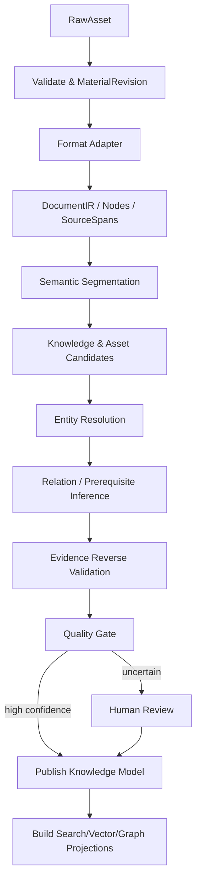
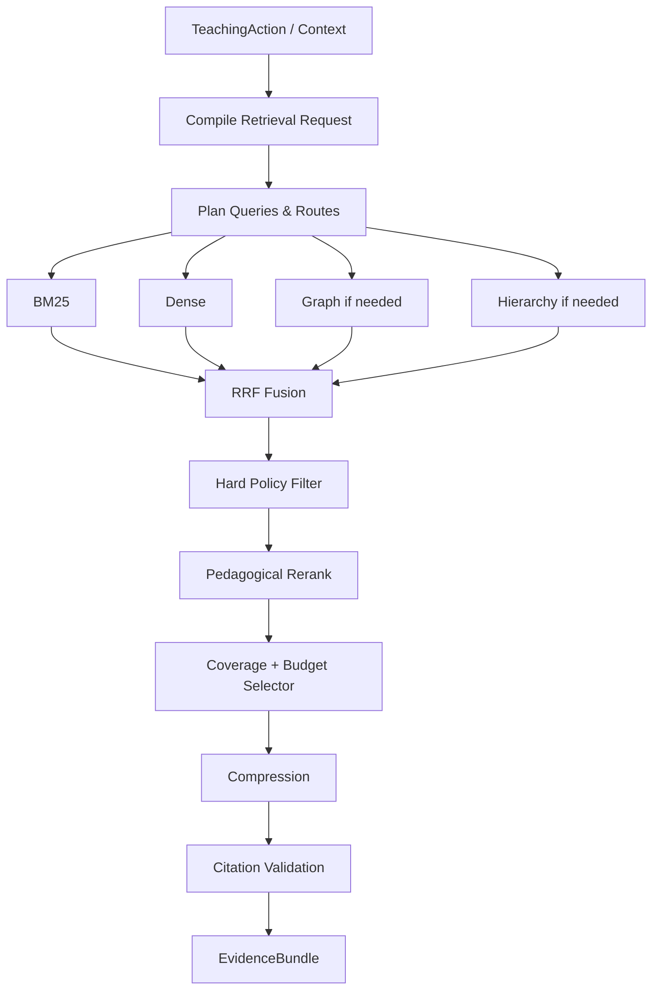

# 八类技术系统：批次 1 系统设计

> 阶段：D｜批次 1  
> 覆盖：`4.1 内容解析与知识建模`、`4.2 检索与知识供给`  
> 约束：遵循《八类技术系统-公共架构冻结稿》，并保留目标文档 4.1、4.2 已有工程细节。

# 4.1 内容解析与知识建模

## D.1.1 系统定义与唯一职责

**一句话定义**：把不可信原始材料转换为可版本化、可定位原文、可审核、可用于教学与评估的规范知识模型。

**唯一核心职责**：维护材料事实、知识对象、规范概念和知识关系的唯一事实源。

**最终决策所有权**：

- SourceDocument/MaterialRevision 是否解析成功；
- KnowledgeUnit/Concept 是否发布；
- PrerequisiteRelation 是否成为正式知识关系；
- 规范 Misconception 是否进入知识模型。

**不负责**：

- 用户是否掌握；
- 当前是否讲解/提问/测试；
- 今天学什么；
- 什么时候复习；
- 检索本轮最终返回哪组证据。

**上游**：用户文件/网页/知识源、审核人员。  
**下游**：4.2、4.4、4.6。

## D.1.2 独有教育价值

本系统的教育价值是把“文档文本”提升为“可教学知识结构”：

- 区分概念、命题、原则、程序、方法、事实、表征和技能；
- 建立可验证前置依赖；
- 把定义、示例、反例、练习、提示、误区与目标知识绑定；
- 保留精确原文证据，让教学解释和评估规则可追溯；
- 支持从书籍目录顺序转为知识依赖顺序。

公共学习科学原则见冻结稿，不在此重复。

## D.1.3 独有输入输出

| 类型 | 对象 | 来源或去向 | 作用 |
|---|---|---|---|
| 输入 | RawAsset | 用户/导入层 | 原始 PDF/EPUB/DOCX/Markdown/TXT 等 |
| 输入 | Parser/Extractor Config | 平台配置 | 解析、切分、抽取版本 |
| 输入 | ReviewDecision | 人工审核 | 修正候选知识和关系 |
| 输出 | SourceDocument | 4.2/4.4/4.6 | 规范材料版本 |
| 输出 | SourceChunk | 4.2 | 检索投影 |
| 输出 | KnowledgeUnit | 4.2/4.3/4.4/4.6 | 可学习知识单元 |
| 输出 | Concept | 全系统只读 | 规范概念身份 |
| 输出 | PrerequisiteRelation | 4.2/4.4/4.6 | 前置依赖 |
| 输出 | Misconception | 4.2/4.3/4.4/4.5 | 规范误区定义 |

## D.1.4 独有领域模型

保留原文成熟八层模型：

```text
RawAsset
→ MaterialRevision
→ DocumentNode
→ SourceSpan
→ KnowledgeUnit（统一原 KnowledgeObject）
→ KnowledgeRelation / PrerequisiteRelation
→ PedagogicalAsset
→ IndexProjection
```

关键内部对象：

- `DocumentIR`：所有解析器统一中间表示；
- `KnowledgeMention`：材料内出现，不等于 canonical Concept；
- `PedagogicalAsset`：材料中定义、例子、反例、exercise 等候选；
- `ExtractionRun`：记录模型/Prompt/规则版本；
- `ReviewDecision`：审核结论；
- `SourceSpan`：任何已发布推断的证据锚点。

## D.1.5 内部模块

| 模块 | 职责 | 输入 | 输出 | 模式 | LLM | 失败降级 |
|---|---|---|---|---|---|---|
| Intake & Validation | 文件签名、安全、checksum、版本 | RawAsset | MaterialRevision | 同步+异步 | 否 | reject/quarantine |
| Format Adapters | PDF/EPUB/DOCX/MD/TXT 解析 | revision | DocumentIR | 异步 | 否/局部多模态 | 部分解析 + review_required |
| Layout/Structure Recovery | 页/章节/表格/公式/阅读顺序 | DocumentIR | DocumentNode | 异步 | 可选 | 原生结构优先 |
| Semantic Segmenter | EvidenceSpan/SemanticUnit/RetrievalChunk | nodes | units | 异步 | 可选 | 规则+embedding |
| Knowledge Extractor | 候选知识/教学素材 | units | candidates | 异步 | 是 | 规则/词典候选 |
| Entity Resolver | 别名、同义、多义消歧 | candidates | Concept mappings | 异步 | 是 | possible_same_as |
| Relation Builder | 显式/隐式关系、前置 | knowledge | candidate edges | 异步 | 是 | 只保留显式边 |
| Evidence Validator | 反向验证、证据覆盖 | candidates | validated candidates | 异步 | 是+规则 | 进入人工审核 |
| Quality Gate | 环、重复、锚点、覆盖 | model | publish/reject | 异步 | 否 | review_required |
| Projection Builder | lexical/vector/graph projection | published model | IndexProjection | 异步 | 否 | 允许延迟重建 |

## D.1.6 核心算法

### 核心算法：证据约束知识建模流水线

1. **问题定义**：从异构材料恢复结构并抽取可学习知识对象/关系，同时保证每个正式对象可回溯原文。
2. **为什么不能只用简单规则**：规则能解析结构，但难处理同义词、隐式关系、论证、误区和跨章节实体；纯 LLM 又容易无证据生成。
3. **输入特征**：结构层级、标题、段落、句法、embedding、术语频率、定义模式、引用、上下文、对象类型、原文显式关系。
4. **状态**：MaterialRevision、candidate object graph、review status、extractor versions。
5. **输出/动作**：创建/合并/保留候选、提出关系、降级为 `possible_same_as`、进入 review、发布。
6. **评分/目标函数**：优先 maximize precision × evidence coverage，在 hard prerequisite 上 precision 优先于 recall；候选 confidence 可由 evidence_quality、extractor_agreement、structural_explicitness、validator_score 组合。
7. **约束**：已发布对象必须有 SourceSpan；低置信 hard prerequisite 禁止自动发布；原文与系统生成 provenance 分离；不能把章节顺序直接当 prerequisite。
8. **更新机制**：文件/解析器/Prompt/模型变更只重算受影响节点和局部子图，稳定 canonical ID 尽量保留。
9. **不确定性**：confidence 必须经人工数据校准；模型自报概率不可直接使用。
10. **冷启动**：先使用结构规则、术语识别和保守 LLM 抽取；跨材料合并可暂缓。
11. **解释机制**：每个对象/关系保存 evidence_span_ids、inference_method、extractor_version、reason code。
12. **离线评估**：黄金材料集上的结构恢复、对象 precision/recall、关系 F1、entity resolution accuracy、anchor replay rate、hallucination rate。
13. **在线验证**：人工驳回率、教学引用错误率、错误 prerequisite 导致的计划修正率。
14. **失败模式**：OCR 错字、多栏错序、错误合并同名概念、把例子属性当概念属性、前置关系环、无证据知识。
15. **替代方案**：纯规则（可靠但 recall 低）；纯 LLM（灵活但不可控）；端到端文档模型（复杂且审计弱）。推荐混合流水线。
16. **推荐采用阶段**：MVP 建 DocumentIR/SourceSpan；P1 知识对象/证据；P2 跨材料 canonical；P3 复杂多模态与自动校准。
17. **数据规模要求**：MVP 无训练数据要求，但应有每种格式黄金样本；置信度校准/自动审核需要持续积累人工 review label。

算法示意：

```text
parse_deterministically()
→ segment_by_structure()
→ extract_candidates_with_schema()
→ bind_source_spans()
→ resolve_entities_conservatively()
→ infer_relations()
→ reverse_validate()
→ graph_quality_checks()
→ human_review_if_needed()
→ publish_version()
```

复杂度：结构解析近似 `O(N)`；实体候选两两比较不得直接 `O(K²)`，应先用词典/embedding blocking 将候选缩小；图环检测为 `O(V+E)`。

## D.1.7 独有运行流程



## D.1.8 与其他系统的边界接口

- → 4.2：`GetSourceSpan`、`ListKnowledgeUnits`、`GetKnowledgeNeighborhood`、索引投影事件。
- → 4.4：知识目标、规范误区、来源 exercise candidate；4.4 负责发布 AssessmentItem。
- → 4.6：PrerequisiteRelation / graph snapshot。
- ← 4.6：只接收“关系冲突/路径异常证据”，不能让规划器直接改图。

## D.1.9 特有失败模式

- 文件结构丢失；
- 解析文本顺序错误；
- OCR hallucination；
- 锚点无法回放；
- 同名异义错误合并；
- 跨版本 ID 大规模漂移；
- 无证据知识对象；
- hard prerequisite 错误；
- Prompt Injection 被误当系统指令。

## D.1.10 特有评估指标

- 离线算法：object/relationship P/R/F1、entity resolution accuracy、hard prerequisite precision。
- 系统：解析时延、失败恢复、增量重算率、索引一致性。
- 教学过程：前置缺口定位有效率、引用可回放率、错误图导致的 replan 率。
- 学习结果：使用正确知识路径是否减少无效前置学习、提高延迟/迁移结果；需通过实验验证，不由知识图指标直接推断。

## D.1.11 技术选型与演进

**MVP**：PostgreSQL + DocumentIR + SourceSpan + deterministic parsers + schema constrained LLM extraction + pgvector/全文投影。  
**增强版**：规范 KnowledgeUnit/Relation、人工审核、增量更新、跨材料 mapping。  
**成熟版**：复杂 PDF/公式/图像理解、置信度校准、自动抽样审核、图质量反馈。  
**暂不建议**：一开始引入独立图数据库作为事实源；纯 LLM 端到端建图；全自动发布低证据关系。

## D.1.12 强化学习约束

本系统不是策略控制问题。

```text
规则 → 启发式评分 → 监督/排序
```

已足够。可以未来用监督学习改进 candidate validation/entity resolution，但 **不建议 Contextual Bandit、Offline RL 或在线 RL**；其探索语义与知识事实发布不匹配。

---

# 4.2 检索与知识供给

## D.2.1 系统定义与唯一职责

**一句话定义**：根据 4.5 已确定的教学动作、范围和泄漏约束，从知识基础设施中选择最适合当前动作的一组可引用证据。

**唯一核心职责**：生成 `EvidenceBundle`。

**最终决策所有权**：哪些检索候选进入本轮 EvidenceBundle、如何压缩组合和引用。

**不负责**：

- 选择 TeachingAction；
- 修改 learner state；
- 判断长期掌握；
- 决定 LearningPlan；
- 生成最终用户表达。

上游：4.1、4.5。  
下游：4.4、4.8；对 4.5 只反馈 `missing_evidence/conflicts`。

## D.2.2 独有教育价值

核心价值是实现：

> **教学适用性，而不只是语义相关性。**

相同问题在讲解、苏格拉底追问、一级提示、无提示测试、错误诊断、迁移练习中，允许取用的材料不同。

特别负责：

- 前置证据充分；
- 示例与学习阶段匹配；
- 误区/反例取证；
- 当前禁止暴露答案时排除高相关答案；
- 提供可跳转原文的引用。

## D.2.3 独有输入输出

| 类型 | 对象 | 来源或去向 | 作用 |
|---|---|---|---|
| 输入 | TeachingAction / TeachingContext subset | 4.5 | 证据需求、提示/暴露、目标概念 |
| 输入 | SourceChunk/KnowledgeUnit/Concept/Relation | 4.1 | 检索 corpus |
| 输入 | source_scope / ACL | 4.8/权限层 | 范围与权限 |
| 输出 | EvidenceBundle | 4.4/4.8 | 可引用教学证据 |
| 输出 | RetrievalTrace | Decision/Audit ledger | 离线评价与解释 |
| 输出 | MissingEvidence/Conflict | 4.5 | 下一轮策略降级的证据，不直接改动作 |

## D.2.4 独有领域模型

内部对象：

- `TeachingRetrievalRequest`：从 TeachingAction 派生的检索合同；
- `RetrievalPlan`：路由、查询、过滤、预算；
- `RetrievalCandidate`：带多路分数/来源/暴露级别；
- `RetrievalTrace`：召回、过滤、重排轨迹；
- `EvidenceBundle`：公共输出对象。

保留原 4.2 L0～L4 `answer_exposure_level`。

## D.2.5 内部模块

| 模块 | 职责 | 输入 | 输出 | 模式 | LLM | 失败降级 |
|---|---|---|---|---|---|---|
| Request Compiler | TeachingAction → retrieval request | context/action | request | 同步 | 可选 | deterministic mapping |
| Retrieval Planner | 查询分解/路由/预算 | request | plan | 同步 | 可选 | 固定路由 |
| Lexical Retriever | 精确术语/原文 | plan | candidates | 并行 | 否 | 返回空 |
| Dense Retriever | 语义召回 | plan | candidates | 并行 | 否 | lexical-only |
| Graph Retriever | 前置/关系多跳 | plan | candidates | 按需 | 否 | skip graph |
| Hierarchy/Page Retriever | 长文档范围收缩 | plan | candidates | 按需 | 可选 | section search |
| Fusion | RRF/融合 | candidates | ranked pool | 同步 | 否 | lexical+dense |
| Reranker | 高精度教学重排 | pool | reranked | 同步 | 模型可用 | RRF score |
| Policy Filter | ACL/泄漏/类型硬过滤 | reranked | allowed | 同步 | 否 | fail closed |
| Selector | 覆盖/预算/MMR | allowed | selected | 同步 | 否 | top-k with caps |
| Compressor | 抽取式优先 | selected | compact evidence | 同步 | 可选 | no compression |
| Citation Validator | 锚点/引用一致性 | evidence | verified bundle | 同步 | 否 | drop invalid evidence |

## D.2.6 核心算法

### 核心算法：混合召回 + 教学约束重排 + 预算选择

1. **问题定义**：在权限、来源、教学动作、答案暴露和上下文预算约束下，选择能覆盖当前教学需求的最小高质量证据集合。
2. **为什么不能只用简单规则**：单一关键词漏掉语义改写；单一向量漏精确术语；纯规则难平衡前置/例子/误区/引用覆盖。
3. **输入特征**：BM25、dense similarity、graph distance、hierarchy proximity、concept overlap、pedagogical role、learner stage fit、source quality、exposure level、redundancy、token cost。
4. **状态**：index version、source scope、TeachingAction、request budget；不持久化 learner state 副本。
5. **输出/动作**：route selection、candidate inclusion/exclusion、EvidenceBundle。
6. **评分函数**：`score = w_r*relevance + w_c*coverage + w_p*pedagogical_fit + w_s*source_quality - w_l*leakage_risk - w_d*redundancy - w_t*token_cost`；MVP 权重手工，后续学习排序。
7. **约束**：ACL/source_scope、allowed type、max exposure、citation valid、required concept coverage、context budget。
8. **更新机制**：材料/index/embedding/reranker 版本变化后重算；learner state 变化通常只需重新过滤/重排。
9. **不确定性**：输出 evidence-level relevance/confidence、bundle confidence、missing evidence；低置信不由 LLM补事实。
10. **冷启动**：BM25 + dense + RRF + Cross-Encoder + 固定 pedagogical rules，不需要行为训练数据。
11. **解释机制**：保留每路 rank、融合分、过滤 reason、重排 features、selected role 和 SourceSpan。
12. **离线评估**：Recall@K、MRR、nDCG、citation precision、role coverage、leakage rate、context redundancy。
13. **在线验证**：下一次独立成功、提示依赖、用户跳转原文率只作过程指标；最终看延迟保持/迁移。
14. **失败模式**：无结果、低相关、缺前置、冲突来源、锚点坏、答案泄漏、长上下文噪声、embedding domain shift。
15. **替代方案**：纯 BM25、纯 dense、全 GraphRAG、全 Agent search；均可作为 route，但不应成为唯一全局方案。
16. **推荐采用阶段**：MVP 混合检索与引用；P2 graph/hierarchy；P3 LTR/个性化 route。
17. **数据规模要求**：MVP 无训练数据；LTR 需积累有教学角色/选择偏好的标注；Bandit 需要稳定 outcome 和 propensity logging。

候选融合：

```text
RRF(d) = Σ_i 1 / (k + rank_i(d))
```

预算选择可近似为带 coverage 约束的 knapsack：

```text
maximize Σ utility(e)
subject to Σ tokens(e) <= B
           required_roles covered
           exposure(e) <= allowed_level
```

MVP 用 greedy marginal utility/token 即可，不必求全局整数规划最优。

## D.2.7 独有运行流程



## D.2.8 与其他系统的边界接口

- ← 4.1：只读知识/索引/锚点；发现冲突可提交 evidence，不直接改知识库。
- ← 4.5：TeachingAction、allowed exposure、required evidence roles。
- → 4.8：EvidenceBundle；4.8 不得扩大 exposure。
- → 4.4：评分/诊断所需 rubric/source evidence；答案对评估模型和学习者展示权限分离。
- → 4.5：只返回 `missing_evidence/conflict/low_confidence` 供**下一轮**决策。

## D.2.9 特有失败模式

- relevance 高但 pedagogically harmful；
- 完整答案泄漏；
- 引用与实际文本不一致；
- source_generated 与 source_extracted 混淆；
- 多路召回重复造成 context flooding；
- 图多跳放大错误关系；
- 外部文档 indirect prompt injection；
- 缓存跨 learner state/version 污染。

## D.2.10 特有评估指标

- 离线算法：Recall@K、nDCG、RRF/reranker win rate、coverage、token efficiency。
- 系统：p50/p95 latency、cache hit、retrieval failure、index freshness。
- 教学过程：answer leakage、prerequisite sufficiency、stage fit、hint material appropriateness。
- 学习结果：EvidenceBundle variant 对下一次独立成功、延迟保持、迁移的增益。

## D.2.11 技术选型与演进

**MVP**：BM25 + dense + RRF + Cross-Encoder + MMR + metadata filter + source anchors + EvidenceBundle。  
**增强版**：GraphRAG route、hierarchical long-doc retrieval、coverage constrained selector、conflict detection。  
**成熟版**：LTR、按学习结果训练 rerank features、route personalization。  
**暂不建议**：全请求 GraphRAG；让 Agent 自由搜并直接回答；单向量检索；把生成摘要当事实源。

## D.2.12 强化学习约束

比较顺序：

```text
规则
→ 启发式评分 / RRF
→ 监督 Learning-to-Rank
→ Contextual Bandit（仅 route/reranker variant）
→ Offline RL
→ 在线受约束 RL
```

当前推荐停在 **启发式 + 监督 LTR 前置准备**。Contextual Bandit 只有在有可靠教学 outcome、propensity logging、明确安全候选集后才考虑。检索系统不需要完整 RL；若简单排序已达到目标，不进入 RL。