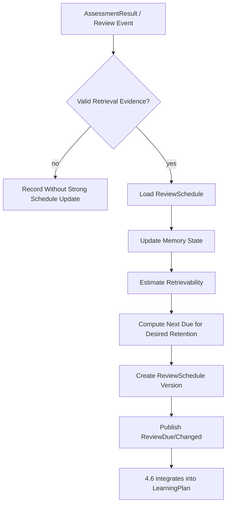
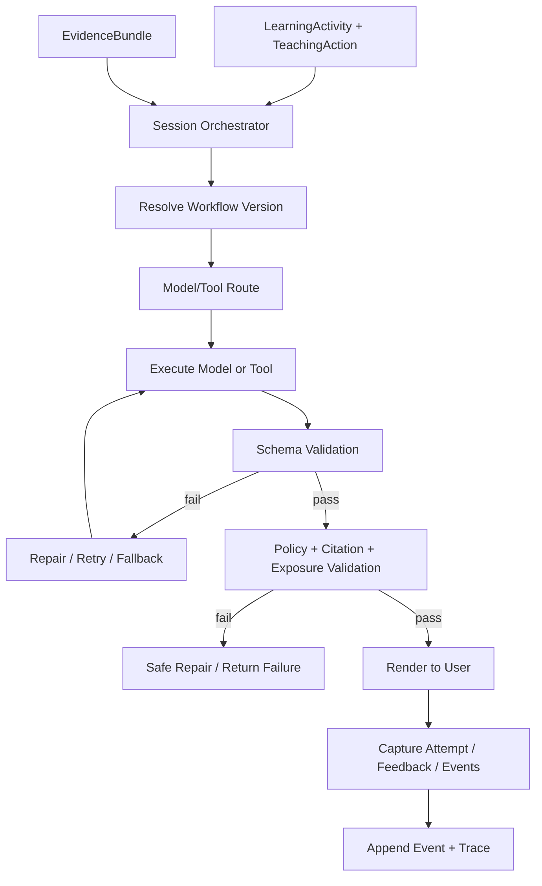

# 八类技术系统：批次 4 系统设计

> 阶段：D｜批次 4  
> 覆盖：`4.7 记忆保持与复习调度`、`4.8 LLM 生成、Agent 编排与可信控制`  
> 公共约束：《八类技术系统-公共架构冻结稿》。

# 4.7 记忆保持与复习调度

## D.7.1 系统定义与唯一职责

**一句话定义**：根据有效提取证据和记忆模型，维护每个 learner × KnowledgeUnit 的遗忘风险，并计算下一建议复习时点。

**唯一核心职责**：决定“什么时候最好复习”。

**最终决策所有权**：

- ReviewSchedule；
- memory scheduling state；
- `next_due_at`；
- desired retention / scheduling policy version 下的复习风险与优先级。

**不负责**：

- 判断完整 mastery；
- 决定今天所有任务；
- 决定本轮讲解/提示；
- 给 Attempt 判分。

上游：4.3、4.4、4.8。  
下游：4.6、4.5；4.3 只读其 retrievability 特征。

## D.7.2 独有教育价值

将间隔效应和提取练习转化为长期保持机制：

- 防止刚学会后长期不再检索；
- 根据真实回忆结果调整间隔；
- 避免所有知识点固定“1/3/7/14 天”；
- 让复习围绕有效 retrieval evidence，而不是重新阅读；
- 把“记忆风险”作为学习计划输入，但不吞并一般任务规划。

## D.7.3 独有输入输出

| 类型 | 对象 | 来源/去向 | 作用 |
|---|---|---|---|
| 输入 | AssessmentResult | 4.4 | 复习结果与独立性证据 |
| 输入 | Attempt metadata | 4.4 | 提示、延迟、是否真正提取 |
| 输入 | MasteryEstimate | 4.3 只读 | 知识状态辅助，不直接复制 |
| 输入 | LearningEvent | 4.8 | ReviewCompleted/DelayedRecall 等 |
| 输出 | ReviewSchedule | 4.6/4.5/4.8 | 下次复习时间和风险 |
| 输出 | ReviewDue signal | 4.6 | 到期候选 |
| 输出 | retrievability estimate | 4.3/4.6 | 只读辅助特征 |

## D.7.4 独有领域模型

### ReviewSchedule

```text
learner_id
knowledge_unit_id
memory_model
model_version
difficulty
stability
retrievability
desired_retention
last_valid_retrieval_at
next_due_at
review_priority
evidence_quality
source_event_ids[]
version
```

### 有效复习证据

必须记录：

```text
retrieval_required
independence_level
hint_level
answer_seen_before_attempt
assessment_confidence
elapsed_since_last_valid_retrieval
knowledge_type
```

## D.7.5 内部模块

| 模块 | 职责 | 输入 | 输出 | 模式 | LLM | 降级 |
|---|---|---|---|---|---|---|
| Review Evidence Filter | 判断是否是有效 retrieval | result/event | valid review observation | 同步 | 否 | low-quality 不更新/低权更新 |
| Memory Model Adapter | FSRS/SM-2/HLR 等统一接口 | observation/state | updated memory state | 同步 | 否 | SM-2/simple exponential |
| Calibration Engine | 参数优化/校准 | history | params | 异步 | 否 | population defaults |
| Due Calculator | 计算 next_due_at | state/target retention | schedule | 同步 | 否 | conservative interval |
| Review Priority | overdue/risk/importance | schedule | priority | 同步 | 否 | overdue heuristic |
| Schedule Projector | 持久化版本 | update | ReviewSchedule | 同步 | 否 | last valid schedule |
| Simulator | workload/retention tradeoff | params | simulation | 异步 | 否 | simple estimate |

## D.7.6 核心算法

### 核心算法：FSRS-compatible 记忆状态与目标保持率调度

1. **问题定义**：根据历史有效提取结果，估计某知识单元当前 retrievability，并在目标保持率下求下一建议复习时间。
2. **为什么不能只用简单规则**：固定间隔忽略材料难度、个体记忆差异和每次成功/失败后的稳定性变化。
3. **输入特征**：review rating/score、独立性、提示暴露、elapsed time、knowledge type、assessment confidence、历史 stability/difficulty。
4. **状态**：Difficulty、Stability、Retrievability 或其他 memory model state；与 MasteryEstimate 分开。
5. **输出/动作**：更新 memory state、`next_due_at`、review priority；不创建 LearningPlan。
6. **目标函数**：使预测 recall probability 接近 desired retention，同时控制 review workload；可视为在保持率与成本之间优化。
7. **约束**：只有有效 retrieval evidence 才高权更新；强提示成功不能当完整 recall；最大/最小 interval；用户可提前/延迟但保留 recommended vs actual。
8. **更新机制**：每次有效 review/recall event 后更新；参数优化异步，切换模型生成新 schedule version。
9. **不确定性**：历史少、评分置信度低或知识类型不适配时提高 uncertainty 并采用保守 interval；不伪造精确概率。
10. **冷启动**：population/default parameters；根据首次有效表现初始化；逐步个性化。
11. **解释机制**：reason codes 如 `retrievability_below_target`、`recent_failure_shortened_interval`、`strong_independent_recall_increased_stability`。
12. **离线评估**：log loss/Brier、calibration、observed vs predicted retention、benchmark 与 SM-2/简单指数模型。
13. **在线验证**：reviews per retained unit、实际保持率、学习负担；最终检查延迟独立回忆与迁移，不只看卡片通过率。
14. **失败模式**：把概念理解简化为 flashcard recall、错误评分污染状态、用户乱用 Hard/Again 类信号、极少数据过拟合、复习爆量、复习内容单调。
15. **替代方案**：Leitner、SM-2、Half-Life Regression、FSRS、自定义 hazard model。推荐 FSRS-compatible + 简单 baseline。
16. **推荐采用阶段**：MVP FSRS/default params；增强个体优化/知识类型分层；成熟长期多目标调度。
17. **数据规模要求**：默认 FSRS 可先用通用参数；个性参数优化需足够 review history，由训练稳定性/validation 决定是否启用，不设置伪精确最小次数。

重要限制：

```text
memory retrievability ≠ full mastery
```

概念、程序和迁移能力仍由 4.3 综合多类 AssessmentResult。

## D.7.7 独有运行流程



## D.7.8 与其他系统的边界接口

- ← 4.4：AssessmentResult/Attempt independence；4.7 不重评答案。
- ← 4.3：MasteryEstimate 只读；4.7 不声明稳定掌握。
- → 4.6：next_due/risk/priority；4.6 不改 memory state。
- → 4.5：若当前 activity 是复习，提供 delay/risk context；4.5 决定用何种 retrieval action。
- ← 4.8：执行事件；4.8 不直接改 schedule。

## D.7.9 特有失败模式

- 闪卡范式过度泛化；
- 无效复述被当 recall；
- schedule 与用户实际执行时间混淆；
- desired retention 过高导致工作量爆炸；
- 参数过拟合；
- 同一知识不同任务难度未区分；
- 计划器和调度器各维护一套 next review。

## D.7.10 特有评估指标

- 离线算法：Brier/log loss、calibration、interval prediction comparison。
- 系统：schedule update latency、due event accuracy、parameter optimization cost。
- 教学过程：overdue rate、review completion、active recall proportion、hint-free review proportion。
- 学习结果：延迟回忆、保持率、单位复习次数的长期保持、迁移维持。

## D.7.11 技术选型与演进

**MVP**：FSRS-compatible scheduler / 官方开源实现思想 + Askora evidence adapter；SM-2/simple exponential baseline。  
**增强版**：个体参数优化、knowledge type policy、retention-workload simulator。  
**成熟版**：transfer probe scheduling、multi-objective workload optimization。  
**暂不建议**：自研 RL 替换成熟 SRS；一个 forgetting score 代表 mastery；4.6 重复计算遗忘曲线。

## D.7.12 强化学习约束

比较：

```text
Leitner/固定规则
→ SM-2/FSRS/HLR 等启发式或可训练记忆模型
→ 监督/参数优化
→ Contextual Bandit
→ Offline RL
→ 在线 RL
```

当前前三级已经覆盖核心需求。RL 只有在长期 workload-retention 优化证明传统调度存在明确瓶颈时再研究。

若未来使用：

- 状态：memory state + learner constraints；
- 动作：候选 review interval；
- 奖励：延迟 recall - review time cost；
- 长期奖励：稳定保持/迁移；
- 风险：过长间隔造成真实遗忘，过短造成负担；
- 安全：interval bounds + desired retention floor；
- 离线评估：counterfactual interval evaluation 极难，需随机化/丰富日志；
- 当前结论：**不实施 RL**。

---

# 4.8 LLM 生成、Agent 编排与可信控制

## D.8.1 系统定义与唯一职责

**一句话定义**：把 4.1～4.7 已确定的业务状态、证据与教学决策可靠地执行为用户交互，并统一管理模型、工具、Prompt、安全、可观测性和降级。

**唯一核心职责**：执行，而不是重新决定教学业务语义。

**最终决策所有权**：

- 会话执行状态；
- 模型/工具执行路径；
- 在不改变 TeachingAction 语义前提下的模型路由和工程降级；
- ModelInference、FeedbackSignal、LearningEvent、DecisionTrace ledger 的持久化执行。

**不负责**：

- 改 LearnerState/MasteryEstimate；
- 改 TeachingAction；
- 改 LearningPlan；
- 改 ReviewSchedule；
- 发布知识事实；
- 在检索失败时“自己补事实”。

上游：4.2、4.4、4.5、4.6、4.7。  
下游：用户，以及事件驱动回到各领域系统。

## D.8.2 独有教育价值

教育价值来自“忠实执行教学决策”：

- 同一个 TeachingAction 用清晰自然语言表达；
- 根据允许暴露级别控制输出；
- 引用证据而不伪造来源；
- 工具故障时显式降级而非改变教学目标；
- 记录用户反馈与行为供学习闭环使用；
- 保证 LLM 生成能力不会吞并可解释教学内核。

## D.8.3 独有输入输出

| 类型 | 对象 | 来源/去向 | 作用 |
|---|---|---|---|
| 输入 | TeachingAction/TeachingContext | 4.5 | 要执行什么 |
| 输入 | EvidenceBundle | 4.2 | 可使用知识证据 |
| 输入 | AssessmentItem / commands | 4.4 | 呈现评估/提交尝试 |
| 输入 | LearningActivity/Plan | 4.6 | 会话任务 |
| 输入 | ReviewSchedule | 4.7 | 到期展示上下文 |
| 输入 | user messages/actions | 用户 | 交互 |
| 输出 | ModelInference | Audit | 模型调用记录 |
| 输出 | rendered response | 用户 | 最终交互 |
| 输出 | LearningEvent | 4.3/4.6/4.7 | 不可变行为事件 |
| 输出 | FeedbackSignal | 4.3/4.4/4.5 | 用户反馈 |
| 输出 | execution trace | 运维/审计 | 可观测性 |

## D.8.4 独有领域模型

内部对象：

```text
SessionState
WorkflowRun
WorkflowStep
ToolCall
ToolResult
PromptTemplate
ModelRoute
ModelInference
ExecutionPolicy
ValidationResult
```

公共对象：LearningEvent、FeedbackSignal、DecisionTrace 由本系统托管 ledger，但决策业务内容由原决策系统产生。

## D.8.5 内部模块

| 模块 | 职责 | 输入 | 输出 | 模式 | LLM | 失败降级 |
|---|---|---|---|---|---|---|
| Session Orchestrator | 状态机/步骤执行 | activity/action | workflow | 同步 | 否 | resume/abort |
| Model Gateway | 统一供应商调用 | inference request | ModelInference | 同步 | 是 | fallback model |
| Model Router | 能力/成本/延迟路由 | task profile | model route | 同步 | 否/监督可选 | static mapping |
| Prompt Registry | Prompt 版本与模板 | task/version | prompt | 同步 | 否 | previous stable |
| Tool Registry | allowlist/schema/权限 | tool request | tool handle | 同步 | 否 | deny |
| Tool Executor | 执行检索/计算/代码等 | call | result | 同步/异步 | 否 | timeout/error |
| Output Validator | schema/business policy | model output | valid candidate | 同步 | 可用模型辅助但规则最终 | retry/fallback |
| Citation/Faithfulness Guard | 生成与 EvidenceBundle 对齐 | response/evidence | verified response | 同步 | 可用 NLI/LLM 辅助 | remove/repair/declare uncertain |
| Injection/Security Guard | 不可信内容、权限 | input/tool | allow/deny | 同步 | 否为主 | fail closed |
| Event/Decision Ledger | append-only trace | domain submissions | events/traces | 同步 | 否 | local durable queue |
| Telemetry/Cost | traces/metrics/logs | runs | telemetry | 异步 | 否 | local metrics |

## D.8.6 核心算法

### 核心算法：确定性工作流编排 + 受约束生成验证

1. **问题定义**：在已有 TeachingAction/EvidenceBundle 下选择合适模型/工具执行固定工作流，并保证输出结构、证据、权限和暴露约束。
2. **为什么不能只用简单规则**：自然语言生成、开放式工具结果和多模型能力差异需要 LLM；但执行控制必须是确定性/可审计的。
3. **输入特征**：task type、required capabilities、context length、latency budget、cost budget、privacy class、model health、TeachingAction exposure、EvidenceBundle confidence。
4. **状态**：SessionState、WorkflowRun、step status、budgets；业务状态只引用版本，不复制为可写真相。
5. **输出/动作**：model route、tool call、retry/fallback、validated rendered response、LearningEvent。
6. **评分函数**：模型路由可用 `utility = quality_prediction - λ_cost*cost - λ_latency*latency - λ_risk*risk`；TeachingAction 本身不参与重新优化。
7. **约束**：tool allowlist、least privilege、budget、schema、answer exposure、citation requirement、no direct domain DB write、side-effect authorization。
8. **更新机制**：模型健康/价格/能力配置动态更新；Prompt/route/workflow 均版本化；正在执行的 run 固定版本避免中途漂移。
9. **不确定性**：ModelInference/ValidationResult 记录 confidence；EvidenceBundle 低置信时输出不确定性或回到 4.5，不自行补事实。
10. **冷启动**：静态模型路由 + deterministic workflows + stable prompts；无需策略训练数据。
11. **解释机制**：记录 model route reason、tool calls、validation failures、fallback chain、source evidence ids；用户只显示必要简化解释。
12. **离线评估**：prompt regression set、schema pass rate、faithfulness/citation precision、tool success、injection tests、model-route quality/cost Pareto。
13. **在线验证**：latency、cost、fallback、用户纠错/评分申诉；最终学习效果仍归整体教学实验。
14. **失败模式**：Prompt Injection、tool abuse、hallucinated tool args、schema drift、供应商 outage、context overflow、引用错配、Agent loop、cost runaway、模型私自暴露答案。
15. **替代方案**：完全 autonomous agent、固定单模型、纯模板无 LLM。推荐显式 workflow + 局部 agentic step。
16. **推荐采用阶段**：MVP workflow/model gateway/validation；增强多模型路由与 sandbox；成熟局部 Agent、自动 route prediction。
17. **数据规模要求**：MVP 无训练要求；学习型路由只需任务级质量/成本历史；不需要教育 RL。

推荐主流程：

```text
load immutable inputs
→ execute domain-defined workflow
→ retrieve/use allowed evidence
→ call model/tools
→ validate schema
→ validate business policy
→ validate citations/exposure
→ render
→ append events/traces
```

### Agent 使用边界

允许 Agent 自由度：

- 在**已授权工具集**内研究如何取得证据；
- 在固定 TeachingAction 下产生多个表达候选；
- 对复杂外部研究进行多步查询。

禁止 Agent：

- 直接 UPDATE learner_state；
- 直接把 AssessmentResult 改成“掌握”；
- 看到检索失败就切换教学目标；
- 自己更改 LearningPlan/next_due_at；
- 运行任意 shell/网络/文件写入而无权限边界。

## D.8.7 独有运行流程



## D.8.8 与其他系统的边界接口

- ← 4.5：TeachingAction 是只读命令语义；执行失败不能私自变策略。
- ← 4.2：EvidenceBundle；4.8 校验最终生成忠实性，但不重选证据。
- ↔ 4.4：呈现 AssessmentItem/提交 Attempt command；评分仍在 4.4。
- ← 4.6：执行 LearningActivity；不能改变 plan ownership。
- ← 4.7：呈现 review due；更新必须通过 event 回到 4.7。
- → 4.3/4.7：只发布 LearningEvent/FeedbackSignal，不直接写状态。

## D.8.9 特有失败模式

- indirect Prompt Injection；
- excessive agency；
- tool schema hallucination；
- 长 Agent loop；
- 同一工具重试造成副作用重复；
- 模型供应商泄露敏感上下文；
- Prompt/模型版本不可追踪；
- structured output 通过 schema 但违反业务语义；
- citation valid 但回答进行了不受证据支持的扩展；
- cost/latency 失控。

## D.8.10 特有评估指标

- 离线算法/模型：task success、schema pass、faithfulness、citation precision、injection red-team pass、route quality/cost。
- 系统：p50/p95 latency、tool error、fallback、resume success、cost/session、event delivery。
- 教学过程：answer leakage、action fidelity、feedback capture completeness。
- 学习结果：只通过整体 TeachingAction/模型 variant 实验测量；不能以生成 fluency 代替学习效果。

## D.8.11 技术选型与演进

**MVP**：显式 workflow/state machine、统一 Model Gateway、Prompt registry、JSON Schema、tool allowlist、OpenTelemetry、Outbox/Event Ledger、citation guard。  
**增强版**：多模型路由、沙箱、自动 Prompt regression、局部 ReAct-style agent、成本治理。  
**成熟版**：基于质量/成本的学习型 route、策略级 shadow evaluation、多 Agent 仅在明确子任务使用。  
**暂不建议**：让一个 autonomous Agent 同时掌握学习者模型、计划、检索、评分和状态写入；开放 shell；把系统 Prompt 当唯一安全边界。

## D.8.12 强化学习约束

本系统的模型/工具路由可按：

```text
静态规则
→ 启发式 cost/latency/quality score
→ 监督 route predictor
→ Contextual Bandit（安全模型候选间）
```

通常无需 Offline RL/在线 RL。

若 Bandit 用于模型路由：

- context：task type、长度、预算、历史 model health；
- action：经过权限/能力校验的模型集合；
- reward：validated task quality - cost - latency；
- 不得使用“用户聊得更久”作为质量奖励；
- 教学策略仍由 4.5 决定；
- 若静态路由足够，不升级 Bandit。

在线 RL 控制 Agent 整体行为当前**不推荐**，因为安全、可解释和副作用风险高。