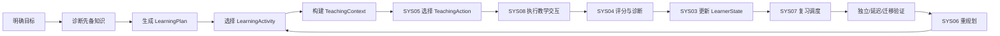
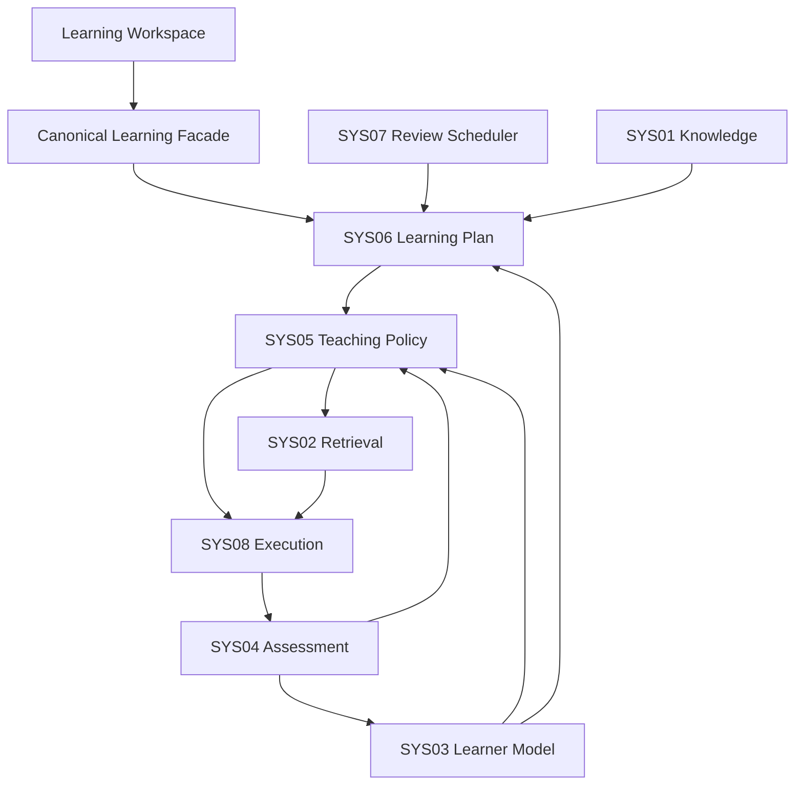

# Askora 个人 AI 辅助学习平台设计方案

> 文档性质：产品级 Canonical Design  
> 当前状态：v0.3 Adaptive Teaching Loop 设计冻结基线  
> 适用范围：私人自用、单用户优先的桌面与本地学习平台  
> 版本：v0.3  
> 日期：2026-08-07

> 说明：本文件定义产品与总体系统语义。`docs/specs/**` 当前仍是既有实现合同，只有在后续 Spec Delta 完成后才会吸收本次 v0.3 设计变化。若本文件中的 v0.3 Canonical Design 与历史 v0.2 示例冲突，以本文件的 v0.3 语义为准，但不得据此直接修改代码或绕过 Spec。

## 1. 文档摘要

Askora 应被设计成一个“个人学习操作系统”，而不是一个更会回答问题的 AI 聊天工具。

系统持续回答以下问题：

1. 用户想学什么，目标、成功标准与时间约束是什么？
2. 用户当前真正掌握了什么，判断依据与不确定性是什么？
3. 本次表现暴露了知识缺口、概念误解、方法选择、执行、提取、迁移还是表达问题？
4. 在当前 LearningActivity 中，下一步应采用哪一种教学控制意图、给予多少支架、允许多具体的提示、是否允许答案暴露？
5. 用户是否已经具备无提示独立成功、延迟保持和迁移能力？
6. 下一次复习和后续学习活动应该如何安排？
7. Askora 的自适应策略是否真的改善了学习，而不仅让交互更复杂？

平台最终目标不是增加用户与 AI 的互动时长，而是提高：

- 无提示独立成功；
- 延迟保持；
- 独立迁移；
- 单位学习时间的能力增益。

一句话产品定义：

> Askora 根据学习目标、知识结构、可审计学习证据和当前 TeachingContext，在明确的安全与测量约束内选择下一步 TeachingAction，并通过独立验证、延迟验证和迁移验证形成长期学习闭环。

### 1.1 v0.3 核心增量

v0.3 将“根据学习状态切换教学方式”的概念设计正式冻结为 **Adaptive Teaching Loop**：

```text
LearningObjective / LearningActivity
+ LearnerState / MasteryEstimate
+ AssessmentResult / Diagnosis
+ Assistance & Exposure History
+ Review / Delay / Transfer Context
+ User Constraints
        ↓
TeachingContext Snapshot
        ↓
Constrained Deterministic Teaching Policy
        ↓
Immutable TeachingAction
        ↓
LLM / Tool Execution
        ↓
Attempt / AssessmentResult / Outcome
        ↓
LearnerState update / validation obligation / next decision
```

它不是第二套 LearnerState，也不是让 LLM 自由选择教学策略。

---

## 2. 设计原则

### 2.1 学习成果优先，而非对话体验优先

对话只是交互手段。Askora 不以回复流畅度、聊天轮次、点赞、token 数或会话时长作为主要学习目标；它们最多属于体验、成本或过程指标。

### 2.2 AI 提供最小必要帮助，但不绝对拒绝直接答案

系统应优先保留用户思考空间，同时避免无效挣扎。完全陌生、存在严重先备缺口、重复失败或用户明确请求直接讲解时，可以增加支架或直接说明。

直接答案必须服从测量完整性：在 active no-hint assessment 中不能通过用户请求绕过答案暴露约束；允许直接答案时必须记录 exposure，并产生后续 fresh independent validation obligation。

### 2.3 教学决策与内容生成分离

SYS05 Teaching Policy 负责产生 TeachingAction；SYS08/LLM 负责在动作 envelope 内实现语言、示例、反馈、工具调用和表达。

LLM/Agent 可以：

- 生成 explanation；
- worked example；
- hint；
- diagnostic candidate；
- feedback；
- self-explanation prompt；
- language realization；
- tool execution。

LLM/Agent 不可以成为：

- LearnerState owner；
- Assessment truth owner；
- TeachingAction owner；
- LearningPlan owner；
- ReviewSchedule owner；
- policy hard-rule override；
- answer-exposure override。

### 2.4 掌握必须由行为证据支持

“看懂了”“感觉会了”“模型认为用户懂了”不能直接视为掌握。Askora 必须区分：

```text
independent
assisted
answer-exposed
immediate
delayed
transfer
```

其中 assisted success 与 answer-exposed success 均不能单独支持稳定掌握。

### 2.5 一个核心状态，一个唯一事实源

八系统状态所有权冻结为：

```text
Knowledge truth / relations     → SYS01
EvidenceBundle                  → SYS02
LearnerState / MasteryEstimate  → SYS03
AssessmentResult                → SYS04
TeachingAction                  → SYS05
LearningPlan / Activity         → SYS06
ReviewSchedule / next_due       → SYS07
Model / Tool execution          → SYS08
```

必须继续保持：

```text
AssessmentResult ≠ MasteryEstimate
LearningPlan ≠ TeachingAction
ReviewSchedule ≠ LearnerState
MisconceptionEvidence ≠ MisconceptionHypothesis
TeachingStage ≠ LearnerState
TeachingStrategy ≠ TeachingAction
TeachingAction ≠ InteractionMove
```

### 2.6 缺失、不新鲜和低置信不是 0

策略输入中的缺失值必须显式表示 `missing / stale / low-confidence / not-applicable`，不能把未知值填成 0 再让 scorer 当作真实证据。

### 2.7 架构先进不等于复杂

首选边界清晰的模块化单体、确定性 policy、可回放事件和可版本化配置。多 Agent、Bandit、RL、Deep KT 等只有在简单 baseline 明确受限且数据条件成熟后才重新评估。

---

## 3. 产品目标与非目标

### 3.1 产品目标

- 将模糊学习意图转化为可测量 LearningGoal / LearningObjective；
- 诊断先备知识、单次错误和可能的误区；
- 维护带证据和不确定性的 LearnerState；
- 对当前 LearningActivity 产生可解释、可回放的 TeachingAction；
- 将个人资料转化为可引用、可练习、可复习的知识系统；
- 通过主动提取、支架渐退、间隔复习和迁移任务形成长期能力；
- 为每次高影响教学决策和掌握判断保留可追溯证据；
- 用真实学习结果而不是 engagement 验证策略价值；
- 在本地优先的前提下提供可替换模型和工具能力。

### 3.2 v0.3 明确非目标

v0.3 不进入：

- Contextual Bandit；
- Offline RL；
- Online RL；
- Deep KT 作为 canonical truth；
- complex IRT-CAT；
- open-world misconception discovery；
- school-level population A/B；
- multi-agent teaching control；
- automatic learned reward；
- synthetic learner 作为学习效果证据；
- free-form LLM TeachingAction ownership；
- generic Productive Failure strategy；
- always-on Socratic tutor。

同时不以替代教师、教材或专业教育机构为目标，不以公开互联网、多租户学校管理为当前阶段目标。

---

## 4. 核心学习闭环



### 4.1 明确目标

系统将自然语言学习意图结构化为：

- 目标主题；
- 目标能力；
- 应用场景；
- 成功标准；
- 截止时间；
- 时间预算；
- 可用资料。

目标属于 SYS06。SYS05 只能在当前已确定的 Objective / Activity 内决定“怎么教”，不得偷偷换目标。

### 4.2 诊断先备知识

诊断可以组合：

- 自我报告；
- 低压力预问题；
- 概念解释；
- 代表性任务；
- 错误原因追问；
- 历史学习证据；
- 前置知识图。

诊断必须输出证据和置信度，不只输出总分。

### 4.3 生成学习路径

SYS06 根据：

- 知识前置依赖；
- LearnerState；
- ReviewSchedule；
- 目标截止时间；
- 知识价值；
- 时间预算；
- 资料覆盖；

生成并版本化 LearningPlan / LearningActivity。

### 4.4 Adaptive Teaching Loop

对每个当前 LearningActivity，SYS05 读取不可变 TeachingContext snapshot，经过 hard constraints、derived TeachingStage、候选动作、feature、评分和 anti-oscillation 后形成一个新的不可变 TeachingAction。

执行后产生的新 AssessmentResult、exposure event、user request 或 LearnerState update 才能成为下一次 material evidence。仅仅“多聊了一轮”不能自动改变教学策略。

---

## 5. Canonical Teaching Strategy Model

### 5.1 六个 Strategy Families

v0.3 顶层策略族冻结为：

| Strategy Family | 产品语义 | 典型目的 |
|---|---|---|
| `EXPLICIT_INSTRUCTION` | 明确建立或修复知识表征 | 新手讲解、完整示例、概念澄清 |
| `GUIDED_PRACTICE` | 在保留学习者生成空间的情况下引导完成 | 受限追问、提示、分解、反馈 |
| `FADING_PRACTICE` | 系统逐步撤除控制并把任务责任交还学习者 | worked-example fading、completion problem |
| `RETRIEVAL_PRACTICE` | 要求从记忆中独立提取或应用 | no-hint retrieval、delayed retrieval |
| `ERROR_REMEDIATION` | 围绕已诊断错误或误区证据进行定向修复 | prerequisite repair、conceptual repair、method repair |
| `TRANSFER_CHALLENGE` | 在新颖情境中检验和扩展能力 | near/far transfer challenge |

Strategy Family 表达相对稳定的 teaching episode / control intent，不等于单条对话动作。

### 5.2 Strategy / Action / Move / Modifier 四层分离

```text
Strategy Family
    ↓
TeachingAction
    ↓
Interaction Move
    +
Action Modifier
```

- **Strategy Family**：相对稳定的教学控制意图；
- **TeachingAction**：SYS05 在某个 TeachingContext 下产生的不可变具体教学决策；
- **Interaction Move**：执行层本轮实际采用的讲解、提问、提示、反馈等交互动作；
- **Action Modifier**：self explanation、metacognitive reflection、feedback type、representation style、transition intent、support reason、target scope 等横切修饰语义。

典型 Interaction Move 包括：

```text
DIRECT_INSTRUCTION
WORKED_EXAMPLE
SOCRATIC_PROBE
SELF_EXPLANATION_PROMPT
ORIENTATION_HINT
CONCEPTUAL_HINT
SUBGOAL_HINT
PARTIAL_STEP
COMPLETION_PROBLEM
FADING_STEP
CORRECTNESS_FEEDBACK
PROCESS_FEEDBACK
RETRIEVAL_REQUEST
DELAYED_RETRIEVAL_REQUEST
TRANSFER_TASK
DIRECT_ANSWER_OVERRIDE
METACOGNITIVE_CHECK
```

不得把每一个 Interaction Move 升级成新的 Strategy Family。

### 5.3 历史策略迁移语义

历史设计名称保留追溯关系，但不再作为 v0.3 顶层 strategy family：

```text
DIRECT_INSTRUCTION
→ EXPLICIT_INSTRUCTION 下的 move/action

WORKED_EXAMPLE
→ EXPLICIT_INSTRUCTION 下的 move/action

WORKED_EXAMPLE_FADING
→ FADING_PRACTICE 下的 action pattern

SOCRATIC_PROBING
→ GUIDED_PRACTICE 下的 bounded Interaction Move

METACOGNITIVE_REFLECTION
→ Action Modifier 或 SYS06 metacognitive activity

PRODUCTIVE_FAILURE
→ v0.3 deferred，不是 selectable canonical family
```

“苏格拉底式”因此是一种有边界的交互手段，不是 Askora 永久默认人格或全局教学模式。

### 5.4 Canonical TeachingStage

`TeachingStage` 冻结为：

> activity-specific、transient、derived policy feature。

可使用：

```text
DIAGNOSE
EXPLICIT_INSTRUCTION
GUIDED_PRACTICE
FADING_PRACTICE
RETRIEVAL_PRACTICE
DELAYED_RETRIEVAL
ERROR_REMEDIATION
TRANSFER_CHALLENGE
```

其语义为：

```text
TeachingStage = f(TeachingContext snapshot, PolicyBundle version)
```

它不是 LearnerState、MasteryState 或持久“学习阶段”。它不作为 authoritative mutable state；replay 时重新派生；可以进入 DecisionTrace；缓存只能是可删除、可重建的 non-authoritative projection。

### 5.5 Scaffold / Hint / Answer Exposure 分离

v0.3 不再用单个“提示等级”代表所有帮助强度。

#### scaffold_control

```text
NONE
LOW
MEDIUM
HIGH
```

表示系统承担多少认知控制、步骤分解和任务组织。

#### hint_specificity

```text
NONE
ORIENTATION
CONCEPTUAL_STRATEGIC
SUBGOAL
PARTIAL_STEP
BOTTOM_OUT
```

表示提示有多具体。

#### answer_exposure

```text
NONE
PARTIAL
COMPLETE
```

它直接影响测量有效性，不能被 hint number 代替。

#### assistance_state

```text
INDEPENDENT
ASSISTED
ANSWER_EXPOSED
```

实际 Attempt 的 assistance/exposure 由 SYS04 记录。

所有权：

```text
SYS05 → 决定允许的 scaffold / hint / exposure ceiling
SYS08 → 在 envelope 内执行，不得扩大
SYS04 → 记录实际发生的 assistance / exposure
SYS03 → 根据实际记录决定 evidence eligibility / weighting
```

### 5.6 Independent Validation Obligation

帮助产生的成功需要后续独立验证：

- **Assisted success**：可作为低/中权 evidence，但不能单独支持 stable mastery，后续必须有 no-hint independent opportunity；
- **Answer-exposed success**：当前结果不能作为 independent mastery evidence，也不能产生 stable-mastery 高权证据，后续必须用 fresh item / fresh context 独立验证。

该 obligation 属于 SYS05 的教学控制语义，不是第二个 MasteryState。

---

## 6. 学习者模型与证据

### 6.1 LearnerState 的职责

SYS03 维护：

- MasteryEstimate；
- mastery confidence；
- prerequisite state / confidence；
- learner-specific misconception hypotheses；
- evidence sufficiency；
- assistance dependency 等由证据派生的认知状态。

它不拥有单次评分、不拥有 TeachingStage、不拥有 ReviewSchedule。

### 6.2 证据等级

不同 evidence 的教育含义必须分离：

| Evidence | 可用于即时理解 | 可支持稳定掌握 | 可支持迁移 |
|---|---:|---:|---:|
| no-hint independent success | 是 | 在足够、有效且必要时结合延迟证据 | 仅迁移任务可用 |
| assisted success | 是 | 低/中权，不能单独支持 | 否 |
| answer-exposed success | 仅作学习行为 | 否 | 否 |
| delayed independent success | 是 | 强证据 | 视任务类型 |
| independent transfer | 是 | 是 | 是 |

具体 mastery threshold、证据数量与权重不是学习科学常数，必须配置化并通过 Askora 数据校准。

### 6.3 误区状态

必须区分：

```text
Misconception definition     → SYS01
MisconceptionEvidence        → SYS04
MisconceptionHypothesis      → SYS03
Remediation decision         → SYS05
```

一次错误不能直接成为永久 learner label。

### 6.4 Open Learner Model

用户应能够查看：

- 系统认为掌握/未掌握什么；
- 依据与置信度；
- 独立、辅助、答案暴露证据的区别；
- 活跃误区假设；
- 状态争议入口。

用户争议触发复测、复核或重算，而不是直接把 mastery 改成指定值。

---

## 7. 知识与内容系统

### 7.1 个人资料库

支持 PDF、DOCX、EPUB、Markdown、纯文本、网页快照、音视频字幕、笔记、代码和课程资料，并保留来源、版本、位置与权限信息。

### 7.2 内容处理


知识事实由 SYS01 管理；全文、向量、图和层级索引都是可重建投影。

### 7.3 检索与引用

SYS02 根据已经确定的 TeachingAction 构建 EvidenceBundle。它可以根据 exposure ceiling、source scope、citation validity 进一步收紧候选，但不能自行改变 TeachingAction。

采用混合检索：

- lexical / BM25；
- dense vector；
- metadata filter；
- reranking；
- graph / hierarchy route（按需）；
- context budget / coverage control。

任何资料型陈述最终应可回到稳定 SourceSpan。

### 7.4 答案泄漏不是普通 relevance 问题

高相关文本可能恰好是完整答案。因此“最相关”不等于“最适合教学”。SYS02 与 SYS08 必须遵守 SYS05 的 answer-exposure ceiling；active no-hint assessment 下完整答案不能因为检索分高而进入用户可见上下文。

---

## 8. 教学编排与 AI 架构

### 8.1 八系统总体架构



Canonical Learning Facade / Orchestrator 是统一 application execution boundary，不是新的领域状态 owner。它负责调用正确的 owner、事务/工作流协调、错误传播和 trace；不得直接拥有或修改 LearnerState、AssessmentResult、TeachingAction、LearningPlan 或 ReviewSchedule。

### 8.2 TeachingContext

SYS05 的决策输入统一为 immutable、versioned/reference-based `TeachingContext` snapshot。它引用而不是复制 canonical state，至少覆盖：

- LearningObjective / LearningActivity / task structure；
- MasteryEstimate、先备状态与置信度；
- recent AssessmentResult、error type、diagnostic confidence、misconception evidence；
- active misconception hypotheses；
- scaffold / hint / answer exposure history；
- independent / assisted success history；
- previous TeachingAction 与 outcome；
- delayed / review / transfer evidence；
- direct-answer / explanation request；
- time budget；
- accessibility constraints；
- experiment opt-out / assignment（如适用）。

具体字段、owner、missing semantics 与版本要求在算法 Canonical Design 中冻结。

### 8.3 v0.3 Teaching Policy

产品级决策路径冻结为：

```text
TeachingContext Snapshot
→ Typed Hard Constraints
→ Derived TeachingStage
→ Candidate Generation
→ Feature Builder
→ Normalized Weighted Scoring
→ Anti-Oscillation Gate
→ Deterministic Tie-break
→ Immutable TeachingAction
→ DecisionTrace
```

Hard Constraint 只负责 admissibility / obligation；Soft Preference 只在合法候选间排序；Experiment Guardrail 只决定哪些合法候选可进入随机实验。三者不得混用。

策略配置采用不可变、可版本化 `PolicyBundle`。同一 context、同一 bundle、同一 experiment assignment 必须得到同一语义 TeachingAction。

### 8.4 Anti-Oscillation

策略不能因为每轮对话措辞不同而跳来跳去。只有 material evidence 才能推动重新判断，例如：

- 新 AssessmentResult；
- 新 independent attempt；
- diagnostic probe；
- LearnerState update；
- explicit user request；
- prerequisite evidence；
- exposure event；
- meaningful review / delay transition。

默认保持仍合法、未满足退出条件且没有 material negative evidence 的当前 action。minimum dwell 以 evidence opportunities 计，不以聊天轮数计；switch margin、failure ceiling 等均为版本化参数。

### 8.5 模型路由与输出验证

模型按任务能力、隐私、成本和延迟路由；确定性计算不交给 LLM 猜测。

SYS08 必须验证：

- schema；
- citation grounding；
- answer exposure；
- tool authorization；
- TeachingAction semantics；
- timeout/fallback。

生成方便不能成为扩大提示或答案暴露的理由。

---

## 9. 评估与错误诊断

### 9.1 能力层级

产品至少区分：

1. 回忆；
2. 常规应用；
3. 独立迁移；
4. 解释与整合。

识别/熟悉可以作为过程现象，但不能替代无提示行为证据。

### 9.2 评分可信性

- 确定性任务优先程序判分；
- 数学/符号任务优先可验证等价性；
- 代码题在隔离环境运行；
- 开放题使用结构化 rubric；
- 题目、rubric、grader、模型和 Prompt 必须版本化；
- 系统故障不能记作 learner failure。

### 9.3 Canonical Error Taxonomy

v0.3 核心 error type 冻结为：

```text
KNOWLEDGE_GAP
CONCEPTUAL_MISCONCEPTION
METHOD_SELECTION
EXECUTION
RETRIEVAL_FAILURE
TRANSFER_FAILURE
EXPRESSION_FORMAT
UNKNOWN
```

历史值迁移语义：

- `condition_omission` → reason code / subcategory；
- `metacognitive` → behavioral/policy signal，不是核心 error type；
- `expression_incomplete` → `EXPRESSION_FORMAT`。

必须保持：

```text
observed error
≠ misconception evidence
≠ persistent misconception hypothesis
```

`assessment_confidence` 与 `diagnostic_confidence` 是两个不同概念；错误无法可靠归类时 `UNKNOWN + needs_probe` 是合法结果。

---

## 10. 产品体验设计

### 10.1 今日学习

首页应呈现：

- 今日新学活动；
- 到期复习；
- 薄弱或证据不足的知识单元；
- 当前目标进度；
- 预计时间；
- 推荐原因。

### 10.2 学习工作台

统一呈现：

- AI 对话；
- 当前资料与引用；
- 草稿或笔记；
- 练习与评估；
- 公式/代码/工具执行；
- 当前教学意图；
- 当前帮助状态；
- 独立验证是否待完成。

用户可以请求：

- 引导我思考；
- 直接讲解；
- 给一个例子；
- 只给一点提示；
- 让我独立试一次；
- 测试我；
- 挑战我；
- 总结并安排复习。

这些是用户 constraint / preference input，不是直接改写 canonical TeachingAction 的命令。

### 10.3 知识地图与学习档案

用户应能查看：

- 为什么系统认为某项能力已掌握或证据不足；
- 最近 independent / assisted / answer-exposed evidence；
- 相关资料；
- 活跃误区假设；
- 下一活动与下一复习时点；
- 当前仍欠缺的独立验证。

### 10.4 对话气泡反馈

反馈入口可以覆盖：

- 表达：太抽象、信息太多、换种讲法；
- 教学：提示太弱/太强、已经暴露答案、让我自己再试；
- 题目：太难、太简单、题意不清、题目可能有误；
- 评分：评分有误、错误原因不准；
- 质量：内容有误、引用不支持。

点赞/点踩只能形成 feedback signal，不能直接增加 mastery 或成为学习效果证据。

---

## 11. 数据与基础设施

### 11.1 推荐架构

初期继续采用模块化单体：

- 前端：React/Vite/Electron；
- API：FastAPI；
- 主数据库：桌面版 SQLite，服务版 PostgreSQL；
- 文档存储：本地文件系统，未来兼容对象存储；
- 检索：关键词 + 向量索引，图/层级按收益进入；
- 后台任务：持久化任务表 / Outbox；
- 可观测：结构化日志、trace、DecisionTrace、OutcomeObservation。

Redis 或外部索引可以加速，但不能成为唯一学习事实源。

### 11.2 核心数据域

- Identity；
- Goals / Plans；
- Content / Knowledge；
- Learning Events / Episodes；
- Assessment；
- Learner Model；
- Review Scheduling；
- Teaching Policy；
- Outcomes / Experiments；
- AI Operations。

### 11.3 状态边界

必须区分：

- 对话历史；
- LearningEvent；
- LearnerState；
- AssessmentResult；
- TeachingAction；
- LearningPlan；
- ReviewSchedule；
- 用户长期体验偏好；
- 内容事实；
- ModelInference / debug trace。

不能把这些压进一个 conversation state JSON blob。

### 11.4 事件与可回放性

真实行为使用不可变事件记录；关键状态以新版本演进；DecisionTrace 记录关键决策；历史重放固定算法/策略版本并使用已持久化输入，不重新调用在线 LLM。

如果历史 PolicyBundle、context input version 或必要配置已经丢失，系统必须把该记录标记为 partial/not fully replayable，不能伪称完整重放。

---

## 12. 隐私、安全与可信性

### 12.1 数据控制

- 默认本地优先；
- 文档、学习记录和密钥分离；
- 用户可查看、导出和删除长期学习数据；
- 外部模型调用最小化上下文；
- 按 privacy classification 管理 telemetry。

### 12.2 AI 安全

- 上传资料视为不可信 data；
- 防御直接与间接 Prompt Injection；
- 工具 allowlist + least privilege + 参数校验；
- 不允许模型直接修改 mastery / plan / action / review；
- 保存模型、Prompt、工具和证据版本；
- 模型降级不得改变领域语义。

### 12.3 人本与可访问性

- 学习者状态是可纠正模型推断，不是不可逆能力标签；
- 用户可以挑战系统判断并要求复核；
- 首期目标继续对齐 WCAG 2.2 AA；
- 支持键盘、读屏、缩放、对比度、多种表达方式和认知负荷控制；
- accessibility constraint 可以改变 delivery mode，但不能绕过 assessment integrity。

---

## 13. Learning Outcome、Evaluation 与 Release

### 13.1 Canonical Outcome Hierarchy

#### Primary Learning Outcomes

1. no-hint independent success；
2. delayed independent performance；
3. independent transfer；
4. unit-time capability gain。

每个具体实验只能预先指定一个 primary outcome。

#### Secondary Learning Outcomes

例如：

- next independent success；
- immediate independent post-test；
- additional delayed windows；
- misconception recurrence；
- relearning speed；
- time to stable capability。

#### Process Diagnostics

例如：

- hint count / specificity；
- scaffold control；
- answer exposure；
- strategy switch count；
- conversation turns；
- latency；
- worked-example exposure；
- fallback；
- user override。

Process diagnostics 用于解释过程，不等于 learning。

#### Safety / Trust Guardrails

至少包括：

- hard constraint violation；
- answer leakage / assessment contamination；
- LLM override；
- unsupported citation；
- grader disagreement；
- system failure → learner failure；
- false mastery promotion；
- experiment opt-out violation。

### 13.2 Outcome linkage 与归因

未来学习效果记录采用概念层：

```text
TeachingEpisode
LearningTrajectory
OutcomeObservation
ExperimentAssignment
```

延迟结果不能简单归因给最后一个动作。归因至少区分：

```text
ACTION_DIRECT
EPISODE_ASSOCIATED
TRAJECTORY_ASSOCIATED
EXPERIMENTALLY_CAUSAL
UNATTRIBUTABLE
```

### 13.3 Offline Policy Verification & Evaluation

v0.3 离线评估正式称为 **OPVE**，而不是因果 OPE：

```text
Contract Verification
→ Gold Set
→ Scenario Replay
→ Sequential Transition Replay
→ Property / Metamorphic Tests
→ Baseline Differential Replay
→ Synthetic Learner Stress Test
```

OPVE 可以证明：

- deterministic replay；
- hard constraint compliance；
- transition correctness；
- candidate validity；
- anti-oscillation；
- no infinite loops；
- policy behavior difference。

OPVE 不能证明：

- human learning efficacy；
- retention benefit；
- transfer benefit；
- population superiority。

Synthetic Learner 只能测试系统结构，不能作为“学习效果提高”的证据。

### 13.4 B2 vs B3 N-of-1

v0.3 真实用户主比较：

```text
B2 = same context / action vocabulary / retrieval / model / assessment / hard shield
     + LLM proposes/chooses TeachingAction

B3 = Askora deterministic Adaptive Teaching Policy
```

核心差异只允许是：

```text
LLM strategy judgment
vs
explicit deterministic policy
```

采用 matched-content randomized/counterbalanced N-of-1，并采集：

```text
Pretest
→ Teaching Episode
→ Immediate no-hint independent check
→ Delayed independent check
→ Near transfer
→ optional far transfer
```

单用户结果只能支持当前用户、当前内容分布、当前实现版本的方向性/个体层证据，不得外推 population efficacy。

### 13.5 v0.3 Release Gate

#### Engineering Gate

至少要求：

- deterministic replay；
- immutable TeachingAction；
- trace completeness；
- no policy bypass；
- assessment integrity；
- failure semantics；
- state ownership；
- versioning / recovery。

#### Policy Correctness Gate

至少要求：

- G0 hard constraint gold = 100%；
- forbidden action = 0；
- G1 selected action ∈ acceptable set；
- repeated failure 能退出/升级；
- independent success 能 fading；
- answer exposure 产生 independent-validation obligation；
- low confidence conservative；
- synthetic stress 无 infinite loop / illegal oscillation。

#### Learning Evidence Gate

v0.3 不要求群体统计显著性，但必须形成：

```text
Engineering Correct
+
Policy Correct
+
No Learning Harm
+
Directional Individual Learning Evidence
+
Correct Experimental Data Foundation
```

真实用户 pilot 至少采集：

- immediate independent；
- delayed independent；
- near transfer；
- active learning time。

若 learning evidence 不充分，正确状态是 `LEARNING_EVIDENCE_INSUFFICIENT`，而不是把工程正确性包装成学习有效。

---

## 14. v0.3 实施路线图（设计层）

### 阶段 A：Canonical Design

本文件与《AI学习系统算法与教学内核设计》冻结 Adaptive Teaching Loop 的产品、系统和算法语义。

### 阶段 B：ADR Resolution

仅对重大 breaking domain/architecture decision 建 ADR，重点包括 Strategy ontology 与 deterministic policy architecture。

### 阶段 C：Spec Delta

把本设计转化为 Domain、SYS03、SYS04、SYS05、Decision Contract、Testing、Observability 与 Vertical Slice 的可实现合同。

### 阶段 D：v0.3 Vertical Slice

验证同一 LearningActivity 在不同 TeachingContext 下产生不同但可解释的 TeachingAction，并覆盖支架增加/撤除、独立验证、延迟与迁移结果。

本文件不直接生成 EXEC，也不授权代码修改。

---

## 15. 近期优先级

进入实现前依次完成：

1. v0.3 Canonical Design 冻结；
2. 必须 ADR 的决策收口；
3. Spec Delta；
4. v0.3 Vertical Slice；
5. 再形成 EXEC。

不要在 Spec Delta 前直接让实现层迁移 strategy enum、TeachingAction schema 或 DecisionTrace schema。

---

## 16. 主要风险

| 风险 | 表现 | v0.3 应对 |
|---|---|---|
| 伪个性化 | 只改变语气，不改变决策 | TeachingContext + explicit deterministic policy |
| 虚假掌握 | assisted/answer-exposed 被当 independent | assistance/exposure 正交记录 + validation obligation |
| 过度苏格拉底化 | 新手持续被追问 | Socratic 仅是 bounded GUIDED_PRACTICE move |
| 策略振荡 | 每轮聊天都切换策略 | material evidence + sticky continuity + dwell/hysteresis |
| LLM 越权 | 模型改 TeachingAction/exposure | SYS05 owner + SYS08 envelope validation |
| 状态分裂 | stage/mastery/action 混在一份状态 | 八系统唯一 owner + TeachingStage derived |
| 诊断过度确定 | 单次错误永久贴误区标签 | error evidence / misconception hypothesis 分离 |
| 答案泄漏 | 高相关资料进入评估上下文 | hard constraint + exposure ceiling + output validation |
| 指标错位 | 追求时长、点赞、提示次数 | outcome hierarchy + process/learning 分离 |
| 离线评测误用 | replay/synthetic 被称为学习有效 | OPVE 与 human learning evidence 严格分离 |
| 算法复杂度失控 | 过早 Bandit/RL/Deep KT | v0.3 明确 defer |

---

## 17. 外部设计依据与研究来源

v0.3 Adaptive Teaching Loop 的直接研究依据由以下冻结文档承担：

- `docs/design/research/synthesis/v0.3-Research-Synthesis-Adaptive-Teaching-Loop.md`；
- DR-03-01 教学策略与支架转换；
- DR-03-02 错误诊断到教学补救；
- DR-03-03 Teaching Policy 决策算法与数据契约；
- DR-03-04 学习效果验证与产品实验。

基础设计继续参考学习科学、ITS、测量、RAG、AI 风险治理、QTI/CASE/Caliper、UDL/WCAG 与 OWASP 等既有研究索引；不在本产品级文档重复展开文献综述。

---

## 18. 结论

Askora 的核心差异不是“能调用更多模型”或“能生成更多教学话术”，而是：

1. 目标、计划、评估、学习者状态、教学动作和复习调度具有明确 owner；
2. SYS05 在不可变 TeachingContext 上产生可解释、可重放 TeachingAction；
3. 支架、提示、答案暴露和实际 assistance 被分开建模；
4. assisted / answer-exposed success 必须回到 fresh independent validation；
5. 策略是否有效最终由无提示独立、延迟、迁移和单位时间能力增益验证。

因此 v0.3 的产品设计基线可以压缩为：

```text
Evidence-grounded learner state
+ Constrained deterministic teaching policy
+ Controlled assistance/exposure
+ Independent validation
+ Delayed/transfer outcomes
+ Replayable decision & experiment foundation
```

---

## 19. 与 v0.2 Implementation Contract 的关系

v0.2 已冻结并实现/执行过的事件、评估、状态所有权、RAG、持久化、恢复、安全、可访问性和 Orchestrator 主链原则仍然有效，除非它们与本次 v0.3 Design Delta 明确冲突。

本阶段不修改 `docs/specs/**`。已识别的冲突必须在后续 Spec Delta 中显式迁移，主要包括：

- 9 个 top-level TeachingStrategy → 6 Strategy Families + Action/Move/Modifier；
- 旧 error enum → v0.3 7 + UNKNOWN；
- 单一 `scaffold_level/hint_level/exposure` 表达 → 正交 support/exposure model；
- TeachingContext snapshot contract；
- anti-oscillation 与 PolicyBundle；
- DecisionTrace probability/transition/replayability 语义；
- OutcomeObservation 与三层 release gate。

在 Spec Delta 完成前，代码实现不得根据本文件自行猜测新 schema。