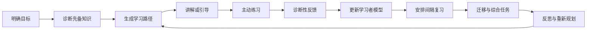
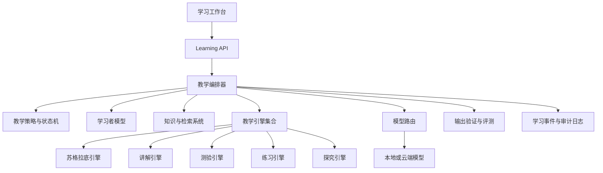
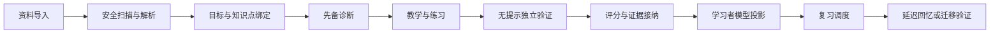
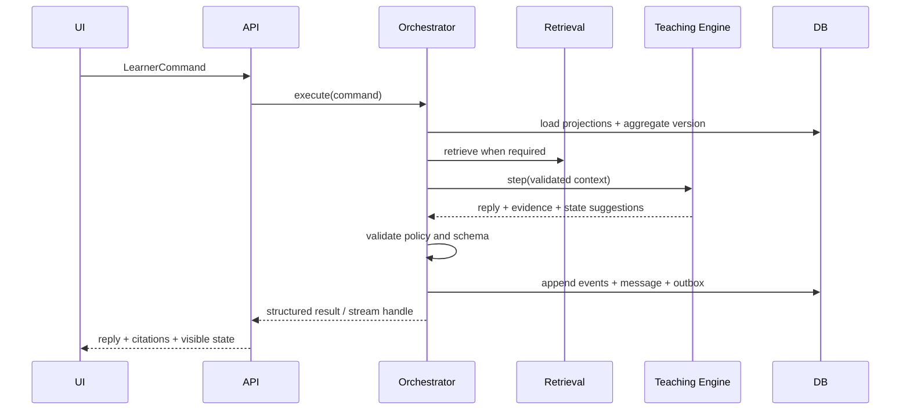

# Askora 个人 AI 辅助学习平台设计方案

> 文档性质：目标产品、技术设计与 v0.2 执行规格  
> 当前状态：执行基线；其中“目标态”不代表现有代码已经实现，实际差距见 [Askora v0.2 架构差距审查](../architecture/Askora-v0.2-架构差距审查.md)  
> 适用范围：私人自用、单用户优先的桌面与本地学习平台  
> 版本：v0.2  
> 日期：2026-08-06

### v0.2 变更摘要

- 将目标架构转化为可编码、可迁移、可验收的数据和模块契约；
- 定义首个“资料导入—学习—独立验证—掌握更新—复习”垂直切片；
- 增加 `LearningEvent`、`AssessmentAttempt`、`LearnerEvidence` 和持久化任务契约；
- 增加教育数据标准映射、AI 运行契约、安全、可访问性与发布门槛；
- 明确首期不建设复杂知识图谱、多 Agent、强化学习和跨设备同步。

## 1. 文档摘要

Askora 应被设计成一个“个人学习操作系统”，而不是一个更会回答问题的 AI 聊天工具。

系统的核心任务是持续回答以下问题：

1. 用户想学什么，目标和时间约束是什么？
2. 用户当前真正掌握了什么，判断依据是什么？
3. 用户为什么卡住，是知识断层、概念误解、方法错误，还是练习不足？
4. 此刻最适合采用讲解、提问、示例、练习、测验还是探究？
5. 用户应该在什么时候复习，才能形成长期记忆？
6. 用户是否已经能够在陌生情境中独立迁移和应用？

平台的最终目标不是增加用户与 AI 的互动时长，而是提高学习效率、长期保持率、迁移能力和独立学习能力。

一句话产品定义：

> Askora 根据学习目标、知识结构和真实表现，在诊断、讲解、引导、练习、验证、复习与反思之间动态编排，帮助用户逐步形成可保持、可迁移、可独立调用的知识和能力。

## 2. 设计原则

### 2.1 学习成果优先，而非对话体验优先

对话只是交互手段，不是产品目标。系统不以回复流畅度、聊天轮次或使用时长作为主要成功指标，而以延迟保持、独立完成和迁移表现作为核心指标。

### 2.2 AI 提供最小必要帮助

系统应优先保留用户的思考空间，但不能把“不直接给答案”绝对化。用户完全缺乏先备知识、连续受挫或明确选择直接讲解时，应提供高质量讲解和完整示例；用户已经具备部分理解时，再通过提问和逐步提示促进主动建构。

### 2.3 教学决策与内容生成分离

教学策略由可审计的策略引擎、学习者模型和状态机决定；LLM 负责语言表达、例子生成、开放题反馈等内容任务。LLM 不应独占教学决策权，也不应成为学习状态的唯一事实来源。

### 2.4 掌握必须由行为证据支持

“看懂了”“觉得熟悉”或“模型判断用户懂了”不能直接视为掌握。掌握度必须来自主动回忆、独立解题、延迟测验、变式练习和迁移任务等行为证据。

### 2.5 个人数据由用户控制

用户应能够查看、纠正、导出和删除系统保存的学习目标、学习记录、模型推断、文档和长期记忆。平台应明确哪些内容会发送给外部模型。

### 2.6 架构先进不等于复杂

首选边界清晰的模块化单体、统一状态和可替换模型；只在确有扩展、隔离或吞吐需求时拆分服务。多 Agent 不是默认目标，可靠的教学闭环才是。

## 3. 产品目标与非目标

### 3.1 产品目标

- 将模糊学习意图转化为明确目标和可执行路径；
- 诊断先备知识、概念误区和能力缺口；
- 根据学习状态动态选择教学策略；
- 将个人资料转化为可引用、可练习、可复习的知识系统；
- 通过主动提取、间隔复习和迁移任务形成长期掌握；
- 为每一个掌握判断保留可追踪证据；
- 在本地优先的前提下提供模型和设备扩展能力。

### 3.2 非目标

- 不以替代教师、教材或专业教育机构为目标；
- 不把通用聊天能力包装成完整教学能力；
- 不根据单次回答轻率宣布“已经掌握”；
- 不用大量游戏化奖励掩盖低质量学习；
- 不在没有证据的情况下生成伪精确的学习评分；
- 第一阶段不追求学校级多租户、班级管理和公开互联网运营。

## 4. 核心学习闭环



### 4.1 明确目标

系统将用户输入的自然语言目标转化为结构化目标：

- 目标主题；
- 期望能力层级；
- 截止时间；
- 每周可投入时间；
- 使用场景；
- 成功标准；
- 可用学习资料。

例如，“我想学 Python”应被进一步转化为“六周内能够独立完成一个读取 Excel、清洗数据并生成报告的 Python 项目”。

### 4.2 诊断先备知识

诊断不应只是固定选择题。系统可组合使用：

- 自我报告；
- 低压力预问题；
- 概念解释；
- 代表性任务；
- 错误原因追问；
- 已有学习记录；
- 用户作品或代码分析。

诊断结果需要包含知识缺口、误区、置信度和证据，而不只是一个总分。

### 4.3 生成学习路径

路径规划依据包括：

- 知识点前置依赖；
- 当前掌握度；
- 目标截止时间；
- 遗忘风险；
- 知识点的重要性；
- 用户可投入时间；
- 学习资料覆盖情况。

路径不是一次性计划。每次测验、练习和复习都可以触发重新规划。

### 4.4 教学、练习与验证

系统应在完整示例、渐次提示、独立练习和迁移任务之间逐步减少帮助。完成学习后不能立即结束，而应安排延迟测验和跨情境应用。

## 5. 多策略教学体系

Askora 不应只有一种教学方式，而应根据状态选择最合适的教学引擎。

| 学习状态 | 首选教学策略 | 目标 |
|---|---|---|
| 完全陌生或存在知识断层 | 直接讲解、具象示例、完整 worked example | 建立初始心智模型 |
| 已有部分理解 | 苏格拉底追问、概念澄清、反例 | 暴露并修正思维结构 |
| 会模仿但不能独立完成 | 示例褪去、半完成题、步骤排序 | 从模仿过渡到独立操作 |
| 基本理解 | 主动回忆、微型测验、变式题 | 稳固提取路径 |
| 重复犯错 | 错因诊断、针对性讲解、专项练习 | 修正稳定误区 |
| 已经掌握 | 间隔复习、混合练习、迁移挑战 | 防止遗忘并促进迁移 |
| 开放性任务 | 假设、证据、分析、结论式探究 | 培养研究和批判性思维 |
| 阶段结束 | 自我解释、学习总结、下一步计划 | 发展元认知和自我调节 |

### 5.1 苏格拉底引导

适用于用户已有一定知识、可以通过追问推进的场景。主要策略包括：

- 概念澄清；
- 问题拆解；
- 证据追问；
- 类比与反例；
- 错误分析；
- 自我解释；
- 元认知反思。

### 5.2 渐次提示

建议保留五级提示，但将其定义为可回退、可升级的支架：

1. 元认知提问；
2. 概念聚焦；
3. 策略方向；
4. 结构或步骤框架；
5. 定向提示或局部示范。

连续错误、主动求助、知识断层或明显挫败时升级提示；连续独立正确、解释清晰或掌握度较高时减少提示。提示使用量必须计入掌握判断。

### 5.3 直接讲解

直接讲解不是教学失败，而是一种受控策略。推荐采用：

1. 具象情境；
2. 类比桥梁；
3. 核心原理；
4. 完整案例；
5. 相似任务；
6. 用户独立复述或应用。

### 5.4 练习与测验

- 微验证：学习后立即检查基本理解；
- 主动提取：不展示资料的回忆；
- 变式练习：改变表面条件，验证结构理解；
- 错题回炉：围绕真实误区生成新题，而不是重复原题；
- 间隔复习：在预测遗忘前安排复习；
- 迁移任务：在陌生情境中调用知识。

### 5.5 探究学习

开放任务遵循以下阶段：

1. 明确问题；
2. 提出假设；
3. 设计验证方案；
4. 收集证据；
5. 分析和比较；
6. 形成结论；
7. 反思限制和替代解释。

## 6. 学习者模型

### 6.1 知识点状态

每个用户、每个知识点至少保存：

```yaml
learner_knowledge_state:
  user_id: string
  knowledge_point_id: string
  mastery_probability: 0.0-1.0
  confidence_interval: [0.0, 1.0]
  memory_strength: 0.0-1.0
  next_review_at: datetime
  independent_success_count: integer
  hinted_success_count: integer
  transfer_success_count: integer
  recent_misconceptions: []
  last_evidence_at: datetime
  model_version: string
```

展示给用户时，应优先使用“证据不足、正在形成、基本掌握、稳定掌握、能够迁移”等级，并允许查看底层证据，避免把概率值包装成确定事实。

### 6.2 学习事件

平台应采用不可变学习事件记录真实行为：

```text
GoalCreated
DiagnosticCompleted
ConceptViewed
ExplanationRequested
HintRequested
AttemptSubmitted
AnswerRevised
QuizCompleted
MisconceptionDetected
ReflectionWritten
TransferTaskCompleted
ReviewScheduled
ReviewCompleted
```

当前掌握状态由事件计算或投影得出。这样可以重新运行新版本模型、解释掌握判断，并修复错误推断。

### 6.3 模型选择

第一阶段推荐透明、易校准的组合：

- BKT 或简化概率更新：追踪知识点掌握；
- IRT 或难度校准：处理题目难度差异；
- 间隔重复模型：预测复习时机；
- 规则与误区分类：诊断错误类型；
- LLM：处理开放回答语义，但不直接覆盖结构化状态。

当积累了足够高质量学习数据，再评估 DKT 或其他序列模型。模型复杂度必须由实际预测提升证明。

## 7. 知识与内容系统

### 7.1 个人资料库

支持导入：

- PDF、DOCX、EPUB、Markdown 和纯文本；
- 网页及其快照；
- 视频或音频字幕；
- 用户笔记、代码和项目文件；
- 课程目录与题库。

系统必须保留来源、作者、章节、页码、时间戳、版本、处理状态和权限信息。

### 7.2 内容处理流程


### 7.3 知识图谱

核心节点包括：

- 知识点；
- 前置知识；
- 定义；
- 示例；
- 练习；
- 误区；
- 学习材料；
- 学习目标。

核心关系包括：

- `requires`：前置依赖；
- `explains`：资料解释知识点；
- `assesses`：题目评估知识点；
- `illustrates`：示例说明知识点；
- `confuses_with`：容易混淆；
- `transfers_to`：可迁移场景。

### 7.4 检索与引用

采用混合检索：

- 关键词检索；
- 向量检索；
- 元数据过滤；
- 知识图谱扩展；
- 重排序；
- 上下文预算控制。

回答需要区分：

- 来自用户资料的事实；
- 来自模型通用知识的内容；
- 基于现有证据的推断；
- 暂时无法确认的内容。

资料型回答应提供可点击到页码、章节或原文片段的引用。

## 8. 教学编排与 AI 架构



### 8.1 编排器职责

- 读取统一学习上下文；
- 选择或切换教学引擎；
- 执行引擎进入、退出和返回语义；
- 验证引擎提出的状态更新；
- 写入学习事件和共享状态；
- 记录每次教学决策及原因；
- 处理超时、失败和模型降级。

编排器是共享状态的唯一写入者。教学引擎只能返回回复、证据和状态变更建议。

### 8.2 教学策略引擎

输入包括：

- 当前学习阶段；
- 知识点和先备关系；
- 掌握度及置信度；
- 最近错误和提示历史；
- 用户明确选择的教学模式；
- 情绪或挫败信号；
- 时间预算；
- 上一引擎结果。

输出包括：

- 目标教学引擎；
- 教学策略；
- 提示级别；
- 期望证据；
- 退出条件；
- 决策理由。

第一阶段采用确定性规则和加权评分；策略成熟后可引入上下文 bandit 或强化学习，但必须保留安全边界、离线评测和回滚能力。

### 8.3 模型路由

根据任务选择模型，而不是所有任务都使用同一个大模型：

| 任务 | 推荐模型能力 |
|---|---|
| 意图识别、结构化抽取 | 小型、快速、低成本模型 |
| 资料摘要、问答和一般讲解 | 中等模型＋RAG |
| 复杂推理、开放题反馈 | 强推理模型 |
| Embedding | 专用向量模型 |
| 隐私敏感的简单任务 | 本地模型 |
| 确定性计算和代码运行 | 工具执行，不交给语言模型猜测 |

路由策略需要记录模型版本、延迟、成本、错误和回退路径。

### 8.4 输出验证

不同教学模式采用不同护栏，不能对所有输出强制使用同一规则：

- 苏格拉底模式：检查答案泄露和是否留下思考空间；
- 讲解模式：检查准确性、完整性和认知负荷；
- 测验模式：检查题目可解性、唯一性和答案一致性；
- 反馈模式：检查评分依据是否匹配 rubric；
- 资料问答：检查引用是否支持对应陈述；
- 高风险主题：增加来源、免责声明或拒答策略。

## 9. 评估系统

### 9.1 能力层级

平台至少区分：

1. 识别：看到内容能够辨认；
2. 回忆：没有提示能够说出；
3. 应用：能解决相似任务；
4. 迁移：能在陌生情境中选择并组合知识；
5. 教学：能清晰解释、处理反例并回答追问。

### 9.2 评分可信性

- 确定性任务优先程序判分；
- 选择题检查是否存在多个合理答案；
- 数学题验证单位、步骤和等价表达；
- 代码题在隔离环境运行测试；
- 开放题使用结构化 rubric；
- 生成题和审题应由不同步骤完成；
- 高影响评分使用第二模型或规则复核；
- 题目、rubric、模型和 Prompt 均需要版本化。

### 9.3 防止虚假掌握

- 提示后答对与独立答对分开统计；
- 即时答对不等于长期掌握；
- 重复原题不等于迁移；
- 自信程度不等于真实能力；
- 至少结合延迟回忆和变式任务再判断稳定掌握。

## 10. 产品体验设计

### 10.1 今日学习

首页不是空白聊天框，而是提供：

- 今日新学任务；
- 到期复习；
- 薄弱知识点；
- 当前目标进度；
- 预计所需时间；
- 推荐每项任务的原因。

### 10.2 学习工作台

统一呈现：

- AI 对话；
- 当前资料与引用；
- 草稿或笔记；
- 练习题；
- 公式、图表或代码执行；
- 当前教学模式；
- 学习进度和退出条件。

用户可以随时选择：

- 引导我思考；
- 直接讲解；
- 给一个例子；
- 只给一点提示；
- 测试我；
- 挑战我；
- 总结并安排复习。

### 10.3 知识地图

展示知识点、依赖、学习证据和当前状态。用户可进入任一节点查看：

- 为什么系统认为我已掌握或未掌握；
- 最近的成功与错误；
- 相关资料；
- 下一项练习；
- 预计复习时间。

### 10.4 学习档案

学习档案回答：

- 我已经学会了什么？
- 判断依据是什么？
- 我经常犯什么错误？
- 哪些能力正在退化？
- 我的学习策略有什么变化？
- 下一阶段最重要的目标是什么？

## 11. 数据与基础设施

### 11.1 推荐架构

初期采用模块化单体：

- 前端：React/Vite/Electron；
- API：FastAPI；
- 主数据库：桌面版 SQLite，服务版 PostgreSQL；
- 缓存与短期状态：Redis，可降级；
- 文档存储：本地文件系统，未来兼容对象存储；
- 检索：关键词＋向量索引；
- 后台任务：桌面版 SQLite 持久化任务表或 Outbox，服务版独立 Worker；
- 可观测性：结构化日志、指标、调用追踪和评测记录。

### 11.2 核心数据域

- Identity：用户与设备；
- Goals：目标、计划和时间预算；
- Content：资料、章节、分块和引用；
- Knowledge：知识点、关系和误区；
- Learning：会话、事件、尝试和反思；
- Assessment：题目、rubric、答案和评分；
- Mastery：知识状态、遗忘和复习计划；
- AI Operations：模型调用、Prompt、检索上下文和验证结果。

### 11.3 状态边界

必须区分：

- 对话历史：用于保持当前交流连续性；
- 学习事件：用户实际做过什么；
- 学习者模型：由证据推导的状态；
- 长期偏好：表达风格、节奏和工具偏好；
- 知识内容：客观资料和来源。

不能把这五类状态全部压入一段对话记忆。

## 12. 隐私、安全与可信性

### 12.1 数据控制

- 默认本地优先；
- 文档、学习记录和密钥分离存储；
- 静态数据和备份加密；
- 用户可查看、导出和删除全部长期记忆；
- 外部模型调用前显示或配置数据边界；
- 默认不允许模型供应商将内容用于训练。

### 12.2 AI 安全

- 防御上传资料中的 Prompt Injection；
- 工具调用采用白名单和最小权限；
- 不允许模型自行修改掌握度或关键记录；
- 高风险输出显示来源和不确定性；
- 保存模型版本、Prompt 版本、检索证据和验证结果；
- 建立模型降级和供应商故障回退；
- 对数据泄漏、越权访问和错误引用进行自动化测试。

### 12.3 人本原则

AI 应增强用户的判断和行动能力，而不是用不透明评分控制学习。系统需要明确其局限，并允许用户覆盖学习路径、教学模式和记忆推断。

## 13. 质量评测体系

### 13.1 离线评测集

按学科和教学任务建设固定评测集：

- 意图识别准确率；
- 错误类型识别；
- 策略选择合理性；
- 提示是否泄露答案；
- 讲解事实准确性；
- 引用支持率；
- 题目可解性；
- 评分一致性；
- 迁移任务质量；
- 隐私与 Prompt Injection 防御。

### 13.2 在线产品指标

北极星指标：

> 每小时学习投入带来的延迟保持率与陌生任务迁移成功率。

辅助指标：

- 7、30、90 天延迟保持率；
- 无提示独立完成率；
- 提示依赖下降速度；
- 首次学习到稳定掌握的时间；
- 相同误区的复发率；
- 学习计划完成率；
- 掌握预测校准误差；
- 引用正确率；
- AI 事实错误率；
- 用户对长期记忆的纠正和删除成功率。

### 13.3 发布门槛

每个教学引擎、模型或 Prompt 变更都必须：

1. 通过离线评测；
2. 不降低关键安全指标；
3. 记录版本和变更原因；
4. 支持快速回滚；
5. 在小范围真实学习会话中验证。

## 14. Askora 实施路线图

### 阶段一：统一核心教学主链路

目标：消除当前双教学路径和双状态模型。

- 让 Orchestrator 成为唯一教学入口；
- 合并现有 `SocraticEngine` 与 `SocraticAdapter` 的状态和策略；
- 定义统一 `LearningEvent`；
- 由编排器独占共享学习状态写权限；
- 为教学引擎建立明确的进入、退出、切换和返回契约；
- 接通真实模型、失败降级和端到端测试。

验收标准：一次学习会话中的引擎切换、提示、测验和掌握更新均可从事件日志完整重放。

### 阶段二：接通知识与评估闭环

- 将 RAG 检索结果自动注入教学上下文；
- 返回可定位到原文的引用；
- 建立知识点与资料片段映射；
- Quiz 和 Drill 结果更新统一学习者模型；
- 区分独立答对、提示后答对和查看答案后答对；
- 建立误区记录和证据化掌握页面。

验收标准：上传一份资料后，用户可以完成“学习—练习—评分—掌握更新—引用回看”的完整闭环。

### 阶段三：形成个人学习系统

- 目标管理；
- 诊断测验；
- 知识图谱与先备关系；
- 今日学习计划；
- 间隔复习队列；
- 错题与误区档案；
- 动态路径重规划；
- 7/30/90 天延迟测验。

验收标准：系统能够根据目标、掌握状态和时间预算自动生成并动态调整一周学习计划。

### 阶段四：提高教学质量

- worked example 与脚手架褪去；
- 多模态资料和手写草稿理解；
- 开放题 rubric 评分；
- 跨知识点迁移任务；
- 教学策略离线评测；
- 教学决策解释；
- 小范围策略实验。

验收标准：系统不仅能提高即时正确率，还能在延迟测验和陌生任务上证明效果。

### 阶段五：生态与跨设备扩展

- 多设备加密同步；
- LMS、日历和笔记工具连接；
- 可移植学习记录；
- 教学策略插件；
- LTI 1.3/LTI Advantage 等标准化教育系统集成。

该阶段仅在个人学习闭环成熟后推进。

## 15. 近期优先级

建议接下来优先完成以下五项工作：

1. 定义可版本化的 `LearningEvent`、`AssessmentAttempt` 与 `LearnerEvidence` Schema，并完成标准映射；
2. 让 Orchestrator 取代默认直连苏格拉底引擎，包括流式路径；
3. 接通 RAG、引用、Quiz、掌握证据和复习调度，形成首个垂直闭环；
4. 建立持久化任务、故障恢复、事件重放和数据迁移机制；
5. 建立端到端教学质量、安全、可访问性和恢复性评测集。

在以上能力完成之前，不建议继续增加更多教学引擎或复杂 Agent。

## 16. 主要风险

| 风险 | 表现 | 应对策略 |
|---|---|---|
| 伪个性化 | 只改变语气，不改变教学决策 | 个性化必须基于学习证据和知识状态 |
| 虚假掌握 | 学完立即答对便标记掌握 | 使用延迟回忆、变式和迁移证据 |
| 过度苏格拉底化 | 用户缺乏知识仍被连续追问 | 根据知识断层切换讲解和完整示例 |
| LLM 自评偏差 | 同一模型出题、作答和评分 | 程序判分、rubric、独立审查和复核 |
| 状态分裂 | 多引擎维护不同掌握状态 | 编排器独占共享状态写权限 |
| RAG 幻觉 | 引用存在但不支持结论 | 逐陈述引用验证和证据覆盖评测 |
| 复杂度失控 | 过早拆微服务或增加 Agent | 模块化单体优先，以指标驱动扩展 |
| 隐私泄漏 | 学习资料或画像发送给外部服务 | 本地优先、最小化传输、明确授权 |
| 指标错位 | 追求时长、连续签到或聊天轮次 | 以保持率、迁移和独立性为核心 |

## 17. 外部设计依据

- [Organizing Instruction and Study to Improve Student Learning](https://ies.ed.gov/ncee/wwc/PracticeGuide/1)：间隔学习、主动提取、测验、worked examples 与深层解释性问题。
- [Metacognition and Self-Regulated Learning](https://educationendowmentfoundation.org.uk/education-evidence/guidance-reports/metacognition%20)：计划、监控、评价与脚手架式元认知教学。
- [UNESCO Guidance for Generative AI in Education and Research](https://www.unesco.org/en/articles/guidance-generative-ai-education-and-research)：以人为中心、隐私保护、年龄适配及教学与伦理验证。
- [NIST AI Risk Management Framework](https://www.nist.gov/itl/ai-risk-management-framework)：以 Govern、Map、Measure、Manage 管理 AI 全生命周期风险。
- [NIST AI 600-1 Generative AI Profile](https://www.nist.gov/publications/artificial-intelligence-risk-management-framework-generative-artificial-intelligence)：生成式 AI 风险、测量与治理要求。
- [1EdTech LTI Advantage Implementation Guide](https://standards.1edtech.org/lti/guides/implementation_guide/implementation-guide)：未来连接 LMS、内容与成绩系统时的标准化集成依据。
- [1EdTech QTI 3](https://www.1edtech.org/standards/qti/index)：题目、测试、评分和结果的可移植数据模型。
- [1EdTech CASE 1.1](https://standards.1edtech.org/case/)：能力、知识点、标准、rubric 与关联关系的数据模型。
- [1EdTech Caliper Analytics 1.2](https://www.1edtech.org/standards/caliper)：学习活动事件的语义与交换参考。
- [CAST UDL Guidelines 3.0](https://udlguidelines.cast.org/)：多种参与、呈现、行动和表达方式的包容性学习设计。
- [WCAG 2.2](https://www.w3.org/TR/WCAG22/)：桌面 Web 界面的可访问性验收基础。
- [OWASP AISVS](https://owasp.org/www-project-artificial-intelligence-security-verification-standard-aisvs-docs/)：AI 系统安全控制的可测试要求。

## 18. 结论

先进且成熟的个人 AI 学习平台，不应以“什么都能回答”为终点，而应具备四项核心能力：

1. 理解用户的目标与真实知识状态；
2. 在合适时机选择合适的教学策略；
3. 用可验证证据形成长期学习闭环；
4. 随着用户能力提高，逐步减少用户对 AI 的依赖。

Askora 已经具备苏格拉底引导、多教学引擎、知识追踪和文档检索的代码基础。下一步的关键不是横向增加功能，而是统一教学状态、接通知识与评估、建立长期复习和真实效果评测，从而把“AI 对话应用”收敛为“可验证的个人学习系统”。

## 19. v0.2 执行基线

本章及后续章节把前述目标设计转化为实现契约。若与前文的概念性示例冲突，以 v0.2 执行基线为准。任何代码实现只有同时满足数据契约、状态边界和验收测试，才能标记为完成。

### 19.1 首个垂直切片

首期只交付一个完整闭环：

> 用户导入一份 PDF 或 Markdown 资料，定义一个可测量学习目标，完成先备诊断，学习一个知识点，在不查看答案和资料的条件下独立作答，得到可追溯评分，形成掌握证据，安排下一次复习，并能从教学回复返回原文位置。

垂直切片必须经过以下状态：



首期默认约束：

- 单用户、单设备、本地优先；
- 默认学习者画像必须由产品配置明确指定，不能从缺失数据猜测年龄；
- 先支持一个可确定性判分的学科场景；
- 一次学习单元只追踪一个主知识点，可附带多个前置知识点；
- 真实端到端验收至少调用一次已配置的真实模型，Mock 结果不得计为模型可用；
- 对事实记忆、程序技能和迁移能力采用不同证据，不将所有任务卡片化。

### 19.2 首期完成定义

以下条件全部满足才算首个垂直切片完成：

1. 所有共享学习状态变更均由事件和证据推导，不能从聊天文本直接写入；
2. 提示后答对、查看答案后答对与独立答对能够被稳定区分；
3. 任一掌握判断可以追溯到题目、答题、评分、提示和模型版本；
4. 应用重启后文档处理、评估和复习任务可恢复；
5. 同一事件日志在同一投影版本下重放得到相同状态；
6. 引用可定位到原文件、文档版本、页码或章节和具体片段；
7. 上传资料中的指令不能覆盖系统策略或触发未授权工具；
8. 普通请求与流式请求必须经过同一教学编排主链路；
9. 模型超时、结构化输出失败和供应商故障有明确降级结果；
10. 端到端、数据迁移、安全和恢复测试全部通过。

### 19.3 首期明确非目标

- 不建设微服务；
- 不默认引入多 Agent；
- 不训练 DKT、AKT 或强化学习策略；
- 不建设通用大型知识图谱；
- 不进行公开互联网、多租户和学校级部署；
- 不把跨设备同步放入首个教学闭环；
- 不以游戏化、连续签到和互动时长作为首期优化目标。

## 20. 学习事件契约

### 20.1 命令、事件与投影

必须区分三类对象：

- 命令：用户或系统希望发生什么，例如 `SubmitResponse`；
- 事件：已经发生且被接纳的事实，例如 `ResponseSubmitted`；
- 投影：由事件计算得到的可查询状态，例如当前掌握状态。

事件使用过去时命名，不允许修改。错误事件通过追加纠正事件处理，不能原地覆盖。对话消息可以作为学习事件的关联证据，但不能替代学习事件。

### 20.2 `LearningEventEnvelope v1`

所有学习事件采用统一信封：

```yaml
learning_event:
  event_id: uuid
  event_type: ResponseSubmitted
  schema_version: "1.0"

  aggregate_type: learning_session
  aggregate_id: uuid
  aggregate_version: 12
  sequence: 12

  occurred_at: datetime
  recorded_at: datetime
  idempotency_key: string
  correlation_id: uuid
  causation_id: uuid|null

  actor:
    actor_type: learner|system|model|reviewer
    actor_id: pseudonym|string
    device_id: string|null

  context:
    user_id: uuid
    session_id: uuid
    goal_id: uuid|null
    knowledge_point_ids: [uuid]
    assessment_attempt_id: uuid|null
    content_revision_ids: [uuid]

  payload: {}

  provenance:
    source: ui|api|orchestrator|worker|migration
    model_provider: string|null
    model_name: string|null
    model_snapshot: string|null
    prompt_id: string|null
    prompt_version: string|null
    policy_version: string
    projection_version: string

  trace:
    trace_id: string
    span_id: string|null

  privacy:
    classification: public|personal|sensitive
    external_processing: boolean
    retention_class: core_learning|diagnostic|temporary
```

约束：

- `event_id` 全局唯一；
- 同一聚合内 `aggregate_version` 唯一且单调递增；
- `idempotency_key` 在命令定义的幂等范围内唯一；
- `occurred_at` 表示行为时间，`recorded_at` 表示系统接纳时间；
- `correlation_id` 串联一次教学轮次，`causation_id` 指向直接原因；
- PII 不进入事件正文，事件仅保存假名化标识；
- 模型、Prompt、策略、投影版本缺失时，不得据此产生关键掌握更新。

### 20.3 v1 必须支持的事件

| 事件 | 事实语义 | 关键载荷 |
|---|---|---|
| `GoalCreated` | 创建了可测量学习目标 | 成功标准、截止时间、时间预算 |
| `DiagnosticStarted` | 开始先备诊断 | 诊断蓝图、知识点范围 |
| `ContentRetrieved` | 为教学检索了资料 | 查询、命中文块、排序和引用 |
| `ExplanationPresented` | 用户看到了讲解 | 策略、内容版本、引用 |
| `HintRequested` | 用户主动请求提示 | 请求时机、上一尝试、期望提示级别 |
| `HintPresented` | 系统展示了提示 | 提示等级、是否包含局部答案 |
| `AssessmentAttemptStarted` | 开始一次评估 | 评估类型、蓝图、题目版本 |
| `ResponseSubmitted` | 提交一次回答 | 原始回答、耗时、当时帮助状态 |
| `ResponseRevised` | 修改已提交回答 | 前后版本及修订原因 |
| `AttemptScored` | 一次回答完成评分 | 评分器、rubric、分数、理由、置信度 |
| `EvidenceAccepted` | 评分被接纳为学习证据 | 能力维度、权重、独立性、有效期 |
| `EvidenceRejected` | 评分不能用于掌握判断 | 拒绝理由，例如答案已泄露 |
| `MasteryProjectionUpdated` | 投影版本更新完成 | 前后状态、算法和参数版本 |
| `MisconceptionDetected` | 发现可证实误区 | 误区编码、证据列表、置信度 |
| `ReviewScheduled` | 建立复习任务 | 到期时间、目标保持率、调度器版本 |
| `ReviewCompleted` | 完成一次复习 | 提取表现、响应时延、帮助信息 |
| `TransferAttemptCompleted` | 完成陌生情境迁移 | 任务、评分、与训练题相似度 |
| `ReflectionRecorded` | 用户完成学习反思 | 计划、监控、评价和下一步 |
| `PolicyDecisionMade` | 策略引擎完成教学决策 | 输入摘要、候选、选择和理由 |
| `EngineTransitioned` | 教学引擎发生切换 | 起止引擎、原因、退出条件 |

### 20.4 幂等、并发与演进

- 数据库对 `(aggregate_id, aggregate_version)` 建立唯一约束；
- 同一用户动作重复提交时返回原结果，不产生第二份证据；
- 写入事件和持久化任务 Outbox 必须位于同一数据库事务；
- 事件消费者至少一次执行，因此所有投影器必须幂等；
- Schema 只允许向后兼容新增字段；破坏性变更需要新主版本和 upcaster；
- 重放时固定投影算法版本，不调用在线 LLM；
- 事件删除只用于依法删除或用户明确删除，删除后追加可审计墓碑并重建投影。

### 20.5 Caliper 兼容映射

内部事件是 Askora 的事实源，Caliper 是交换视图。首期不要求实现完整 Sensor API，但至少保留以下映射：

| Askora | Caliper 参考 |
|---|---|
| `actor` | `actor` |
| `event_type` | `action` 与 Metric Profile |
| `object` 或题目 | `object` |
| `occurred_at` | `eventTime` |
| `session_id` | `edApp`、`membership` 或扩展会话字段 |
| 评分结果 | Assessment/Grading Profile |
| 提示、反馈 | Feedback Profile 或 Askora 扩展 |

## 21. 评估与证据契约

### 21.1 `AssessmentItem v1`

```yaml
assessment_item:
  item_id: uuid
  item_version: "1.0"
  status: draft|reviewed|active|retired
  item_type: multiple_choice|numeric|short_answer|code|open_response
  stem: string
  options: []

  claims:
    - knowledge_point_id: uuid
      weight: 1.0
      cognitive_process: recall|apply|transfer|explain

  difficulty:
    source: expert|calibrated|generated
    value: 0.0-1.0
    uncertainty: 0.0-1.0

  scoring:
    method: exact|equivalence|tests|rubric|model_assisted
    answer_key: {}
    rubric_id: uuid|null
    rubric_version: string|null
    max_score: 1.0

  provenance:
    source_content_revision_ids: [uuid]
    author_type: human|model|imported
    generator_model: string|null
    generator_prompt_version: string|null
    reviewer: string|null
    reviewed_at: datetime|null

  exposure:
    exposure_count: integer
    last_exposed_at: datetime|null
    alternate_form_group: string|null
```

要求：

- 每道题至少关联一个可测量知识声明；
- 迁移题必须标记训练题相似度和变化维度；
- 模型生成题默认是 `draft`，通过可解性、答案一致性和内容安全检查后才能激活；
- 生成题与审题不得由完全相同的模型调用和 Prompt 完成；
- 题目、答案、rubric 和来源均需版本化；
- 评估结果保存时必须引用准确的题目版本。

### 21.2 `AssessmentAttempt v1`

```yaml
assessment_attempt:
  attempt_id: uuid
  user_id: uuid
  session_id: uuid
  item_id: uuid
  item_version: "1.0"
  assessment_type: diagnostic|formative|summative|review|transfer

  started_at: datetime
  first_response_at: datetime|null
  submitted_at: datetime
  response_time_ms: integer
  raw_response: {}
  normalized_response: {}
  revision_count: integer

  assistance:
    class: none|metacognitive|conceptual|strategic|structural|partial_solution|full_solution|answer_exposed
    max_hint_level: 0-5
    hint_event_ids: [uuid]
    source_visible: boolean
    answer_visible: boolean

  scoring:
    method: exact|equivalence|tests|rubric|model_assisted
    score: 0.0-1.0
    passed: boolean
    rationale: string
    rubric_scores: {}
    confidence: 0.0-1.0
    grader_version: string
    reviewer_result: accepted|rejected|needs_review

  validity:
    evidence_eligible: boolean
    rejection_reasons: []
    duplicate_or_exposed: boolean
```

### 21.3 证据资格规则

| 条件 | 可用于即时理解 | 可用于稳定掌握 | 可用于迁移 |
|---|---:|---:|---:|
| 独立答对、资料不可见 | 是 | 延迟后可用 | 仅迁移题可用 |
| 元认知或概念提示后答对 | 是 | 低权重 | 否 |
| 结构提示或局部示范后答对 | 是 | 否 | 否 |
| 查看完整答案后复述 | 仅作学习行为 | 否 | 否 |
| 重复原题答对 | 是 | 低权重 | 否 |
| 延迟平行题独立答对 | 是 | 是 | 视任务类型 |
| 陌生情境独立完成 | 是 | 是 | 是 |

以下情况必须产生 `EvidenceRejected`：

- 答案已经显示；
- 题目无唯一或可审计评分依据；
- 评分器失败或置信度低于该题型门槛；
- 题目版本与答案版本不一致；
- 发生重复提交、数据损坏或无法确认帮助状态；
- 模型直接建议掌握更新，但没有真实答题证据。

### 21.4 QTI 映射

- `AssessmentItem` 对应 QTI Item；
- 题组和测验蓝图对应 QTI Assessment Test/Section；
- `responseProcessing` 对应确定性评分规则；
- `AssessmentAttempt` 和评分对应 QTI Results Reporting；
- Askora 的帮助等级、证据资格与投影版本作为扩展字段保留。

## 22. 学习者证据与掌握投影

### 22.1 `LearnerEvidence v1`

```yaml
learner_evidence:
  evidence_id: uuid
  user_id: uuid
  knowledge_point_id: uuid
  attempt_id: uuid
  accepted_at: datetime

  dimension: recall|routine_application|transfer|explanation
  outcome: success|partial|failure
  score: 0.0-1.0
  confidence: 0.0-1.0
  independence: independent|assisted|answer_exposed
  delay_seconds: integer
  novelty: repeated|near_variant|far_variant
  evidence_weight: 0.0-1.0

  item_difficulty: 0.0-1.0
  item_difficulty_uncertainty: 0.0-1.0
  source_event_ids: [uuid]
  expires_or_decays_at: datetime|null
  model_version: string
```

### 22.2 `LearnerKnowledgeProjection v1`

```yaml
learner_knowledge_projection:
  user_id: uuid
  knowledge_point_id: uuid
  projection_version: string
  aggregate_version: integer

  dimensions:
    recall:
      estimate: 0.0-1.0
      confidence: 0.0-1.0
      evidence_count: integer
    routine_application:
      estimate: 0.0-1.0
      confidence: 0.0-1.0
      evidence_count: integer
    transfer:
      estimate: 0.0-1.0
      confidence: 0.0-1.0
      evidence_count: integer
    explanation:
      estimate: 0.0-1.0
      confidence: 0.0-1.0
      evidence_count: integer

  assistance_dependence: 0.0-1.0
  memory:
    difficulty: 0.0-1.0
    stability_days: float
    retrievability: 0.0-1.0
    desired_retention: 0.0-1.0
    next_review_at: datetime|null
    scheduler_version: string|null

  active_misconceptions: []
  last_evidence_at: datetime|null
  status: insufficient_evidence|forming|basic|stable|transferable
```

禁止用一个 `mastery_probability` 覆盖所有能力层级。产品可以展示一个简化状态，但简化状态必须由上述维度按版本化规则计算，并允许展开查看证据。

### 22.3 首期算法路线

1. 证据接纳先使用确定性规则；
2. 回忆与近迁移使用透明概率更新或 BKT 基线；
3. 题目难度首期使用专家先验，积累足够跨题数据后再评估 IRT；
4. 记忆调度使用 FSRS 类难度、稳定性和可提取性模型；
5. 程序技能和迁移任务不直接套用记忆卡片调度；
6. DKT、AKT 或其他序列模型必须与透明基线进行时间切分测试、校准比较和消融实验；
7. 单用户数据不足时不启动上下文 bandit 或强化学习策略。

### 22.4 知识组件治理

- 每个知识点必须具有稳定标识、版本、定义、边界、前置关系和反例；
- 多知识点题目使用权重而不是简单复制一份成绩到所有知识点；
- 误区必须有可观察表现和反证条件；
- 知识点拆分、合并或更名时保留映射和迁移规则；
- 题目难度、区分度、正确率和提示依赖应定期审查；
- 首期知识图谱可以由关系表实现，只有指标证明需要时才引入专用图库。

## 23. 教学编排契约 v2

### 23.1 唯一主链路

所有普通、流式、测验、练习和资料问答请求必须进入同一个 Orchestrator。旧引擎只能通过 Adapter 接入，不允许接口层根据环境变量绕过编排器。



### 23.2 Orchestrator 输入

```yaml
orchestrator_command:
  command_id: uuid
  command_type: ProcessLearnerTurn|SubmitAssessmentResponse|RequestHint|ChangeTeachingMode
  idempotency_key: string
  expected_aggregate_version: integer|null
  user_id: uuid
  session_id: uuid
  occurred_at: datetime
  payload: {}
  client_context:
    mode_selected_by_user: string|null
    source_visibility: boolean
    device_id: string
```

### 23.3 教学引擎输出

教学引擎输出必须通过严格 Schema 校验：

```yaml
engine_step_result:
  contract_version: "2.0"
  reply:
    text: string
    mode: explain|socratic|quiz|drill|inquiry
    citations: []
  evidence_proposals: []
  event_proposals: []
  state_change_proposals: []
  transition:
    type: stay|switch_to|switch_and_return|end_flow
    target_engine: string|null
    reason_code: string
    exit_condition_status: met|not_met|unknown
  usage:
    model_provider: string|null
    model_name: string|null
    model_snapshot: string|null
    prompt_version: string|null
    input_tokens: integer
    output_tokens: integer
    generation_ms: integer
  validation:
    schema_valid: boolean
    safety_checks: []
    unresolved_uncertainties: []
```

引擎不得：

- 直接写数据库、Redis 或共享状态；
- 自行宣布稳定掌握；
- 在没有 `AssessmentAttempt` 的情况下产生可接纳证据；
- 绕过引用、安全或工具授权策略；
- 将自由文本解析结果直接作为关键状态更新。

### 23.4 事务与并发

- LLM 和检索调用不得长时间持有数据库事务；
- 持久化时使用 `expected_aggregate_version` 做乐观并发检查；
- 消息、事件和 Outbox 在一个事务内提交；
- 冲突时重新加载状态并重新执行确定性策略，不能重复计入答题；
- Orchestrator 是逻辑唯一写入边界，不要求所有请求由同一个进程处理；
- 会话创建、加载和恢复通过公开 Repository 接口，业务层不能读取 Orchestrator 私有内存字段。

### 23.5 流式语义

- 流式内容仍由 Orchestrator 生成和审核；
- 中间 Token 不是学习事件，也不直接持久化掌握状态；
- 正常完成后追加 `AssistantReplyCompleted`；
- 用户取消时追加 `AssistantReplyCancelled`，并明确未完成内容是否可作为已展示教学材料；
- 输出护栏在流式过程中发现高风险内容时必须能够停止发送；
- 普通与流式路径共享策略选择、RAG、提示和状态更新逻辑。

## 24. RAG、来源与引用契约

### 24.1 文档修订

每次导入生成不可变 `ContentRevision`：

```yaml
content_revision:
  document_id: uuid
  revision_id: uuid
  content_sha256: string
  original_filename: string
  media_type: string
  source_uri: string|null
  imported_at: datetime
  parser_name: string
  parser_version: string
  chunker_version: string
  embedding_model: string|null
  embedding_dimension: integer|null
  index_version: string
  status: pending|processing|ready|failed|quarantined
```

文件内容、解析器或分块规则变化时必须创建新修订，不能静默覆盖旧分块。

### 24.2 文块与定位

```yaml
content_chunk:
  chunk_id: uuid
  revision_id: uuid
  chunk_index: integer
  text: string
  token_count: integer
  locator:
    page_start: integer|null
    page_end: integer|null
    section_path: [string]
    paragraph_start: integer|null
    char_start: integer|null
    char_end: integer|null
    timestamp_start: float|null
    timestamp_end: float|null
  content_type: paragraph|table|formula|caption|code|transcript
  embedding_version: string|null
  trust_level: user_content|reviewed_content|system_content
```

### 24.3 检索结果

检索结果必须包含：

- 查询及查询改写版本；
- 关键词、向量、元数据和图扩展各阶段候选；
- 重排序器和版本；
- 最终分数与被选择原因；
- 上下文预算和截断信息；
- 文档修订、文块和定位器；
- 检索 Trace ID。

### 24.4 引用规则

- 回答中的资料事实应尽可能逐陈述绑定引用；
- 引用必须支持对应陈述，不能只与主题相关；
- 引用定位器必须能在 UI 打开原文；
- 模型通用知识与用户资料明确区分；
- 无证据时明确表达不确定性，不生成伪引用；
- 引用验证失败时不得进入高影响评分或掌握证据。

### 24.5 Prompt Injection 信任边界

所有上传资料、网页、OCR、字幕和检索片段都属于不可信数据：

- 文档中的命令不得成为系统或开发者指令；
- RAG 上下文使用明确的数据边界和来源标记；
- 检索内容不能直接决定工具调用；
- 工具调用由白名单、参数 Schema、能力令牌和用户授权控制；
- 安全扫描不能只依赖关键词，应包含间接注入评测集；
- 任何被污染的文档修订可被隔离并从索引撤销。

## 25. 持久化任务与恢复契约

### 25.1 桌面版任务表

桌面版任务以 SQLite 为事实源：

```yaml
durable_job:
  job_id: uuid
  job_type: document_process|embed|reindex|assessment_review|projection_rebuild|review_notify
  status: pending|leased|running|succeeded|failed|cancelled|dead_letter
  payload: {}
  payload_schema_version: string
  idempotency_key: string
  attempts: integer
  max_attempts: integer
  available_at: datetime
  lease_owner: string|null
  lease_expires_at: datetime|null
  timeout_seconds: integer
  result: {}|null
  last_error_code: string|null
  last_error_message: string|null
  created_at: datetime
  updated_at: datetime
```

### 25.2 执行规则

- 任务与触发任务的领域事件在同一事务中写入；
- Worker 使用 lease 抢占，进程崩溃后过期任务可重新执行；
- Handler 必须幂等；
- 重试采用有上限的指数退避和抖动；
- 超过最大次数进入死信状态，由用户可见；
- 应用关闭前可等待任务，但不得依赖优雅关闭保证可靠性；
- Redis 可以加速服务版队列，但不能成为唯一学习事实源；
- 文档处理成功必须保存解析器、分块器和索引版本。

### 25.3 备份与迁移

- SQLite 启用外键并评估 WAL 模式；
- 所有 Schema 变更通过 Alembic；
- 升级前创建可验证备份，升级失败支持恢复；
- 备份包含数据库、文档和必要索引元数据，不包含明文密钥；
- 每个发布版本至少执行一次“旧版本数据升级—启动—回滚”测试；
- 用户删除操作同步删除文件、索引、投影和可识别事件，保留最小审计墓碑。

## 26. AI 运行契约

### 26.1 模型能力注册表

模型路由不能只按供应商或学科选择，应维护能力与风险：

```yaml
model_capability:
  provider: string
  model: string
  snapshot: string
  supports_streaming: boolean
  supports_json_schema: boolean
  supports_tool_calling: boolean
  supports_vision: boolean
  context_window: integer
  data_region: string|null
  retention_policy: string
  allows_zero_data_retention: boolean
  approved_privacy_classes: []
  latency_slo_ms: integer
  cost_class: low|medium|high
  eval_suite_version: string
  eval_status: approved|restricted|blocked
```

### 26.2 结构化输出

- 教学决策、题目生成、rubric 评分和状态建议必须使用严格 Schema；
- 供应商不支持原生 Schema 时，仍需 Pydantic 验证、有限重试和失败降级；
- 结构化失败不能回退为“从任意文本猜字段”；
- 关键枚举使用封闭集合；
- 拒答、截断、超时和内容安全拒绝具有独立状态；
- Prompt 中的 Schema 与代码模型使用同一来源生成，避免漂移。

### 26.3 Prompt 与策略注册表

每次调用至少记录：

- Prompt ID、版本和内容哈希；
- 教学策略和退出条件；
- 模型快照、采样参数和工具版本；
- 检索上下文 ID；
- 输出验证结果；
- 关联评测套件；
- 上线、回滚和停用状态。

### 26.4 可观测性

- 使用统一 Trace 关联 API、Orchestrator、检索、模型、工具、数据库和事件；
- 追踪字段尽可能遵循 OpenTelemetry GenAI 语义约定；
- 默认不在日志或 Trace 保存完整私人资料和模型输入输出；
- 调试时采集敏感内容必须显式开启、限时并可删除；
- 指标至少包含延迟、TTFT、Token、成本、超时、重试、Schema 失败、引用失败和降级率；
- AI 运行 Trace 与学习事件相互关联但分开存储，不能把调试日志当学习事实源。

### 26.5 外部工具与 MCP

日历、笔记、代码执行和 LMS 等外部工具未来可通过 MCP 或专用连接器接入，但必须：

- 显式显示数据访问和操作范围；
- 工具描述视为不可信元数据；
- 每个工具使用最小能力和参数 Schema；
- 写操作获得用户授权并记录审计事件；
- MCP 不承担内部学习事件、掌握状态或数据库事务协议。

## 27. 隐私、安全与可访问性执行要求

### 27.1 安全基线

安全验收至少覆盖：

- Web/API：OWASP ASVS；
- Electron/桌面客户端：OWASP TCASVS 的适用控制；
- AI：OWASP AISVS 与 LLM/GenAI 威胁清单；
- 风险治理：NIST AI RMF 与 AI 600-1；
- 供应链：锁定依赖、漏洞扫描、SBOM 和发布制品签名。

### 27.2 数据生命周期

每类数据定义收集目的、保存位置、外部传输、保留时间、导出格式和删除方法。至少区分：

- 原始学习资料；
- 对话消息；
- 真实学习事件；
- 学习者模型投影；
- 长期偏好；
- 模型调用和调试 Trace；
- 密钥和身份信息。

外部模型调用前按隐私分类最小化上下文。用户可以查看“发送了什么、发给谁、为什么发送”。

### 27.3 年龄与情绪信号

- 首期不得在缺少明确信息时默认用户属于某个未成年人群；
- 如果未来面向未成年人，单独完成年龄适配、监护同意和法域合规设计；
- 挫败或情绪判断以用户自报和可纠正的行为信号为主；
- 不根据文本推断敏感心理状态并直接改变高影响决策；
- 情绪信号只可作为低权重教学节奏建议，不能作为掌握证据。

### 27.4 可访问性与 UDL

首期界面目标为 WCAG 2.2 AA，并至少支持：

- 完整键盘操作与清晰焦点；
- 屏幕阅读器可理解的标题、表单、题目、反馈和状态更新；
- 颜色不是唯一信息载体；
- 字号、缩放、对比度和减少动态效果；
- 数学、代码、图表和引用的可访问表达；
- 同一目标支持文本、示例、步骤、练习和必要的多模态呈现；
- 用户可以选择回答方式和教学模式；
- 认知负荷控制、内容分段和明确的任务退出条件。

## 28. 测试与发布门槛 v0.2

### 28.1 测试分层

| 层级 | 主要对象 | 必测内容 |
|---|---|---|
| 单元测试 | 规则、评分、投影、调度 | 边界、属性、确定性、时间注入 |
| 契约测试 | 引擎、模型、RAG、工具 | Schema、错误语义、版本兼容 |
| 数据测试 | 事件、迁移、重放 | 幂等、顺序、Upcaster、回滚 |
| 集成测试 | DB、文件、任务、模型适配 | 事务、恢复、超时、降级 |
| 端到端测试 | 首个学习闭环 | 导入到复习的完整流程 |
| AI 离线评测 | Prompt、教学策略、引用 | 准确性、泄露、可解性、支持率 |
| 安全测试 | 上传内容、工具、权限 | 注入、越权、泄漏、恶意文件 |
| 可访问性测试 | 前端学习流程 | 键盘、读屏、焦点、对比度 |
| 教学效果测试 | 学习策略 | 前测、后测、延迟测、迁移 |

### 28.2 P0 自动化门槛

- 同一事件日志重放一致率：100%；
- 无 `AssessmentAttempt` 却形成掌握证据：0；
- 提示后答对被归类为独立答对：0；
- 确定性题型评分复现率：100%；
- 文档任务在模拟崩溃后的恢复成功率：100%；
- 引用定位成功率：100%；
- 固定资料问答集的引用支持率：不低于 95%；
- P0 Prompt Injection 与越权用例通过率：100%；
- 真实模型端到端测试不得出现 Mock 响应；
- 数据迁移、备份恢复和回滚测试全部通过；
- 关键可访问性流程无阻断级问题。

若评测集规模或质量不足，不得用小样本“全绿”证明教学有效。上线阈值与评测集版本一并记录。

### 28.3 教学效果验证

首期使用单用户可执行的 N-of-1 设计：

1. 使用平行题进行前测；
2. 记录教学策略、帮助量和学习时间；
3. 使用不同但等价的题目进行即时后测；
4. 在预定间隔后进行延迟回忆；
5. 使用陌生情境完成迁移任务；
6. 比较不同提示或复习时机时，随机化或交替处理；
7. 同时记录负面结果，例如过度依赖、挫败和学习时间异常增长。

预测准确率、用户满意度和真实学习收益是三类不同指标，不能相互替代。

### 28.4 发布流程

每次模型、Prompt、策略、检索或评分变更必须：

1. 固定依赖和模型快照；
2. 运行传统测试与 AI 评测；
3. 生成差异报告；
4. 通过安全和隐私门槛；
5. 使用 Feature Flag 或小范围会话验证；
6. 保存变更原因、评测结果和批准记录；
7. 确认快速回滚路径。

## 29. 标准映射与可移植性

| 内部领域 | 首期内部事实源 | 外部标准映射 | 实施时机 |
|---|---|---|---|
| 学习目标与能力 | Knowledge Point/Goal | CASE 1.1 | Schema 阶段预留 |
| 题目与测验 | Assessment Item/Test | QTI 3.0.1 | Schema 阶段预留 |
| 评估结果 | Assessment Attempt/Score | QTI Results | Schema 阶段预留 |
| 学习活动 | Learning Event | Caliper 1.2 | 首期建立导出映射 |
| LMS 启动与成绩回传 | Integration Adapter | LTI Advantage | 生态阶段 |
| 外部工具与资料 | Tool Adapter | MCP 或专用 API | 教学闭环成熟后 |

标准映射不得反向污染内部领域模型。Askora 可以保存标准未覆盖的提示依赖、证据资格、记忆稳定性和投影版本，但必须保留稳定扩展命名空间。

## 30. v0.2 实施里程碑

### M0：契约与迁移基线

- 定义事件、评估、证据、投影和任务表；
- 建立 Alembic migration；
- 完成事件类型注册表和 Schema 兼容策略；
- 建立 QTI、CASE、Caliper 映射测试；
- 完成架构决策记录。

验收：示例事件可写入、导出、重放并生成多维投影。

### M1：统一 Orchestrator 主链路

- 普通与流式请求统一进入 Orchestrator；
- 旧 `SocraticEngine` 仅通过 Adapter 使用；
- 引擎输出升级为严格 Schema；
- 事件、消息、Outbox 原子提交；
- 去除业务层对 Orchestrator 私有内存状态的读取。

验收：没有绕过 Orchestrator 的教学状态写入路径。

### M2：RAG 与引用闭环

- 建立内容修订、哈希和解析版本；
- 将 RAG 自动注入统一教学上下文；
- 返回可点击定位引用；
- 建立检索与引用评测集；
- 完成间接 Prompt Injection 测试。

验收：上传资料后能在教学回复中获得逐陈述可验证引用。

### M3：评估与掌握证据闭环

- Quiz/Drill 生成标准 `AssessmentAttempt`；
- 程序判分优先，模型评分使用 rubric 和复核；
- 区分独立、提示、答案暴露；
- 产生 `LearnerEvidence` 并重建多维投影；
- 建立题目版本、审核和暴露控制。

验收：每个掌握状态都能展开到真实题目和答题证据。

### M4：复习与延迟验证

- 接入 FSRS 类调度；
- 建立持久化复习任务；
- 支持延迟平行题和迁移题；
- 记录保持率、提示依赖和迁移表现。

验收：应用重启后复习任务仍存在，延迟结果会更新正确的能力维度。

### M5：生产质量门槛

- 完成备份恢复、升级回滚和桌面打包测试；
- 完成 WCAG 2.2 AA 核心流程检查；
- 完成 OWASP 适用安全基线；
- 建立模型、Prompt 和策略持续评测；
- 完成首个 N-of-1 教学效果报告。

验收：首个垂直切片满足第 19.2 节完成定义和第 28.2 节 P0 门槛。

## 31. 必须记录的架构决策

实现前或实现过程中，应使用 ADR 明确以下决策：

1. 首个学科、学习者画像和可测量成功标准；
2. Electron＋FastAPI 双运行时是否继续保留；
3. SQLite 的 WAL、备份和加密策略；
4. 学习事件表、Outbox 与投影表的事务边界；
5. Orchestrator 并发与乐观锁策略；
6. 首期题目来源、审核责任和评分方法；
7. FSRS 参数和目标保持率；
8. RAG 关键词、向量和重排序技术选型；
9. 模型供应商、数据区域和隐私分级路由；
10. QTI、CASE、Caliper 的映射范围；
11. Trace 敏感数据采集和保留策略；
12. 知识图谱、MCP、多 Agent 和强化学习的进入门槛。
