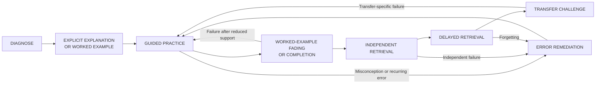
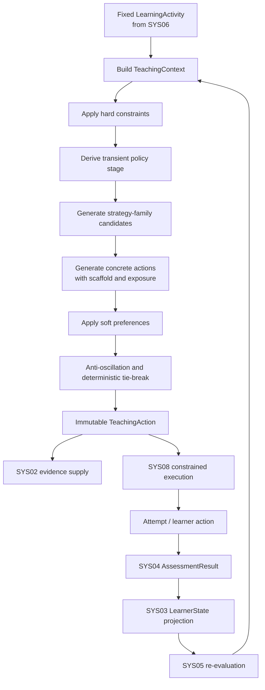

# Askora v0.3 DR-03-01 教学策略与支架转换研究

> 状态：Deep Research / Synthesis 研究资产  
> 日期：2026-08-07  
> 适用范围：Askora v0.3 Adaptive Teaching Loop  
> 权威性：本文件提供研究证据、设计推导与后续 Canonical Design 输入，不构成第二套正式规范。若与 Canonical Design 冲突，以 Canonical Design 为准。

## Executive Summary

Askora v0.3 不应尝试寻找一种对所有学习者、所有任务都最优的教学方法。现有证据更支持一种**条件化、可审计的教学策略（contingent teaching policy）**：系统应根据学习者当前知识、状态不确定性、错误模式、任务要求、历史支架、独立表现、延迟保持证据、迁移证据以及用户明确请求，选择当前教学动作，并在新证据出现后重新评估。

对先备知识弱、目标任务真正处于新手阶段、或任务 element interactivity 较高的学习者，直接讲解与 worked example 往往优于无支架搜索；随着任务相关能力形成，持续提供同等支架可能变成冗余，甚至出现 expertise-reversal。因此，Askora 的核心优化目标不应是“当前回合答对”，而应是把学习者从**受支持表现**逐步推进到**独立、保持、可迁移的能力**。

推荐的教学控制进程为：



该图不是固定线性课程，而是 **SYS06 已选择 `LearningActivity` 之后，由 SYS05 控制“当前如何教”的策略进程**。其中的阶段只能作为 activity-specific、transient policy interpretation，不能成为第二套长期 `LearnerState`。

### 核心研究结论

| 结论 | 证据分类 |
|---|---|
| 当先备知识不足、学习者对目标任务真正处于 novice 状态、或无支架搜索造成过高负荷时，优先使用 explicit instruction 与 worked example。 | **强证据，条件适用** |
| 随着任务相关能力被独立证据支持，应逐渐撤除冗余帮助；永久高支架会增加依赖与 expertise-reversal 风险。 | **强原则；具体 fading 算法为中等证据** |
| 提示后成功、部分答案暴露后成功、完整答案暴露后成功，不能等同于独立能力；必须在新的无帮助机会中重新验证。 | **强证据 + Askora 冻结不变量** |
| Retrieval practice 应在错误可能发生时配合纠正性反馈，并在后续延迟条件下再次检验。 | **强证据** |
| 有意义的失败应触发更多帮助或不同表示，但应先识别失败类型；单次错误不足以触发全面重教。 | **中等至强证据；具体阈值为工程选择** |
| Socratic questions 适合作为诊断、引出思考、自我解释和 guided practice 的有界动作；“永远只问不讲”缺少证据，尤其不适合真正的新手。 | **一般 dialogic move 为中等证据；独立 LLM Socratic strategy 为弱证据** |
| Productive Failure 在具有相关先备知识、问题空间经过专门设计且随后有 consolidation 的条件下具有可信收益，但不是任意任务的安全默认策略。 | **中等证据；v0.3 暂缓** |
| Self-explanation 与 metacognitive reflection 有价值，但更适合作为受控 action modifier，而非始终可进入的顶层 strategy state。 | **中等证据；建模方式属于 Askora 工程选择** |
| mastery cutoff、连续失败次数、最短策略驻留轮数、一次撤除多少支架等，不是教育科学常数，必须版本化并通过 Askora 实验校准。 | **Askora 工程选择** |
| 用户明确要求直接答案时应原则上尊重其自主权；当前 attempt 必须被标记为 assisted/answer-exposed，后续掌握验证必须使用新的独立机会。 | **用户自主权 + 测量有效性 + Askora 冻结语义** |

### v0.3 推荐最小策略族

建议 Canonical Design 后续综合时优先考虑六个策略族：

1. `EXPLICIT_INSTRUCTION`：包含 `DIRECT_INSTRUCTION`、`WORKED_EXAMPLE` 等动作变体；
2. `GUIDED_PRACTICE`：包含有界 `SOCRATIC_PROBING`、`SELF_EXPLANATION` 等交互动作；
3. `FADING_PRACTICE`：实现 `WORKED_EXAMPLE_FADING`、completion problem 与责任转移；
4. `RETRIEVAL_PRACTICE`：包括即时独立提取与 delayed retrieval；
5. `ERROR_REMEDIATION`；
6. `TRANSFER_CHALLENGE`。

这一“六族”结构是 **Askora 工程选择**，不是声称研究文献天然存在六种教学策略。其目的在于保留真正影响教学控制与证据语义的差异，同时防止 strategy proliferation 与频繁 oscillation。

`PRODUCTIVE_FAILURE` 不进入 v0.3 canonical baseline；`METACOGNITIVE_REFLECTION` 初期作为 action modifier 或 SYS06 的 `METACOGNITIVE_REVIEW` activity；`SOCRATIC_PROBING` 不作为永久会话模式。

---

## 1. Frozen Context

### 1.1 v0.2 冻结学习闭环

本研究基于当前仓库已经冻结的 v0.2 学习闭环，不重新设计八类技术系统：

```text
Material / SourceSpan
→ LearningGoal / LearningActivity
→ TeachingAction
→ EvidenceBundle
→ canonical Orchestrator
→ deterministic AssessmentResult
→ LearnerEvidence
→ MasteryEstimate
→ ReviewSchedule
→ future LearningPlan integration
```

v0.3 的研究目标是补足 Adaptive Teaching Loop 中仍未充分 canonicalize 的部分：系统已经能够表达 `TeachingAction`，但“为什么此刻应该讲、问、提示、练习、补救、撤除支架或进行迁移”仍需要形成可解释、可回放的策略机制。

权威前置研究：

- `docs/research/learning-core/synthesis/v0.3-候选范围分析.md`
- `docs/research/learning-core/synthesis/v0.3-深度研究议程.md`
- `docs/design/learning/AI学习系统算法与教学内核设计.md`
- `docs/research/learning-core/synthesis/4.5-教学策略选择-系统设计研究.md`

### 1.2 决策所有权冻结

Askora 当前架构的关键前提是每一种核心状态和决策只有一个最终所有者：

| 状态 / 决策 | 唯一所有者 |
|---|---|
| 当前 `TeachingAction`、策略版本、支架/提示等级、答案暴露上限、动作退出/升级条件 | SYS05 Teaching Policy |
| `LearningPlan`、`LearningObjective`、`LearningActivity` 与长期内容顺序 | SYS06 Learning Planner |
| 单次 `AssessmentResult`、正确性、分数、错误类型、独立性与诊断置信度 | SYS04 Assessment & Error Diagnosis |
| 跨时间 `LearnerState` / `MasteryEstimate` 与长期误区假设 | SYS03 Learner Model |
| `EvidenceBundle` 的检索与组合 | SYS02 Retrieval & Knowledge Supply |
| 生成、表达、工具执行 | SYS08 LLM / Agent Execution |

因此，本研究只回答：

> SYS05 当前应选择什么教学方式？

> 新证据到来后，何时增加、维持、降低或撤除支架？

它不回答 Planner 应安排什么内容，也不把一次作答结果直接升级为长期 mastery。

### 1.3 SYS05 冻结决策顺序

当前 Teaching Policy 的基线决策顺序保持为：

```text
hard constraints
→ strategy state machine
→ candidate generation
→ weighted action scoring
→ deterministic tie-break
→ TeachingAction
```

硬约束不能被 soft score 抵消；meaningful repeated failure 必须存在退出或升级路径；稳定的独立成功应减少不必要支架；永久 Socratic mode 被禁止。

### 1.4 证据语义冻结

v0.2 已冻结如下方向性关系：

```text
independent evidence
> assisted evidence
> answer-exposed evidence
```

完整答案暴露后的成功不能作为稳定独立 mastery 的高权证据；当前 frozen baseline 中 answer-exposed evidence 对 mastery 的权重为零。SYS04 负责描述当前 attempt，SYS03 负责跨 attempt 推断长期状态。

---

## 2. Research Method

### 2.1 研究层级

本研究采用三层证据：

1. **Askora 冻结设计与 v0.2 release evidence**：首先约束系统边界与所有权；
2. **成熟学习科学与 ITS 证据**：优先 meta-analysis、systematic review、controlled experiment、Cognitive Tutor / AutoTutor 等成熟 ITS 研究；
3. **2023—2026 LLM tutor 实证**：用于判断生成式 AI 的现实边界，但不把“LLM 能对话”直接等同于“教学策略有效”。

### 2.2 证据标签

| 标签 | 本报告中的含义 |
|---|---|
| **Strong evidence** | 多项一致的 meta-analysis、可重复 controlled study，或大型高质量 field RCT 且与更广文献一致 |
| **Medium evidence** | 多项研究方向一致，但仍存在学科、年龄、实现方式或 outcome 限制 |
| **Weak evidence** | 小样本、单一研究、quasi-experiment、preprint，或没有独立/延迟 outcome |
| **Theoretical inference** | 与成熟机制一致，但尚未被直接验证为 Askora policy rule |
| **Askora engineering choice** | 为可实现、可审计、可实验而提出的设计约定，不应包装为科学常数 |

### 2.3 反伪精确原则

本研究刻意不把平均处理效应转换成类似以下规则：

```text
mastery > 0.72 → SOCRATIC_PROBING
fail_count == 2 → scaffold + 1
independent_success == 3 → mastery
```

研究可以支持“随着 expertise 增长减少冗余 guidance”这类方向，但不能证明某个跨学科固定阈值天然正确。阈值、窗口、权重和驻留时间必须成为 versioned policy configuration，并由 DR-03-04 的 replay、expert review 与产品实验校准。

---

## 3. Evidence Review

### 3.1 Worked examples、fading 与 expertise reversal

Worked examples 对缺乏目标任务 schema 的学习者具有稳定优势：它们减少盲目 problem-space search，把有限工作记忆更多用于理解结构、步骤关系与一般原则。example–problem pair、completion problem、逐步移除已完成步骤，是从观察走向独立生成的常见桥梁。

随着学习者形成任务相关 schema，同样的详细解释会逐渐转为冗余；继续提供完整步骤可能增加 extraneous load，并出现 expertise-reversal。因此：

- `WORKED_EXAMPLE` 的选择应基于**目标任务相关的已有证据**，而不是全局“新手/专家”身份；
- fading 应由新近 independent evidence 驱动，而不是只看“已经展示过几个例子”或经过多少轮；
- worked example 之后必须安排 learner-generated enactment 或 problem solving，否则只能证明学习者接触了正确解法，不能证明其独立生成能力。

**证据强度：对低知识学习者的 structured task 为强；对任何任务通用的 adaptive fading 算法为中等。**

### 3.2 Cognitive load 与 element interactivity

任务难度不是材料的固定属性，而是材料结构与学习者已有 schema 的关系。一个专家可把多个元素 chunk 成一个 schema，而新手必须同时处理多个未整合元素。因此，Askora 不应仅使用静态 difficulty 标签推断认知负荷。

更可审计的 task complexity proxy 应考虑：

```text
material element interactivity
× prerequisite availability
× representation switching
× simultaneous subgoals
× number of learner decisions
× recent failure pattern
```

SYS05 的 `cognitive_load_penalty` 不应由 LLM 主观给出一个“精确负荷分数”，而应尽可能来自上述可观察代理特征。

### 3.3 Contingent scaffolding、assistance dilemma 与 help seeking

computer-based scaffolding 的总体学习收益有稳定证据，但研究并未证明某一种固定 fading schedule 在所有场景都最优。真正关键的是 **contingency**：

```text
meaningful learner failure → increase tutor control
credible learner success → decrease tutor control
```

完整 scaffolding 还必须包含“责任转移”。只不断增加帮助而从不撤除，不是完整的 scaffolding，而是 assistance dependency。

ITS 的 assistance dilemma 同时提醒：

- 学习者可能在需要帮助时拒绝帮助；
- 也可能尚未尝试就不断点 hint；
- 可能直接追到底层 bottom-out answer；
- 可能用支架完成当前任务却没有形成独立能力。

因此，Askora 不应把“减少 hint 点击次数”作为学习目标，也不应简单禁止帮助。系统可以在诊断到真实 struggle 时主动提供低曝光支架，但必须记录帮助强度、答案暴露、后续独立验证义务。

### 3.4 Retrieval practice、difficulty、feedback 与 delay

Retrieval practice 对长期保持具有强证据，但“让用户不断答题”并不等于有效 retrieval。有效设计通常需要：

- 已存在最低限度可提取表征；
- 先尽量无提示作答；
- 提交后给 correctness feedback；
- 错误时提供正确原则、过程解释或可执行修正；
- 重要知识在不同时间、不同表面形式中重复提取；
- 区分 immediate、delayed 与 transfer outcome。

retrieval difficulty 只有在成功概率仍合理或失败后及时纠正时才具有“desirable”意义。持续失败且不给纠正并不构成有效困难。

关于 feedback timing，没有跨任务唯一胜者。对新手或高难任务的错误，及时纠正通常更安全；在较熟练学习者的简单任务中，可适当延迟 solution-bearing feedback 以保留自检与 retrieval 机会。

**证据强度：强。**

### 3.5 Self-explanation 与 metacognition

Self-explanation 的总体效果为正，但依赖 prompt 质量、任务类型、已有知识与比较条件。开放式“请解释一下你的思路”可能只增加文字量或时间成本，并不保证学习。

更好的 prompt 应要求连接原则与步骤，例如：

- “这一步使用了什么原则？”
- “为什么这个条件在这里必要？”
- “这个例子与前一个例子的结构相同在哪里？”
- “哪一步最可能出错，为什么？”
- “你的方法在什么条件下不成立？”

Metacognitive prompts 在计划、监控和评价方面具有正向证据，但永久提示也会变得冗余。因此两者均适合建模为 bounded move，并需要 fading。

**证据强度：中等。**

### 3.6 Socratic / dialogic tutoring

有目的的 dialogic move 可以促进解释、诊断与推理，但现有证据并不支持“整场学习始终采用苏格拉底追问”。对真正的新手，连续开放式问题可能增加 search 与 language-processing demand，却没有提供形成 schema 所需的知识。

Socratic probing 较适合：

- 已有相关知识但表达不完整；
- 答案可能正确但理由不清；
- 需要定位 misconception；
- 学习者能够产生候选解释；
- 当前任务本身要求论证、判断或解释；
- probe 数量有上限，失败后存在明确 fallback。

不适合：

- 严重 prerequisite gap；
- 用户不知道从何开始；
- 多轮均只能回答“我不知道”；
- 当前目标只是首次建立基本事实或程序；
- 用户明确要求直接解释；
- 每轮只是换一种说法重复问题。

LLM-specific Socratic evidence 截至 2026 年仍明显弱于成熟学习科学证据，常见限制包括小样本、短期 post-test、偏 engagement 指标或缺少 delayed/transfer test。

**证据强度：有目的 dialogic move 为中等；独立 universal LLM Socratic strategy 为弱。**

### 3.7 Productive Failure

Productive Failure 不是“让学习者先失败几次”。高 fidelity 设计通常要求：

1. 学习者具有可激活的相关先备知识；
2. 问题允许产生多个有意义但不完整的表示或方案；
3. 初始 generation 阶段不过早纠正每一步；
4. 随后必须进行明确 consolidation；
5. 比较不同方案并连接正式概念；
6. outcome 重点通常是 conceptual understanding 与 transfer，而不是首次记忆事实。

以下情况容易退化为 unproductive failure：

- 无相关先备知识；
- 搜索空间过大；
- 失败持续过久；
- 只能随机猜测；
- consolidation 缺失；
- 错误策略被重复练习；
- 时间/挫败成本超过潜在收益；
- 系统无法区分 productive generation 与无方向困惑。

因此 `PRODUCTIVE_FAILURE` 不进入 v0.3 顶层 baseline，仅可作为后续受限实验。

**证据强度：中等，且边界条件强。**

### 3.8 Feedback 与 error-contingent remediation

反馈应与诊断置信度成比例。一个可能的 execution slip 不应触发整套概念重教；一个高置信、反复出现的 conceptual misconception，才可能合理触发 contrasting case、changed representation、prerequisite check 等补救。

推荐反馈层级：

```text
correctness
→ error location/type
→ principle or process explanation
→ next actionable step
→ full worked correction when required
```

“错了”通常不足以修正知识模型；但每次错误都给完整长篇答案，也会造成 extraneous load 与答案依赖。

近期大规模 LLM feedback 研究显示，经过验证的生成式反馈可以改善当前纠错与短期下一题表现，低知识学习者受益更明显；但这类结果尚不足以证明 delayed retention 与 broad transfer。因此 LLM 可以执行 SYS05 已选择的 remediation action，但不能自行发明 error type、提升 exposure ceiling 或改变 evidence semantics。

### 3.9 Mastery learning、deliberate practice 与成熟 ITS

Mastery learning 的稳定机制是：

```text
attempt
→ formative feedback / remediation
→ new opportunity to demonstrate capability
```

这支持 Askora 的闭环，但不支持“固定答对 N 次 = 稳定掌握”。长期 mastery 仍需结合独立成功、延迟保持、迁移、证据置信度和误区状态。

成熟 ITS 的关键经验是：bottom-out hint 可以恢复任务进度，却不能证明相关 knowledge component 已经掌握。Askora 已有的 attempt assistance、AssessmentResult 与 MasteryEstimate 分离，与这一经验一致。

### 3.10 2023—2026 LLM tutor 证据

生成式 AI tutor 的实证结果有潜力，但高度异质：

- 某些研究发现精心设计的 domain-specific AI tutor 能改善即时学习并减少时间；
- 某些现场研究发现 unrestricted GPT 可提升带辅助练习表现，却损害之后的无辅助考试表现；
- 加入 teacher-designed hints、答案保护与结构化限制后，可以降低这种风险；
- human–AI tutoring（如 AI 辅助真人 tutor）显示了提高教学行为质量与主题掌握的潜力；
- delayed retention、broad transfer、跨领域稳定性仍明显欠缺。

因此当前最佳设计模式不是 free-form autonomous tutor，而是：

```text
structured pedagogical policy
+ explicit answer-exposure constraints
+ grounded/validated generation
+ immutable TeachingAction envelope
+ subsequent unassisted measurement
```

**总体证据：受约束 LLM tutoring / feedback 为中等；自主策略选择、永久 Socratic、长期保持与迁移为弱。**

---

## 4. Teaching Strategy Evidence Matrix

下表用于表达“什么状态更倾向选择什么策略”，而不是建立全局 learner stage。所有判断均针对当前 `LearningActivity` 与目标技能。

| 策略 / 动作 | 低先备 / Novice | Emerging | Guided / Practicing | Independent Check | Delayed Retention | Transfer | 证据强度 | 主要失败模式 |
|---|---|---|---|---|---|---|---|---|
| `DIRECT_INSTRUCTION` | **Primary**：先建立概念、规则与表示 | Conditional：补充缺失原则 | 仅针对局部缺口 | 通常不应在独立测量中使用 | 遗忘后可短暂 restudy | 仅当迁移失败来自知识缺口 | **Strong** | 过度讲解、被动接受、无法证明独立生成 |
| `WORKED_EXAMPLE` | **Primary**：尤其高 element interactivity 的 structured task | **Primary/Conditional** | 应逐步转 completion/fading | 不适合作为无提示证据 | 遗忘后可用简短示例重建 | 可用于解释 source-target mapping，但不能替代迁移任务 | **Strong for novice** | expertise reversal、示例依赖、表面模仿 |
| `FADING_PRACTICE` / `WORKED_EXAMPLE_FADING` | 在初始模型建立后进入 | **Primary** | **Primary** | 目标是转向 H0 独立完成 | 可在遗忘后重新升支架再 fade | 迁移前用于完成责任转移 | **Strong principle / Medium algorithm** | 固定 schedule、撤除过快/过慢、只看当前正确率 |
| `SOCRATIC_PROBING` | 一般避免开放式连续追问；仅作小范围诊断 | Conditional：定位理由与误区 | 适合作为 bounded move | 可在提交后追问解释，但不能泄露答案 | 可用于解释 retrieval 结果 | 对论证/解释任务有用 | **Medium dialogic / Weak standalone LLM** | 对话很多但学习少、新手猜测、挫败、隐性答案提示 |
| `GUIDED_PRACTICE` | 解释或示例后进入 | **Primary** | **Primary**，直到可逐步撤除 | 仅用于发现薄弱组件 | 延迟失败后可短暂返回 | transfer failure 诊断后可回到近迁移 guided practice | **Strong-to-Medium** | tutor 替学习者完成认知工作、支架不撤除 |
| `RETRIEVAL_PRACTICE` | 仅在已有最低可提取表征时使用，低风险、高成功率 | 适合短独立回忆/应用 | **Primary**，配合变化与反馈 | **Primary**，原则上无 solution-bearing hint | **Primary** | 迁移前可验证 prerequisite | **Strong** | 过难 retrieval、错误反复无纠正、把练习当 summative test |
| `ERROR_REMEDIATION` | knowledge gap 时可直接解释/示例 | recurring misconception / strategy error 时 **Primary** | slip 时只做局部补救 | 独立失败后 Conditional | forgetting 后可 **Primary** | 迁移失败需先区分 knowledge / retrieval / transfer problem | **Strong feedback; Medium mapping** | 单次 slip 全面重教、低置信误诊、重复同一解释 |
| `TRANSFER_CHALLENGE` | 严重 prerequisite gap 时避免 | 通常避免，仅做高支架 near transfer | 独立成功后 Conditional | 具备可信独立能力后 **Primary** | retention 成立后 **Primary** | **Primary** | **Medium** | 把表面新颖当迁移、过早挑战、提示消解迁移需求 |
| `SELF_EXPLANATION` | 仅与可见示例绑定且 prompt 具体时使用 | example / guided step 的 **Primary modifier** | 原则选择与错误修正时适用 | 提交后可要求解释 | retrieval 后解释机制/置信度 | 比较 source-target 结构时有用 | **Medium** | 泛化废话、错误理由、时间成本、expertise reversal |
| `PRODUCTIVE_FAILURE` | 真正 foundational novice 通常避免 | 仅在有相关 prior knowledge、低风险、专门设计任务且保证 consolidation 时 Conditional | conceptual differentiation 时少量实验 | 仅 advanced PFL 场景 | 不是 retention strategy | 某些 conceptual transfer 场景可能有效 | **Medium under narrow conditions** | unproductive search、挫败、无 consolidation、误用为“无指导” |
| `METACOGNITIVE_REFLECTION` | 简短、具体，不能替代教学 | 可用于计划下一步/识别困惑 | 错误或策略选择后有用 | 校准与 help-seeking review | 对比预测与结果 | 识别 invariant principle | **Medium as prompt / Weak standalone** | 过度内省、模板化、打断练习、永久提示依赖 |

### 4.1 影响候选优先级的主要 moderator

| Moderator | 典型方向 |
|---|---|
| Severe prerequisite gap | 提高 `DIRECT_INSTRUCTION`、`WORKED_EXAMPLE`、prerequisite remediation；抑制 unsupported retrieval/transfer |
| Low learner-state confidence | 提高 diagnostic probing 与低风险 guidance；降低激进 transfer 与高置信 misconception treatment |
| High task element interactivity | 对低知识学习者提高 modelling、decomposition、example |
| Conceptual misconception | 提高 contrasting case、conceptual explanation、self-explanation、targeted probe |
| Procedural slip | 优先简短 error-contingent feedback + retry，而非全面重教 |
| Method-selection error | 比较适用条件、subgoal hint、强调选择条件的 worked example |
| Retrieval failure | corrective feedback 后安排新的 retrieval；不要自动推断广泛 misconception |
| High hint dependency | 不应完全拒绝帮助；减少 answer-bearing support、要求 attempt-before-hint、安排 fresh independent check |
| Repeated prior failures | 改变支架、表示或策略；禁止无限重复同类提问 |
| Stable independent success | 降低支架，增加 variation、delay、transfer |
| Answer-exposed history | 下一次 mastery evidence 必须来自新 item / 新 context |
| User requests direct explanation | 提高 direct instruction / worked solution 候选，同时重分类 evidence |
| Low confidence / frustration | 更小可执行步骤、简短解释或用户选择；情绪信号不能替代 mastery evidence |
| High time pressure | 倾向高信息密度的 concise explanation 与 focused check，除非当前是正式 assessment |

---

## 5. Transition Condition Matrix

下表不规定任何通用数值阈值。`sufficient`、`repeated`、`credible` 等词必须由 versioned Askora policy configuration 定义，并通过 DR-03-04 验证。

| Policy stage | Entry condition | Stay condition | Escalate scaffold | Reduce scaffold | Exit condition | Failure fallback |
|---|---|---|---|---|---|---|
| `DIAGNOSE` | learner state 缺失/陈旧/低置信；错误含义不清；prerequisite 不确定；近期表现与长期估计冲突 | 证据仍不能区分 knowledge gap / retrieval failure / misconception / slip | 允许澄清题意、定向 probe、低曝光提示 | 不适用 | 得到足够证据可选择后续教学策略 | 若仍不确定，选择低风险解释或请求 SYS06 replan，而不是制造高置信误区 |
| `EXPLICIT_INSTRUCTION` | 明显 prerequisite gap、novice、相对复杂度高、连续无方向失败、用户明确要求解释 | 学习者尚不能复述关键原则或完成受控下一步 | 从概念解释升级到 worked example / step modelling | 学习者能解释原则并完成局部生成后转 guided/fading | 形成最低可操作表征 | 若解释无效，更换表示、例子或回到 prerequisite diagnosis |
| `GUIDED_PRACTICE` | 已有基本表征，但独立完成仍不稳定 | 低/中支架能促成有意义 learner-generated step | meaningful failure、错误复发、当前 hint 无效 | 辅助下成功且能解释/生成下一步时逐级 fade | 达到可进行 fresh independent attempt 的状态 | error remediation、changed representation、必要时 replan |
| `FADING_PRACTICE` | worked example / guided practice 后出现可信受支持成功 | 撤除一部分控制后仍能完成关键步骤 | 撤除后出现有意义失败 | 每次优先撤除一个教育上有意义的控制来源 | 进入 H0 fresh independent check | 回到前一有效 scaffold band，不直接跳到 full answer，除非硬约束或用户请求 |
| `RETRIEVAL_PRACTICE` | 已有最低可提取知识；当前活动要求 independent retrieval | 无提示 retrieval 可进行，或错误可通过 feedback 修复 | failed retrieval 后可短暂 cue/restudy | 正确独立表现后维持 H0，并增加间隔/变化 | 产生有效独立证据或暴露需要 remediation 的问题 | corrective feedback → remediation → new retrieval opportunity |
| `ERROR_REMEDIATION` | SYS04/SYS03 提供足够可信的错误或误区证据 | 当前补救方式正在修复明确目标 | repeated same error、hint 无效、prerequisite gap 明确 | 学习者能在降低支架后完成 target step | 新的 fresh independent opportunity 可验证修复 | diagnosis 低置信则返回 probe；系统失败则退出，不计 learner failure |
| `DELAYED_RETRIEVAL` | 已达到初步独立能力且进入 review window | 无提示 delayed attempt 正在进行 | forgetting 后可进入 remediation / brief restudy | 成功后保持 H0 | 得到 retention evidence | remediation 后重新安排未来 delayed check |
| `TRANSFER_CHALLENGE` | source competence 具有可信独立与保持证据；任务具有 meaningful novelty | 学习者在新情境中独立映射结构 | transfer-specific failure 时可给结构对齐或回到 near transfer | 默认不应增加答案暴露；保持 H0 才能获得 transfer evidence | 得到有效 transfer evidence | 区分 source knowledge gap、retrieval failure 与真正 transfer failure 后决定回退 |

### 5.1 Anti-oscillation controls

| 控制 | 推荐语义 |
|---|---|
| `Material-evidence gate` | 不因“又发生一轮对话”而切换策略；必须有新的 `AssessmentResult`、有意义 learner action、相关 state update、execution failure 或显式 user request |
| `Directional hysteresis` | 一次弱成功不能移除全部支架；一次孤立错误不能触发最大 remediation |
| `Minimal-change preference` | 多个动作都合理时，优先保持当前策略族或只移动一个支架 band，除非 hard constraint 要求更大变化 |
| `Strategy episode trace` | 记录 episode 为什么开始、什么证据可结束、转换由 learner evidence / user override / system failure 中哪一种触发 |

以上控制属于 **Askora engineering choice**，需要 scenario replay 与 outcome validation。

---

## 6. Scaffold / Hint Model

研究不支持“三层、四层、五层或六层 hint 中哪一个数字普遍最优”。重要的是不同帮助必须映射到教育上与测量上真正不同的语义。因此，建议 Canonical Design 把 scaffold 建模为正交字段，而不是让一个整数同时承载所有信息。

### 6.1 推荐 canonical dimensions

| Dimension | 推荐值 | 目的 |
|---|---|---|
| `scaffold_control` | `NONE`, `LOW`, `MEDIUM`, `HIGH` | 系统替学习者承担多少 task decomposition 与 cognitive control |
| `hint_specificity` | `NONE`, `ORIENTATION`, `CONCEPTUAL_STRATEGIC`, `SUBGOAL`, `PARTIAL_STEP`, `BOTTOM_OUT` | 帮助具体到什么程度 |
| `answer_exposure` | `NONE`, `PARTIAL`, `COMPLETE` | 测量关键：是否暴露任务特定正确步骤或答案 |
| `delivery_mode` | `ON_REQUEST`, `OFFERED`, `SYSTEM_TRIGGERED` | 帮助是用户请求、系统建议还是主动触发 |
| `attempt_status` | `INDEPENDENT`, `ASSISTED`, `ANSWER_EXPOSED` | 当前 attempt 应如何进入证据系统 |
| `support_reason` | structured reason codes | prerequisite gap、repeated failure、misconception、accessibility、user request 等 |

其中 `answer_exposure` 必须是证据有效性的权威字段。一个名义上“二级提示”的文本，如果已经包含决定性步骤，就不能因为数值标签较低而仍被视为低帮助。

### 6.2 用户可见 H0—H4 ladder

可以在 UI 中保留五档提示，但明确这是 Askora 的可用性设计，而不是“研究证明五档最优”。

| Band | 允许内容 | Solution exposure | Assessment / evidence effect | 正常 fading target |
|---|---|---|---|---|
| `H0 — Independent` | 题目、无教学性界面澄清、accessibility 支持 | None | 条件满足时可形成 independent evidence | 继续 H0，之后增加 delay / transfer |
| `H1 — Orientation` | 重述目标、提醒检查条件、要求列出 knowns、提示关注某类原则但不点出决定性操作 | None / negligible | 若具教学信息则计 assisted；纯中性澄清可保持 independent | 移除 orientation，要求 fresh independent step |
| `H2 — Conceptual / Strategic` | 指出相关概念、条件、表示、策略族、错误区域或 subgoal | 通常不直接给答案，但显著缩小搜索空间 | Assisted；当前成功不能作为 fully independent | 下一步由学习者自主选择并执行 |
| `H3 — Subgoal / Partial step` | 给 subgoal、中间结果、方程 setup、code skeleton、worked first step、completion problem | Partial | Strongly assisted / answer-partial；不能作为稳定独立掌握 | 回到 H2/H1，再做 fresh item |
| `H4 — Worked solution / Direct answer` | 完整演示、最终答案、逐步纠正 | Complete | Answer-exposed；当前成功不产生 independent mastery evidence | 必须使用新的无提示任务重新验证 |

### 6.3 Fading 原则

推荐原则：

1. 先撤除**一个教育上有意义的 tutor control source**，而不是一次性清零所有帮助；
2. 撤除之后立即观察一个新的 learner-generated step；
3. 如果 partial / complete answer exposure 已发生，当前 item 后续成功不再恢复为独立证据；
4. 必须使用 fresh item、surface-varied item 或 delayed retrieval 重新验证；
5. fade 由新证据触发，而不是固定轮数；
6. repeated failure 可以升级一个 band，但大跳级需要 hard constraint、明确 prerequisite gap、用户 direct-answer override 等理由。

---

## 7. Hard Constraints

以下约束应在候选评分之前执行，不能被其他正向 score 抵消：

1. **Formal independent assessment 不允许 solution-bearing support。** 若用户要求答案，必须先结束、暂停或重分类当前 attempt。
2. **Assisted / answer-exposed success 不能 retroactively 变成 independent mastery evidence。**
3. **Material prerequisite gap 必须阻止继续进行 unsupported high-complexity / transfer challenge。**
4. **若当前 `LearningActivity` 因 prerequisite 缺失而不可执行，SYS05 应发出明确 failure / replan request，不能偷偷改写 SYS06 的学习目标。**
5. **Meaningful repeated failure 必须改变支架、表示、诊断动作或策略；不得无限重复开放式 Socratic question。**
6. **单次 ambiguous error 不得激活 high-confidence misconception 或 broad remediation。**
7. **Model / retrieval / sandbox / network / orchestration failure 不能被记为 learner failure。**
8. **SYS08 / LLM 只能执行已选择的 action，不得自行提高 exposure、替换 strategy、修改 success/failure semantics。**
9. **Transfer evidence 必须来自具有 meaningful novelty 且独立尝试的任务。 heavily scaffolded transfer task 只能算 practice，不能算 transfer mastery。**
10. **Low-confidence learner state / diagnosis 不得转换成伪精确、高风险策略结论。**
11. **每次 support escalation / reduction 都必须保存输入 snapshot、reason code、policy/config version 与 exposure effect。**
12. **User override 应被尊重，但不能让 answer-exposed work 倒推为 independent。**

---

## 8. Soft Decision Factors

以下因素影响 candidate score 或 tie-break，但不应单独成为全局硬开关。

| Factor | 典型偏好方向 | 为什么只是 soft factor |
|---|---|---|
| Estimated target mastery | 低值偏 modelling/guidance；高值偏 retrieval/transfer | estimate 有不确定性且与任务相关 |
| Learner-state confidence | 低置信偏 diagnosis 与 conservative action | 低置信不等于低能力 |
| Prerequisite gap severity | gap 越大越偏 explicit connection/remediation | 可能存在替代知识路径 |
| Relative task complexity | 相对复杂越高越偏 decomposition/example | complexity 随 learner schema 改变 |
| Recent correctness | 成功倾向 fade；失败倾向 diagnosis/support | 单次结果噪声大 |
| Error type | conceptual 偏 contrast/explanation；slip 偏 brief correction | error classification 可能不确定 |
| Error recurrence | repeated error 提高 remediation priority | 可能由重复 item 或题目缺陷造成 |
| Hint dependency | 提高 independent check 与低曝光 support 需求 | 简单拒绝帮助会造成 help avoidance |
| Assistance effectiveness | 低层 hint 有效则逐步 fade；无效则换形式 | hint count 本身不足 |
| Independent success history | 提高 retrieval/delay/transfer 候选 | success 可能 item-specific / immediate |
| Delayed retention evidence | 提高 transfer、降低复习频率 | delay 长度与 item equivalence 不同 |
| Transfer evidence | 提高更广泛 transfer 机会 | transfer 高度 context-sensitive |
| Learner confidence / frustration | 可偏更小步骤、简短解释、用户选择 | self-report 不是 mastery evidence |
| User request | 强烈偏用户明确请求的模式 | preference 可能与 formal assessment 目标冲突 |
| Available time | 时间短偏 concise explanation/focused practice | 效率与长期学习可能冲突 |
| Prior failures in episode | 提高 escalation / representation change | 失败原因可能是题目或系统 |
| Accessibility needs | 调整表示、节奏、输入方式 | 不应降低学习目标标准 |
| Previous strategy recently failed | 暂时降低重复选择同一动作的 score | 防止无效循环，但不能永久封禁 |

---

## 9. User Override

当用户明确说“直接告诉我答案”“直接讲解”时，系统应优先尊重自主权，不能把用户困在强制 Socratic loop。

推荐语义：

```text
user requests direct answer
→ determine whether current context is formal assessment
→ if formal assessment:
     end/pause/convert assessment attempt
     preserve attempt as incomplete or answer-exposed
→ select new DIRECT_INSTRUCTION or WORKED_EXAMPLE action
→ set exposure = COMPLETE
→ provide answer and concise explanation
→ create future independent verification requirement
```

具体行为：

- 非正式学习活动中，可以直接回答；
- 正式 assessment 中，应先明确“提供答案后本次不再是无提示独立测量”，然后转换 attempt 状态；
- 不应道德化、反复阻拦或强迫用户继续猜；
- `DecisionTrace` 记录 `user_override=direct_answer`、exposure、new `TeachingAction`；
- 当前 item 后续复制答案不进入高权 mastery evidence；
- 后续验证使用 new item、surface-varied item 或 delayed retrieval；
- 用户可以拒绝后续检查，但 learner state 应保持“证据不足”，不能假装已经掌握。

---

## 10. Failure Modes

| Failure mode | 形成机制 | Policy guardrail |
|---|---|---|
| Novice 被连续追问 | 把所有 active dialogue 误认为深度学习 | novice/probe hard limit；无有效产出后转 explanation/example |
| Socratic teaching 滥用 | 优化对话轮数、参与感或“像 tutor” | outcome 以 independent success / retention / transfer 为主；probe 必须有明确目的 |
| Over-scaffolding | 一遇困难立即给步骤/答案 | minimum necessary help；默认一次移动一个 band；后续独立验证 |
| Under-scaffolding | 把困难本身当 productive struggle | repeated-failure boundary；prerequisite / relative complexity 检查 |
| Scaffold 不撤除 | 只优化当前题完成率 | assisted success 后创建 fade obligation；追踪 scaffold fading rate |
| Strategy oscillation | 每轮依据 noisy signal 重新选最高分 | material-evidence gate、hysteresis、minimal-change、deterministic tie-break |
| Productive Failure 误用 | 无 prior knowledge、无 consolidation、任务空间过大 | v0.3 defer；未来必须有 PF-compatible activity metadata 与 exit condition |
| Hint abuse / answer dependency | bottom-out hint 过早、答案机式交互 | attempt-before-hint、exposure logging、fresh independent check |
| False misconception | 单次错误被长期化 | diagnosis confidence、recurrence evidence、uncertain 时 diagnostic probe |
| System failure 被当 learner failure | timeout / retrieval miss / schema error 与学习行为混淆 | execution failure 与 learner outcome 分离 |
| LLM 自行升级帮助 | 模型为了完成当前任务泄露更多信息 | immutable TeachingAction、exposure ceiling、output validation |
| Current-turn optimization | 只优化当轮正确率或满意度 | 关联 next independent / delayed / transfer outcome |
| Engagement-maximizing policy | 长对话被误当学习效果 | 不以 conversation length / likes 作为主要 reward |

---

## 11. v0.3 Recommended Minimum Strategy Set

### 11.1 顶层策略族

```text
EXPLICIT_INSTRUCTION
GUIDED_PRACTICE
FADING_PRACTICE
RETRIEVAL_PRACTICE
ERROR_REMEDIATION
TRANSFER_CHALLENGE
```

### 11.2 典型 instructional moves / action variants

```text
DIRECT_INSTRUCTION
WORKED_EXAMPLE
SOCRATIC_PROBE
SELF_EXPLANATION_PROMPT
ORIENTATION_HINT
CONCEPTUAL_HINT
SUBGOAL_HINT
PARTIAL_STEP
COMPLETION_PROBLEM
FADING_STEP
CORRECTNESS_FEEDBACK
PROCESS_FEEDBACK
RETRIEVAL_REQUEST
DELAYED_RETRIEVAL_REQUEST
TRANSFER_TASK
DIRECT_ANSWER_OVERRIDE
METACOGNITIVE_CHECK
```

### 11.3 为什么不把每一种动作都做成 strategy

顶层 strategy 应表达一个相对稳定的**教学 episode 目的**；instructional move 表达该 episode 内具体做什么。若把每一种话术都升级为 strategy，系统会产生：

- 状态数量快速膨胀；
- 频繁 strategy switch；
- 难以定义 episode entry / exit；
- 难以区分教学目的与文本表面形式；
- offline replay 与实验比较变得混乱。

因此：

```text
TeachingStrategy = pedagogical episode / control intent
InstructionalMove = concrete tutor operation
Scaffold = amount/type of support
AnswerExposure = measurement-critical disclosure
```

四者应分离。

---

## 12. Rejected / Deferred Strategies

### v0.3 SHOULD NOT IMPLEMENT YET

| Deferred item | 原因 |
|---|---|
| `PRODUCTIVE_FAILURE` 作为通用 selectable strategy | 收益依赖高 fidelity task design、相关 prior knowledge、可生成多种方案的 problem space 与明确 consolidation；通用实现风险过高 |
| Standalone always-on `SOCRATIC_PROBING` | 证据支持有目的 dialogic moves，不支持无限追问；LLM delayed-learning evidence 仍弱 |
| Standalone `METACOGNITIVE_REFLECTION` 作为普通 turn strategy | 有价值但易打断 practice 并模板化；初期更适合作为 modifier 或 Planner activity |
| Free-form LLM strategy selection | 与 SYS05 冻结所有权、deterministic replay、hard constraints、auditability 冲突 |
| Ungrounded / unvalidated LLM-generated hints | hint quality 会改变 learner behavior，并可能引入 misconception，开放领域风险更高 |
| 全局“Socratic vs direct” learner preference | 用户偏好不等于每一种任务上的学习效果 |
| Fixed example count before fading | 研究支持按 knowledge adaptation，不支持统一固定数量 |
| Fixed consecutive-correct rule as stable mastery | 忽略 item difficulty、assistance、delay、novelty、evidence confidence |
| Unrestricted bottom-out hint in formal assessment | 破坏 independent evidence |
| Engagement-maximizing policy | 满意度与对话长度可能与学习效果分离 |
| Contextual Bandit / Offline RL / Online RL / multi-agent teaching / Deep KT 作为 v0.3 canonical baseline | 当前数据成熟度、反事实评估和安全条件不足；先建立稳定 action logging 与 delayed outcomes |

Productive Failure 未来进入 Askora 前，至少需要：

```text
PF-compatible activity design
+ required prerequisite profile
+ low-stakes generation phase
+ diversity of plausible attempts
+ explicit consolidation action
+ conceptual and transfer outcome measures
+ failure exit conditions
```

---

## 13. Open Questions

以下问题不能仅靠继续查文献解决，需要 Askora-specific replay、expert review 或实验：

| Open question | 推荐验证方式 |
|---|---|
| 不同 activity type 的“sufficient independent evidence”如何 operationalize？ | expert-labelled replay cases → 与后续 independent/delayed outcome 校准 |
| 多长的 strategy persistence 能防 oscillation 又不阻碍必要 adaptation？ | 比较 no-hysteresis、minimal-change、episode-based controls |
| 哪一种低层 hint 最能保留 learner generation？ | randomized comparison：orientation / conceptual / subgoal / partial-step |
| 系统何时应主动 offer help？ | 比较 help avoidance、time、frustration、next independent success |
| 如何检测 LLM 文本中的 semantic answer exposure？ | gold-set annotation + deterministic/model-assisted classifier |
| self-explanation quality 是否足以跨领域驱动 fading？ | domain-specific rubric reliability + outcome prediction |
| 哪些 error category 足够可靠，可触发 differentiated remediation？ | DR-03-02 diagnostic gold set + confidence calibration |
| immediate vs delayed elaborated feedback 哪些 activity 有差异？ | task-stratified experiments，禁止假设一个全局 timing rule |
| confidence / affect 如何影响 support 而不污染 mastery？ | N-of-1 与 cohort experiment，保留 independent-outcome guardrail |
| bounded Socratic probing 是否优于 direct explanation（emerging learner）？ | equalized time/content RCT + no-hint/delayed test |
| transfer 是否应拆 near / far action variant？ | expert task taxonomy + outcome studies |
| answer exposure 后 fresh-item distance 多大最合适？ | isomorphic vs surface-varied vs structurally varied |
| LLM feedback 在 user-supplied material 上能否保持事实与教学质量？ | source-grounded validation + teacher review + outcome measurement |
| `WORKED_EXAMPLE_FADING` 应保留独立 enum 还是成为 `GUIDED_PRACTICE` action pattern？ | canonical simplicity、replay clarity、experiment routing |
| 如何使用用户 answer-seeking pattern，而不形成 paternalistic policy？ | user-controlled settings + autonomy/return/independent outcome experiment |
| 哪些 outcome 必须 blocking release，哪些只做 telemetry？ | 与 DR-03-04 联合定义；constraint violation / exposure corruption 应优先 blocking |

最重要的 outcome hierarchy：

```text
current-turn correctness
< next fresh-item independent success
< delayed independent retrieval
< meaningful transfer
```

只改善第一项的 intervention，不应被宣布为“更好的教学策略”。

---

## 14. Implications for Askora

### 14.1 对关键设计问题的回答

| Required question | DR-03-01 结论 |
|---|---|
| v0.3 最小 `TeachingStrategy` 集合是什么？ | 六族：`EXPLICIT_INSTRUCTION`、`GUIDED_PRACTICE`、`FADING_PRACTICE`、`RETRIEVAL_PRACTICE`、`ERROR_REMEDIATION`、`TRANSFER_CHALLENGE` |
| 哪些 transition 有强证据？ | novice explicit guidance；随 expertise 撤除冗余支架；retrieval + feedback；delayed retrieval；answer exposure 使独立证据失效；纠正后重新 demonstration |
| 哪些规则仍只能是 configurable heuristic？ | failure count、success sufficiency、minimum dwell、fade amount、confidence cutoff、hint timing、delay interval、novelty distance、score weights |
| scaffold 应如何定义？ | 使用 control / specificity / exposure / delivery / attempt-status 等正交维度，并可提供 H0—H4 用户可见 ladder |
| fading 应如何工作？ | learner processing 有证据后一次撤除一个有意义 control source；fresh generated step 验证；partial/complete exposure 后必须 fresh no-hint item |
| direct-answer request 如何处理？ | 原则上 honor；active independent attempt 先结束/重分类；记录 exposure；后续 fresh independent check |
| 哪些策略暂不进入 v0.3？ | generic Productive Failure、永久 Socratic、普通 turn 的 standalone reflection、free-form LLM policy、learned/RL policy optimization |
| 仍未解决什么？ | 精确阈值、hint sequence、unsolicited help timing、Socratic-vs-direct、semantic exposure、跨领域 transfer、LLM delayed effect |
| 对 SYS05 Canonical Design 意味着什么？ | 明确 strategy-family semantics、scaffold/exposure 分离、transition episode、evidence-sensitive escalation/fading、hard constraints、anti-oscillation、user override、outcome trace |

### 14.2 TeachingContext 需要可操作输入

SYS05 至少需要只读访问：

```text
fixed LearningActivity / LearningObjective
task structure / relative complexity
target mastery + confidence
prerequisite state + confidence
recent AssessmentResult
error type + diagnostic confidence
active misconception hypothesis
prior attempts
hint specificity / answer exposure history
independent / delayed / transfer evidence
current strategy episode
user request
time budget / accessibility constraints
review context
```

### 14.3 TeachingAction 必须区分 strategy 与 move

建议未来 Canonical Design 能表达：

```text
strategy_family
instructional_move
scaffold_control
hint_specificity
answer_exposure
assistance_type
support_reason
target_scope
feedback_type
transition_intent
independent_check_required
```

其中：

- `strategy_family`：当前教学 episode 的目的；
- `instructional_move`：解释、示例、追问、hint、feedback、retrieval、transfer 等具体动作；
- `transition_intent`：`increase / maintain / fade / remove / verify`；
- `independent_check_required`：高支架或答案暴露后是否产生 fresh-evidence obligation。

### 14.4 Scaffold 与 Answer Exposure 必须分离

一个短文本可能直接泄露最终答案，一个很长的 orientation explanation 可能完全不泄露任务特定答案。因此不能把帮助强度与答案暴露压缩到同一个 scalar。

SYS02 的 evidence supply 与 SYS08 的 generation 均不得超过 SYS05 已冻结的 `answer_exposure` ceiling。

### 14.5 每个策略 episode 需要 entry / stay / exit 语义

每个 episode 应明确：

- 为什么开始；
- 什么证据允许继续；
- 什么证据触发 increase / fade；
- 什么情况下退出；
- failure fallback；
- 当前结果可以产生哪类 evidence；
- 是否产生未来 fresh-item obligation。

### 14.6 Remediation 只能消费诊断，不能拥有诊断真相

SYS05 可以：

```text
low-confidence error
→ diagnostic probe candidate

high-confidence recurring conceptual error
→ targeted remediation candidate
```

但不能重写 SYS04 的 `AssessmentResult`，也不能把一次错误直接写成 SYS03 的长期 misconception。

### 14.7 Anti-oscillation 必须 canonical 且可 replay

至少记录：

```text
previous_action_id
previous_strategy_episode
previous_scaffold_state
new_scaffold_state
transition_direction
transition_trigger_evidence_ids
available_actions
hard-filtered actions + reason codes
selected strategy / move
exposure classification
independent-check obligation
policy/config version
experiment assignment
```

### 14.8 User override 应成为一等输入

`user_requested_direct_answer`、`user_requested_explanation` 等不应通过自然语言临时处理，而应成为 TeachingContext 与 DecisionTrace 的结构化输入，并明确其对 exposure 与 assessment validity 的影响。

### 14.9 LLM 执行必须从属于 policy

LLM 可以在 TeachingAction envelope 内生成：

- explanation；
- worked example；
- hint；
- self-explanation prompt；
- feedback；
- reflection prompt。

LLM 不可以：

- 自行变得“更苏格拉底”；
- 超过 exposure ceiling；
- 改变 `LearningActivity`；
- 重解释 learner state；
- 修改 mastery / assessment semantics。

### 14.10 Outcome logging 应优先关联后续独立结果

每个 TeachingAction 不应只记录“当前答对了吗”，还应尽可能关联：

```text
next fresh-item independent outcome
delayed retrieval outcome
transfer outcome
time cost
support consumption
answer exposure
strategy switches
```

这些数据既用于 v0.3 教学质量验证，也为更晚阶段的 supervised policy challenger、甚至 Contextual Bandit 离线评估打基础。

### 14.11 概念决策流程



核心设计原则：

> **SYS05 应优化从“受支持表现”向“独立证明、延迟保持、可迁移能力”的转换，而不是优化当前对话的顺滑程度或表面成功。**

---

## 15. References

### 15.1 Askora internal sources

- Askora. `docs/research/learning-core/synthesis/v0.3-候选范围分析.md`.
- Askora. `docs/research/learning-core/synthesis/v0.3-深度研究议程.md`.
- Askora. `docs/design/learning/AI学习系统算法与教学内核设计.md`.
- Askora. `docs/research/learning-core/synthesis/4.5-教学策略选择-系统设计研究.md`.
- Askora. SYS05 — Teaching Policy canonical implementation contract.
- Askora. SYS03 — Learner Model canonical implementation contract.
- Askora. SYS04 — Assessment & Error Diagnosis canonical implementation contract.
- Askora. SYS06 — Learning Planner canonical implementation contract.
- Askora. v0.2 First Vertical Learning Slice.
- Askora. v0.2 First Vertical Learning Loop Completion Report.

### 15.2 Representative external evidence

- Adesope, O. O., Trevisan, D. A., & Sundararajan, N. (2017). *Rethinking the Use of Tests: A Meta-Analysis of Practice Testing*. Review of Educational Research.
- Belland, B. R., Walker, A. E., Kim, N. J., & Lefler, M. (2017). *Synthesizing Results From Empirical Research on Computer-Based Scaffolding in STEM Education*. Review of Educational Research.
- Bisra, K., Liu, Q., Nesbit, J. C., Salimi, F., & Winne, P. H. (2018). *Inducing Self-Explanation: A Meta-Analysis*. Educational Psychology Review.
- Gonçalves, A. O., Muniz, B. F. B., & Jaeger, A. *Retrieval Practice Versus Elaborative Encoding: A Systematic and Meta-analytic Review*.
- Worked-example、expertise-reversal、cognitive-load、contingent tutoring、help-seeking、mastery learning、Productive Failure、ITS 与 2023—2026 LLM tutoring 的系统综述、controlled studies 与 field experiments，详见本次 Deep Research 原始证据记录。

---

## 16. Research-to-Design Boundary

本报告结束于研究与设计含义，不执行以下动作：

- 不修改 Canonical Design；
- 不修改 SYS03 / SYS04 / SYS05 / SYS06 specification；
- 不创建 ADR；
- 不生成 v0.3 EXEC；
- 不修改生产代码；
- 不把本报告中的工程启发式伪装成已冻结规范。

后续应在 DR-03-02、DR-03-03、DR-03-04 完成后统一进行 v0.3 synthesis，再决定哪些结论进入 Canonical Design。